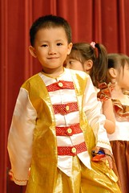

又到了一年一度的音樂發表會嚕...  
阿徹兩年來的第四次表演 似乎越來越習慣站在舞台上了  
表演前的胸有成足 表演中的認真投入  處處顯見阿徹的學習成長  
不知道是否因為今日的流程太順暢  
還是因為第四次參與這樣的活動少了新鮮感  
跟徹爸兩人有點覺得 ㄟ...熱鬧有餘 精采不足  
也許在阿徹還沒唸幼稚園唸成老油條前 我跟徹爸會先老油條了  
  
不過講歸講啦 當輪到阿徹班上表演時 徹爸還是箭步如飛的跑到台前standby  
而我也抱著小愛往前站好看清楚阿徹的一舉一動  
跟著阿徹的響板拍ㄚ拍  點著頭 哼著歌  標準的愚孝(孝子)  
  
真的 小孩真的不要長的太大隻  
像阿徹這樣嬌嬌小小 表演永遠排在第一排  
瞧 照片照的多清楚阿~哈哈  
  
 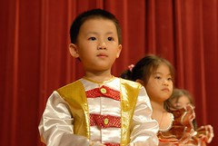 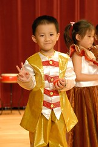

表演結束 宣佈家長可以上台跟小朋友合照(主要是讓大班小朋友留下紀念)  
遠在50公尺遠的我馬上抱起小愛往台上衝  
上到台上徹爸還一臉訝異的"咦 什麼時候出現在這了"  
哈哈~媽媽好個身手俐落吧  
  
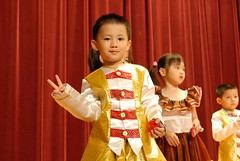  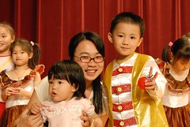  
  
整個表演歷時90分鐘 阿徹上台表演5分鐘(倒數第2-3個節目)  
大部分的時間就是在等待(說真的 不會太仔細看不是自己小孩子的表演)  
而今日玩的最開心的是小愛  
隨著表演音樂點點頭 搖擺身體 認真的投入這場音樂會  
  
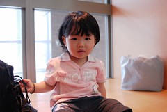  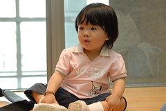  
  
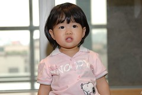  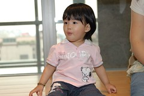  
  
音樂發表會在台北縣政府的大禮堂 空間寬敞 採光又好  
台上表演的槍槍滾 台下觀賞小朋友也滿場跑(家中陪同來的小朋友)  
為了避免我們也上演著大人小孩競逐的遊戲  
小愛的活動範圍就這麼的被限制在禮堂周圍的小平台上   
或坐或站或爬 看起來還算是個有家教的小孩  
  
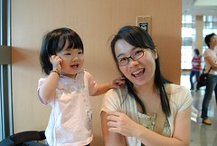  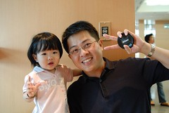  
  
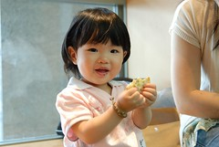  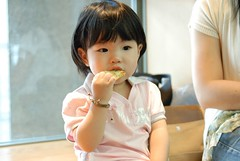  
  
好快~去年的音樂發表會小愛還只是個六個月大的女娃  
只能讓媽媽揹著 抱著 坐著  
今年的發表會卻是個小女孩般的亭亭玉立  
很快的 也許明年就看到小愛站在台上表演或是哇哇哭了
