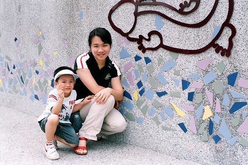

週六原本計畫到金山晃晃的 可是天公不作媒  整天的大雨讓人連公園都去不得  
除了傍晚晃去巷口吃包薯條外 一家四口在這麼在家呆了一整天  
小愛偶而拿起她的包包喊著"包包"示意要背背  
跟他說今天放假不用去阿姨家  才似懂非懂似的放下  
可又突然跑到陽台拿著她的鞋子要穿穿  
每隔一段時間就這麼的來來回回拿包包 拿鞋鞋  
充分展現她想出門晃晃的渴望  
而阿徹雖然enjoy蓋他的帳棚 把所有玩具家當搬到帳棚裡 玩的不亦樂呼  
但三不五時也唸著 "我們好久沒去動物園了"  
可見週一到周五每天在家裡/媬母/學校/公司的忙碌讓大大小小都渴望在週末時去外頭透透氣  
不過也也許這陣子真的太常出門了 讓阿徹跟小愛越來越不安於室了  
  
雖然晚上雨勢越來越大 但還是答應阿徹如果明天沒下雨就來去動物園走走(還不是說出太陽才去喔)  
那晚媽媽難得的失眠了 撐到3-4點失去意識前 窗外還下著傾盆大雨   
我想白天應該還是下雨天吧 可以在家補我失的眠   
八點多阿徹吆喝著起床時  媽媽睜不太開的雙眼撇見紗窗隙縫透過來的強烈陽光  
剎那間人完全的醒過來 搖醒徹爸"沒下雨了 大太陽耶"  
徹爸也啪的翻過身醒過來說"走吧 那就來去..."  
快喔 大大小小趕緊張羅出門嚕 太晚到車子要停好遠哩....  
  
從去年3月來 今天是第五次到動物園    
每次都是大約鎖定2-3個區域或館然後晃個2-3小時左右便打道回府  
今日目標是已經維修好久 前兩次都無法去成的"昆蟲館"  
再來就是"爬蟲館"  阿徹說他要去看變色龍...  
入園前先跟外牆的蜥蜴圖案合照一張吧  
  
  
  
小愛今天的心情也很好    
而且來了這麼多趟 小愛總算不再只是伴遊小姐(以前大半時間都在推車上睡著了)  
開始會好奇的比著動物 咿咿ㄚㄚ的  
  
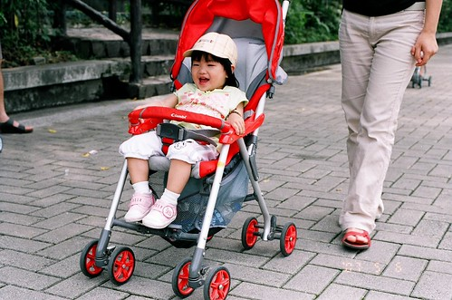  
  
 

10點多進園 人潮顯得有點稀稀疏疏  
可能大家以為今天會是下雨天 所以還在被窩裡睡大覺吧  
阿徹難得的說要看無尾熊 於是去館外走過一圈看看正在睡大覺的無尾熊  
阿徹說"無尾熊是bear"  媽媽說"無尾熊不是熊 所以不是bear"  
但是阿徹還是堅持的說"熊有兩種 一種是bear 一種是..."  
很難溝通 說清楚講明白  
  
看完無尾熊後搭上遊園車前進我們的目標爬蟲館嚕  
前幾次人擠人 甚至是被人潮推著逛完的爬蟲館  
今日顯得難得的寬敞與愜意  
還湊熱鬧的去參加影片觀賞跟講座  
才知道原來這館的正式名稱是"兩棲爬蟲館"  
只有同時住水上跟陸上的才能住這喔  四大類:蛇 蜥蜴 青蛙 烏龜  
當志工伯伯問小朋友 有哪四大類是兩棲爬蟲類時  
坐在第二排的阿徹奮快的舉高小手 可是伯伯眼界比較高 紛紛點名後排較大的小孩  
在我的提示下阿徹知道烏龜是其中一個答案   
當聽著被點到名的小朋友陸續說著 蛇 蜥蜴 青蛙時  
媽媽冷汗直冒的心想"幸好烏龜還沒被說走 阿徹還有希望"  
而阿徹自己則是堅持的一直舉著手  
講完三個答案時剩沒幾個小孩舉手  志工伯伯總算點了阿徹  
阿徹大聲的說著"烏龜"  OHYA ! 獲得紋身貼紙一枚  
志工伯伯又陸續問了幾個問題  也不知道阿徹聽不聽的懂問題甚至知不知道答案  
阿徹就是一股勁努力 拼命舉手  害我跟徹爸實在很擔心若阿徹真被點到只能傻笑了  
不過志工伯伯應該看的出阿徹年紀尚小只是瞎起哄吧   
發現參加這種活動 小孩本身厲害最好 但爸爸媽媽最好也要有兩把刷子  
要不然當小孩看著別的父母打pass給自己小孩 答對而獲得小禮物時  
實在不知道小孩心理會不會想"爸爸 媽媽 妳們好遜喔"  
我看著別人的爸爸這麼英勇  開玩笑的跟徹爸說"沒事多唸點書阿"     
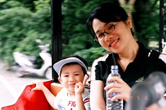    
  
逛完爬蟲館後又順道去了企鵝館看看可憐的小企鵝  
然後就又坐遊園車下來去昆蟲館嚕  
每次去昆蟲館 阿徹都會手癢的非要去邦逋一下這水  
下圖右為去年3月拍的  才一年時間怎絕得阿徹長大成熟許多  
  
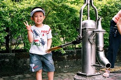  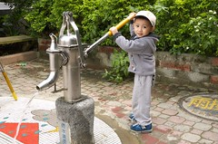  
  
小愛時而ㄊㄟ在推車上 時而靠著欄杆東忘西看  
十足大寶寶的模樣嚕~怎麼時間過的這麼的快阿~  
  
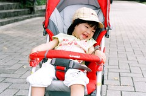  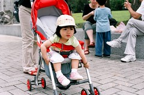    
  
今天爸爸帶了他買的二手古老長鏡頭出征  
恩~老東西果然別有一番味道  
  
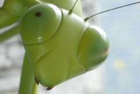 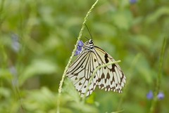  
  
烏龜不知道在跟鴛鴦還是鴨子說些什麼 兩人講的頭頭是道的樣子  
  
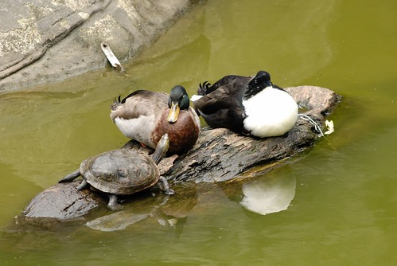  
  
逛完昆蟲館已是中午1點鐘 肚子餓的咕嚕咕嚕叫  
犒賞阿徹小愛去吃M先生  
徹爸說 真好來動物園都有M先生可以吃 小心阿徹愛動物園上癮  
小愛享受的自己吃著鮮奶酪還有薯條 越來越像雜食性動物了  
  
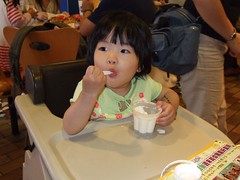  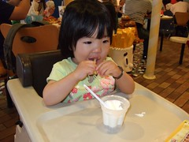  
  
上車離去前 開心的比個勝利手勢吧  
哥哥表情動作90分 小愛你面對鏡頭可以不要這麼嚴肅嗎...  
  
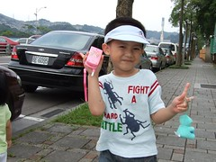   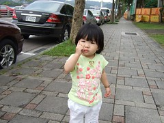
