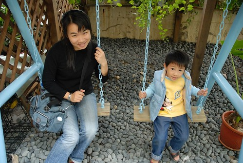

(這遊記實在越拖越久了...)  
  
這次打定主意就是到花蓮市區跟市郊晃晃而已  
所以第一次嘗試了花蓮市的民宿  
老實說上網找要落腳的民宿真的是在"賭"運氣  
網路上的民宿照片就像女人的婚紗照一樣  
可能有一天當新娘子都站在你面前了你還不識這就是相本裡的那位女主角  
會有跌落谷底的失落感  遺憾感 和排山而來的"提不起勁"  
  
這回找了位於花蓮市南北濱公園附近的"不老海洋"民宿  
衝著預定住宿日期的前一晚還肯讓我們更改延期 就該給她們三顆星  
加上民宿主人"小阿姨"的親切熱情 房間的整齊乾淨以及跟照片相差不會太大的view  
如果有人問我花蓮市的住宿 我想我會推薦"不老海洋"的  
  
(這是從我們住的四樓後方公共陽台望出去的view    
雖然沒有日出沒有夕陽 沒有藍天白雲但感覺就是讚)  
  

傍晚到民宿checkin 讓徹爸小憩片刻後  出發到南濱夜市打牙祭找樂子  
從入口望進燈火輝煌阿  很有"名"觀光夜市的味道  
  
  
  
南濱夜市完全的"遊戲"夜市  一堆從沒看過的遊戲攤子挑戰著阿徹的慾望  
老實說有點後悔來這 因為不僅沒有想吃的東西可以吃飽  
還讓我們與阿徹間為了玩幾個遊戲  要玩幾次鬧了小彆扭  
所以小孩定力不高 父母包容力不大的我們實在不適合這夜市 (下次要記取教訓)  
  
其實現在夜市裡的遊戲攤真的比較像是拿錢換劣質的大陸玩具  
偏偏小孩子就是對那些不可求的玩具有著高度幻想    
以為拿老爸的錢拼命炸下去就可以得到  
只是當小孩沒技巧 沒耐性時  就像是把錢扔到地上   
爸媽看了真的會心疼(當然是心疼錢)  
然後原本的要讓小孩來享受夜市樂趣的美意也徹底的被自己扔到地上了  
用著威脅 恫赫把小孩跟自己帶離現場  
  
(讓球滾進不同的動物洞裡有不同的分數 然後依照累積的分數換玩具)  
  
  
  
這是民宿主人口中唯一值得吃的烤玉米  
每天兩袋現採番麥 賣完就沒了  
雖然得等上15分鐘 但排隊的人潮依舊是南濱夜市裡的No.1  
  
  
  
番麥是連殼下去烤過後再涮醬烤過 口感蠻不錯的(可是徹爸覺得不優)  
  
  
  
晚餐只吃一個番麥當然是不會飽  
所以還是繞了去市區吃旅遊指南上寫的\*記扁食  \*口蚵仔煎 順道買丹露  
這蚵仔煎更猛得等20-30分鐘  
雖然因為外帶回民宿口感會略差 但我跟徹爸一致的結論是  
"這口感能紅成這樣 還得等20多分鐘實在有扯"  
反正在市區東吃西吃一圈後雖然肚子撐了 但胃與心依舊沒有獲得滿足與安慰  
結論是我們還是比較適合吃的飽的套餐或是火鍋 (這下回又要記取教訓了)  
  
這也是從民宿後陽台拍出去的view  
原來期待在秋天裡的太陽+微微涼風下享受這view的  
變成冬遊後便只有這灰濛濛的天空還有吹的會讓人頭痛的風   
  
這是民宿的男生三明治(女生是另外一種三明治 份量較少 )  
還有我們的熱豆漿 冰豆漿還有阿徹的熱可可  
擺盤的很漂亮 東西也好好吃 大大滿足了前一晚的空虛  
  
  
  
吃完早餐到民宿後花園跟露台嬉戲  
小愛有點水腫的臉顯示出她前一晚的沒睡好  
  
  
  
花園有點小但還挺雅致的  
  
  
  
會"ㄍㄧㄍㄧ"響的木鞦韆  
  
  
  
吶喊(留言)牆  
  
  
  
交誼廳一角  有提供電腦可以上網喔  
  
  
  
這是用餐時 主人幫我們拍的全家福 (都會放到民宿blog裏)  
也算愛玩的我們越來越喜歡住民宿  
不同的民宿體會不同主人們的那份用心與堅持 甚至跟著主人們一起幻想勾勒他們了夢想園  
那份心靈的感動與親近也是旅行的樂趣之一~~~  
  
  
  
  
  
花蓮不老海洋: [http://www.yang8333338.com.tw/page3.html](http://www.yang8333338.com.tw/page3.html)
