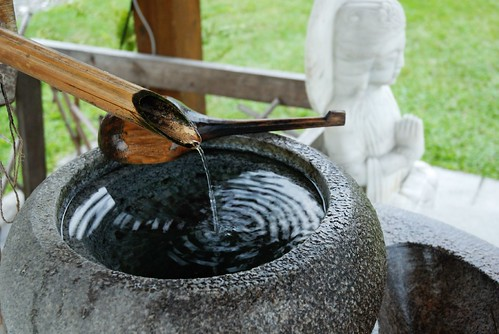

(白天忙工作  晚上忙K日劇  遊記進度落後中更別說一些生活趣事 成長日記了...  
  大家勤勞點多自己上flicker看照片說故事吧)  
  
上兩次去花蓮時都曾經想拜訪慶修院但都撲空而回  
第一次是因為颱風過後封院整修  
而第二次則是因為遇到星期一封館  
這回不是颱風期又是星期六 總沒有理由再撲空了吧 .....  
  

都看到照片了 當然代表這回我們並沒有撲空  
入院後的感覺就是小而巧 小而美 很有日劇中寺院的味道   
媽媽裝氣質一下  舀一池水洗洗我的纖手  
  
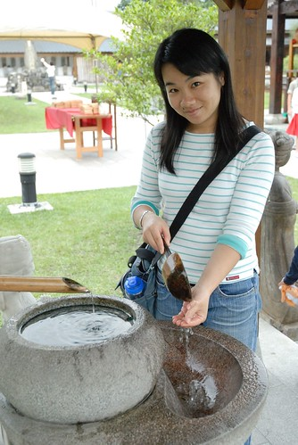  
  
滿桌的祈福卡 很奇怪怎麼不是掛起來比較叮叮噹噹漂亮ㄋ  
而且比較方便遊客跟神明看阿  
這樣擺一堆 熊熊一看很像準備集體放火燒毀的樣子  
(我真的有猜想是不是會把祈福卡燒掉後才比較有效 就像燒金紙那樣)  
  
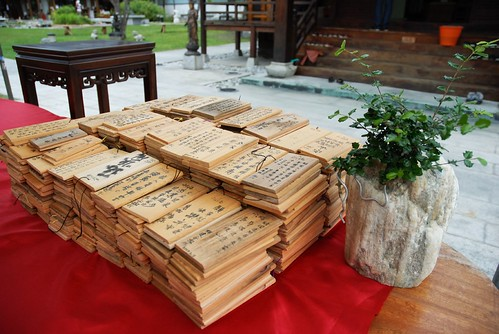  
  
裡頭的神像幾乎都是石雕的  
對宗教實在沒有研究加上拖著兩個小孩實在沒啥機會細看告排解釋  
所以純當藝術品 古蹟欣賞  
  
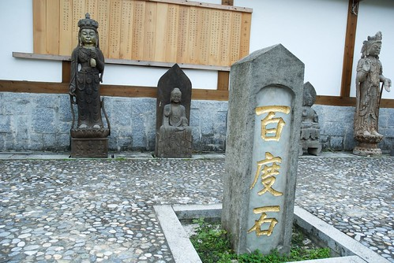  
  
整個園就是這麼的小 依序分別為入園後的後左角 後右角 前左角 前右角  
  
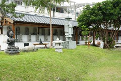 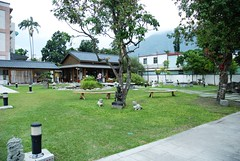  
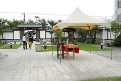   
  
這是後左角屋簷下的神像 數量頗可觀  
因為阿徹像來很怕神像類的東西 所以我只得跟他一起遠觀  
  
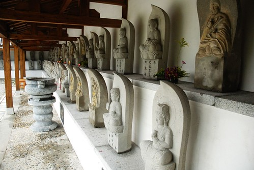  
  
男生廁所照出來的view (雖然我沒走到這裡 但這張很容易看圖說故事吧 哈哈)  
  
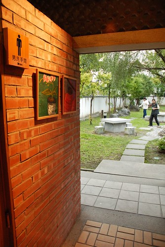  
  
一個流著水 蓄著小漥水 被當作許願池而丟了不少銅板的石座  
我拿了兩個一圓硬幣給阿徹許願   
阿徹很認真 很虔誠的 雙手合十說著"我要跟謝宜庭結婚"  
聽的我跟徹爸差點昏倒  原來這是阿徹最想實現的夢想阿....  
  
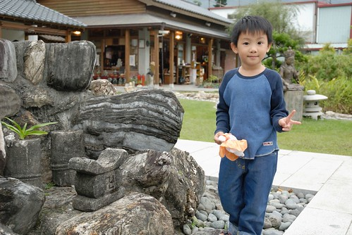  
  
阿徹跟小愛時而跑步時而嬉戲發出的聲音 更對照出園內的祥和寧靜  
雖然有點擔心破壞了這的莊嚴 但卻也覺得這不就是小孩子的天真  
神明們應該很開心難得聽到小孩的歡笑聲吧  
  
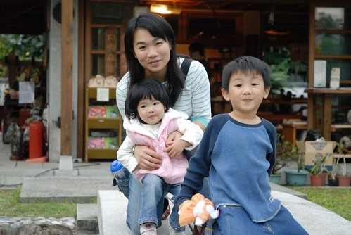  
  
蹲在那裡其實我是想著"如果我可以住在這裡該有多好"  
這樣的走廊 這樣的view  這樣的放鬆 這樣的自在空間  
(寫的當下熊熊明白自己為什麼最近這麼戀日劇"螢之光"了 我骨子裡就是迷戀像這樣的後廊  走廊阿)  
  
  
  
這下...大家明白這慶修院的典故了吧  
  
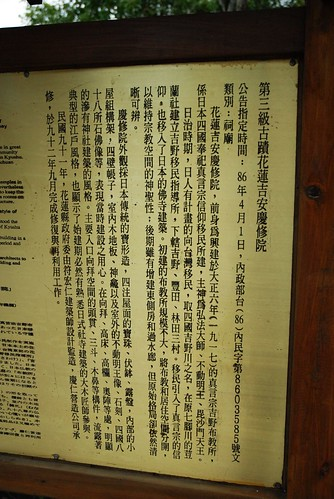  
  
5點了要關院 要離開了   
徹爸回首一照 照到了天上的那道光... 那個光... 就是那個光....   
讓我們登門三次方入的慶修院果然值得走一遭~~  
  
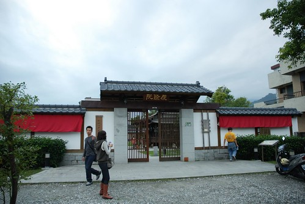
