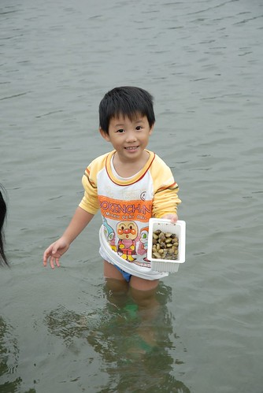

原本是心血來潮的想要趁著秋老虎去海邊逐浪踏沙的  
結果因著一連串的颱風 東北季風 花蓮的秋遊變成了冬遊 (雖然也才11月但是過了立冬就是冬天了吧)  
天氣不穩定 行程也跟著的充滿變數  
只有先選定幾個想去的點 慶修院  立川漁場 南北濱公園 石雕公園  
詳細的行程就等到花蓮後 視天候狀況再調整了  
  
11/10周六一早 睡飽飽 9點半踏出家門    
一小時後進入了蘇花公路  然後三小時後(下午一點)抵達新城鄉  
有北宜高後 真的快捷許多 只是這時節的花蓮真的冷清  我們開玩笑說"時機很壞喔 遊客這麼少"   
  
今天的花蓮雖然沒有太陽 但起碼無風無雨 還算舒爽  
因此把握天氣來去壽豐鄉的立川漁場摸蛤...   

出蘇花後到新城鄉路上一家很明顯的台灣牛肉麵吃中餐   
兩碗牛肉麵加一些小菜400摳摳  這算是這次旅行"好"的開始嗎?!  
  
(睡了一整路的小愛 精神飽滿)  
  
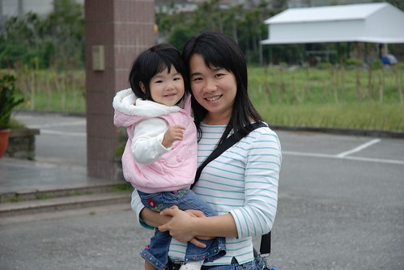  
  
現在的都市人好像都很愛去體驗鄉村生活  
種種菜 採採果 抓抓蝦 摸摸蛤...  
在城市被"榨"的剩半條命後 總得到鄉村裡回歸自然 回歸自己  
其實講穿了 城市人真的很悲哀說  (我們就是那悲哀的台北人啦)  
真的就像王文華說的"住在台北是種幸福 但也是種負擔"  
不過錢還是得努力的賺  工還是得努力的做 小孩子還是得努力的養  
所以我們這麼愛玩不是沒道理的...  
  
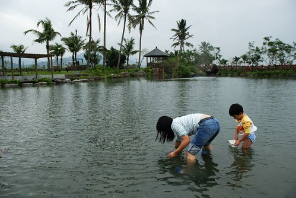  
  
本來以為蛤蠣池會是黑沙泥的小淺池  
想不蛤蠣池竟然這麼大 這麼深 水還清澈見底  
努力的捲起牛仔褲管以免真的摸蛤兼洗褲  
至於阿徹直接把褲子脫了乾脆點 (徹爸說下次要帶泳褲來 可是穿著泳褲摸蛤真的怪哩)  
  
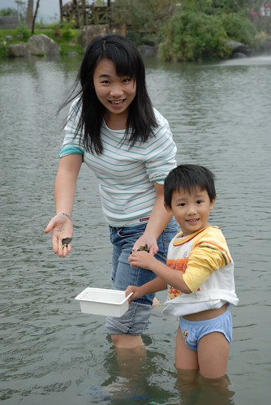  
  
摸蛤真的挺好玩的 看清哪裡有蛤後彎腰拾起就可以  
只是為了顧及不要濕了褲子 只得下半身直挺挺的彎下去 這麼彎個10幾分鐘下來還真的挺累的  
而且蛤一粒一粒的揀  要揀滿一盒(一公斤)真的不是件輕鬆的事  
  
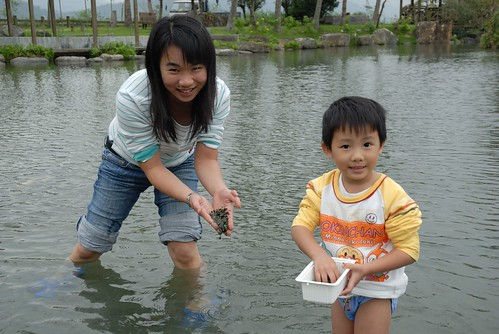  
  
阿徹個子還太小 要彎腰自己摸蛤的話 可能連頭都得栽到水裡去了  
所以只能跟在爸媽旁邊拼命喊"這裡還有...那裏還有...快一點...好多喔"  
  
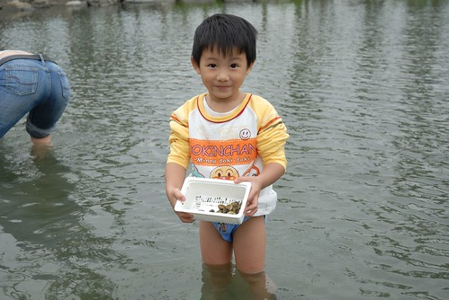  
  
小愛更別說下池了 真下到池裡可能動彈不得吧   
而且這樣的天氣還是不要冒著生病的風險好 (出門在外生病很麻煩的)  
  
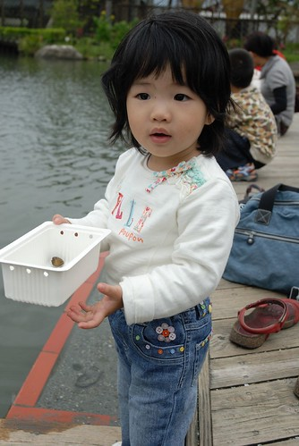  
  
OH YA!  媽媽辛苦10多分鐘摸的蛤總算夠煮一鍋湯了  
  
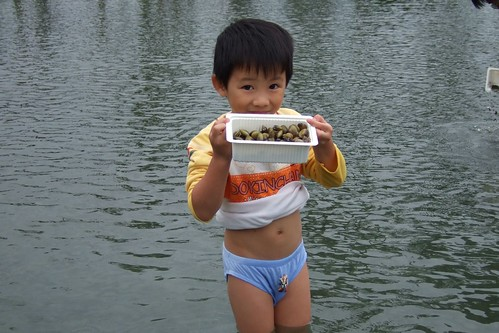  
  
池真的很大 我跟阿徹顯得很渺小  
而且下去摸蛤的遊客真的很少 更別說讓小孩在這種天氣裡脫褲子下水的  
  
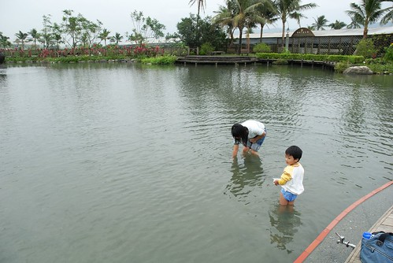  
  
阿徹連內褲都泡在水裡了 還是很認真的當小幫手  
  
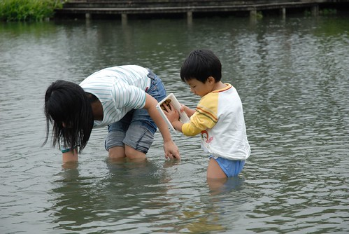  
  
不行了... 媽媽的腰桿快要閃到了... 換爸爸下場繼續奮戰....  
  
阿徹玩到連衣服也快泡到水裡了 爸爸只好把他衣服綁起來  
  
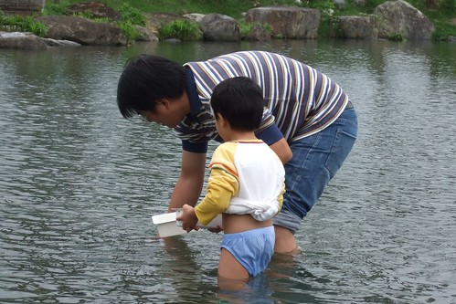  
  
然後肚臍"浪風"了  
當時我有在想一個問題  到底是肚臍"浪風"容易感冒還是衣服濕掉容易感冒  
  
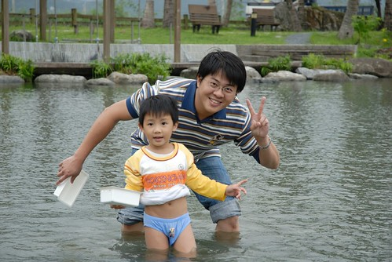  
  
小愛竟然都沒有唉唉叫要下水  
只求哥哥施捨她一些蛤蠣可以玩耍就好  
只是看她趴的這麼低 真有點擔心她一個不小心就咕嚕滾下水了  
  
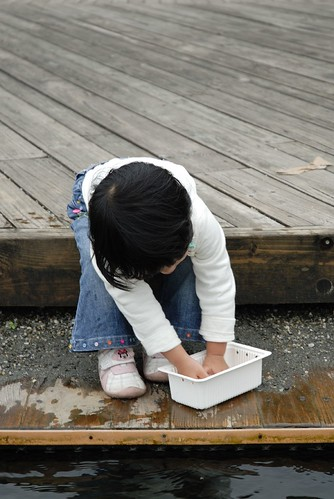  
  
立川漁場完全打破之前對於水產養殖場的印象  
沒有髒亂 沒有腥臭  
反倒讓人有種置身巴里島之中的錯覺  
哈哈 其實我也沒去去巴里島 只是看到這排排的椰子樹很有照片中巴里島的味道  
  
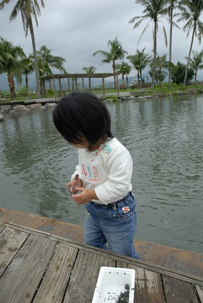  
  
水清澈見底 讓你可以先鎖定區域再下腰摸蛤  
  
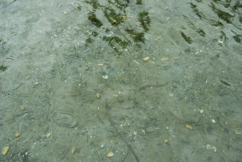  
  
我們很古意的買了3人份摸蛤的票 可以摸3盒(3斤)的蛤蠣走  
可是摸了4-50分鐘 只摸了近2盒的蛤  
雖然有點"虧"到  但還是決定認賠殺出 可別不小心感冒就了更多  
魚場裡還有一座餵魚池 (讓人花錢買飼料餵養的魚池)  
魚池邊掛了個恩典鐘  讓人覺的餵魚好像也是件有氣質 有善良的行為  
  
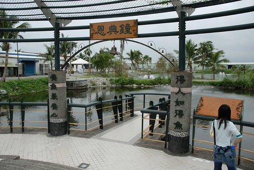  
  
我們貢獻了10元...  
  
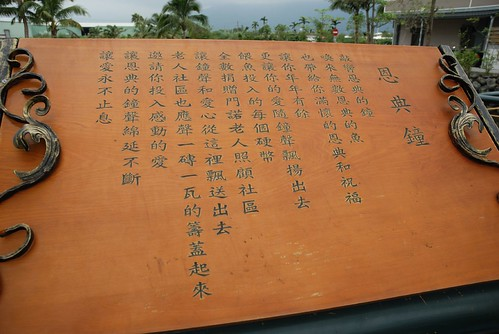  
  
這是蛤場的展示館兼蛤池的入口  
  
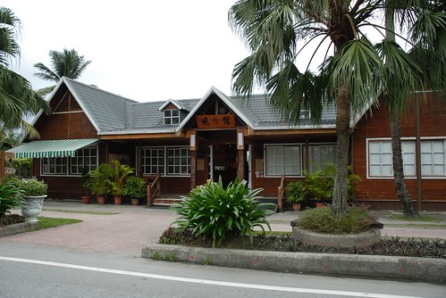  
  
魚場的招牌  
一整個很適合花東這樣好山好水的地方  
我們說下次天氣熱一點再來摸蛤一定很好玩  
我一定會把阿徹小艾脫的只剩一條內褲下水"摸蛤兼洗褲的"  
  
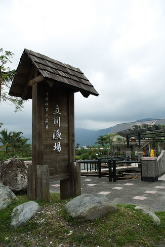  
  
然後拿著我們的摸蛤門票去喝蛤丸湯嚕 (本來以為是薑絲蛤蠣湯的)  
不小心就又點了招牌炒蛤 跟炸蛤丸 (用蛤蠣跟魚漿做的丸子 全台唯一的蛤丸但口感不如預期 )  
  
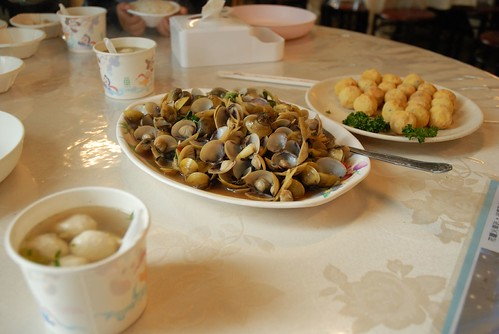  
  
還有烤的香酥 甜美的香魚...  
  
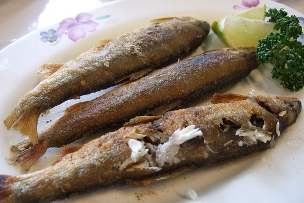  
  
雖然1點才嗑了牛肉麵中餐而現在也才3點半  
我們還是如蝗蟲過境  除了蛤丸外全清空空了  
  
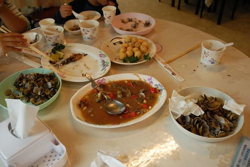  
  
立川漁場就位在壽豐鄉 從市區開車過去大約20分鐘  
這是這次花蓮行最南端的一個點    
這次真的很不貪心 就是打算在花蓮市郊走一走而已....
