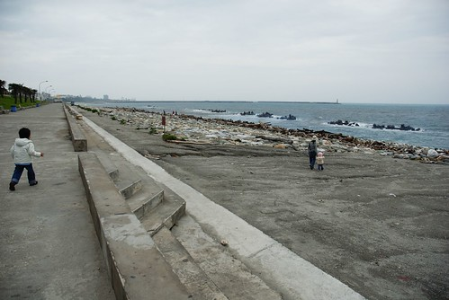

(要一鼓作氣的把花蓮遊記寫完....)  
  
原本計畫這個早上就那麼悠悠哉哉的騎著腳踏車從南濱晃到北濱  
可是計畫永遠比不上變化  (真的...這是自古恆久不變的道理)  
在民宿主人無情的告訴我們"附近的腳踏車店都倒光了"後  
我們真的只能瞎無目的的且戰且走且看了  
越來越符合當初預定的花蓮"隨意"走  真的很隨意~ 

原本還在期待今天早上可以出個大太陽的  
這樣就可以帶著陽光般的笑容在海邊 沙灘上逐沙踏浪 撿石頭的  
可是天真的灰 風也真的大   
讓人不免驚嘆這年的冬怎麼來的這麼的早阿 不是才11月中嗎?  ...  
  
雖然跟徹爸沒能租到大腳踏車  
但起碼那台從台北載下來的阿徹腳踏車讓我們稍稍滿足了在南濱騎車的小心願  
風很大 坡很陡  但阿徹還是努力的踏著  
這是阿徹第一次在戶外騎沒有輔助輪的腳踏車    
事實證明阿徹真的會騎車了  
  
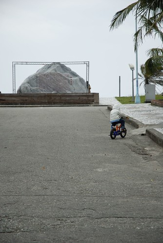  
  
如果是涼爽的秋天時後來這 一定很讚 (整個遊記似乎越寫越遺憾秋遊變成冬遊)  
  
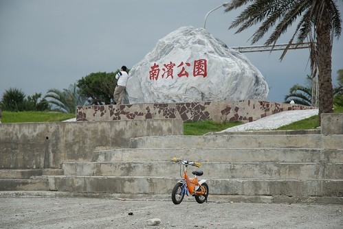  
  
沒揀揀石頭 怎能說我們來過花蓮 來看過海ㄋ  
  
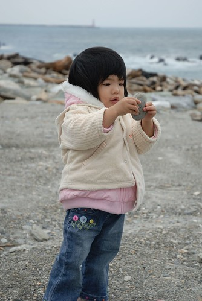  
  
這種天氣帶小孩出門考驗著小孩的"寒風耐受性"  
反正不管怎樣把小孩裹緊點就沒錯啦     
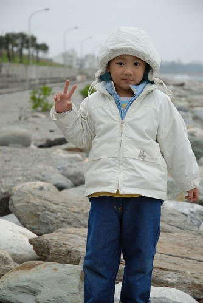  
  
如果風沒那麼大 應該順著岸邊一直走下去  甚至走到北濱的  
  
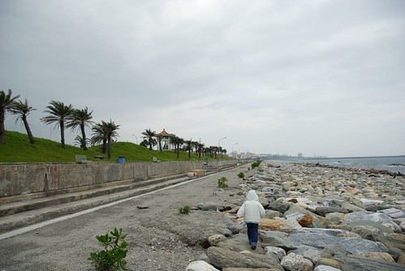  
  
只是風真的大阿~ 小不點小愛可能一個不小心就被風吹倒了  
  
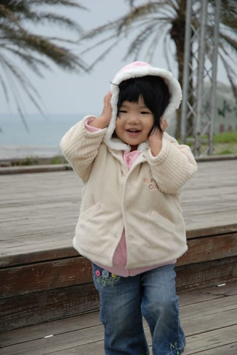  
  
帽子也得壓緊點  免得頭被吹的ㄅㄧㄤˋㄅㄧㄤˋ痛 (其實只有我這個中年婦女經不起風吹)  
  
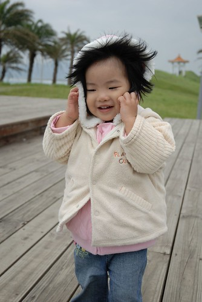  
  
隨意走又走到了原本隨意規劃的石雕博物館&公園  
看到這大草坪不禁又讓我跟徹爸扼脕  去年過年那個飛走的風箏(講了快一年要再去反斗城買都還沒買)  
  
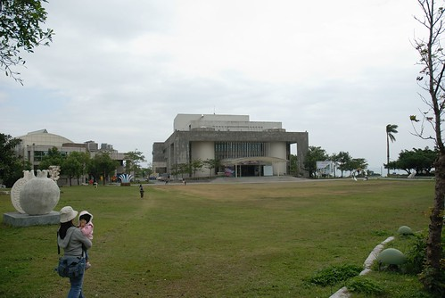  
  
像猴子般的阿徹看到公園內的石頭展示 總忍不住的爬一爬 攀一攀  
(這人型大理石的觸感真的很好說)  
  
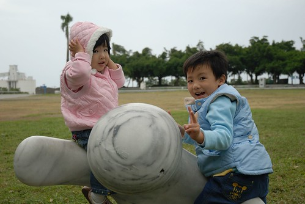  
  
沒幾隻小貓的公園更適合我們這家子的暴走 隨意走  
  
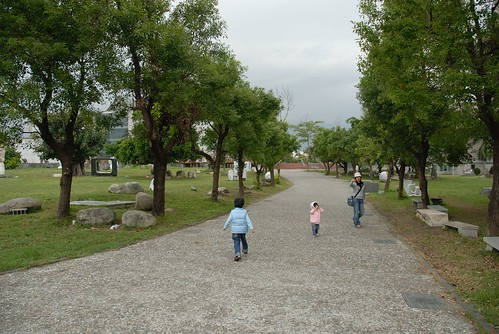  
  
累了就再休息一下唄  
  
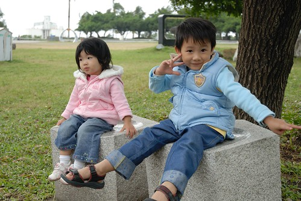  
  
阿徹看這一家子人看的很認真 很仔細  
  
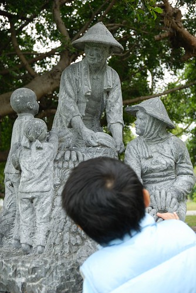  
  
逛完公園 原本滿心期待要帶阿徹去看各式各樣的石頭"勞作"  
結果...結果...博物館竟然休館   博物館不是都週一才休館的嗎?  
而且...而且...今天是週日哩  遊客不是會最多嗎?  
我跟徹爸一整個的不解....  
莫非因為10月的石雕季剛過 封館休息大整頓阿  那ㄟ阿ㄋㄟ啦~  
  
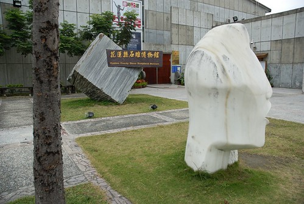  
  
不能接受事實的我們 在博物館門口呆了很久  
因為不知道還要去哪裡隨意走  去哪裡打發到中午好打道回台北  
  
(看到我跟徹爸同時入鏡的照片就知道是阿徹照的 照的還不錯ㄋ)  
  
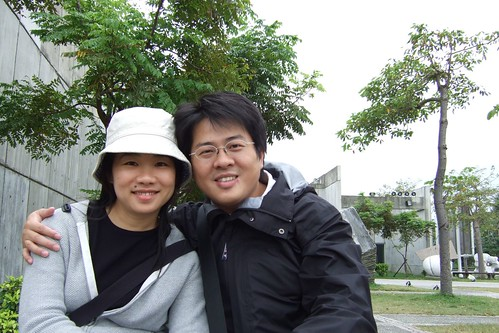  
  
徹爸小病初癒 顯得有些疲憊與水腫    
真是為難他娶到一個這麼愛玩的老婆  
  
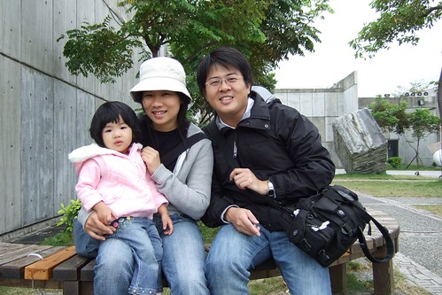  
  
阿徹跟小愛走起S型平衡椅  
  
  
  
反正時間多的是 慢慢走慢慢玩也挺有趣的  
  
  
  
很長的S型  兄妹倆來來回回走了10趟有吧  
  
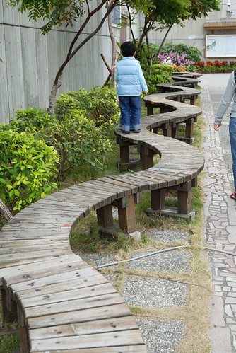  
  
小愛越走越穩 越走越快  
  
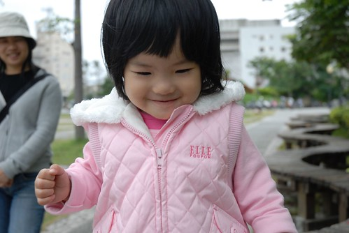  
  
坐在這裡望著前方的草坪與遠方的太平洋  
風又是剛剛好的不大不小   
一整個的慵懶 放鬆  不想動了  
  
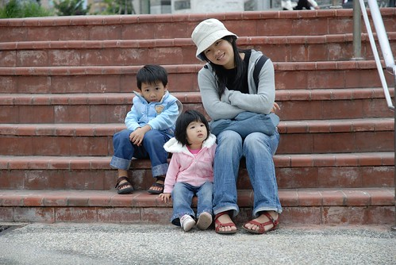  
  
  
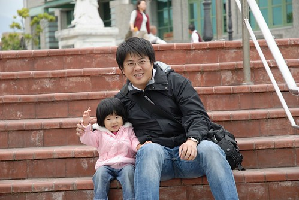  
  
(小愛有時候真的有古靈精怪)  
  
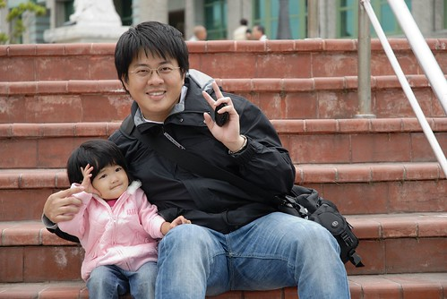  
  
猴子阿徹又發現了玩意  
  
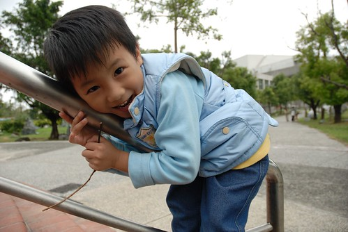  
  
玩溜滑"梯"阿  這真的是梯阿   
幸好衣服穿的還不少不會讓人磨破皮  
  
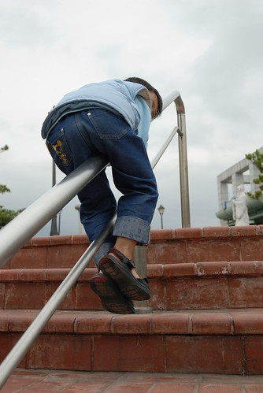  
  
這消玩法也打發了一整個早上  
總算12點可以去吃中餐 然後回家嚕...  
  
  
  
後記:   
這次聽了美賢的建議去"鵝肉先生"吃飯  
吃了兩天中最便宜 可是胃與心卻是最滿足的一餐  
雖然花連小吃洋洋灑灑一大串  但這一味才是最適合我們家的胃阿  
  
補充: 出遊的那天11/10 是我跟徹爸的五週年結婚紀念日  也算是一個紀念方式吧
