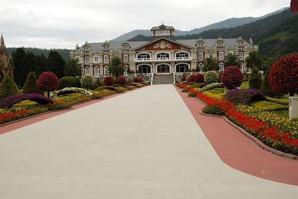

純貼圖看圖說遊記的九族文化村~~~  
  

日月潭春遊的第二天早上與第一天早上一樣睡飽飽才起床  
所以接近9點去吃早餐的時候已剩沒幾位客人  
  
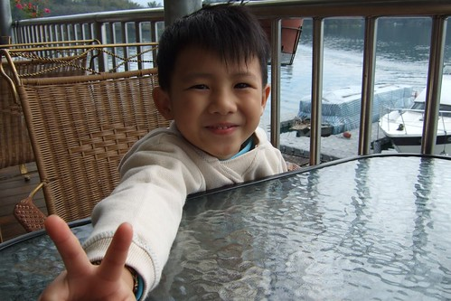  
  
拉著妹妹自拍的徹爸  
  
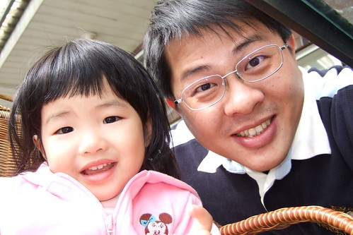  
  
週一早上停在停車場裡的小紅更顯得孤寂  
乖~妳是匹好駒 這幾年的東奔西跑都多虧妳了  
我會多督促爸爸幫妳洗香香的  
  
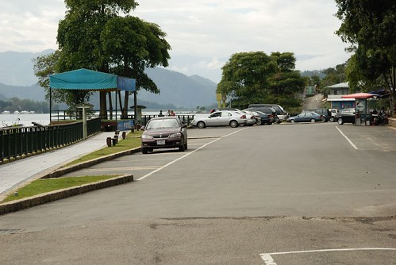  
  
九族文化村的記憶又更遠了 要追朔到高一時參加科學營的周末活動  
其實一直很好奇為什麼在一個標榜台灣原住民文化的樂園裡會搞個這麼歐洲風的庭院與建築  
不可否認的 在山嵐的襯托下這庭園真的挺美的  
但是我還是深深覺得一整個不對味阿  
  
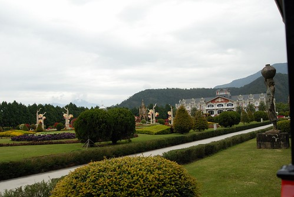  
  
如果把這歐風庭園從"九族文化"這沉重的名詞解脫出來  
這絕對是個美麗且用心維護的庭園  
其實我也沒見識過真的歐洲庭園是長怎麼樣  
但一座座華麗生動的花藝雕像就是感覺很大器 很宮廷  
  
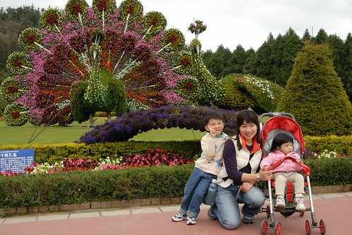  
  
雕像生動到連羊妹妹的屁股都覺得線條優美 富有彈性阿...  
  
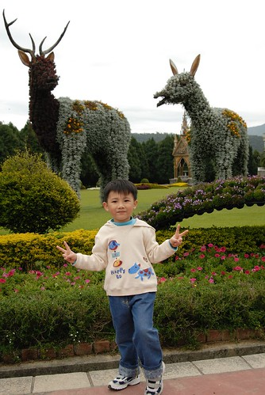  
  
花園裡種滿了各式各樣的花  阿徹看到之前在北海道見過的薰衣草可興奮了  
  
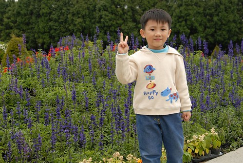  
  
這個view很美但卻也很突兀...  
裊裊山嵐下的那根柱子 讓人很難不去注意到他  
也許這也是業者為了生存所不得不的迎合趨勢吧  
  
  
  
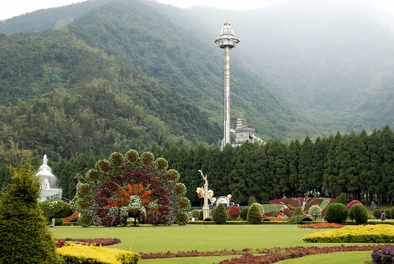  
  
往山頭走上去就漸漸有台味啦   
尤其正值二三月櫻花開的時節 一整個春意盎然  
  
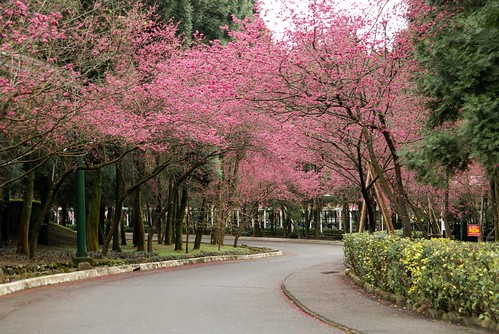  
  
雖然阿徹還是膽小 對於陌生或是有危險的東西總會退避三舍  
但這幾年趴趴造經驗累積下  對於新事務嘗試的勇氣已逐年增加中  
原本看到園裏的空中單軌電車時喊著說"好危險 如果軌道斷掉 掉下來怎麼辦"  
我說"它不會那麼容易斷掉啦 而且就像昨天坐船 原本你也會怕   
         可是去坐了後是不是發現根本沒有什麼 還很好玩ㄋ"  
阿徹說"對阿 坐船好好玩喔"...然後就跟著我們去坐單軌電車了   
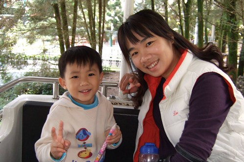  
  
事後徹爸竟也偷偷跟我說"其實我也覺得有點恐怖"  
ㄟ....雖然我也很不大膽 但膽小遺傳自徹爸的可能性應該比較大  
  
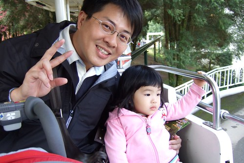  
  
九族的櫻花一叢一叢的  跟原本預想的滿山滿谷櫻花不一樣  
雖然小失望但還是肯定這裏是個散步的好地方啦  
  
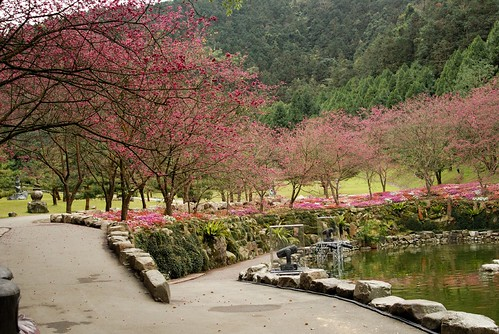  
  
看到有魚的池塘尤其又有魚飼料販賣機 兄妹兩一定吵著要餵魚  
不過魚的胃口好像不太佳  因為聽說從農曆春節到現在吃太多啦  
  
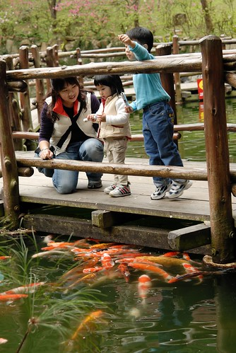  
  
阿徹勇氣增加的證明之一 就是去走池塘中的石頭道  
還橫衝直撞用跳的  讓我擔心的直抓緊他的手深怕他不小心就落水了  
所以人好像還是膽小點好 這樣危險少一點 呵呵...  
  
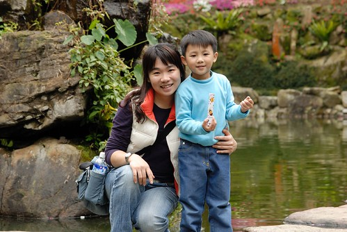  
  
我跟徹爸最愛這種躺椅了  
尤其這種天氣下 若能躺著睡他個一覺該有多好阿  
  
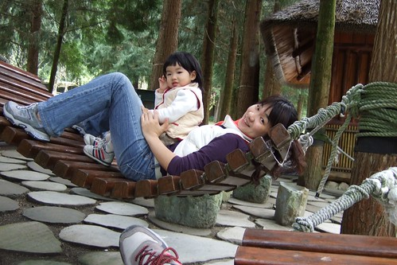  
  
小愛說她要吃"玉米" 徹爸說"啥咪玉米 是爆米花啦"  
曾經在迪士尼嗑掉半桶爆米花的小愛還真的挺愛吃"玉米"的  
  
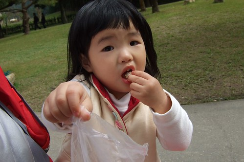  
  
小愛忙著吃她的"玉米"  阿徹則忙著撿他的花...  
  
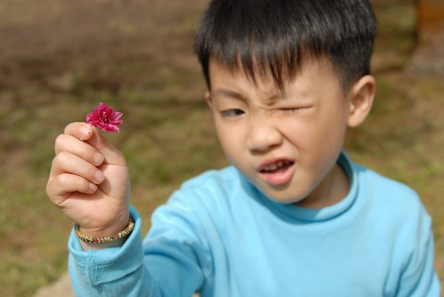  
  
這是阿徹幫徹爸照的喔 ... 相片中的兩人身材還挺像的ㄋ  
  
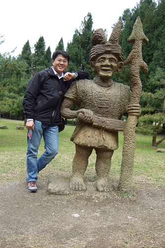  
  
今天的中餐  竹桶飯+香菇肉絲湯+烤蛋(那是包著紙的蛋 不是地瓜喔)  
  
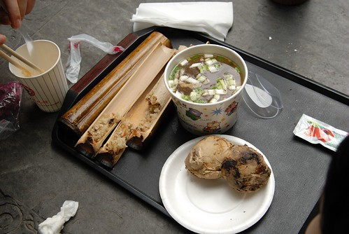  
  
  
OHYA~櫻花樹下嬌羞的徹爸  
  
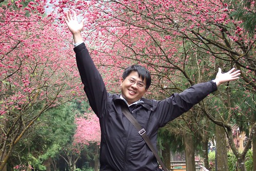  
  
阿徹鏡頭下的三人組  
  
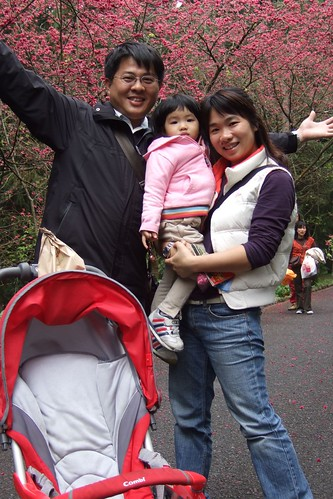  
  
聽說貓頭鷹是原住民裏的神 (蘭嶼那的達悟族除外)  有好運氣的象徵  
  
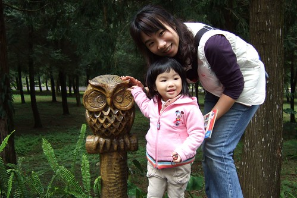  
  
一路上阿徹就這麼辛勤的撿著他的花    
地上摘的不夠還要媽媽偷偷摘一朵樹上的給他  
原本他還說要拿回家放到澡盆裏洗澡的 幸好後來只有做乾燥花而已  
  
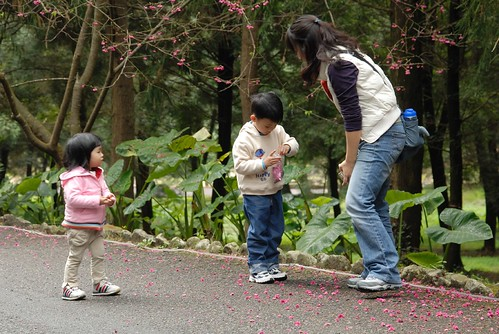  
  
滿滿一袋總算心滿意足但也累了  
  
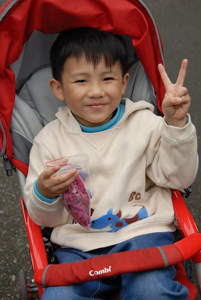  
  
總算走到山的上頭 要看九族的招牌-原住民歌舞表演  
距離表演開始還剩10分鐘 場外一片寧靜場內卻已坐無需席  
  
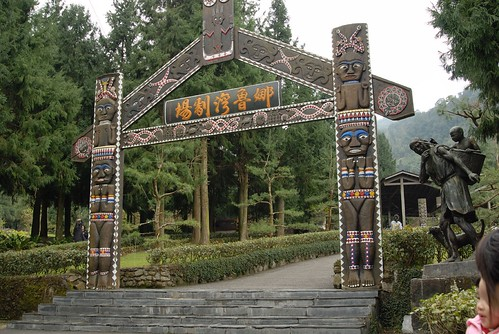  
  
40分鐘精采的表演讓人感受到原住民的能歌善舞與熱情  
  
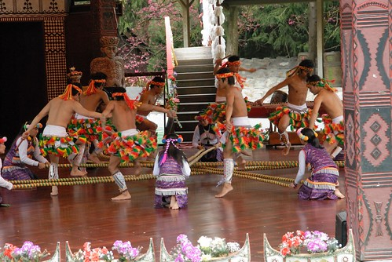  
  
看完表演後接著就是 另一個重頭戲"空中纜車"啦  要搭空纜下山去嚕  
  
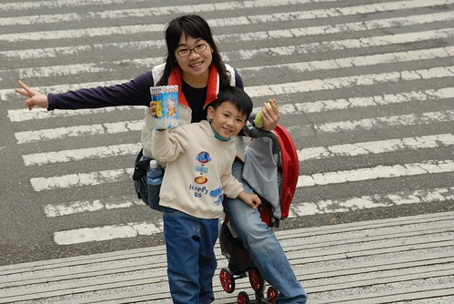  
  
腳力還不甚好的小愛常走一走就會討抱  
爸爸說"那抱一下下 走一下下喔"    
於是抱100公尺走100公尺 這麼著完成大大小小的旅行      
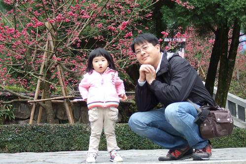  
  
有別於花蓮海洋公園空纜的海景  九族空纜是十足的山景  
  
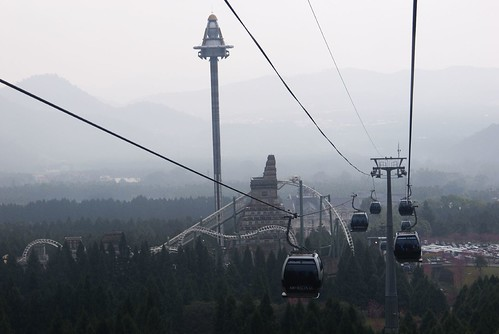  
  
阿徹與我看底下的風景看的津津有味 驚呼連連   
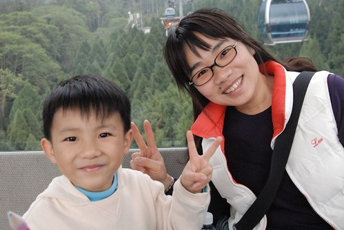  
  
小愛則有點故做堅強.... 握緊的小手讓人感受到她小小的緊張與謹慎   
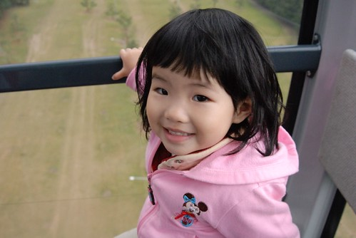  
  
放輕鬆點"嘻"一下  
  
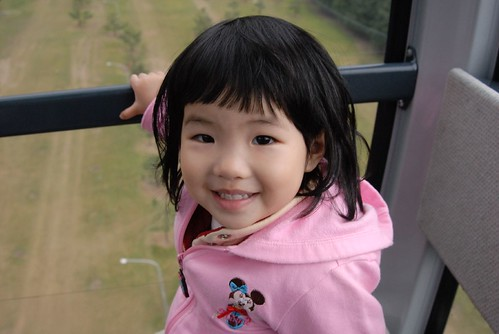  
  
至於徹爸ㄋ...勇奪今日最最膽小獎  
  
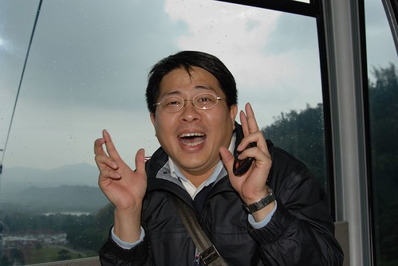  
  
底下表演的人好小...  
  
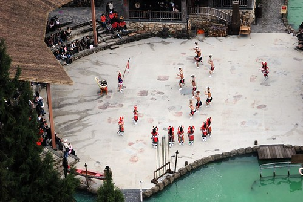  
  
樹也好小...  
  
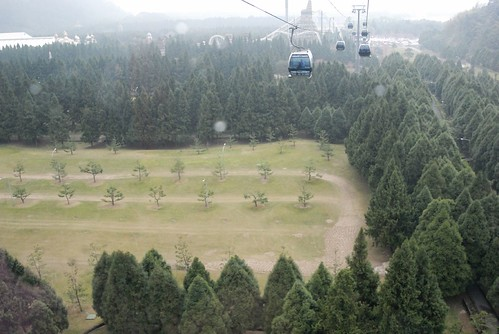  
  
連恐怖的遊樂設施也變的像玩具般小巧可愛  
  
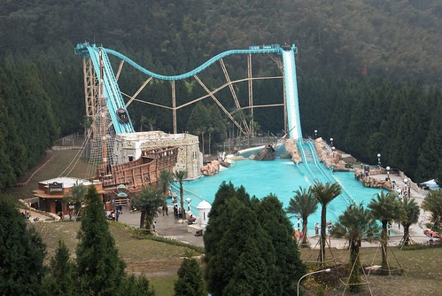  
  
下了纜車後我跟阿徹意猶未竟的還想再去坐一趟  
可是雙腳剛抖完的徹爸怎麼樣也不願意再來一回  
  
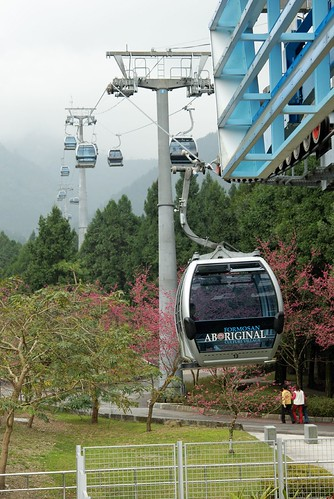  
  
小愛露出平安落地的小笑容  
  
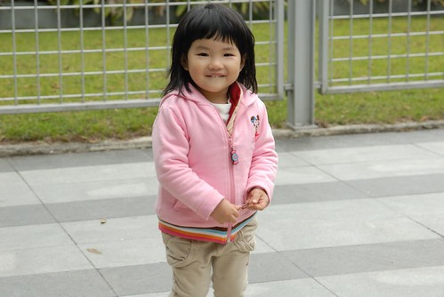  
  
往回走 準備離開要回家嚕~   
這次的春遊只去兩個地方 很簡單但卻很精采  令人很驚豔...  
  
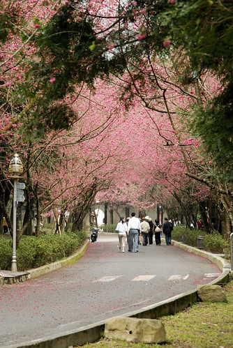  
  
櫻花樹下望上去的自由落體柱 又是另外一個矛盾的美麗  
  
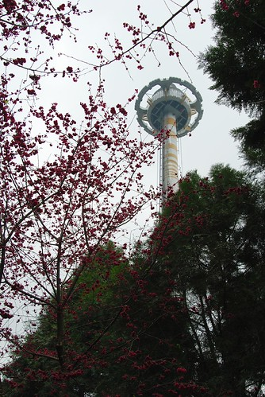4
