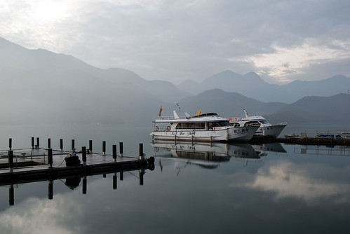
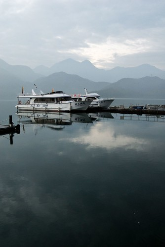
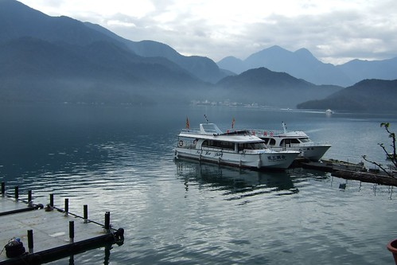

對日月潭的印象一直停留在大學時期  
有點髒亂 有點陰森(尤其是在某塔前的同學合照) 有點商業卻又疏於管理  
所以這幾年即使四處趴趴造卻總對日月潭興趣缺缺 (正確說法是對西部景點不甚期待)  
可就在一月看了玟姿的日月潭照片卻為之驚豔  
知會戶長後馬上上網預約了一個多月之後的民宿住宿  
等待煎敖了一個多月 冒著氣象預報的壞天氣踏上了我們揭開日月潭神秘面紗之旅  
美~真的美~原來我只能用這麼平凡 了無新意的辭來形容日月潭  
尤其這樣不冷不熱 不甚晴不甚陰的天氣 我們註定能與日月潭有個美麗的約會  
(我也沒見識過其他天氣的日月潭啦 不過覺得這種天氣的日月潭就真的很棒了)  
  
清晨六點的日月潭  從房間陽台望出去的日月潭   
很寧靜...很清新...  
與潭同一水平面望出去的視野感覺很特別    
這一宿真的是值得啦 謝謝玟姿推薦的好地方...  
  

清晨六點忍痛從被窩裡爬起 (徹爸早已按掉他設的鬧鐘)  
只因為擔心會錯過日月潭美麗的晨景    
雖然在陽台感受了五分鐘美景後還是窩回被窩裡了  
但幸好有起來而且吵醒了徹爸 拍下這些美麗的景緻(這才是我起床的最大目的)    
  
  
七點多突然又睡不著的徹爸又捕捉到陽光穿透雲層的美景  
  
  
  
望著這些美景 突然可以明白體會為什麼日月潭畔會矗立著這麼多高檔的飯店   
真的是美啦~啥事也不用做的 只要坐在陽台望著這些晨昏變化就是享受  
  

