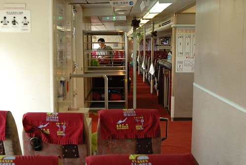

果然心裏想的都會比實際做的要來的快且簡單許多....  
一天一篇遊記的期望果然不出意外的嚴重拖稿中  哈哈哈!!!  
  
今年一直很想去離島晃一晃  
金門馬祖澎湖都是原先考量的地點之一  
但徹媽不愛坐太久的船而徹爸很怕小飛機  
因此最後決定去台東時"順海"來去綠島晃一晃就好  
耳聞&網路聞到綠島這段路不算遠但"晃"起來可真會讓人兔的去掉半條命  
所以從訂好行程 訂好綠島民宿與船票後的那天起   
我與徹爸的憂心恐懼逐日醞釀累積中  
只怕屆時會二個大的抱著兩個小的兔成一團糟  
尤其在20天後正式踏上我們的旅途 平安抵達綠島前  
認床加上擔憂讓我夜夜睡的不安穩 (其實我嚴重認床 在外頭睡眠品質很不好)  
總算...一切平安甚至若無其事的抵達綠島...  
那晚我在綠島小貓空一夜好眠 睡的好香好沉...   

行程的第三天 吃完早餐退了住了兩晚的知本溫泉房後  
整裝待發 戒慎恐懼 如履薄冰的前往富岡漁港搭船  
徹爸說"重頭戲來嚕! " 是阿 真的是此行中最令人擔憂的重頭戲阿!!!  
  
11點30分的船 但民宿田媽媽說如果怕暈船可以早40-50分鐘到 早一點上船坐中後段的位子  
所以我們10點30分就到漁港了 還把小紅停好在一個令人安心的好車位   
早早取了船票後 開始引頸等待登船...  
可時間真的挺早 候船室的人也很少(可能因為週日 搭船過去的人潮比較少)  
於是進到漁港裡頭晃一晃 但心情不太對...  
  
  
  
外頭的太陽有點烈 因此打發時間且預做準備的先抹防曬油吧 (怕兔到綠島下船時已無力塗抹)  
  
  
  
小愛跟阿徹還不知道坐船的恐懼是什麼  
可能覺得就像日月潭的遊湖那般詩情寫意吧  
  
  
  
11點鐘還沒聽到登船的廣播(領船票時 小姐說聽到廣播再登船就好)  
但看到候船室外一車車遊覽車載來的人潮  
我與徹爸決定往登船口前進(需步行5分鐘左右) 早一點登船搶好位  
到登船口後果然看到有乘客開始上船了 我心裡竊喜著幸好有早點來  
進到船艙裏  哇! 挺大挺乾淨挺舒適的說....出乎我的想像  
趁著還沒啥人 我們選擇了船後段的這區位子  
位置的隔壁還有和室間說 可以讓人舒服的隨意躺著  
但我是很好奇 躺著搭船不會暈的更慘嗎? 會不會從頭暈到腳後再重腳暈回頭  
後來我問台東人的二嫂  她說她高中畢旅時暈到坐也不是 站也不是 只想躺著  
原來這和室還真不是裝闊氣擺好看的而已  
  
  
  
船還有30分鐘才要開 能做什麼ㄋ?  
繼續看海 看漁港嚕...  
  
  
  
不過我跟阿徹還有小愛 很俗辣的只敢坐在位子上等待  
倒是徹爸很開心的樣子 拿著心愛的相機到船尾 到船上頭照相  
  
  
  
我覺得漁港右邊的這座牆很漂亮 跳躍的海豚栩栩如生  
加上藍色的底色 讓人一整個嚮往綠島蘭嶼的藍天大海  
  
  
  
太無聊了 阿徹小愛拿出畫筆亂塗鴉  
我千叮嚀萬交代 船發動後就要收好坐好 只能睡覺啥也不能再做  
  
  
  
YA!  雖然不知道接下來會發生什麼事   
  
  
每個位子前方都塞了一兩個塑膠袋  除此之外最旁邊的壁上還掛了一串  
我跟徹爸兩人伸了伸舌頭  真的會需要到一串阿?  會不會太誇張了點...  
  
  
  
11點接近30分  船上感覺依舊空蕩沒啥人 但船出發了  
徹爸雀躍的從船尾進來說太陽好大阿 於是戴上他帥氣的太陽眼鏡 (真是十足味道的中年男子阿)  
繼續衝衝衝 去外頭賞風景 拍好照  
徹爸還一臉開心 得意的說"我覺得我狀況很好 一點都不感覺晃"  
  
  
  
船離港喔~~  
其實我想 在船啟動出發的那一刻就能預知這趟航程是否可以平安  
從本島出發往綠島時 船啟動在走了我都還感受不太到 還問徹爸與阿徹"船開了嗎"  
果然一整路風平浪靜 感覺有點像是在坐火車 身體稍微會晃一晃而已但無大礙  
而從綠島回本島的時候  船一開浪就拍打上窗   一整路窗戶都因浪打而模糊  
果然暈的很慘 很慘...  
  
  
  
加速馬力全速前進  徹爸說這時候黑煙冒的可凶的哩  
  
  
  
就是這樣一整個風平浪靜 很像日月潭的湖面哩  
可是我跟阿徹還有小愛依舊不敢輕舉妄動的 乖乖坐好睡覺  
航行的中段還聽到前座的乘客說 有飛魚耶...不是小鳥喔...是飛魚喔  
後來徹爸也說真的有看到飛魚耶  
一開始不安分走來走去 且沒乖乖休息睡覺的徹爸果然是四個人當中唯一有暈船感覺的人  
哈哈哈!!! 再鐵齒嘛...   
  
  
35分鐘的時間 船就抵達綠島南寮漁港  
這趟船真的超乎我想像與意外的平安順利阿  
阿彌陀佛  善哉善哉!!!  
  
  
  
下船後往出口方向走 看到這家民產店 一整個讓人心情振奮阿  
嘿嘿~夏耶 耶耶的風光多麼美~~~  
  
  
  
一趟安穩平安的航程真的可以讓人帶來好心情 好的渡假內容與品質  
心情愉悅 神輕氣爽的在綠島晃了24小時後  
隔一天搭12點半的船回本島  
雖然也是早早半個鐘頭前就吃了暈船藥 但心情一整個輕鬆甚至有點不以為意  
這時候心理還是想 綠島真是個好地方 以後來台東也許可以多多順道來一下  
  
  
  
瞧~ 我多麼的開心 一整個渡完假的好心情  
還假裝要跳海 嚇的阿徹猛拉住我喊"危險 不可以啦"  
  
  
  
嘿嘿~ 甜蜜老人二人組~  
  
  
  
救生圈?! 我們用不上啦  
不過綠島各景點都可見到救生圈 感覺有認真要做好安全預防措施啦  
  
  
  
等船時的悠閒優雅心情  
在船靠岸 船上乘客下船 岸上乘客可以上船時瞬間摧毀殆盡  
船開10分鐘內聚集的鋒擁人潮在這一刻引爆似的爭先恐後搶著上船  
那場面真的就很像難民逃難說  
搞的我神經兮兮深怕一不小心就落得坐在前座的下場  
於是我抱著小愛努力接近人群 穿過人群  好上船先搶得好座  
唉~ 真的是形勢迫人  逼的我也要耍狠阿..  
  
上船入座沒多久 整船就也坐滿了人 然後又沒多久船就啟動出航了  
船一啟動就讓人明顯感覺船開了  
因為浪就開始絡繹不絕 波濤洶湧的拍打上窗阿  
而且船身明顯的晃動 讓人緊張臉色轉白 爽手緊臥扶把  
出海不過三分鐘的時間 就感受到明顯的暈意阿  
原本跟徹爸一起坐前方的小愛開始不適唉叫   
而徹爸也開始暈的慘白 自顧不暇 把小愛交給我  
於是小愛開始趴在我身上循環的暈..兔...腸胃緊張收縮..  
兔到後來連唉的力氣都沒有了  
想兔的時候就直接以口就口邊的塑膠袋 完了再無力的趴回我胸前  
小愛的嘴可以說一整路的埋在塑膠袋口吧  
我想情景應該真的蠻慘的 因為負責幫人收集偶兔袋的行員在經過我們身旁時眼中閃過好些絲的同情  
還去拿了好些張衛生紙好讓我可以擦擦小愛的小臉 (我那時候根本不敢動也無法動 彎身拿我包包裡的東西)  
  
而在小愛在我身上兔了第一攤後 我就拿了個塑膠袋給阿徹  
交代他說"你如果想兔就自己兔在袋子裏 媽媽要照顧妹妹 沒有辦法照顧你了"  
阿徹果然很認命 很堅強的 自己兔兔 睡睡 兔兔 睡睡 完全沒吭一聲 沒麻煩到媽媽 (只有問了幾聲要到了沒)  
  
右手扶抱著軟趴趴的小愛 左手輕扶著睡睡倒倒的阿徹  
隱約看著前座的徹爸高頻率的低頭..作嘔...擦汗..抹香矛膏...  
(徹爸前一天還一臉信誓旦旦的說"我應該可以不用吃暈車藥 我不太會暈的樣子"  
  結果回程兔到連他自己都說 第一次兔到連頸後的筋都會酸痛)  
真的覺得這趟船不好搭 綠島不好來阿!!!  
雖然我尚未到胃翻攪 作嘔的地步  但已可以感覺接近崩盤的邊緣  
看著不斷拍打的海浪 我甚至數度以為自己看到了陸地  
原來海市蜃樓不只在沙漠會出現 在茫茫大海中也會出現阿  
總算在航行50分鐘後 船長廣播即將抵達本島  
然後就在看到陸地的瞬間我崩盤了   
雖然懷裡還有小愛 但我抓著袋子狂兔了有一分鐘吧   
兔完好多了也總算結束了這場浩劫  
我們果然還是逃不過大人抱著小孩一起兔的宿命阿....  
  
上岸後先到候船室打理兔的滿身"泥"的小愛與我  
這是已經清理乾淨但仍舊軟趴趴的小愛 (在往花蓮的路上睡了一整個下午才整算恢復精神)  
  
  
  
很可憐的小妮子  
不過我想最可憐第一名應該還是徹爸 (忘了照一張徹爸的模樣)  
雖然兔的最多但還是得開車到花蓮   
而且我還規劃錯誤的走了不輸蘇花的海線走 (一路上汪汪大海相伴又讓人想暈了)  
真要給徹爸一個大大的擁抱與鼓掌阿   
套據小愛常說的話"爸爸 好利害..."  
  
  
  
這是情況最良好的阿徹  
而且往花蓮的路上還很精力旺盛  一整路的說說唱唱  
與兩眼空洞 雙手攤在方向盤上的徹爸形成強烈對比  
難道莫非這就是年輕人的體力嗎???  
我在清理妹妹的時候 阿徹說"綠島好好玩 明年要再去"  
我說"可是要坐船 會暈船喔"  
阿徹才又如恍然大悟但又若有所思的說"ㄟ...那等我大一點後再去好了"  
聽的前座的陌生叔叔忍不住笑出聲  
  
  
  
我...蠻狼狽的...  
衣服髒了半邊 褲子髒在尷尬的地方  
不過精神還算OK的啦  
  

