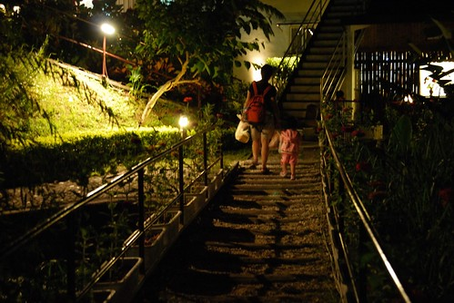

雖然徹家很愛住民宿  體驗不同的台灣風情 台灣精神  
但老實講選民宿需要點運氣  
"賭"網路上的照片跟實景有多大的差別....  
"賭"民宿主人是否真的親切地讓你如回家一般的自在輕鬆  
  
有的民宿很豪華 一點都不輸六星級的飯店  
有的民宿很搞sense  充滿異國風味 充滿濃濃的人文氣息  
而有的民宿雖然很簡單  一點都不豪華大器  也不浪漫特別  
但卻讓人深深感動於主人們對於家鄉社區的回饋貢獻  
對於民宿裡一磚一瓦  一草一木的執著用心 細心呵護  
不同的民宿主人分享著不同的人生故事  房子故事...   
開了我們的眼界  豐富了我們的視野  也替我們的旅行增添了許多美好回憶  
  
這回住在綠島的小貓空民宿  
適逢主人家剛辦完喜事 姻親家一行人浩浩蕩蕩來綠島遊玩  
很湊巧的主人家的親家母跟徹爸一樣是嘉義人  
而且還是嘉女的 可以算是徹爸的學姊吧 (徹爸是嘉中的)  
就如同田媽媽說的"這都是一種緣分阿"  
我們來到了小貓空  遇到了田爸爸田媽媽 遇到了同鄉人...  
是的...緣分就是這麼巧妙又令人回味無窮的一件事!!!  
  
(照片中前排阿徹左手邊分別為田媽媽 田爸爸   
 前排最右邊為田小弟的岳父也就是田媽媽的親家公 後方紅衣者為親家母)  
  
　

雖然知道小貓空只離南寮漁港走路5分鐘的路程  
但下了船後還是急急的打了電話給田媽媽詢問是否可以有人來帶路  
但最主要還是因為行李有點小重 怕微暈的徹爸不知道得提著走多遠  
很快的黝黑的"阿輝"拿著小貓空的招牌出現了(就像機場裡的接人牌子一樣)  
相認後二話不說地接過我們的行李  領著我們去租借摩拓車  
果然戴上安全帽 騎上摩拓車 不到一分鐘就到達小貓空了  
真的是給他離南寮漁港有夠近...  
早知道真的這麼近 照我愛死撐的個性應該一開始就會自己給他走過去了  
  
停好摩拓車後開始驚豔於小貓空的一草一物....  
  
  
  
來到小貓空首先得拾階而上  
中間的木地版階梯配上旁邊的水泥白梯讓人一眼就感覺這是個"濕杯雪"的地方阿  
一階一階的樓梯往上走  通往一個"自成一園"的小花園 小天地 (哈哈 文筆不佳有夠爛的形容詞 )   
  
  
然後是兩旁花團錦簇的小水泥道  
沿途還矗立了不少美麗的貝殼小路燈  
  
  
  
小愛超喜歡這些路燈裡頭各式各樣的美麗貝殼  
非要在每個路燈旁擺好照相pose  請徹爸幫她照  
當中 小愛最愛的是這個梳子貝殼  
  
  
  
吃完中餐回來時 還在這發現了一隻黑亮亮的鍬形蟲  
雖然驚訝與好奇 但我們這些都市人還真不敢抓起來  
倒是正準備要出門的田爸看到這可興奮了 二話不說的抓起來給徹爸照的仔細些  
  
  
  
水泥道的盡頭轉個彎後是小石子道  
兩旁一樣是被田爸田媽照顧的超漂亮超大朵的盆栽  
最近很"興"種東西的徹爸看到這些花 可升起濃濃的好奇心與求知慾  
而正值愛玩石頭 揀石頭的小愛也是二話不說的就蹲下身去了  
  
從入門口到主建築物之前三種不同風味的小道讓人馬上就喜歡上小貓空  
只是帶著小孩子的我們每次走這段路都要走好久好久阿  
小孩子看貝殼 看花 玩石頭 很難離腳阿...  
  
  
  
石子道的盡頭就是這的主建築物啦  
首先映入眼簾的是吧台  
應該是沒有在賣簡餐跟咖啡了吧  倒比較像是飯店裡的櫃檯  
  
  
  
既然叫做小貓空 當然得有隻貓來坐鎮嚕  
  
  
  
這是入夜後的小貓空 另一種神秘浪漫氣氛  
  
  
  
  
  
  
小路燈裡 打著光的貝殼 真的超級美麗說  
  
  
  
這是小貓空的四人房 (可能因為只有兩個大人 所以田媽只放了兩個枕頭  睡前還去跟她多要了兩顆)  
很簡單的擺色與佈置 就像我們習慣的家一樣 (跟徹家一樣走實用儉約派的)  
只是唯一比較令我們不解與不習慣的就是廁所裡的蹲式馬桶  
現今家庭裡很少見的說.... (除了高速公路休息站跟公園公廁以外)  
  
  
  
早餐就是在這"正"面向南寮漁港的露台享用  
(露台的一邊也是房間 但我們不是住這 我們住後方面對小花園的房間)  
  
  
  
這是吧台前方小池塘裡的小燈塔    
阿徹很愛這兩尾魚 第一天就請徹爸幫他照這魚  
可是徹爸只照了粉紅色那尾 徹少爺不甚滿意請徹爸再補拍  
第二天的這張總算讓阿徹滿意了  
  
  
  
騎著摩拓車環島一圈後赫然發現 綠島人竟然把梅花鹿當寵物養  
我們兩天中看到的綠島人家門前的梅花鹿比狗還多  
小貓空也養了一隻 芳名"LuLu"  一歲多的小女生  
(覺得梅花鹿的眼睛園園又亮亮 很漂亮 很有靈氣)  
  
  
  
阿徹看到LuLu很興奮很好奇 可是怎麼樣就是不敢太靠近她  
要幫他與LuLu合照 阿徹也隔的遠遠的   
於是我下場親自示範 請阿徹幫我照  
阿徹邊拍邊自己退的遠遠的 還一直跟我說你不要再過去了啦  
  
  
  
阿母保護你別怕啦...只是LuLu不想跟你照 把臉別過去了啦  
  
  
  
LuLu還沒吃早餐 加上阿徹嚷著要餵鹿  
田爸爸去房子後方拔了不少草讓"徹太子"在"太監徹爸"的服伺下餵鹿吃草  
(怎麼都沒看到"大膽愛"ㄋ?   
 沒辦法 大膽愛對於動物們實在沒輒 所以很俗辣的一直坐在早餐桌那啃麵包)   
  
徹爸一直肖想可以種出像這樣美麗盛開的花朵  
所以逮住田爸爸出門前的空檔(田爸這兩天都要忙著帶親家團遊玩)好好請教了一番  
  
  
  
然後不知道啥因素(我沒在當場)  
田爸阿殺力的說要給徹爸幾株幼苗 還咻的動作很快的就植好在小盆子裡了  
讓徹爸既開心又感動的  
田爸說以後要寄照片回來讓他看看有沒有照顧好喔...  
我想這五盆小幼苗絕對會是讓徹爸愛上小貓空的那根稻草  
而且因著這些 我們與小貓空  與田爸田媽的緣分還延續著ㄋ  
沒有在踏出小貓空 上船離開綠島後就停止了  
起碼會到花開花謝 田爸田媽看到照片   
甚至會一直開在我們的心中...  
   
  
  
同時間 田媽媽(阿徹們叫田奶奶)也是熱情的剪下數朵盛開的玫瑰花給阿徹小愛  
這可樂壞了素愛"偏女性特質"的阿徹   
  
  
小愛一開始還都害羞 不敢回答田奶奶要不要花  
也不敢伸出手接下田奶奶手中的花  
害田奶奶以為小愛不愛她手上花的顏色  
拼命去剪其他顏色的花朵 說著"那粉紅色好了 你應該會喜歡...還是白色好了..."  
  
  
  
可小愛一朵都不敢拿 於是田奶奶把花都給了阿徹 (阿徹更是樂壞了)  
可是田奶奶一個轉身去忙後 小愛就"詞嚴厲色"的哥哥要了花回去 說"這是我的..."  
真是有夠人前一條蟲 人後一頭虎的小妮子  
  
  
  
呵呵...耍嬌羞 我們家阿徹最會了...   
田媽媽的花也這麼開到阿徹小愛的心砍裡去了  
  
  
  
跟田爸田媽還有親家們的大合照後  
田媽媽熱情主動的也幫我們拍了全家福 很難得的四人合照  
  
  
  
後來田媽媽還拿了兩頂小貓空的帽子送給我們   
真的是超級 超級感心的啦...  
尤其素來不適合扁冒的我與徹爸 戴上這小貓空帽卻都超有型 超好看   
更是....吼...心徹底的被田爸爸田媽媽收買了  
  
在與田媽媽合照時 她突然很興奮的說"我也要來戴帽子"  
然後戴上美美帽子後 開心的與我合照...  
  
  
  
  
真的...緣分真的是很奇妙的事...  
當初找綠島的住宿地時 徹爸上網找了找   
看到一個網友在小貓空住五天的搞笑紀錄(本來三天因颱風硬是住成五天) 我們兩都笑到不行   
於是就這麼決定了小貓空  
原本是計畫週六來的 但小貓空早已客滿(徹爸說網路上說要兩三個月前預定)  
硬是更改了我們原已排定的行程計畫 然後週日來綠島住小貓空  
緣分也就這麼的展開了..  
  
小貓空其實很簡單 很樸實 但溫暖的人情濃的讓人想忘也忘不了....
