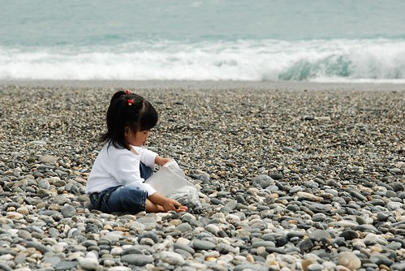

5月花東的遊記還沒寫完卻又開始感覺好久沒有去外頭走走了...  
  
這兩個月的週末除了回陳嬤張嬤家的時間外  
一家四口一整個的宅在家  
就連家裡走路三分鐘就到的公園也沒去...  
我忙著在廚房裡練習我的習作 徹爸忙著拈草養魚    
而阿徹小愛也是卯起來的玩她們的爸爸媽媽遊戲   
從遊戲區到客聽到房間全都是他們的戰場(喔 應該說甜蜜的家啦)   
雖說如此真的挺愜意快活的 (尤其現在已經是曬死人不償命的夏天)  
但還是好懷念花東山的味道 海的味道喔........  
  
話說從綠島吐回台灣本島的那一天   
一家子(精力旺盛的阿徹除外)還得帶著空洞的眼神 虛弱的身軀開3個多小時的車到花蓮  
當初想說富岡漁港就在濱海線上 所以似乎理所當然的就該走海線北上花蓮  
可是疏不知從綠島慘兮兮的兔回來後還得再望著這片海開3-4小時的車是多麼痛苦的一件事  
尤其那更甚於蘇花公路的路況更是讓徹爸與我邊開邊罵邊懊惱  
下回不管怎麼樣也要繞回去走山線   
起碼風景多變 路況也好許多   
可以讓徹爸聽著音樂單手輕輕鬆鬆開著車  
這是這回很深很深的經驗體認...要切記切記....  
  
5點多到達花蓮七星潭時天尚未黑  其實這樣的時間點蠻適合去踏浪玩水的  
但累阿...虛阿....真的只想躺下來休息 早早結束這一天  
連再開20來分鐘的車去花蓮市區覓食的一丁點動力都沒有    
(其實本來行程規劃從綠島回來後要在台東住一晚的 但為了配合綠島小貓空的房間把行程更改為後來這樣)  
  
雖然今日看海看到怕  
但休息過後再從房間內欣賞著七星談彎景還是覺得好美   
舒適寬敞的房間 寧靜美麗的海景  
替我們的旅行畫下美麗的句點...很棒很開心...  
  
   

  
又是看圖說故事嚕  
\*\*\*\*\*\*\*\*\*\*\*\*\*\*\*\*\*\*\*\*\*\*\*\*\*\*\*\*\*\*\*\*\*\*\*\*\*\*\*\*\*\*\*\*\*\*\*\*\*\*\*\*\*\*\*\*\*\*\*\*\*\*\*\*\*\*\*\*\*\*\*\*\*\*\*\*\*\*\*\*\*\*\*\*\*\*\*\*\*\*\*\*\*\*\*\*\*\*\*  
  
徹爸平常工作閒暇很愛上網看各家攝影好手與爛手的照片  
看到特好或特爛的都會傳給我一起分享幻想或開罵  
望海樓就是徹爸去年給的令人驚豔的旅遊分享 (徹爸壓根忘了這事 還一直問我怎麼找到這民宿的)  
親自實驗住過一宿後 我得說  
真的! 他"正正"面向的七星潭彎景真的很棒很迷人  
讓人感覺離海那麼的近可卻又是那麼的寧靜...  
  
民宿的外觀  我們住在四樓最左邊的那間  
  
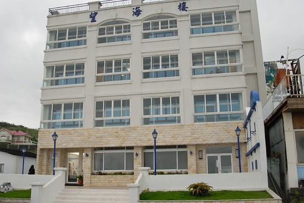  
  
進到房間後 徹爸把自己重重的甩到床上去  
一整個的心力耗盡 枯竭了...  
  
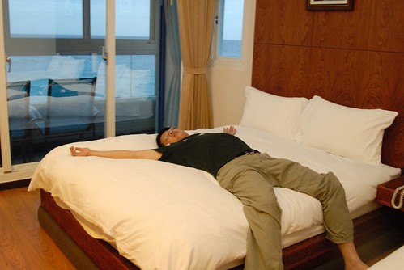  
  
可是當爸當媽的實在沒有當弱者的權利阿  
小孩子不管怎麼樣就是愛揉擰你 壓榨你...  
  
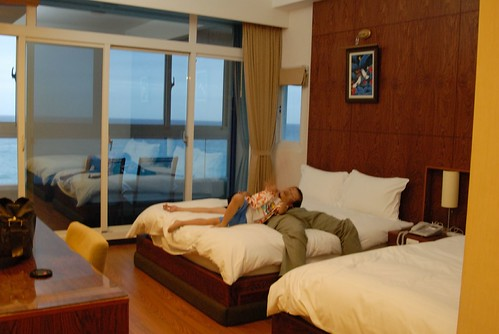  
  
還是拖著老命賣力陪笑 裝可愛吧  
  
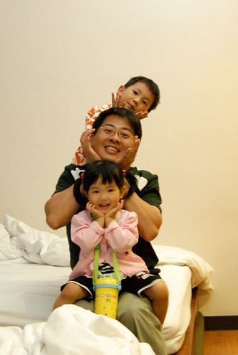  
  
這是從房間陽台看出去的右邊彎景  
  
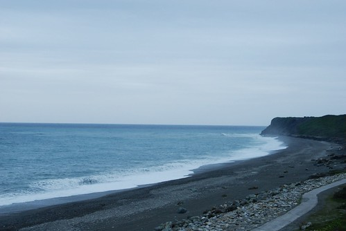  
  
左邊彎景  
照片下方是民宿一樓的平台 可見真的離海有夠近吧  
  
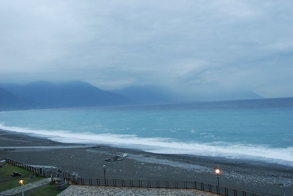  
  
正面彎景  
  
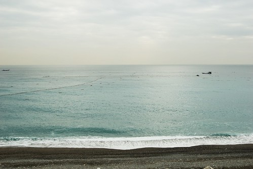  
  
房間內穿過陽台望出去的景  
通常賣海景的民宿或飯店的陽台都是開放式的  
但是望海樓兩層窗戶的設計 讓你打開外面陽台的大窗戶就可以看海聽海吹風  
但不想被海風吹亂頭髮 吹的頭ㄅ一ㄤˋㄅ一ㄤˋ痛的時候  
可以關起窗戶寧靜優雅的欣賞這份美景  
尤其晚上睡覺的時候不用聽著一整晚的海浪拍打聲  
  
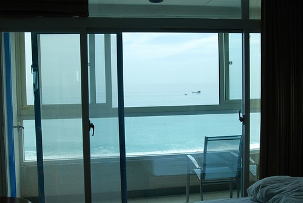  
  
民宿的二樓是網路上大家對他評價頗高的早餐廳  
  
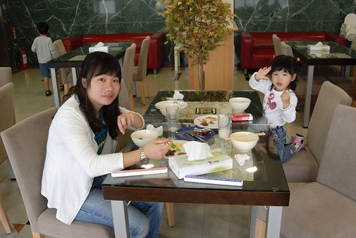  
  
美麗的貝殼桌 我跟徹爸說以後我們家可以擺客廳茶几的時候我也要這樣搞FU  
  
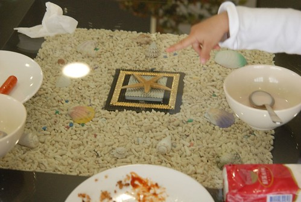  
  
餐桌一旁還有一排單人小沙發可以讓人端著咖啡杯 若有有思的看著窗外大海  
不過我們一家子無法搞詩情畫意的sense  
只能耍白痴 裝可愛的搞High啦  
  
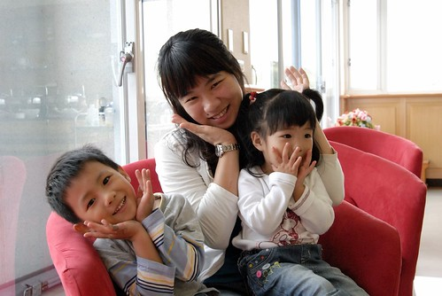  
  
這回出來玩 小愛已經很愛照相也會擺pose了  
還常會要求你說"你幫我照...."  
這到底是天性顯露還是後天訓練的阿  
  
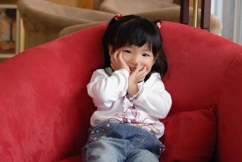  
  
這..這...是前一晚因為懶惰不想去市區而在附近隨便用餐的海鮮餐廳  
只有兩個字形容...黑...店...  
沒有菜單 沒有價位表 只能看著冰櫃點參  
點了一個肉 一個炸魚 一個炒青菜 一個鹽到讓人不想多嚐的涼拌海菜 還有一個湯  
一張四個小孩就沒有了 既不滿足亦不美味一整個的空虛   
  
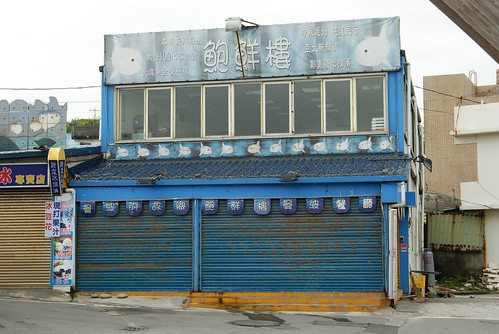  
  
不過即使晚餐真的很不滿意  
但起碼早早吃飽飯 洗完澡 一家子四口10點左右全都睡著了  
我說我好像已經有好多好多年沒有這麼早上床睡覺了  
睡飽飽隔天才能又是一尾活龍阿  
  
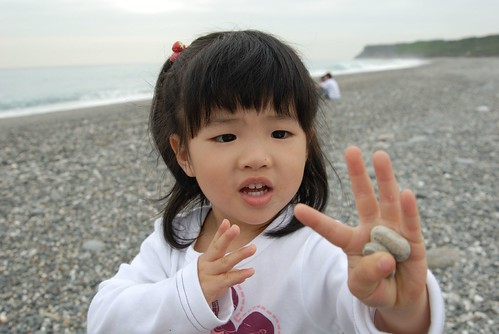  
  
這是從七星潭邊照的右邊彎景  
  
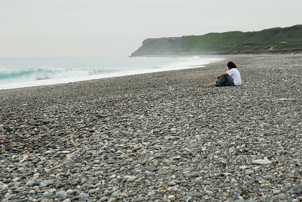  
  
左邊彎景  
感覺又跟在房間陽台望出去的不一樣了  
  
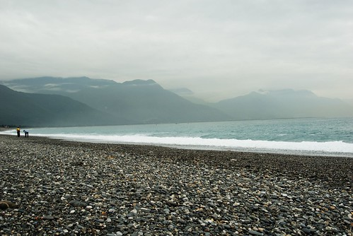  
  
阿徹興沖沖的拉著我去踏浪  
可是浪真的要奔騰過來時又有點嚇的想拔腿跑  
試過兩三回 褲子也預估錯誤的被打濕後就"如釋重負"的直說我有玩水了 我要去撿石頭了  
  
徹爸在幹麻 搞自拍嗎?  
因為徹媽說無論如何也想在這美麗的海邊留下全家福照片  
所以徹爸在架腳架 測光測距離...  
  
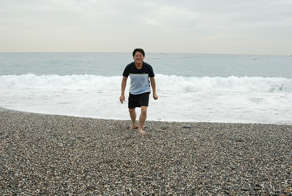  
  
嘿嘿...徹媽除了想留下一家四口全家福照片  
也想跟徹爸來張兩人親密照....有一種甜蜜蜜戀愛的感覺說  
  
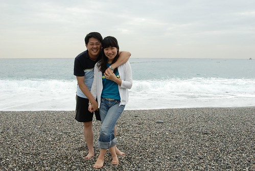  
  
雖然兩人開心的望著鏡頭笑 但也怕後頭的浪一個猛然就拍打過來阿  
  
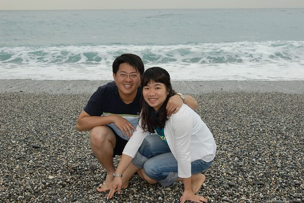  
  
要阿徹跟小愛來拍全家福 一個擔心後面的浪 一個逕自的玩石頭  
  
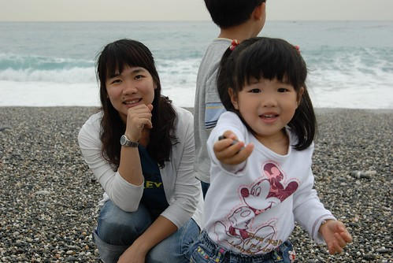  
  
很難僑 很難在美麗的大海前留下幸福的全家福哩  
  
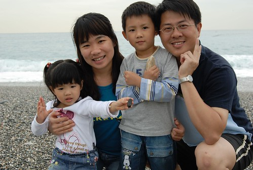  
  
那...那...用石頭"ㄒ一ㄚˊ"一下好了...效果還是不彰  
  
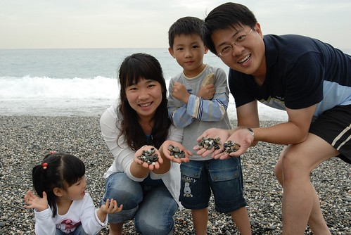  
  
小愛的眼裡盡是石頭 沒有小兩...  
算了...爸爸媽媽有拍的開心就好  
  
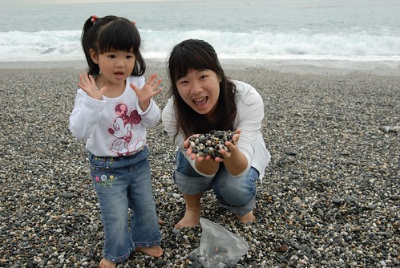  
  
玩了一個多鐘頭的石頭 接著去騎腳踏車嚕...  
其實10點了太陽實在有點大了 但是這是此行唯一可以騎車的地方  
所以不管怎麼樣也要去晃一晃...  
我跟徹爸還有小愛三人共騎一台協力車  
  
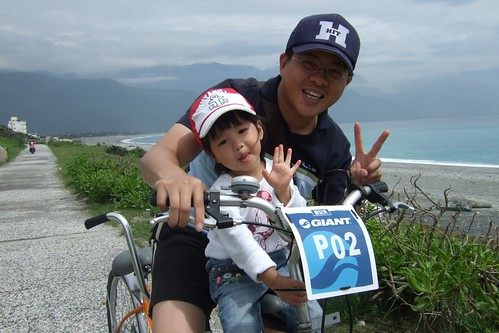  
  
阿徹自己踏著小腳踏車 (這樣的路況還是不敢讓他騎沒有輔助輪的)  
  
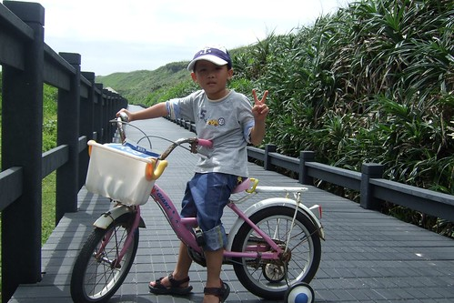  
  
上坡路段 衝阿...  
可是熱阿...累阿.....  
  
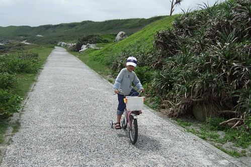  
  
騎了30來分鐘 連四八高地都還沒到 便打道回頭了  
  
(從這望過去的景又更彎了)  
  
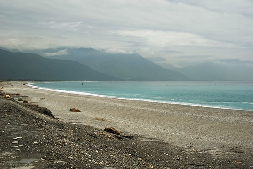  
  
我們三個人一馬當先的回到起點還悠哉的照起相  
阿徹勒? 在那阿!    
在哪阿? 在紅色道路盡頭的那一小黑點阿!  
看的出一個小孩獨自賣力的牽著他的腳踏車嗎?  
即使已被曬的臉紅通通 汗已流濕整粒頭  阿徹不坑一聲的(有點賭氣的)自己騎著牽著回到起點  
難得看到他如此堅持的模樣 我們可是大大鼓勵了一番"很好! 阿徹今日有貫徹始終喔!"  
  
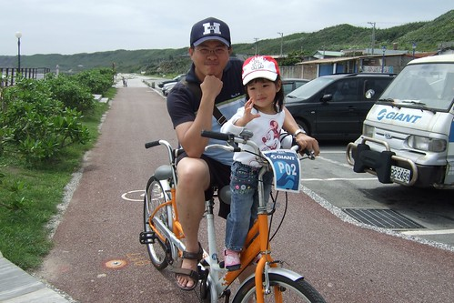  
  
殘忍的三個人.. 還笑的這麼開心....  
  
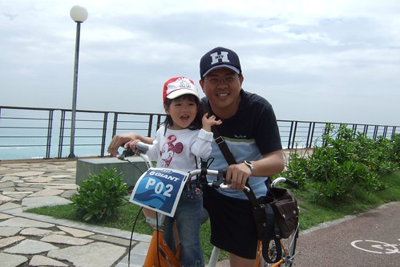  
  
阿徹7個月大時 我們曾經來過一次七星潭  
十月的天風有點大 七星潭這也尚未像現今這樣乾淨  
所以除了對於原野牧場裡的羊奶咖啡稍有印象外    
老實說很難感受網路上大家說的七星潭彎景有多美 踏浪多有趣  
但這回真的讓我喜歡上七星潭了  
這的海讓人有種寧靜的放鬆... (雖然沒有沙玩是對他比較大的不滿意外)  
  
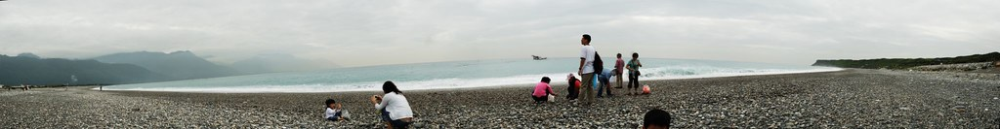
