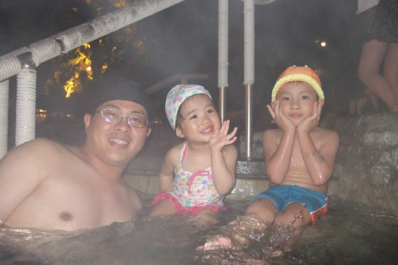
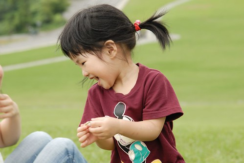
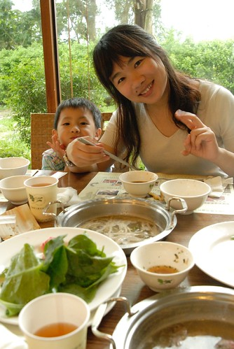
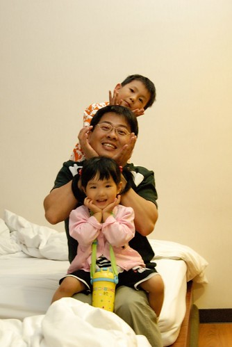

前一篇花東回顧文似乎昭告了大家"徹家要去台東玩了"  
這麼虛張聲勢 這麼大張旗鼓...想想...好像...有點欠扁哩...  
Sorry 啦~~~  
我有多叮嚀徹爸要多拍些照片好回去賠罪喔...  
  
這回如果連5/1回嘉義那天也算進去的話 整整出了六天的門  
小紅整車滿滿的行李(當然還有我們一家四口)換得幾大袋的髒衣服還有我們滿滿的回憶  
雖然最後依舊又患了思家病  想念著我們的小窩  
但車子從雪山隧道駛出時 迎接我們的竟然是與入隧前大不同的磅礡大雨  
真的...真的讓人很想轉頭再回東部阿...  
  
徹爸回來後又接著去外頭上了幾天課  
一直沒進辦公室所以也就沒載照片上去(家裡是有夠可憐的最廉價網路)  
沒日記沒照片 搞的眾人忍不住問"ㄚ是從台東回來沒..."  
呵呵~ 早回來啦 我們沒這麼猛去台東Long stay啦  
今日照片載了上去   我也可以開始一連串的看圖說故事嚕  
不過小心我的懶病發作...  
像去年的日本行最後只交了幾篇總文交差   
多勉勵! 多督促!    
不過等不及的人就先去看照片嚕~~  
[http://www.flickr.com/photos/hmchen0328/sets/72157605010222023/detail/](http://www.flickr.com/photos/hmchen0328/sets/72157605010222023/detail/)  
  

5/2星期五  從嘉義出發 正式展開這次的行程  
第一站 屏東車埕海生館  
因為覺得小孩都愛看魚 水族館是很重要的童年回憶  所以想要帶小愛來這  
魚兒依舊美麗但不知是因館內昏暗的環境還是5/1連假的人潮  
整趟逛下來小累小頭暈說 我想這暫時會被我們列入黑名單中了  
  
  
  
4點從海生館出發 經南迴公路前往台東知本  
連兩晚住宿台東知本泓泉溫泉渡假村  
雖然跟徹爸兩人很哈網路上的知本老爺 但只能是殘念阿....  
(再住那只會落得敗家之臭名 "這樣玩怎麼存錢養小孩阿?"的質疑恐會排山倒海而來)  
  
(不小心讓徹爸露了點)  
  
  
5/3星期六  睡飽飽吃飽飽 一身輕便(這是連宿的好處)暢遊台東  
以前來看飛行傘起落的鹿野高台多了個滑草大草坪  
這裡 讚! 真的讚! 是此行中最令我驚豔的一個地方  
除了滑草帶來的刺激感外  
愜意的不趕時間的坐在草原上望著山望著雲 還有偶而飛行的飛行傘   令人通體舒暢  
  
(學人家裝模作樣的搞sense ...)  
  
  
  
旅行中的最佳康貝特就是這笑容阿  
  
  
  
接著去了慕名已久的原生應用植物園區吃"汆燙鍋" 也就是野菜涮涮鍋啦  
很出乎我們意外的好吃說 (本來想說養生的東西能好吃到哪去...)  
  
  
  
然後然後又去了隔壁的初鹿牧場  
放牛吃草的景象沒看到 倒是讓阿徹畫了頭紅奶頭的彩色變態小牛  (好奇的人可以先去看照片)  
  
  
  
5/4星期日 此行的重頭戲....搭船去綠島喔...  
綠島有美 溫泉有讚 可是船果然真的如人人所言的不好玩阿  
不過幸好去時一片風平浪靜 讓我們有心力體力好好享受綠島的美  
而回程中則連本加利的給他兔回來了  
  
  
  
一望無際  海天連線的綠島朝日溫泉  
  
  
  
泡湯 撿砂 玩的不逸樂呼的阿徹說明年還要再來  
可是兔回來後 雖然一時腦頓還是會說綠島好好玩要再去  
但被提醒會暈船後就改口說 那等長大一點後再去好了  
  
  
  
5/5星期一 早上環了第二趟綠島 然後心情愉悅 掉以輕心的準備搭船回本島  
如果早知道風這麼的大 浪這麼的高 我想我絕對沒法笑的這麼開心 開落海的玩笑...  
  
  
  
一家子歷劫歸來 拖著剩下的半條命北上回花蓮(徹爸絕對是靠著意志力在開車的)  
來到七星潭畔的望海樓民宿後  只想快快吃飯洗澡上床睡覺...  
真的 一點都不假 暈船不是病但暈起來要人命  
  
  
  
5/6星期二   一覺醒來果然又活跳跳一隻蝦...  
七星潭踏浪 撿石 騎腳踏車....  
  
  
  
這回從綠島 七星潭扛了不少石頭回家  
回家後打算買個魚缸來養這些石頭延續這次旅行的美好回憶   
  
  
接著去了最近網路上有關花蓮深度旅遊很推薦的慕谷慕魚生態廊道  
老實說 此地之原始未開發果非一般人習慣的大眾路線阿...  
  
  
  
但這讓人想起小時後會去郊遊烤肉的深山小溪  激發心底的野性  
才發現原來阿徹的小猴子野樣一整個像我這個媽阿 (我真是錯怪徹爸太多年了)  
  
  
  
雖然山很美 天很藍 但還是該回家了....  
這回的遺珠之憾仍有不少 來年繼續慢慢補上嚕~~~  
  

