雖然一鼓作氣花了幾個鐘頭把所有照片分主題給貼好了  
打算一天一篇 花個兩個星期應該就可以寫好了吧  
但...我有強烈的預感我會懶病發作阿...  
自己邊貼照片邊想 怎一堆人有那麼多時間這樣每天寫blog阿???  
可是我要振作  振作!!! 要不然就太對不起徹爸的這些好照片了  
不過為了以防萬一 我還是從印象最深刻的幾個點寫起好了.... (起碼彈藥要用在關鍵處)  
  
鹿野高台~   
雖然對那的飛行傘 井然有序的稻田景觀印象深刻  但去過兩次後倒也不會想再多去  
就在一次偶然間新同事知道我要去台東 然後很碰巧的他老家在台東 於是跟我講了鹿野高台大滑草坪這事  
上網查了查  看了人家去那拍的照片  哇!感覺有大說!!!  
等到自己真的站在那草坪上了 感想一樣是"哇! 真的有大哩!!!"  
除了大以外 那個點真的好....  
坐在最上頭的草地上 望著一直往下延伸的草坪  
然後視線的盡頭是山 是雲 是藍天 偶而還有飛行傘飄阿飄  
很舒服 很平靜 很讓人怡然自得的東台灣景色....  

這是從以前就有的鹿野高台標準view  
可能因為正值日頭赤炎炎的大中午 所以並沒有看到飛行傘在起飛  
    
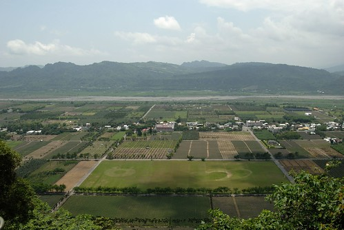  
  
鹿野高台視線裏的道路稻田呈井然有序的格子狀  
看到下圖右上方自成一格的那戶人家  真的..真的..好生羨慕阿  
  
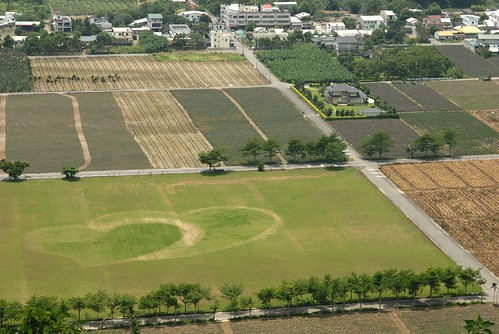  
  
既然看不到飛行傘起飛就轉移陣地轉往大草坪嚕  
因為之前就已經跟阿徹預告有草可以滑 所以阿徹路過這草坪時就開始嚷嚷著要去滑草啦  
在高台的瞭望亭租了一台滑草車(此地是政府規劃 委託當地居民管理經營)  
老闆(居民)說  一台50元  如果我們自己拖上來的話可以不限次數  
就是說讓我們玩到爽玩到沒力為止啦  
老闆還補了句 如果是下午人多的時候可就沒這麼好康了  
不過如果不要自己拖上來 要用流籠讓他們拉上來  
那麼很抱歉 50元一台車就是玩一趟  要再多玩就請再付50元  
所以我們當然是死撐活撐也得自己拉上來  
要不然阿徹這樣五趟玩下來 250元與50元的差距可不小哩   
  
拖到滑草車後 阿徹熱舖舖(迫不及待)的想要趕快衝下去  
逼的連雲霄飛車都不敢玩的膽小媽媽硬著頭皮陪玩  
 (自從8-9年前在六福村的海盜船後我就發誓再也不花錢虐待自己的心臟了)  
我張大嘴一路ㄚ了下去...ㄚ．．．ㄚ．．．ㄚ．．．  
而想不到阿徹竟然是一路笑著下去　一整個顛覆他平日的膽小樣　(因為媽媽太雄壯威武  阿徹一整個被我的熊背給擋住了)  
  
  
我們滑到哪去了？　在照片中間的那個橘色小點啦  
  
  
  
滑下去的時間應該不到１分鐘吧(可能只有30秒吧)　可拉上來的時間可就要５分鐘以上了  
而且不好拉不輕鬆阿．．．  
難怪老闆說如果自己拉上來的話讓我們玩到爽  
有誰有那耐力與體力這樣拉到爽阿？？？  
  
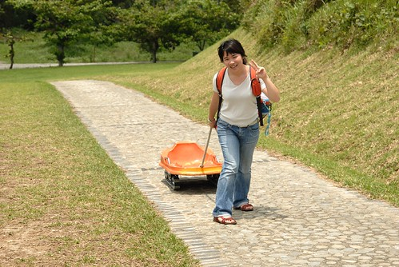  
  
媽媽的心臟真的不太好　所以換徹爸陪玩  
還提醒了阿徹　爸爸比較胖重力加速比較快所以會滑的更快更恐怖喔．．．．  
  
  
  
果然．．．我從上面看下去　速度有快哩　ㄚ．．．  
  
  
  
看徹爸拉的挺輕鬆的樣子　應該有本錢可以玩到爽喔  
  
  
  
不過怎麼走上來後看起來也是喘呼呼的樣子  
  
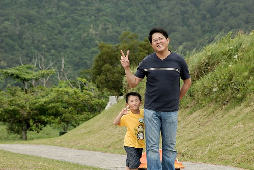  
  
阿徹玩的不亦樂呼　賴在車上不願下來  
唉～爸媽是老人家阿．．．怎樣也給我們休息一下唄  
  
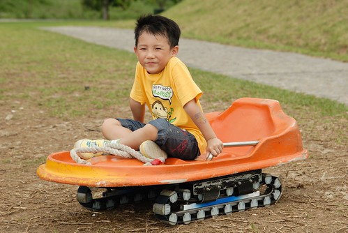  
  
而且還沒好好坐下來欣賞這裏的viewㄋ  
拍一下照　休息一下再玩吧  
  
  
  
跟小愛玩起餵牛吃草的遊戲  
  
  
  
不敢滑草的小愛倒也自得其樂的反覆玩著餵牛吃草  
  
  
  
剛到鹿野時日頭赤炎炎  還擔心著會不會不小心中暑了阿  
幸好滑了第一趟後 大太陽就害羞的躲了起來  還吹來陣陣涼風  
一整個適合滑草 郊遊的天氣阿...  
  
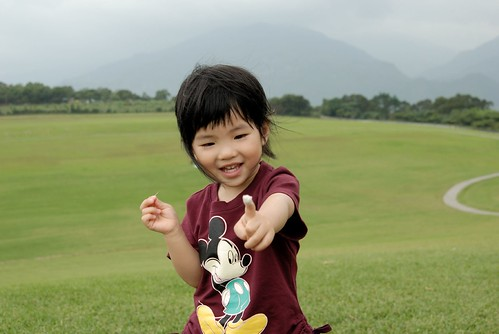  
  
小愛學著媽媽跟哥哥拔草 可往往費盡吃奶力氣卻只抓得小草一兩根  
連阿徹哥哥都看不下去...  
教她一開始要把手張開如五爪章魚 然後如鷹鉤般的抓住一把草 然後使勁拔起...  
在哥哥指導下 小愛果然可以抓起一把如雪花紛飛的小草    
第一次成功拔起一把草的小愛可開心得意的  
  
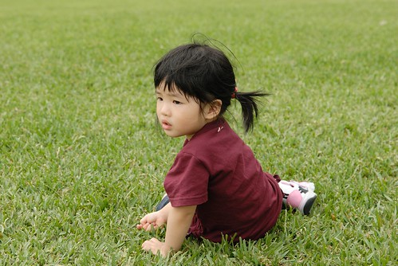  
  
可是阿徹哥哥還是一心一意想要滑草  一直嚕著媽媽  
還想拍照還想吹風的媽媽就說"再休息一下啦 要不然你自己下去"  
而小子竟然就真的嚕著滑草車想要自己衝下去的樣子  
ㄘㄟˊ...嚇得媽媽一身冷汗  只好再拼著老命陪玩了  
不過媽媽鄭重聲明"最後一次! 要再玩請找爸比"  
  
  
  
再滑了一趟後 小子總算比較心甘情願要照全家福了  
行前特意買的 讓徹爸耗盡心思想著怎麼帶出門的腳架 總算派上用場嚕  
一二三 七~~~   
小愛果然七的有奸詐的樣子 而哥哥還是逕自的擺起自己的小花臉  
不過此行要加洗放大纳入徹家全家福牆的就是這張啦  
  
  
  
再來一張唄~   
小愛不甩我們了 失敗....  
  
  
  
雖然阿徹又一直嚕著要去滑草啦  
但媽媽很堅持的要跟徹爸來個兩人親密大合照  
枉費我與徹爸擺出這麼撩人濃情密意的姿勢  
最後喀擦關頭竟殺出阿徹這個程咬金  
  
  
  
失敗 再來一張...(阿徹被警告想要快點滑草的話就別再搗蛋了)  
  
  
  
照玩相後 徹爸又陪玩了二趟  
所以阿徹總共玩了五趟 媽媽陪兩趟 爸爸陪三趟  
雖然就如徹爸說的 第一次下去時會比較緊張外 後來就覺得挺刺激挺好玩的  
但...我還是很驚訝阿徹今日怎麼有那guts玩五趟阿...  
  
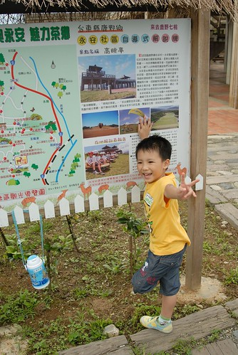  
  
這是滑草坪的左方視野  
  
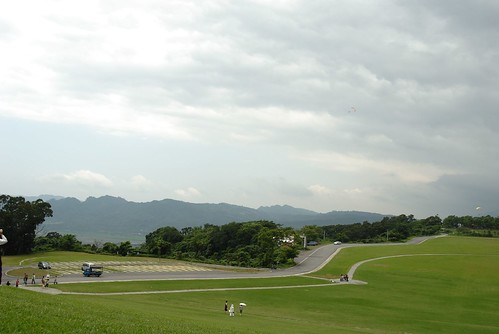  
  
前方偶而入鏡的飛行傘...看起來好小好小...  
  
  
  
五趟後阿徹小愛說要玩球玩飛盤  
在高處玩不太好吧?  
 一不小心球就咕嚕咕嚕滾下去了  只怕撿球比丟球的時間還要多  
所以還是下到下方平緩處玩球適當些  
  
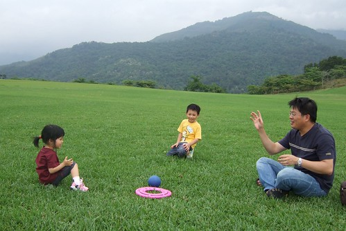  
  
草坪上的小孩 怎麼照怎麼可愛...  
  
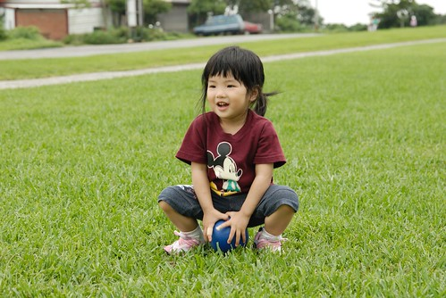  
  
  
  
只是要小心偶而飛來的小飛蟲 小蚊子阿 (這的蚊蟲算是非常非常的少)  
  
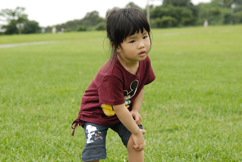  
  
小愛把握機會 繼續練拔草   
這麼大片草 不用擔心被小孩拔禿了...  
  
  
  
這的草不算長 也不算黃 跟徹爸兩人很好奇草坪怎麼維護的阿  
光是要用鋤草機除草就是個很大的工程吧  
  
  
  
在這草坪不知不覺就消磨了近2個鐘頭  肚子早已餓的咕嚕叫  
下山尋食去嚕...要走前的最後回眸一眼...  
美呆了~~~  
我想下回來台東 我們全家都會想再來這裡的.....  
  
  
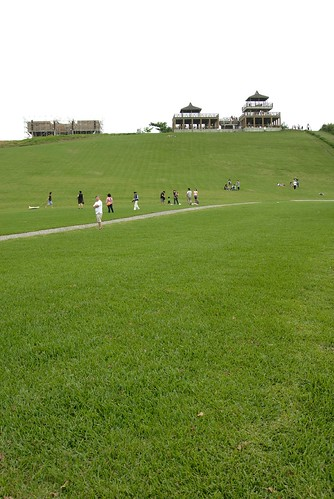  
  
這是徹爸將數張照片接起的整個滑草坪  
可惜草坪上方拉的不夠深...  
但還是看的出來這塊草坪的絕佳地理位置與空間設計阿....  
  

