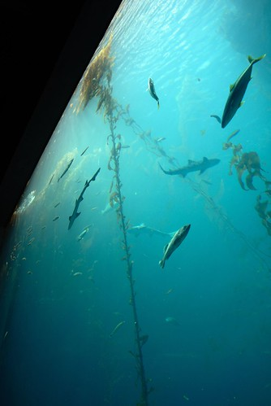

  
呵呵~寫遊記的頻率好像越拖越長  
長到都忘記自己貼了哪些照片 徹爸照了哪些好照片...  
雖然事隔兩個月再看這些照片感覺好像也沒什麼 (徹爸直嚷著這回沒有好看的照片)  
但既然照片都貼了那就要寫 這是我對自己的要求與期望  
只是好像有點勉強大家繼續看這齣歹戲拖棚的遊記...   
   
對了!前幾天跟徹爸提了一下blog要改進的小地方 所以徹爸換了個新頁面測試   
結果...舊頁面竟然就再也找不到了...  
所以...挑了個自己都看的很ㄋㄞ呦的頁面 (常常以為自己逛到別人家去了)  
唉...真是手殘手賤...悔不當初....  
等有時間時我再好好開個規格書讓徹爸量身修改一下  
這段時間就勉強大家勉強自己看這讓人很不習慣的版面嚕  
真是超懷念以前那麼可以大大突顯照片的深藍底色阿....  
   
自己對水族館有著一種莫名的喜好與想望  
總覺得小孩都該有著逛水族館的美好童年回憶  
其實自己也是有了小孩後才開始有水族館的回憶的  
也許自己不過是假孩子之名圓自己之夢吧...  
   

   
阿徹第二次來到海生館 依舊如第一次一樣的好奇興奮蹦蹦跳  
   
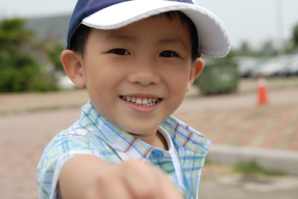  
   
入園後的戲水池越搞越大 看的阿徹心很癢直嚷著要下水去玩  
   
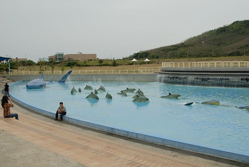  
   
至於小愛的興奮指數則既不高也不長  
只能說大膽愛對於動物一點都不大膽甚至膽小如鼠  
   
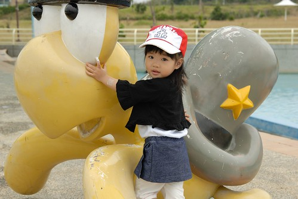  
   
光是看到這幾尊"魚"物就讓阿徹開心不已 硬是每尊都要來個一張  
   
  
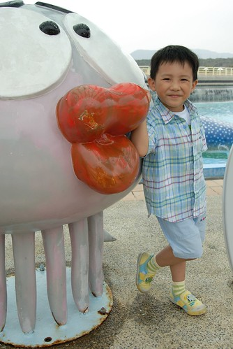  
   
小愛則一如每次旅行時的小心謹慎  
   
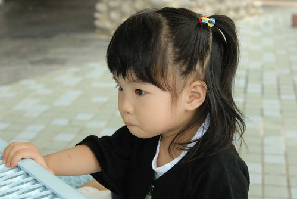  
   
5/1勞動節人潮如預期內的不是太少  
讓向來習慣非假日遊玩的我們有點不適館內排隊的人潮與悶熱  
而本來就很不喜歡排很久隊等表演的我們更是沒有好好的/舒服的看完任何一場表演  
不過因為阿徹哥哥的好奇與堅持倒是仔細看了不少魚  
   
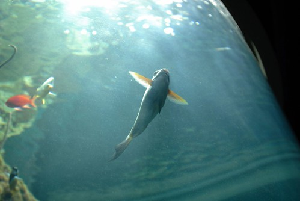  
   
這是我們三個人一致公認的"今日最醜"  
我們喚他為"醜醜魚" 不過醜的真的很可愛  
很像一個臉上塗了誇張藍色眼影與篩紅的阿花女子  
   
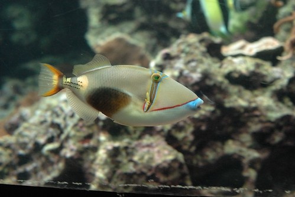  
   
一整個"趴"到玻璃牆上的章魚  有點令人作噁  
   
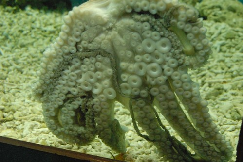  
   
魚群之一  
   
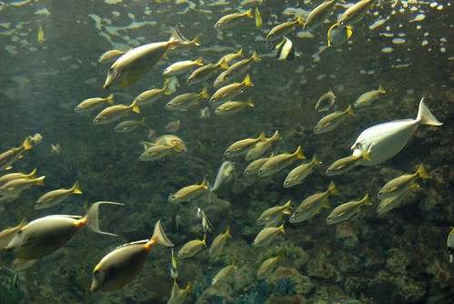  
   
僅僅一牆之隔卻這麼貼近魚群 那種感覺真的有點震撼  
雖然對魚兒來說 待在這有限的"水缸"實在有點委屈了  
但對我來說卻因著這缸水這些魚 心情清涼與舒放  
   
魚群之二  
   
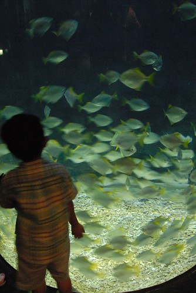  
   
水母之一  
   
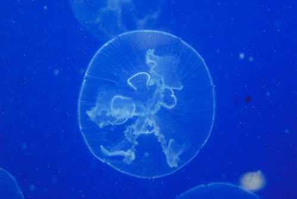  
   
水母之二  
   
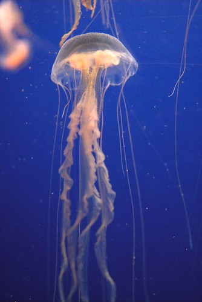  
   
大部分都市人應該都像我一樣享受這看魚遨遊的樂趣吧  
自己不能獲得的解放與自由只能寄情於這些令人羨慕的魚兒身上  
   
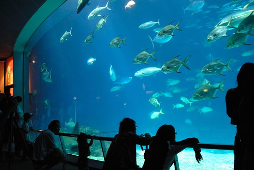  
   
魚雖然好看但看久還真有點頭暈目眩  
尤其館內燈光有點難以適應的昏暗 (記得上回來時沒這麼暗阿)  
   
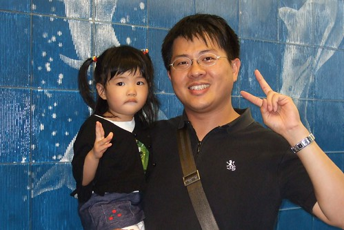  
   
阿徹那一陣子很喜歡這樣嘟嘴巴裝可愛 討親親  
常常就這麼嘟著嘴 追著你 要親你  
媽媽我完全的抵擋不了他的柔情攻勢  
   
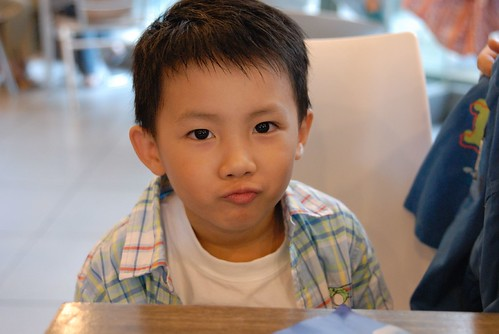  
   
女生比較"秀皮"  一點點點小傷非得要你包的像是被人拿刀劃過一樣  
   
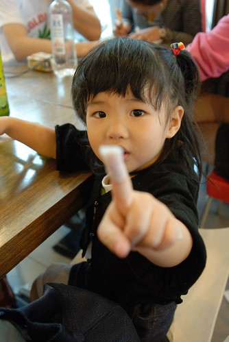  
   
小愛真的是個適合出外的小孩  
不只乖巧謹慎不用你擔心  連吃飯這事也表現的比在家中好很多  
可以認份認真的自己餵飽自己 讓爸媽盡情的享受自己的餐點  
真是好樣的!!!  
   
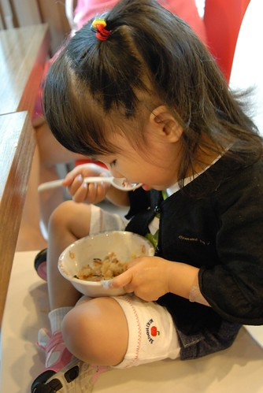  
   
海生館內的餐點價格不斐   
但就當地食材設計餐點內容的那份用心很是令人感動  
有著當地盛產的涼拌洋蔥 櫻花蝦拌飯  香魚\*\*飯....  
個人覺得算是端出去不會丟台灣臉 屏東臉的觀光餐  
   
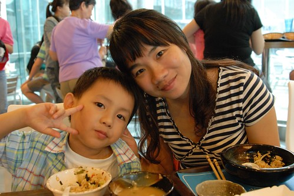  
   
阿徹與魚兒照相的興緻高出小愛許多  
但小愛碰到他喜歡的東西也是會要求照個不停  
所以這回徹爸成了我們家名副其實的攝影官 沒有太多個人的偏好選擇  
   
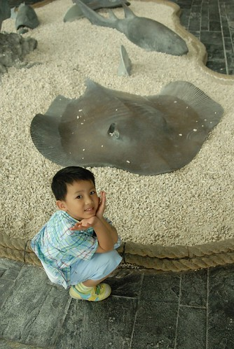  
   
午餐前看完台灣水域館 餐後去了世界水域看企鵝  
   
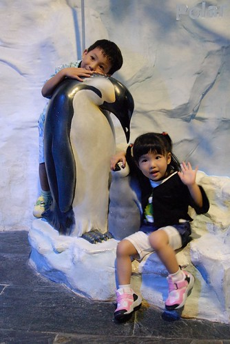  
   
世界水域館是新的館 4年前我們來時還沒有  
個人覺得燈光昏暗 動線不佳 秩序感不足   
海獅餵食秀時一堆人擠在缸前 第三排以後的人啥也瞧不見  
而企鵝餵食秀我們這種懶人更是不用肖想了  
不過看企鵝在那哩咚咚跳的還有在水中游泳的可愛模樣就也夠了啦  
(覺得海生館的企鵝比木柵動物園的好命些 生活環境像樣 人道多了)  
   
  
   
當大家看企鵝看的嘖嘖稱奇時  
小愛最感興趣的卻是同時間在池中清潔的人員 看到捨不得離腳  
   
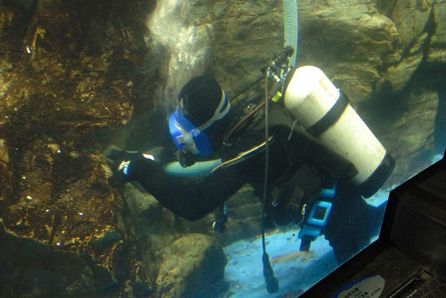  
   
其實有點距離的觀賞 美感最佳  
   
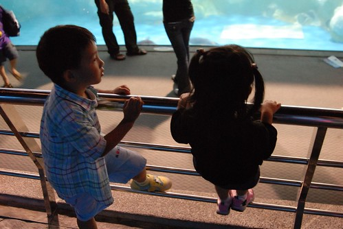  
   
陰陰悶悶的天氣讓人才逛兩小時就已累呼呼...    
   
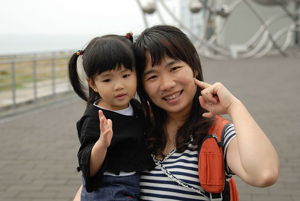  
   
魚群之三  
   
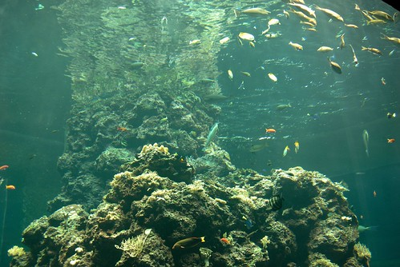  
   
上次來時印象很深刻的珊瑚館  
可這回感覺卻一整個昏暗 且節目表上的餵食秀時間到時也不見任何餵食 大大失望...  
   
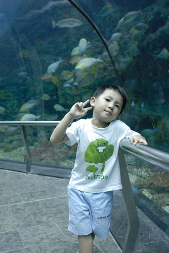  
   
感覺似乎有了新的世界水域館後 這裡失寵了  
連魚看起來都有點孤單了  
   
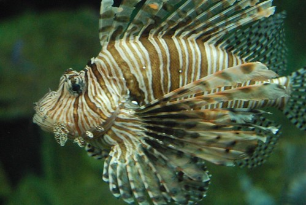  
   
會發光喔...身上的白色東西都會這樣變成螢光色喔...  
   
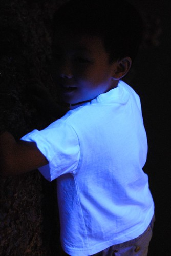  
   
當小孩看魚看的疲累時 這是振奮精神的好遊戲  
   
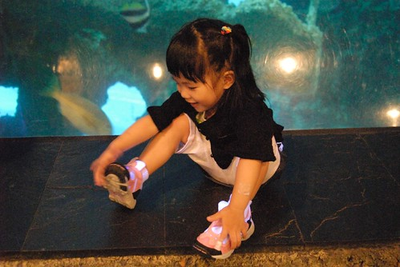  
   
看到阿徹的嬌羞樣 常忍不住想他跟小愛的性別似乎顛倒一下"結果"會更好  
   
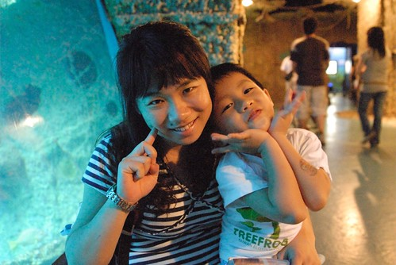  
   
不過還是當個美少男好啦  
爸爸說他這輩子沒玩到的女人就交給他兒子了  
   
  
   
長大後如果還有這模樣 這笑容  我想應該有機會可以幫他爸圓夢吧....  
   
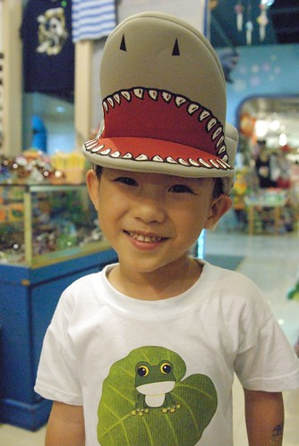  
   
行程排定後就告知了阿徹我們行程中大致會去的景點  
出發前幾天阿徹突然跟我說 我們來看上次去海生館的照片  
於是兩人興奮的找出那次旅行的照片   
可是找了好一會怎麼都沒有魚的照片ㄋ...就只有幾張以人物為主的海生館照片  
 完全的看不出來我們曾經去過海生館  就像船過水無痕  
後來跟徹爸兩人討論 仔細回想一番  
好像是當初都很不滿意海生館裡照片的色澤與精采度所以照片都沒挑出來洗  
看了這回徹爸拍的魚  真的要說徹爸技術進步啦(當然器材也進步不少)  
這回就可以留下證據充分證明我們來過海生館啦~~~
