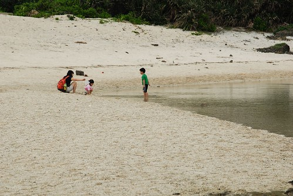

最近應該做..想做..可以做的事很多...  
敲著鍵盤寫日(遊)記成了priority最低的一件事  
才發現原來寫東西是需要投資大量時間與耐力的  
真的很佩服那些部落格紅人怎麼有這些心力時間經營她們的blogㄋ...  
  
雖然有點懊惱當初不該花了那麼多時間把5月初花東行的照片都貼好  
以為這樣就可以push自己寫遊記  我真的太高估自己也太低估目前生活的充實度  
但.....既然一大清早天還沒亮就被小愛吵到睡不著了  那就繼續來寫我的花東山海戀吧...  
只是...怎麼才寫完開場白就又想睡了....還是再窩回床上吧...  
原來下次失眠的時候可以寫寫東西催睡一下...(現在時間早上六點半)  
  
話說我們一切風平浪靜 平安抵達綠島後   
我們一家四口騎著摩拓車快樂的環島機遊(別懷疑 我們是四貼沒錯)  
人說綠島的溫泉 浮淺 日出最有名  
但大家知道的...帶著小孩很麻煩的... 所以後兩項都沒我們的份啦  
我們純粹來綠島泡溫泉 看海 拾貝 享受綠島美麗風光與濃濃人情的  
雖然只有這樣但這趟來的很令我們回味無窮  
阿徹小愛長大念小學後我們一定會再拎著她們來綠島的  
到時候是一定要給他浮淺的啦!!!好期待下次的綠島行喔~~~  
  

一樣的開始看圖說故事嚕...  
  
出發前同事跟我說綠島有一家菲哥的店很有名喔 一定要去喔  
菲哥? 感覺像是一個色老頭開的店 很懷疑那地方適合帶小孩去嗎  
去到綠島的第一頓中餐 問了小貓空田媽媽綠島那好吃  
田媽媽竟然用著理所當然 無庸置疑的語氣說著"菲哥的店阿"  
看來這菲哥真的在綠島很紅喔 沒去走他一回可能會枉來綠島喔  
從南寮漁港出發往綠島最熱鬧的地方騎去 果然很快的就看到菲哥的店了  
原來...原來...是家快炒店阿...  
雖然桌椅有點擁擠而且整家店呈現用餐人潮過後的寧亂樣  
但可以感受出這真的是家人氣餐廳阿  
  
印傭領我們坐定位後 送上菜單說了句"四樣400元"後轉身就又去忙了  
看著菜單上有魚有肉有湯的 讓我跟徹爸忍不住懷疑有沒有聽錯阿  
就又跑去問了一次印傭"菜單上的任何四樣都可以嗎"  
印傭一臉肯定的回答我"是的"  
於是我們放心的選了三菜一湯: 紅燒魚 三杯雞 炒高麗菜 還有一個海菜吻子魚湯  
過沒多久 菜紛紛上桌...  
哇...看起來好好吃..真的好好吃....(我現在寫著寫著竟然忍不住又吞口水了)  
尤其那加熱著的紅燒魚真的燒的好 燒的香  吃到只差魚頭沒拿起來啃而已  
  
那天晚餐想說換口味吃吃別的 結果吃了一頓300元卻不飽又不滿意的麵食  
讓我們超懊惱沒再去菲哥那的  
要不是隔天的船班訂在那尷尬的 不知道該不該先吃午餐的12點半  
真的很想再去菲哥那點不同的四樣菜吃飽飽  
下回去綠島不用再多考慮 午晚餐都包給菲哥就對啦...  
  
對了菲哥的確長的有像菲哥  
不過看他冒著汗勤勞的認真的在廚房裡忙進忙出的  
我覺得這個認真的綠島菲哥比較帥  
  
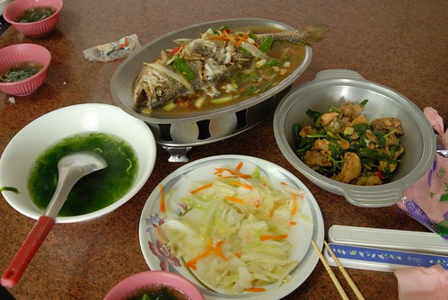  
  
吃飽飯後 騎著車小晃了一下綠島最熱鬧的那條街 (其實整個島就也那條環島大街而已)  
看到小7 不用懷疑這就是最熱鬧的地方啦  
一團團騎著摩拓車的人潮 難道她們也跟我們一樣來小7尋找家的味道嗎  
  
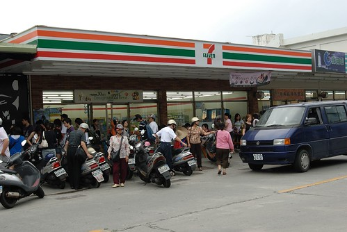  
  
阿徹小愛最愛的味道是什麼就是養樂多的味道啦  
飯後來瓶養樂多可是人生一大樂事ㄋ  
  
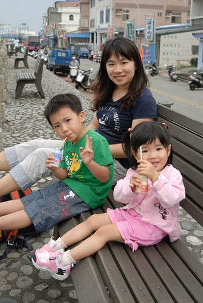  
  
好喝 好喝 真好喝 30年來恆久不變的好味道...  
  
  
  
慢慢喝 慢慢享受這份幸福  
  
  
  
尤其坐在堤岸邊 穿著風 望著海 心一整個的慵懶了  
  
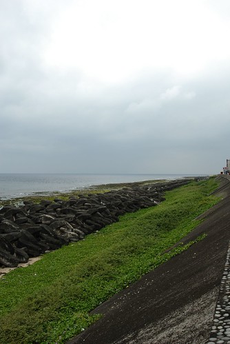  
  
  
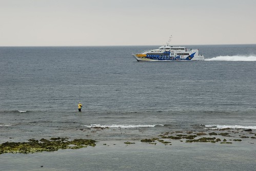  
  
慵懶到讓我跟徹爸再回到小貓空休息時不小心就睡著   
睡了個香沉的午覺後 3點起床開始我們的綠島探索嚕  
  
從南寮漁港出發 順時鐘方向的繞著環島公路  
第一站綠島燈塔  
  
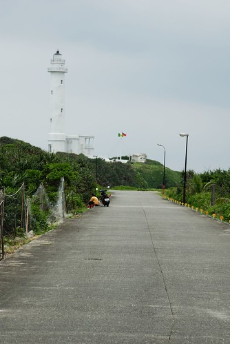  
  
一個只可遠觀不可褻玩焉的燈塔  
不只是不得進入外 那燈塔的白讓人覺得還是遠觀的好  
不過到底要怎麼樣才可以把燈塔跟人都同時入鏡而且還都很"大仙"很漂亮ㄋ  
  
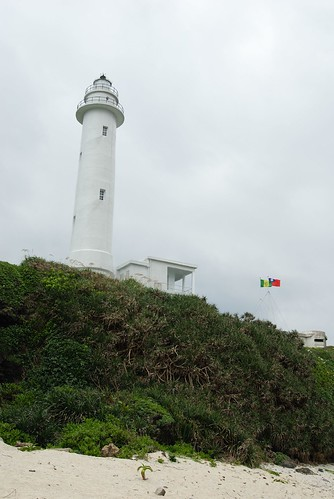  
  
小貓空的阿輝說 燈塔下方的潮間帶生態很豐富  
也許可以適合我們這種不浮潛的親子拾貝路線  
還給了我們一些星沙當目標 並且說等我們親自去找之後就會知道這些星沙有多寶貴了  
真的...真的很寶貴...我們撿了半小時連一顆都找不到  
所以回去後要再跟小貓空多凹一點的 (隔天是田媽媽主動又給了我們一小包的喔)   
  
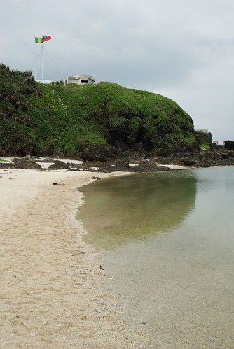  
  
本來還期待(幻想)可以去抓螃蟹的 就像我跟徹爸在大學澎湖畢旅中抓螃蟹一樣的說  
可是潮間帶的生態豐富歸豐富 實在很讓人不良於行啦  
  
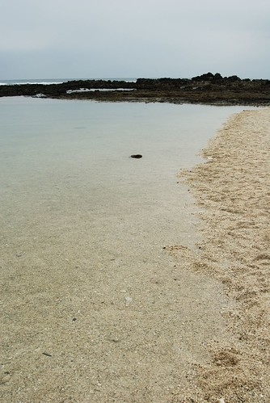  
  
沒練過的人不要隨便輕易嘗試喔  
  
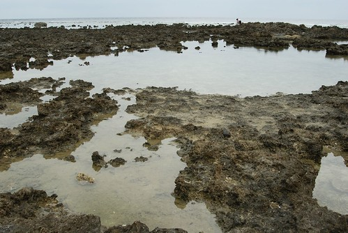  
  
尤其是小孩子  還是玩玩沙找找貝殼就好  
  
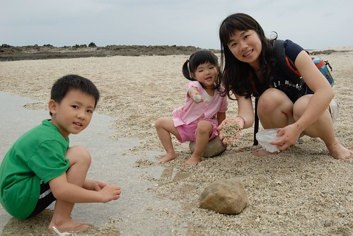  
  
阿徹很懊惱我們沒幫他帶玩沙的傢斯頭出門  
只好問了問田媽媽有沒有玩沙時可用的小器具小工具可以借我們用  
田媽媽當下有點被我們問倒的樣子    
我後來在踏上綠島的沙後總算明白她為什麼會頓ㄉㄟ了   
可能那時候他心裡在想綠島的沙要怎麼玩阿  
不過她還是很熱心的去了她的工作間 努力的 嘗試的要找出可以借阿徹用的東西  
最後她一臉歉意的拿了兩跟塑膠湯匙說"田媽媽只有這個哩..."哈哈  
阿徹雖然不甚滿意的樣子 不過這可是田奶奶的一份心意ㄋ  
   
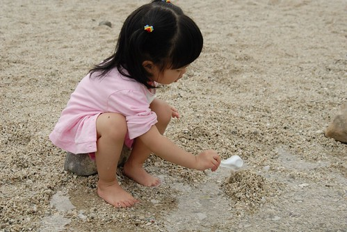  
  
珊瑚沙踏在腳底其實很刺也很不適合堆沙堡  
我想應該真的很少有人會在綠島"玩沙"吧 (其實大部分的人忙著浮潛 應該也沒有那時間與閒情逸致的)  
  
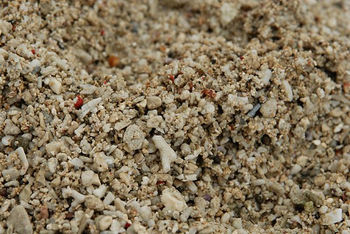  
  
偶而可以發現可愛的小寄居蟹  
  
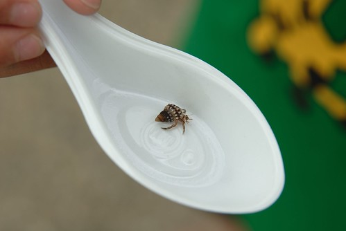  
  
各式奇形怪狀的貝殼與小石子  
  
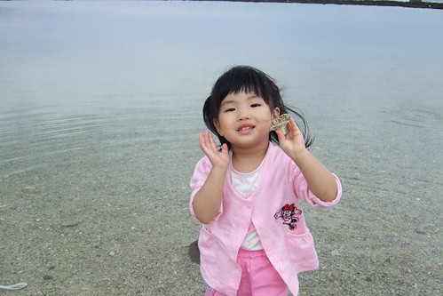  
  
踏在水中還有小小魚繞著我們的腳團團轉  
這是帶著小孩旅行"因禍得福"的另類收穫  
  
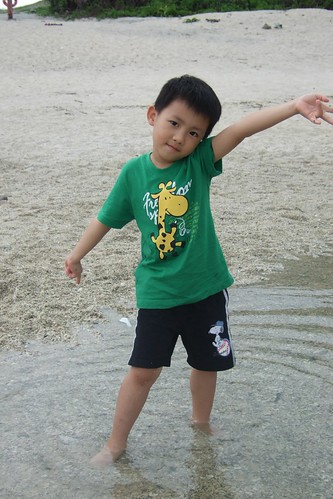  
  
環島第二站 綠島監獄  
當然...當然...只能照張過門無法入的到此一遊照嚕  
  
  
  
環島公路上多都是屬於坐在摩托車上賞她幾眼的景點  
如牛頭山  
  
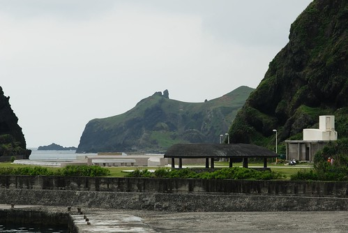  
  
將軍岩 (老實說我一直搞不清楚到底要從哪個角度看過去才能看到將軍)  
  
  
  
綠洲山莊  
  
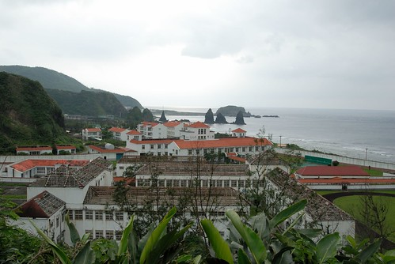  
  
楠仔湖  
  
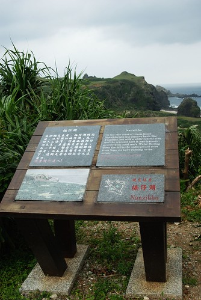  
  
柚子湖  
  
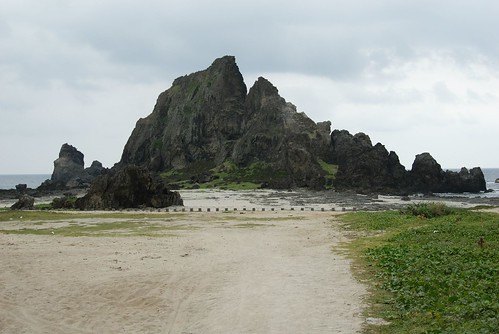  
  
在柚子湖總算看到難得的人潮  
  
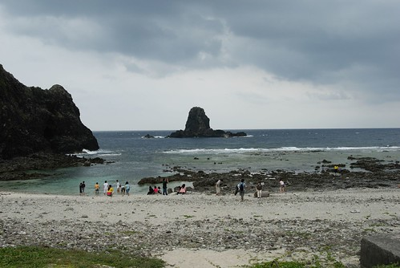  
  
花東回來後 徹爸說這次照了不少到此一遊照 但卻沒有令人驚豔的風景照出現  
可見這回的旅行很放鬆 很愜意喔(講白點就是很懶惰啦)   
  
  
  
下午的天氣有一點陰 有一點風 不冷不熱的天氣很適合環島  
阿徹與小愛逮到機會就是撿石頭 撿樹枝  
  
  
  
小愛在我們都不知情的情況下 自己撿了個治痛單的瓶子裝小石子  
  
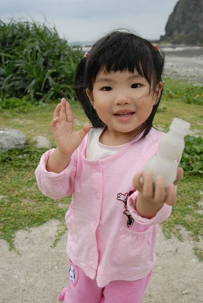  
  
乾燥的小石子路上竟然又讓我們發現寄居蟹了  
小心翼翼的抓起寄居蟹想讓徹爸照個仔細美麗的  
結果寄居蟹竟然就棄殻而逃了  
看著牠慌張的模樣 讓我們超懊惱打擾了他  
嘗試著把牠的殻ㄉㄨ到牠面前 希望牠再回到牠原本的避難處  
可是牠怎麼樣就是不願意 逕自的想要找洞鑽進去  
嗚嗚...下次我們看到寄居蟹再也不敢拿了啦  
  
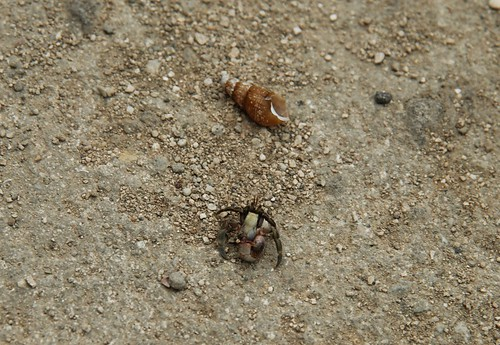  
  
哈巴狗與睡美人   
可是我覺得比較像木乃伊說  
  
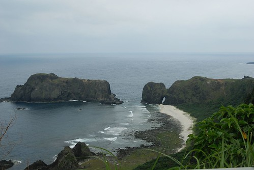  
  
總算總算...繞了大半圈後到了朝日溫泉  
換好泳裝迫不及待的下湯嚕  
  
  
  
這幾年以BOT案新建的湯池 深度很適合小小孩們  
這樣的天氣 這樣的水溫也配合的很剛好  
  
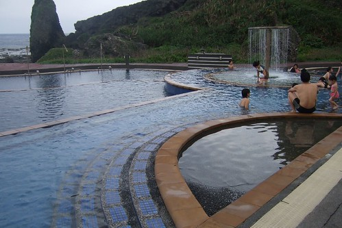  
  
小愛自個毫無所懼的走來走去 反倒是我們怕他滑倒的跟在他後頭  
  
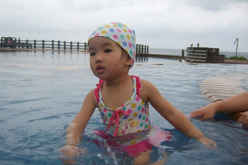  
  
阿徹更別說了 越玩越大膽  一直偷偷跑去下方更深更冰的水池中  
  
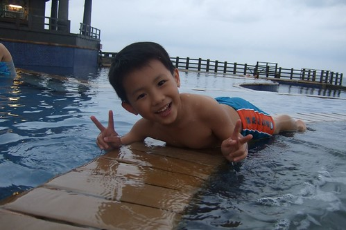  
  
雖然很多人都是下午浮淺 晚上泡溫泉  泡著湯望著滿天星空  
但我覺得傍晚時分來的FU真的也挺好的說  
一來人潮不多 再來這樣不是能泡著湯看著前方海天一線的美景嗎  
  
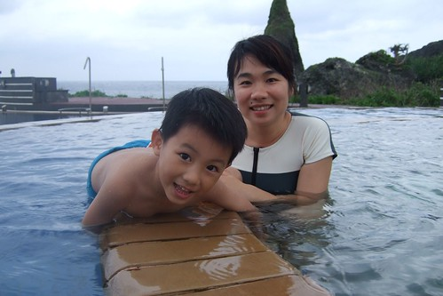  
  
雖然親水池很好玩 但來到朝日沒泡泡那原汁原味的湯怎麼能算是來泡過溫泉ㄋ  
  
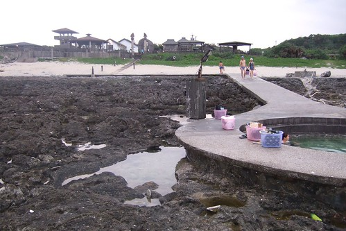  
  
只是這原汁原味的湯就真的有像下水餃的大鍋了 (人多的時候應該就成了滷腳鍋了吧)  
  
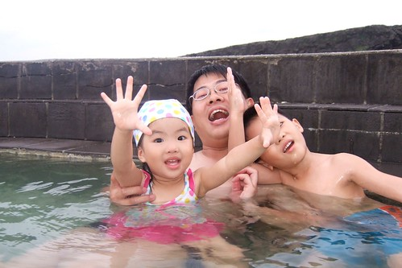  
  
池比較深 水也比較鹹  
小愛若要泡到上半身就得坐在我或徹爸的大腿上 要不然會被淹沒  
若要自個坐在檯子上那就只能泡泡小腿肚  
所以泡個10來分鐘 大的小的就都直嚷著回去上面比較好玩  
  
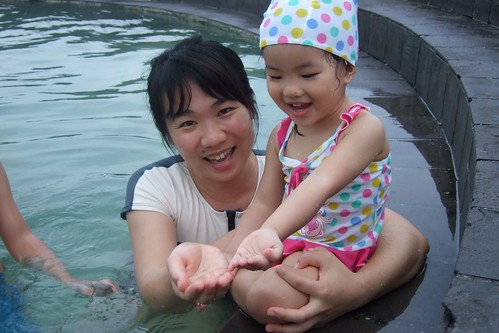  
  
阿徹小愛玩打背遊戲玩的不亦樂呼  
  
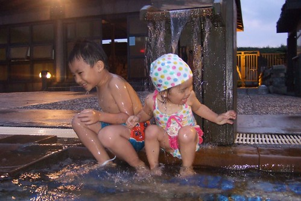  
  
像不像在練功的少林小沙彌  
  
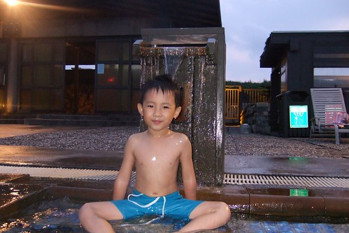  
  
小愛興奮著喊著"打背 打背" 來來回回 上上下下的一直去打背  
  
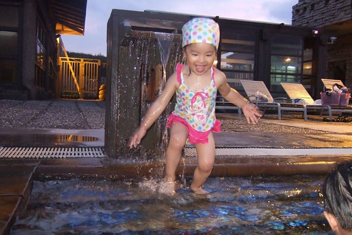  
  
越玩越High 笑的花枝招展的   
  
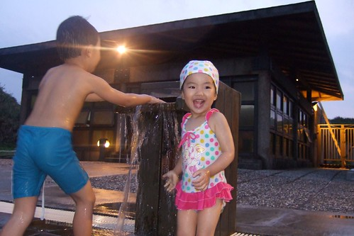  
  
泡了一個多鐘頭 天都黑了 還不願意起身  
可是肚子好餓了說...下回再來玩哩   
小愛阿徹對綠島的念念不忘絶對是因為這打背遊戲  
  
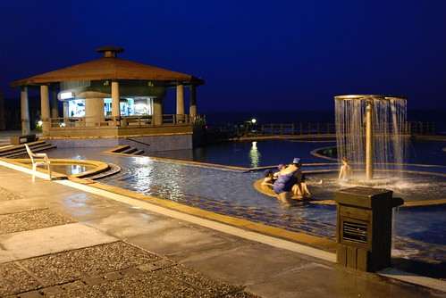  
  
入夜了 這裡等著那些浮完潛的人...  
  
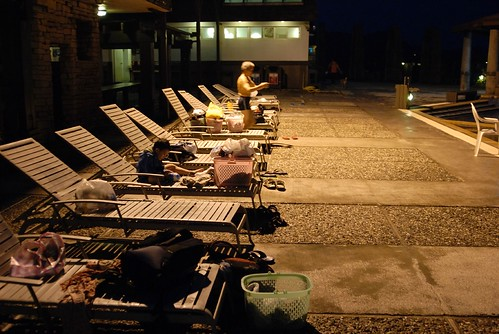  
  
泡完溫泉 吃完晚餐 一家四口早已累的想要洗澡睡覺了  
我與徹爸平日在家難得可以12點前上床睡覺 在外卻每每11點不到就已躺平在床上  
算是有認真玩 玩的有累吧  
  
隔天早上採逆時鐘方向再環島了一圈 尤其是昨晚從朝日溫泉回到南寮漁港那段路  
黑咪媽悽的啥也沒看到  
  
大白沙潛水區  對我們來說當然還是在於沙嚕  
  
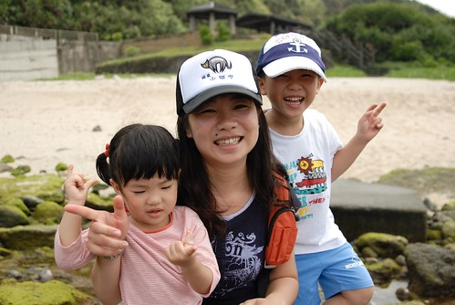  
  
今早日頭赤炎炎 得抹上重重厚厚的防曬油  
但小兄妹撿石頭的興致絲毫未减  
拿著塑膠袋猛裝他們喜愛的小貝與小石  
  
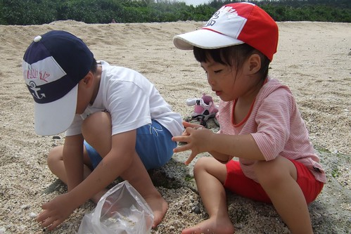  
  
這也是豐富的潮間帶生態  
  
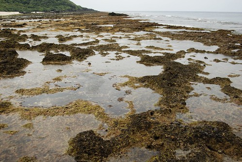  
  
石塊中隨處可見小螃蟹穿梭著  
  
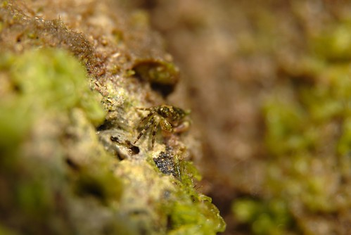  
  
這艱困的地形當然還是派徹爸去探勘  
  
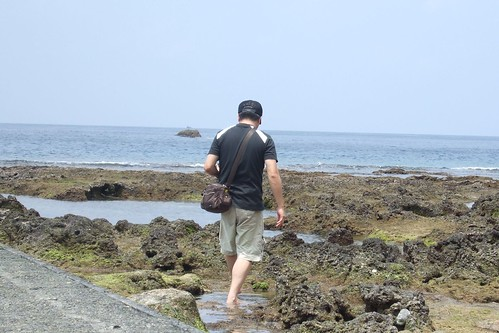  
  
我們母子三人留在這裡曬太陽玩沙就好  
  
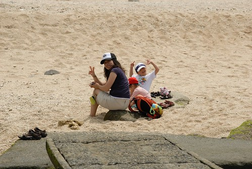  
  
很難想像在7-8月的旺季裡 誰能有這能耐坐在這玩沙ㄋ  
  
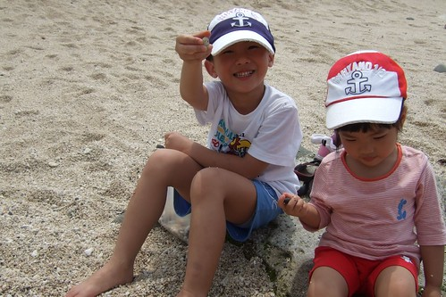  
  
五月初的太陽其實就已經很吃人了說  
算一算適合出遊的時間實在真的不多  
所以"玩"其實才更是需要timing 錯過就要再等一年的  
  
  
  
這石頭上的綠苔 曬一曬處理好後應該就可以煮成我們前一日午餐的海苔湯吧  
很神奇的是 這苔不會滑喔 走在上面就像走在草地上般的柔軟 觸感挺好的  
  
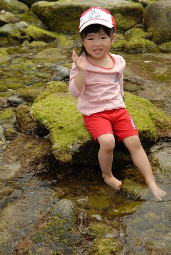  
  
太陽真的大再曬下去會成小黑干了...  
  
徹爸說我這背影超像是有擔當的男人的(像他啦) ㄘㄟ....講話再毒一點沒關係  
  
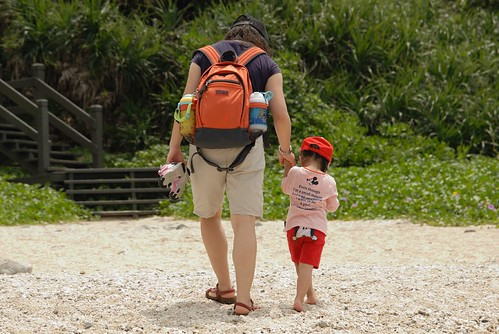  
  
難得遇到其他遊客請人家幫我們拍張難得的全家福  
  
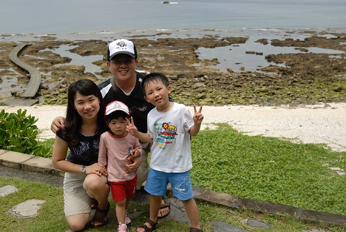  
  
離開大白沙後 又慢慢的環了綠島一圈 再多看幾眼綠島的美  
12點回到小貓空拿起行李 準備搭船去  
一天一夜 24小時整的綠島行記憶滿滿  
即時回程時暈船暈的讓人叫不敢  
但我們一定會再來綠島泡溫泉 浮潛的 as soon as we can  
期待那時候的船可以大台一點 要不然就重金炸機票錢好了...  
   
補充:  
  
這是徹爸拍的小花  
  
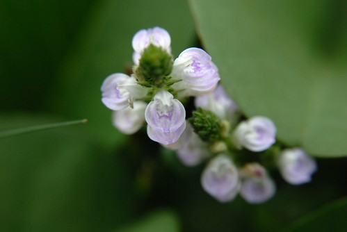  
  
這是在路旁整齊排列的摩過車隊  
很難想像旺季的時候 會有5000台摩拓車穿梭在這小小的島上  
我想旺季可能不只天氣不適合我們來 這危險的車潮也挺不適合的  
  
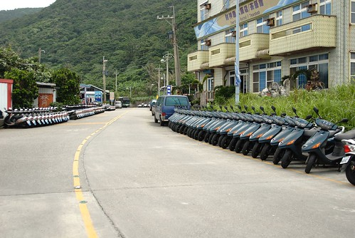  
  
睽違多時候 總算完成了一篇遊記... 連我自己都想給自己拍拍手了....
