我們家的太平山總算成行了! 話說我們家跟太平山真的很無緣的 對於太平山這個避暑勝地 我們慕名許久 但在夏天 人算永遠比不上天算 所以兩次預訂好的太平山旅都因為颱風的攪局而告吹 這回安排在4月底(剛好利用阿徹校慶的補假) 應該很難被颱風掃到了吧(哇哈哈) 不過不知道是否因為期待太久太深 老實講我跟徹爸還是比較喜歡衫林溪與武陵... 也或許熾熱的夏天上山方能體會太平山的涼與好吧! 只是那樣的天氣就又不適合洗溫泉了 因為太平山下的鳩之澤溫泉真的棒! 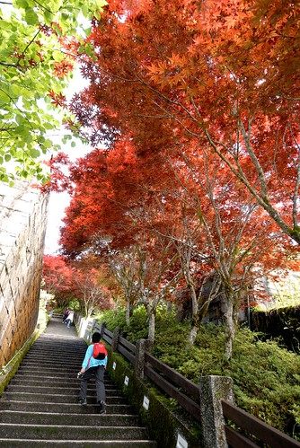

原本理當兩天的時間都好好待在山上 走遍可以走的步道 但因為先去松羅步道所以我們只剩1天的時間給太平山 其實是有點過短的 我們到達太平山莊時已經是下午3點多 太陽公公早躲到雲後休息去了 於是辦理好付費手續以及預訂隔日碰碰車後 我們索性先去我們今晚下榻的翠峰山屋 待隔日再好好探索太平山莊 不過這時候眼睛早被山莊階梯旁的火紅槭樹給吸引了 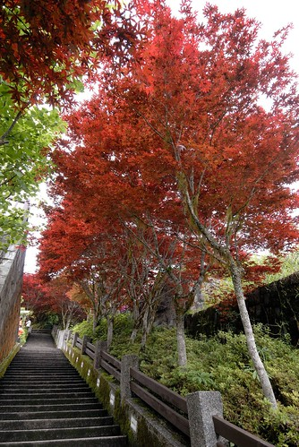 隔天早上再來到太平山莊 豔陽高照襯的槭樹是更加火紅 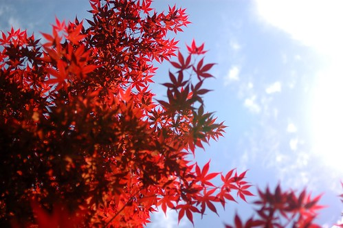 我喜歡從樹下抬頭往上看紅紅綠綠的樣子 那個光影很棒但卻只有雙眼才能完美紀錄這畫面 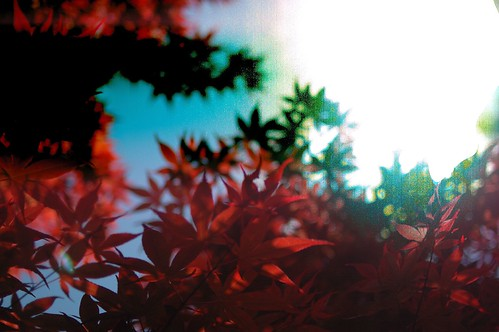 適逢五一連假(上山後我才意識到) 上山的人潮不少以致徹爸的車停的有點遠 我們母子三人等候的空檔 邊拍邊玩 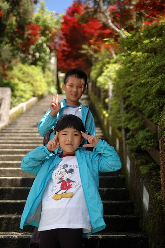 徹爸從停車場一路走來 一片好山好天氣 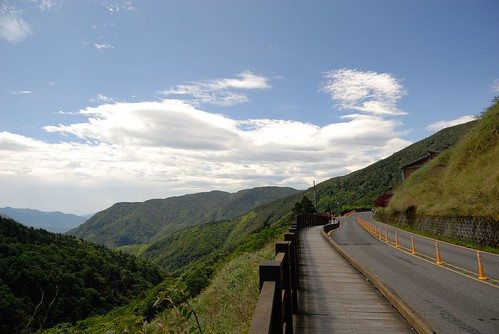 還有徹爸的好心情 (自拍嘞)  應景地標照也來一張唄 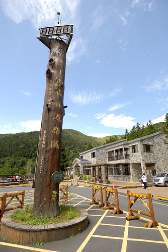 全員到齊 理當好好的在這美麗的階梯道留下一幅幅美麗的倩影 可惜我因為怕耽擱取票時間而先行去碰碰車站 後來也因為人潮絡繹而未能在這好好拍照 此行最大遺憾 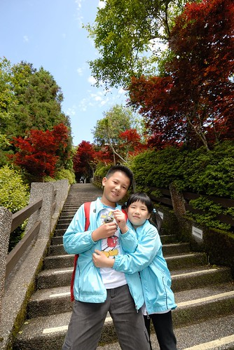 這一路走上去 真的煞是美麗 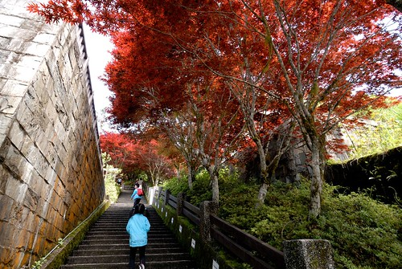 雖然徹爸說他不愛這樣的楓紅 不過這本來就不是楓是槭阿 不過少了楓紅時的那種蕭蕭然 還真令我們有點不習慣 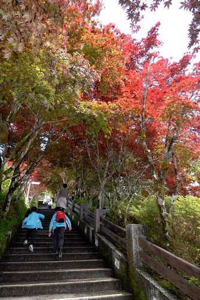 "小妮子~ 你在做什麼" 就說愛愛也是隻猴子吧 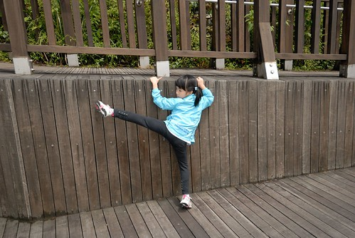 礙於時間與體力(從下面再走一次上來) 我只能在這留下槭樹紀念照 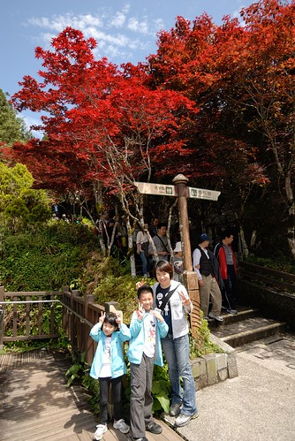 然後趕緊去坐碰碰車嚕 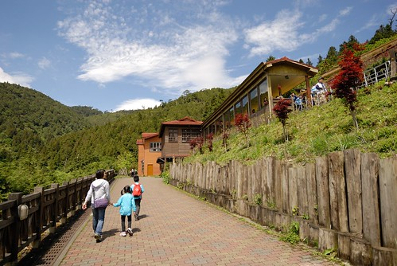 車站內的火頭造型座椅讓愛愛一看到就開心坐上去要爸爸照一張 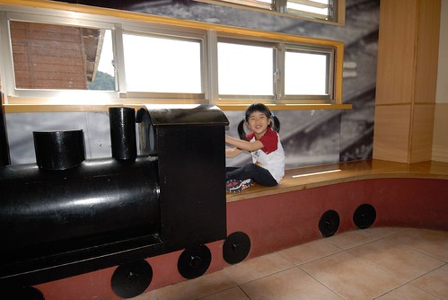 只是同時間 距離火車開駛時間前10分鐘 所有要搭車的遊客都早已全上車了 難怪大廳與月台都靜悄悄 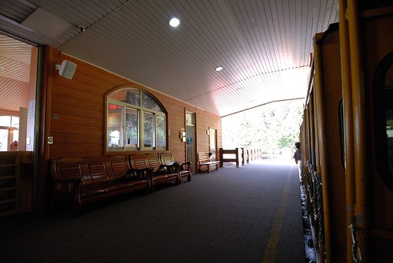 我們好不容易找到一排空的位置 擠進我們全家人 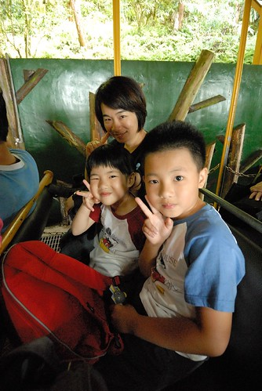 嘟~嘟~嘟~ 火車要開了 我們的太平山碰碰車回憶也真的一滴滴開始嚕 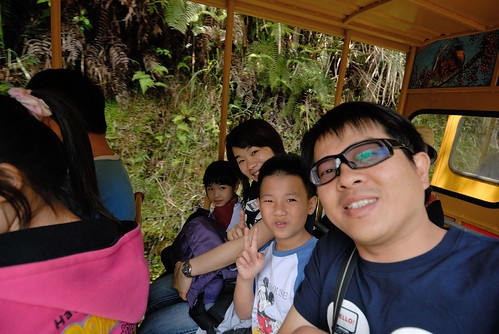 好奇 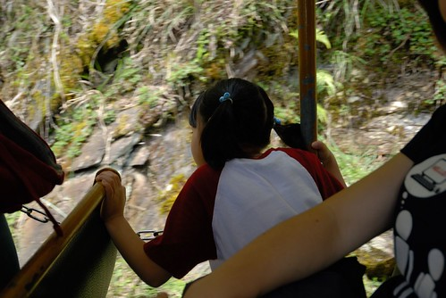 開心 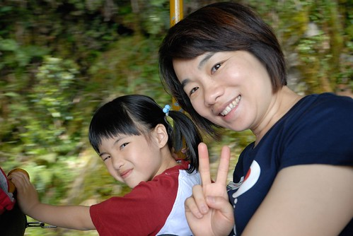 各種幸福的情緒穿插著 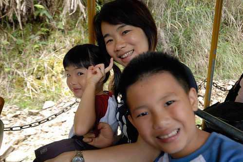 火車轉彎時 前面車廂的遊客對著火車尾拍 而後面的我們對著前面的他們拍 很有趣 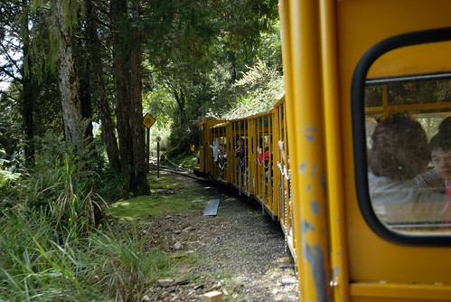 其實碰碰車很吵 沿途景觀也無太大變化 但就是"新鮮" 倒是視線所及的另一邊山頭上 雲好野 天空好藍 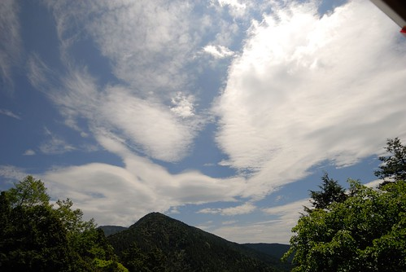 20分鐘的時間抵達終點茂興站 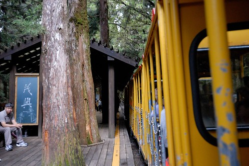 下車後站在原地不知該往哪走 只是看著碰碰車的駛去 大家的相機又忍不住喀擦個不停 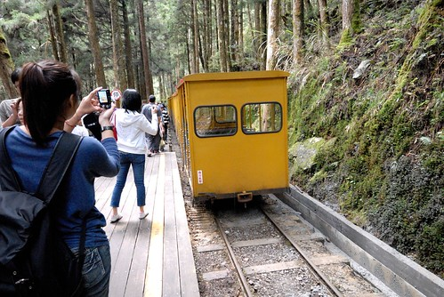 或許我們是刻意的放慢了腳步 才能感受人潮散去後的靜懿 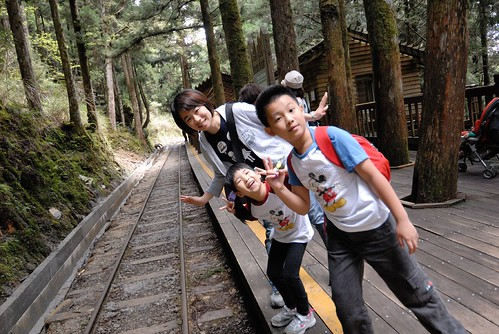 雖然碰碰車未劃位 但車票上列著搭配的回程時間(假日人多 園方希望大家都能照安排搭乘以免發生搶位問題) 一個小時多一些的時間剛好也只夠讓人走懷舊步道 (來回3-4小時且高度落差大的三疊瀑布步道今天也的確不太適合我們 因為媽媽小鐵腿 而且再走小人肯定哇哇叫) 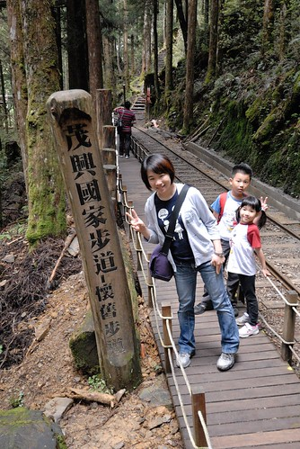 森林裡沿著舊鐵道的步道 感覺芬多精很多哩~ 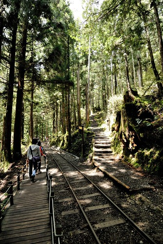 我們大口大口呼吸著新鮮空氣 只是這裡樹的味道出乎意外的淡 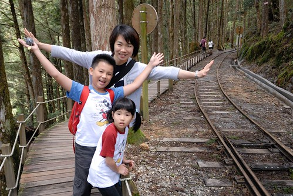 走阿走 不小心又看到碰碰車 但此時火車調頭了 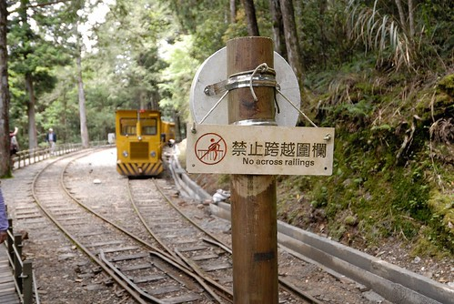 再往前走又遇到一輛與我們同方向行駛而來的火車頭 不小心讓我們看見火車如何調頭的小祕密 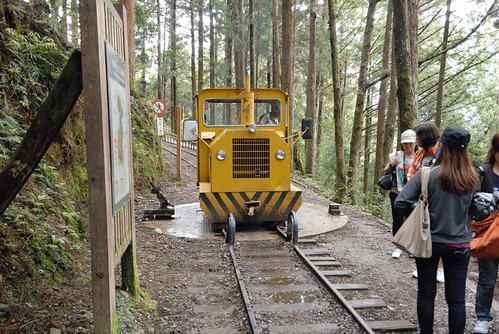 原來就是靠著這圓形轉盤 讓司機一人手動式的把火車頭180度大轉身 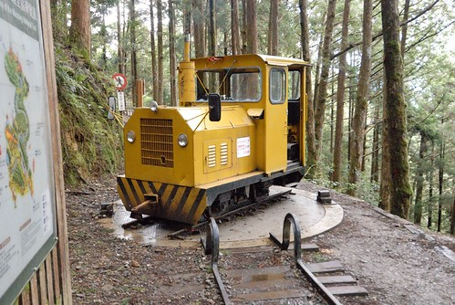 噹~ 完成! 給小火車拍拍手 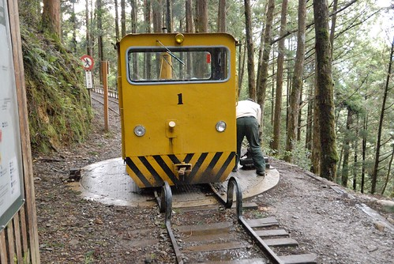 沒預期要走到盡頭 我們反到好好的邊走邊看 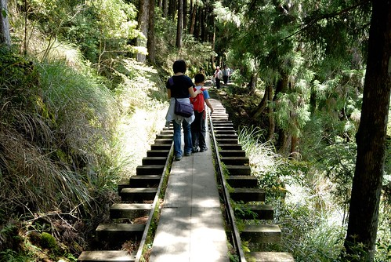 邊玩邊拍 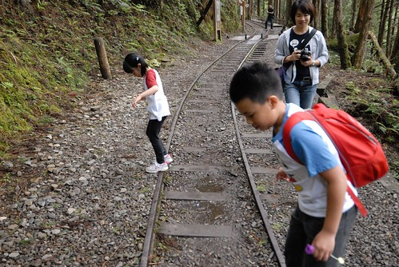 小學生阿徹 不用走長步道心情特好  愛玩的愛愛當然也是心情好 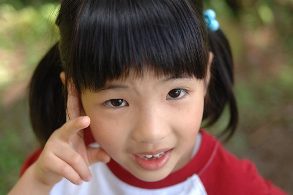 最愛玩的媽媽不用說 當然肯定也是好! 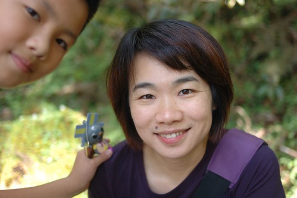 而徹爸應該也是還不錯吧! 話說中年男子徹爸 戴上全視線眼鏡後更增添幾分熟男味道阿 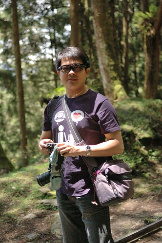 除了我們四個人的好心情外 這裡的小花小草也好可愛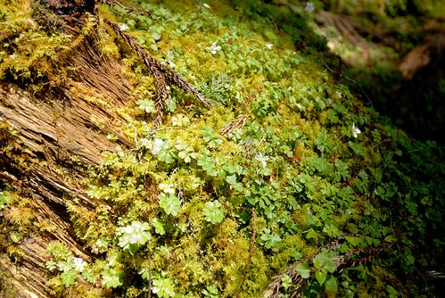 好美麗 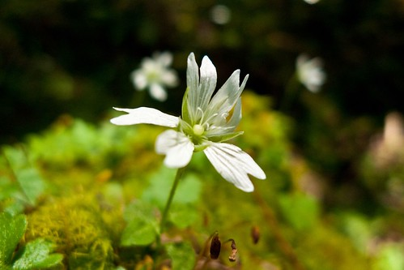 這些直挺挺的大樹更是不用說了 耀眼阿~  這回我跟徹爸不搞自拍 請我們的愛愛掌鏡 (不好意思~ 情侶裝露餡了) 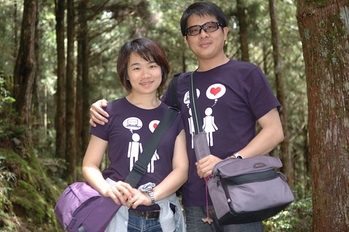 小攝影師愛愛技術越來越好 越是得意了 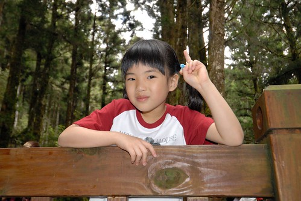 為了回程要坐前排點的位置 我們早早便回到車站候車(其實因為遊客多 也刻意的晚走早回啦) 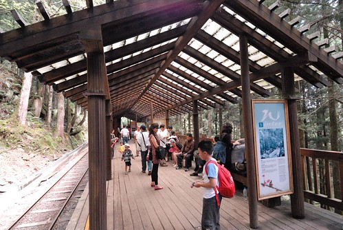 我們還耍心機的分兩列候車 賭可能的火車頭停靠點 (父女倆這張照片很鮮哩) 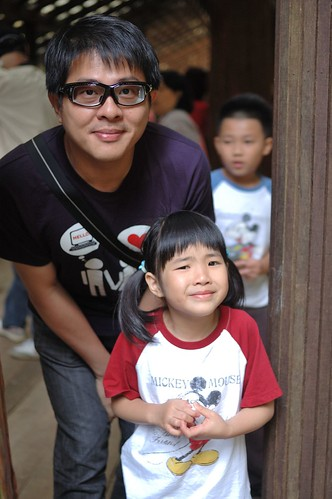 LUCKY的 我們如願坐到火車頭後的第一排位置 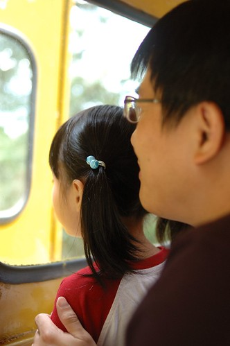 上車後 父女倆繼續搞恩愛 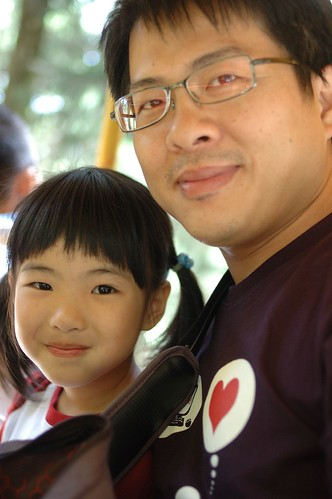 真的很恩愛阿~~~ 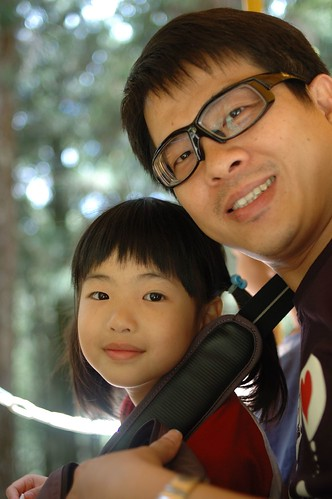 回程裡少了新鮮感 只是滿心期待的希望趕快回到太平山莊 因為正中午 我們的肚子咕嚕咕嚕叫 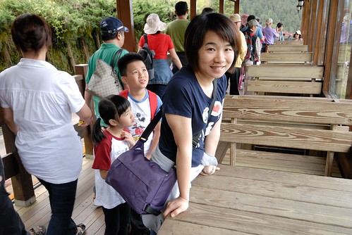 只是園內似乎唯一僅有的餐廳 似乎只提供旅行社的團體合菜 讓原本一直以為山上用餐不是問題的我最後只能帶著一家子到遊客中心內的商店買泡麵吃 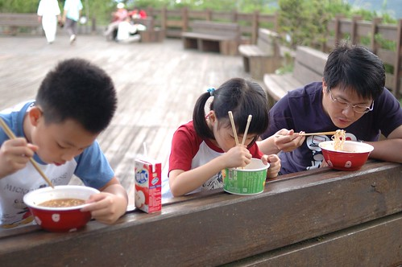 很少吃泡麵的徹愛 聽到要吃泡麵 開心的直嚷"太好了" 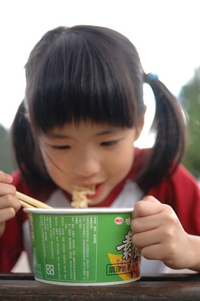 兩人也大口大口的嗑掉大半碗 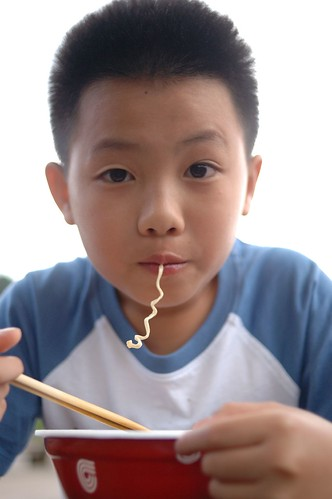 只是對於真的什麼都沒有的山上 園方卻只提供這樣少的用餐"機會"與選擇 讓遊客中心內外到處是三三兩兩的遊客(就是不是搭遊覽車上來的)吃著泡麵  實在很無奈 這點讓我們對於太平山打了很大的折扣 畢竟民以食為天ㄇㄟ 不用像seven那樣的便利與多樣 但起碼可以有個飯菜吃應該是基本吧! 我這樣認為.... 吃完泡麵後一場雨突然來的又急又猛  而大雨過後又馬上回復為藍天白雲 山上天氣果然說變就變 難捉摸阿 也或許因為如此多變的氣候 太平山的雲海景觀才如此有名 但可惜這回我們沒遇見這樣的好景色

二點多我們啟程下山 多留點時間給山下的鳩之澤 首先當然是去泡有名的溫泉 這裡的水質不錯 咕溜咕溜的 一池池的石窟泡起來也很有趣 只是沒想到今日溫度飆升  氣溫30多度的正下午泡湯還真是挺熱 我們只好努力的冷熱水交替泡著 我說春秋時分來這裡泡湯 炊煙裊裊 肯定很是舒服  泡完湯 接著的當然是煮溫泉蛋嚕 (話說這裡真的沒什麼變 跟5年前一模一樣)  蛋跟玉米我們前一天在三星便買好  只需去販售部借兩隻網子 (網子只要押1百元保證金就能借 這點要肯定一下)  搞不清細節 只記得前一天買蛋時老闆娘說的蛋煮10分鐘 玉米20分鐘 一片白煙中把我們的蛋跟玉米下水了  這種天氣泡溫泉會熱  煮蛋會不會熱? 當然肯定更是熱阿 尤其泡完溫泉後身子也是熱的 於是我們打著傘 等候我們的溫泉蛋  同時也吃冰淇淋消暑  噹~ 時間到 我們的蛋可以起鍋嚕  看著徹愛盼望的眼神 媽媽顧不得燙 用鐵手剝著熱呼呼的蛋  我們的軟嫩溫泉蛋!  話說再少煮個1-2分鐘會好些...  又過了10分鐘 玉米也可以起鍋了 只是起鍋後才發現怎麼籃子裡只剩下一根 剩下的兩根離家出走 漂流到哪去了 幸好最後讓阿徹找著流浪到對岸的那兩根玉米  用溫泉水煮的玉米 顏色更顯金黃美麗  至於好不好吃 我只能說食物的本質還是最重要的  不過徹愛兩人揮汗大口吃著溫泉蛋 啃著玉米  這份回憶絕對是甜美的 (吃完的冰盒拿來吃熱呼呼的蛋剛好)  事後問徹愛"太平山什麼最難忘" 兄兩妹一致說那個溫泉 那個蛋..  離開太平山區 繞去三星買了阿婆蔥油餅 襯著藍天白雲 彩虹以及之後的美麗夕照 回家了~  太平山 我們總算也添上一筆了... 
