這幾年之所以一直沒有去成太平山 除了因為真的要去的那兩年暑假因颱風原因而被迫取消 其實主要的原因在於太平山房間的難訂~~ 但房間難訂且設備簡單又不打緊 那直比五星級飯店的房價(尤其假日暑假)讓我很卻步... 雖說美景無價 雖說物以稀為貴(房間數真的不多阿)  但我真的很難接受公營單位這樣的價位 這次既然抱著非得圓這場夢的決心 就索性訂更偏僻更簡單的翠峰山屋 山屋~ 給人無比的想像空間阿~~ 尤其訂房網頁上註名的"供電僅到晚上十點" 哇! 沒電的夜晚讓人是既期待又害怕 所以我們做足準備 帶了水果 帶了手電筒 帶了可以打發一整晚的牌與畫本... 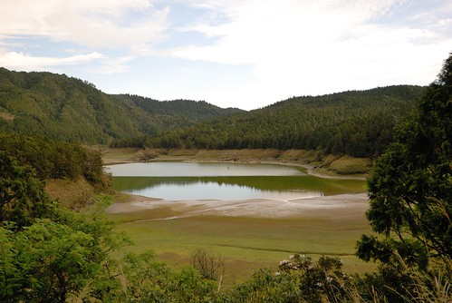

翠峰山屋就在翠峰湖附近 從太平山莊還得再多開40分鐘左右的車才能抵達 下午4點抵達翠峰山屋時 天上雲很多而空氣裡飽含著雨欲來的水氣 這情境下的翠峰山屋看起來好孤單但好美 尤其那斑白的原木外牆... 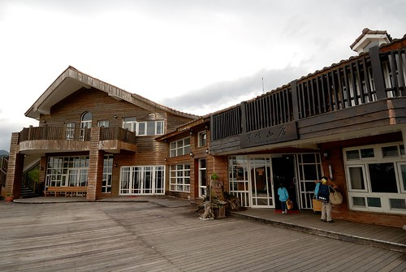 可是進入大廳後 空間超乎我們想像的高挑與寬敞 尤其採用大片的白色窗(門)框作為山屋的外牆 讓室內穿透明亮 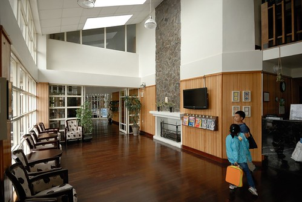 辦理入住手續 山屋的工作人員解釋各事項(一天一夜中只看到三位工作人員面孔) 尤其是用餐時間以及熱水與電力供應時間 粉重要!  山屋只有兩種房型:雙人房以及八人房  且不接受加床服務 因此我們只能訂八人房型   不過訂房前我有先打電話確認費用計算方式 就是照八人房原房價扣除少掉人頭的餐費  因此計算後的房價與太平山莊四人房差不多 不過這樣的四人房就空間來講真是奢侈很多... 而且還有著超大好視野!  房間內有個小閣樓 閣樓上去後分為左右兩邊 可以各睡兩個人 因此閣樓上的四個床鋪加上下層的兩張雙人床 這果然是八人房  徹愛看到這閣樓開心的不得了 第一個反應是"我們晚上可以睡這裡嗎?" 我說"你們敢就可以 不過爸媽要睡下面" 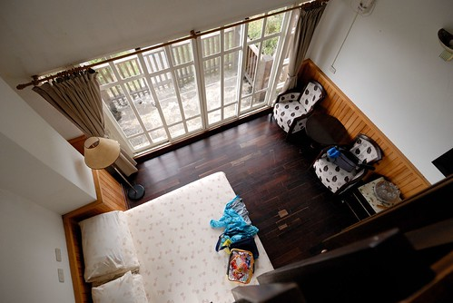 進房後休息的那一小時裡 徹愛就樓上樓下玩著 小閣樓儼然是他們的秘密基地  不過整個太平山區不若武陵那樣乾爽  可能山形的關係 濕氣頗重 也因此窗框或是陽台等處總會見到一些潮濕發霉的現象 而木地板也顯得不是那麼乾爽(當然維護不佳應該也是原因之一) 雖然入房時工作人員有交代 電力供應的時間內就讓房間內的除濕機一直開著 可是除濕機會發出不小的運轉聲音 所以我們在房內的時候還是偷偷關上了 所幸高山上的好空氣還是戰勝房間內的濕氣與小灰塵問題 讓我們那晚有場好覺 (往八人房房間經過的戶外走廊便可以看進我們的房間 超穿透的哩) 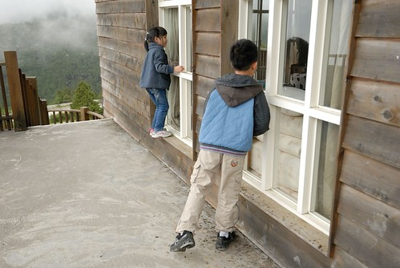 走往八人房房間的這個旋轉樓梯是我覺得山屋視野最好 最美的地方 那天晚上我們也在這裡看見半天星斗(另外一半天則是一陣陣黃色閃電)  趁著晚餐前的時間 我們去翠峰湖走走 行前上網作功課時 聽說翠峰湖的晨昏變化 景色很不一樣喔 (照片中建築物的一樓為餐廳 二樓最右邊即為我們的房間 晚上躺在床上要睡覺時 我透過最上面的那個小閣樓窗看見月亮 其實真是很美 很有意境的房子) 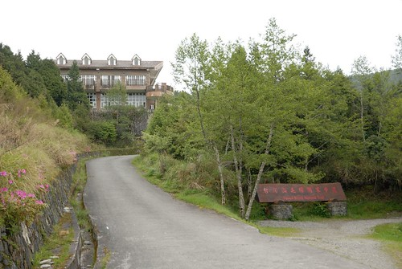 我本來還以為翠峰湖就在山莊邊 走出個大門或是起碼一個後門就可以看到湖 (那是多美的畫面阿) 但原來是步行5-10分鐘可以到的"附近"阿 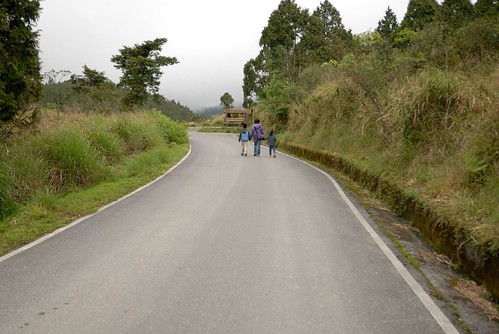 不過走到山屋附近的環山步道口後 還得再走小小一段的木棧道 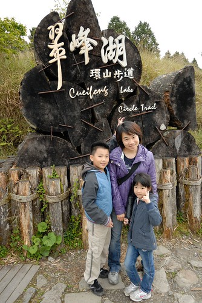 這段木棧道很平 很美 徹爸心血來潮的左右步跳舞著前進  徹愛兩人也跟著有樣學樣 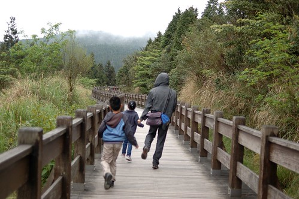 三人就這樣一路開心的跳過去 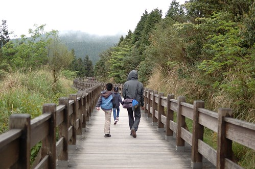 雖然天候不佳 飄起絲絲細雨 但一家子性致高昂   只是怎麼還沒看到傳說中的翠峰湖ㄋ... 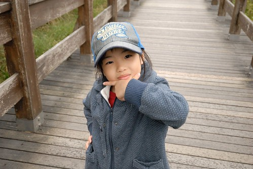 一個轉彎 突然間翠峰湖映入我們眼裡 大家第一個反應是"怎麼好像快乾了" 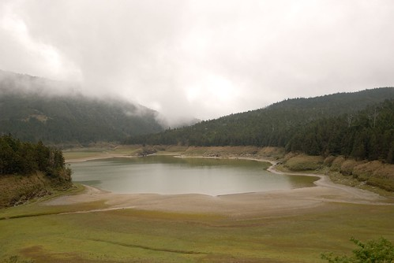 換個角度再瞧瞧~ 真的很乾涸哩 我對翠峰湖的第一眼印象 老實講就像是見著偶像後的小失落 原來真實是這樣... 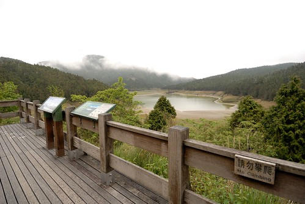 因為雨勢越來越大 我們提早結束餐前的小散步回到山莊等6點的開飯  我跟徹爸坐在屋簷下看山 (在山中 下雨時的景色都很詩情畫意) 無聊的徹愛則去請工作員伯伯開大廳的電視給他們看 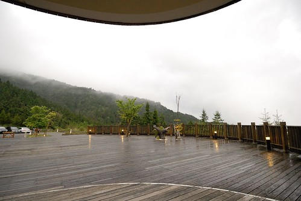 6-7點是用餐時間 但6點一到大半的房客都來用餐了 5-6樣菜 簡單但可口  而當中的金針湯最受全家喜歡 喝的暖呼呼 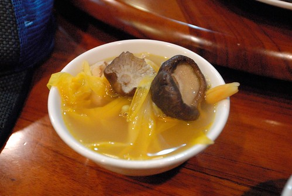 能在整座什麼都沒有的高山上 吃到這樣的餐點我覺得很好了 太平山與其他農場/山莊最大的差別在於 整座山都屬於太平山國家森林 所以從山下到山上就一條林道 沿途除了樹還是只有樹 沒有任何住家或商店 因此所有的物資食物都是得從山下運上來 當然所有的垃圾也都得運下山處理 所以簡單與不浪費很重要! (以上純屬個人看法) 而在山上除了吃的簡單外 度時間的方式也很簡單 因為沒有電視 因為早早6點多就吃完晚餐  因為天外下著雨 我們在徹爸手機音樂的陪伴下 用玩牌 發呆與小遊戲度過一整晚  有時後我跟徹爸倦了 窩在床上呆  徹愛兩人繼續興緻高昂玩著他們設計的大富翁遊戲  九點半前一家子都盥洗完 上床準備10點的熄燈 正準備躺上床的我 看見上方一抹黃亮 確認好一會那是電燈還是月亮  因為外頭明明下了一整晚雨阿 確定是月亮後 我們興沖沖的跑出外頭看月亮 還看見了半天星斗 看見星星的同時 也看見另半邊一陣陣的黃色閃電 實在是有點詭異的景像 而更出乎意外的是隔天一早醒來 窗外藍天白雲好天氣阿!  山屋不只晚餐用的早 早餐也早 用餐時間為早上7點到8點 因此我們跟平常在家上學日一樣時間起床 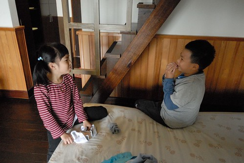 進餐廳前 忍不住被這樣的美景吸引 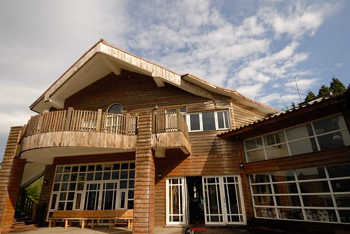 藍天白雲襯著的山屋真的好漂亮 好帥喔  用完餐後回房收拾行李時 在樓梯露臺看過去的山景 這裡山的林相真的很好 一顆顆樹很分明 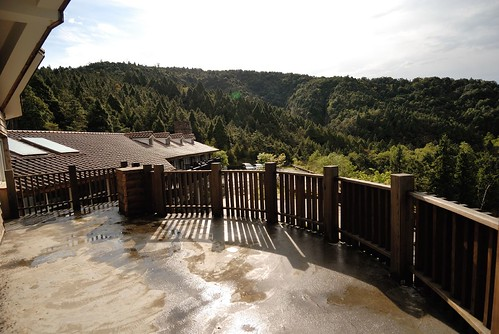 同時間 兄妹倆在廣場前玩著踩腳遊戲 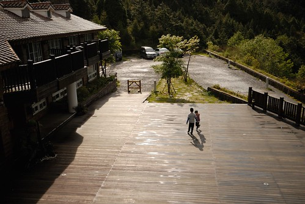 真是很清新的山中早晨  預約了早上10點半的蹦蹦車  我們把握時間的再去看一次翠峰湖 木棧道上還遇見了一隻可愛小鳥 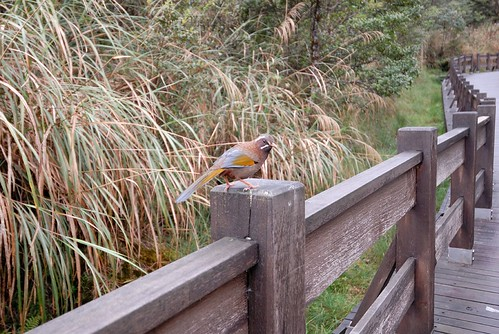 大晴天的翠峰湖果然又是不一樣的面貌  無心賞湖的小攝影師愛愛說要幫我們拍照 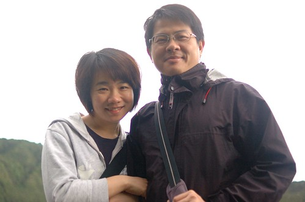 跑出來的電燈泡  然後換阿徹幫我們三人照  突然媽媽說 讓我們來愛台灣吧!(事後我真的有把這張照片傳到"I LoveTaiwan"活動FB)  這是徹爸父女倆版的我愛台灣  還有些時間 我們接著平元步道繼續走 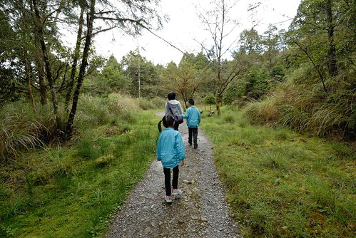 沒預期走步道的阿徹果然又開始小碎念  我們更是索性悶起頭來猛走... 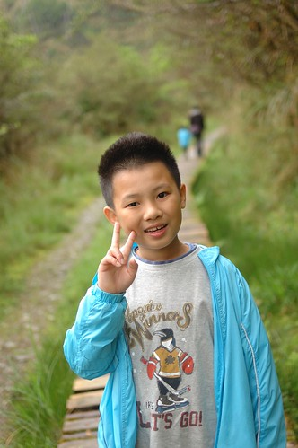 途中看見超可愛 有小小外星人之稱的"裡白"  還在某個點看見太平洋與龜山島 我們討論著是否為龜山島  因為徹爸說這裡的距離幾乎等同於到南澳了怎麼可能看見龜山島...  步道的路平緩好走 加上兩旁原始林相  很值得一走 可惜我們的時間只夠讓我們走到一半路程變得折返 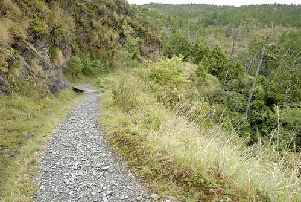 這一路上 徹爸與愛愛一直攜手同行著 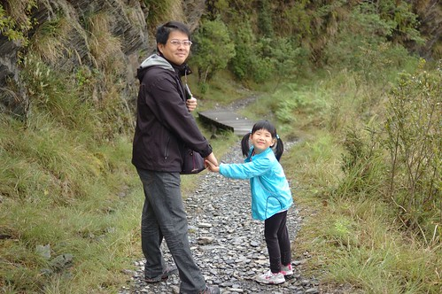 感情可好! 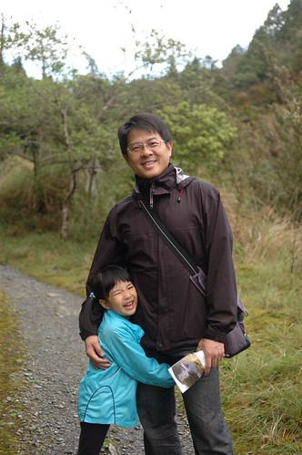 獨留我面對問題很多的小學生! 走回翠峰湖景觀台時 留下兄妹倆的到此一遊照 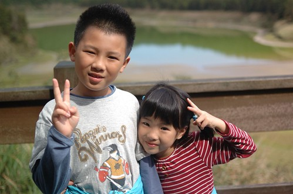 然後忍不住坐下來看著大美麗天空  沒事的愛愛又說了"我要幫你們照相"  然後我們互相照了大頭照  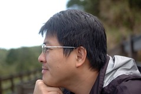  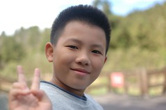 就像徹爸說的 這樣好舒服阿!  真的! 很舒服阿!!! 以後再有機會來太平山 要再多留很多時間在翠峰湖 好好看天 好好走完所有步道  後記: 那天晚上阿徹問我為什麼山莊10點後要斷電 我說可能是因為高山上更要節能吧 這兩天上網才看到有網友寫 原來翠峰山屋沒有台電的電線抵達 是自行用發電機發電的... 難怪... 真的更要好好珍惜山屋的一切阿 !
