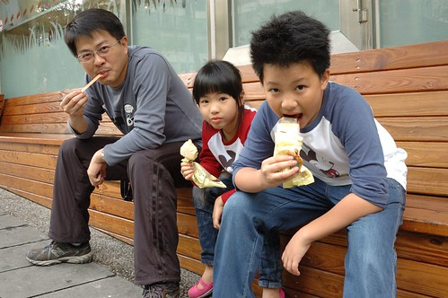

趁著小學生校慶補假 難得的兩天假期 我們安排了一趟大雪山小旅行 下山後 在東勢鎮跟玟姿阿姨吃著挫冰 我說 "連兩年的這時候 我們都來東勢玩 來找阿姨吃冰哩" 大家一臉不可思議 沒想竟然已經是一年前的事!

中橫 對於曾在台中念書的徹爸與我來說 是別具回憶的地方 每個學期 寒暑假 社團或大學同學總會邀集一起機遊到中橫沿線的東勢林場 八仙山 谷關 德基水庫 梨山 甚至是到得騎上一整天 坐到屁股會開花的武陵農場去 只是隨著921大地震及這十多年來的颱風肆掠 中橫斷了 我們的回憶也封存在過去... 這些年常常跟徹愛說起我們的大學生活  說著說著 我跟徹爸越是懷念起這些地方 於是去年我們到谷關 今年到大雪山 尋找我們青春回憶的蛛絲馬跡~

這一幕是我的中橫記憶中很經典的一幕 青山綠樹中 房舍 果園 橋墩 接二連三著  因為天災 也或許有人為 讓谷關到德基這段路 十幾年來修了又斷 斷了又修 到現在的長期封閉  谷關溫泉區 在九二一之後曾經沉寂 現在 是否恢復榮景 我不清楚 只是至少從各飯店的房價看來 不是靠低價吸客的低潮 (話說台灣溫泉區的飯店價格真是越來越高貴 Orz)  那天下午辦理好飯店的check-in後 我們便到外隨意走走 說隨意 真的很隨性 因為也實在不清楚谷關有哪些好玩  新穎的遊客中心建築吸引我們登門尋章 章沒蓋著 到是發現遊客中心後頭的公園可以讓人走走  公園並沒有太特別 就...純粹可以走走 坐坐的地方   離開公園後 研究了路邊矗立的地圖 總算找著可俯覽谷關全景的捎來步道可探訪  往步道口的這段下坡階梯路挺詩情畫意的  只是沒想到步道正因修復而封閉中  我們只能走小小小一段的吊橋  只在橋上 沒能把全谷關盡收眼底  但卻也清楚感受河床兩岸的觸目驚心  紅色吊橋 成了這回在谷關最多回憶的地方  我們慢慢的走  慢慢的邊走邊拍  兄妹倆的打打鬧鬧 是期間的最佳調味劑  果然 旅行最大的樂趣不在去了哪裡 而是跟誰一起做了什麼事...  沒步道可走 讓我們有些遺憾也有些難以打發接下來的漫漫午後  只好繼續步阿步的到中橫牌樓 好歹照個谷關到此一遊照 在這也才發現 連牌樓也不再是記憶中的紅色模樣... (更別說一旁龐然的商業停車大樓)  一家子決定就坐在seven門口吃冰 渡時間  父子三人一字坐開的吃冰模樣挺惡霸    結束散步 我們回到今天住的溫泉渡假村泡湯嚕  我們利用徹爸的旅遊補助挑了間價格與設備可以接受的溫泉渡假飯店 老實講 若不是徹愛喜歡泡湯玩水 我跟徹爸對於台灣的溫泉飯店評價都不太高 難怪一年過後 我實在想不起當初住的這家飯店叫什麼名字了  泡溫泉是兄妹倆一致覺得最愜意的渡假方式   尤其徹哥 超享受飄在池子裡的輕輕然  蠻會享受的小孩子  除了大眾池外 當然也要好好利用房內倘大的家庭溫泉池  晚飯過後回到房間 愛愛就迫不及待的等著泡湯  注滿一池子熱呼呼的水  光溜溜的泡個徹底解放的湯(媽媽照糊掉的技術剛好當作打馬賽克)  泡完湯後 再一起窩著看點電視 講些故事 徹愛享受 開心得不得了的旅行夜  第二天早上吃完早餐 我們便起程下山  經過東勢鎮 當然肯定要來東勢高工拜訪我們的玟姿阿姨  學生上課的週一 我們卻來校園裡作客 感覺挺high   東工的校園真的很美麗 尤其這片發著嫩葉的小欖仁樹  阿姨帶著我們校園巡禮  山腳下的大操場讓我們羨慕  山腳下的山林風情讓人說讚  真的很美的學校 很幸福的老師與學生阿!  謝謝玟姿阿姨 讓我們谷關小旅行打了個漂亮句點 (起碼還有這這句點讓我們記得)  還有那每次講到中橫 來到東勢 就絕對不會忘記的挫冰約會~ 
