這半年多來 哆啦A夢是徹愛生活中很重要的期待與快樂來源 因為兄妹倆週一到週五 每天6點半總會準時打開電視看十二台的哆啦A夢 雖然他們曾經試問過是否可以看其他卡通 徹爸也說看DVD比較快 但我堅持讓他們每天固定時間守候著電視 等著哆啦A夢帶給他們的快樂與放鬆 就好像我們小時後每天晚餐過後等著楊麗花的出現一樣... 在廚房忙的我總會不時聽到他們從客廳傳來的爆笑聲(真的很誇張的笑聲) 也曾經發生他們過於投入劇情,完全無視我的任何請求而讓我無奈 但兄妹倆卻也為了要準時收看哆啦A夢 總是很努力的在六點半前完成當日所有作業 所以我衷心感謝哆啦A夢帶給兄妹倆的效益與笑意!

去年底開展前就跟同事一起團購了特展門票 母子三人一直盼望著去看哆啦A夢 卻沒想到從過年前 等到三月真的想去了卻因為好幾次的突發事情而讓我們不得一延再延 延到閉展前的最後一週我們才總算成行 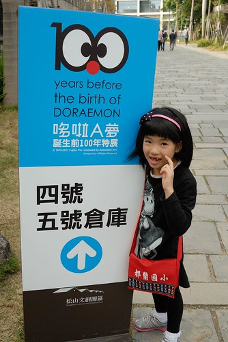 雖然預期最後一週人潮肯定不少 但也太people mountain, people sea  好熱鬧也好擁擠阿! 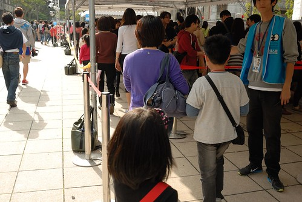 排隊等了20來分鐘才進場  而進到館內後 哇! 盛況空前~~~ 我們這一刻徹底明白與死心 今天是沒法好好看 好好拍照的了... 不過幸好徹家也算是有練過的  抓空檔卡位 站定後立馬看鏡頭笑一個 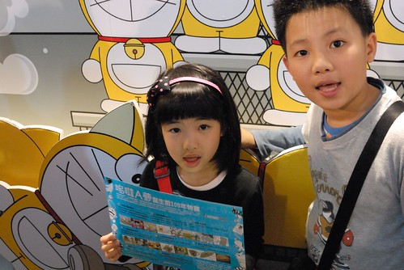 致於哆啦A夢本尊  徹爸只能發揮他高超卻有點隨便的技術  有照就好... 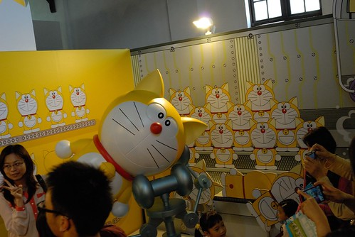 雖然我也算是看哆啦A夢長大的 但對於哆啦A夢的了解卻大半都是來自於阿徹告訴我的  聽阿徹說過許多的哆啦A夢故事 我卻來到這看到一個個的圖像後才更記得  好可憐! 被吃掉耳朵後哭到掉漆的哆啦A夢! 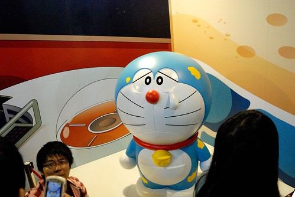 進入到主要的展場後 哇! 好多的哆啦A夢!!! 也好水洩不通的人潮阿~  展場兩側滿滿是耳聞很久的100尊原比例的哆啦A夢  看的我們哇哇叫~ 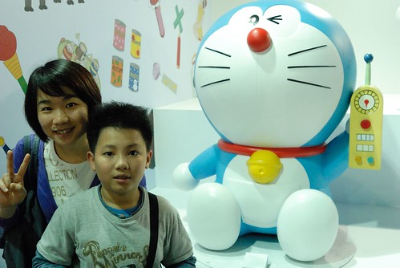 而且哆啦A夢的藍真的很漂亮  難怪許多女生拿著手機一臉滿意的猛跟哆啦A夢自拍  我們當然不是自拍 而是一家子快狠準的見隙卡位 拍照 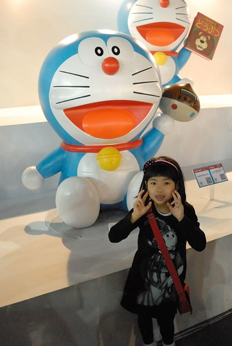 在這的攝影策略就只能亂槍打鳥 總有一槍打中  雖然人潮的擁擠真的讓人很容易爆點 但一個個可愛的哆啦A夢卻讓人願意忍受一切  兄妹倆 看著比自己高 比自己胖的哆啦A夢 一直喊著好可愛 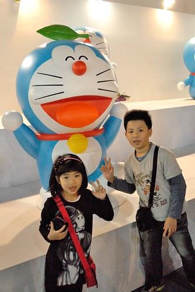 而更讓人覺得沒白走一趟的是 我才發現現場100個哆啦A夢手上拿的工具 我家小學生阿徹竟然說的出99個的名字 阿徹平日按時收看電視哆啦A夢 沒事就翻看哆啦A夢工具書 果然都不是看假的 如果學校有哆啦A夢這學科 我相信阿徹一定可以拿高分! 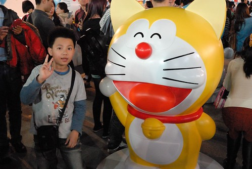 衝著阿徹這樣高竿 我們難得有耐心的在這樣擁擠環境中一個接一個仔細研究 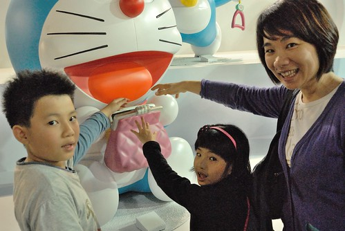 還有努力的拍阿拍!  阿徹很不解為什麼這麼多人來看哆啦A夢 我說沒辦法 哆啦A夢大概是台灣最被大家認識的卡通人物 上至阿公阿嬤 下至一兩歲的娃 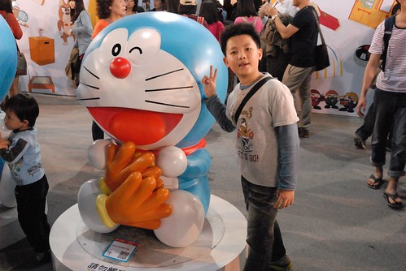 不管怎樣 我們很高興可以一同慶祝哆啦A夢的前一百歲生日! 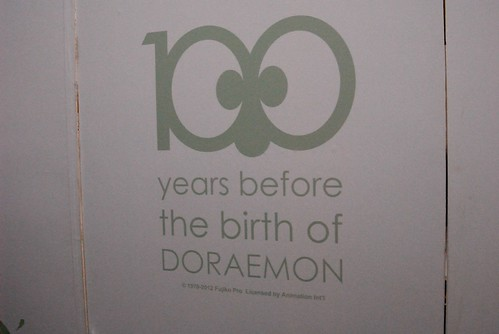 主要展場之後還有幾個小展場 分別有小公仔 作者原稿 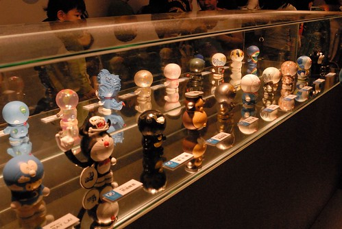 大雄跟靜香的結婚  時光機  (真的很詭異的色調) 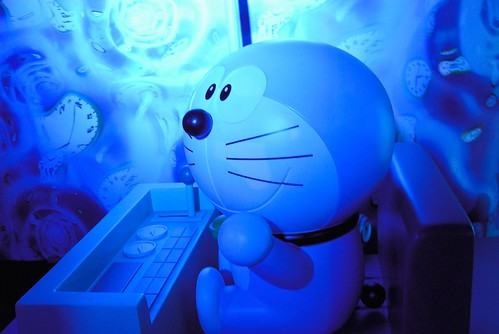 以及劇中場景 大雄阿嬤家 大雄家 靜香家 空地.....  

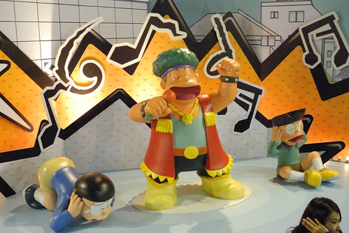

 只是滿滿的排隊人潮 我們只好選擇走馬看花 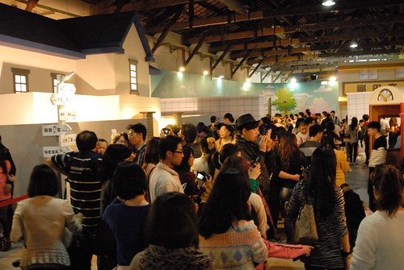 而更恐怖的是最後的紀念品商店 徹爸排了半小時的隊才結到帳 Orz 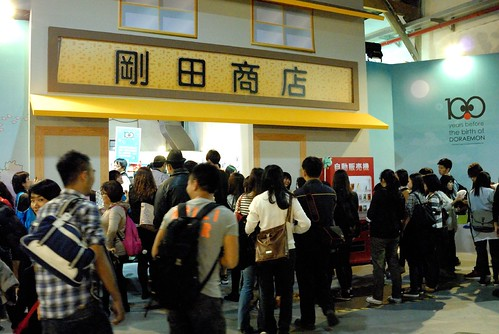 真的! 要不是因為哆啦A夢 我們沒這樣人擠人的興致與耐性! 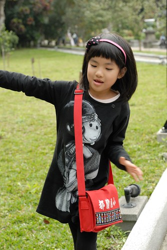 瞧~ 小人拿到戰利品後的模樣 多麼開心! 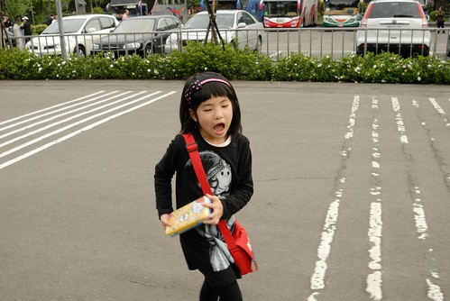 只是因著太開心 也讓我們在後來的蘇阿姨pizza店吃晚餐後 一起把阿徹的相機忘在店裡了 我們失去了那台別具意義的小相機~ 我說 要不是因為我說要去吃pizza也不會丟相機 但要不是因為爸爸上週臨時要出版本 我們也不會這週來 而要不是再上上週 阿徹的語文競賽讓我們臨時延後 也不會直到清明連假前一天我們才來 總結一切都是輪迴 都是天意!!! 因著最後的小意外 我想我們一家子肯定一輩子記得我們一起去看過這麼多哆啦A夢!
