放在心上很久的福山植物園總算在四月成行! 原以為福山最美的季節應在五葉松轉色的深秋時分 沒想到綠意盎然且濕情畫意的四月竟是福山最美的時候之一 原始的綠 豐富的綠  清嫩的綠 盎然的綠... 交錯映入眼簾的是一幅幅美麗的圖像 我們喜歡這樣一片林 尤其林間偶遇的悠然猴子更讓人明白這片林的美與好! 

其實早在去年11月我們便申請過一次也抽籤得以入園 只是那月連續的豪大雨讓我們到預定日前一天的最後決定不成行 來不及取消入園 於是一家子被限制2個月內不得再提出入園申請 過了處罰期的二月我又滿懷期待再一次申請入園 沒想到又如第一次的順利抽中 徹爸還笑說好像很好申請阿 這回雖然預定日的氣象又不好了 但我們怎樣都不敢再爽約(很怕以後不能再申請) 搞笑的是到了福山後 我們才明白原來"雨霧"是福山的特產 福山一年有200多天在下雨阿 所以下回真是別再傻傻擔憂上福山的天氣好不好 雨天是正常 晴天是老天爺的賞賜 但下雨的福山其實才是最美

到福山的路比想像中的快且好走 只是過了雙連埤後 越來越小 越來越往山裡走的小徑讓人不禁越是期待著即將到訪的祕境(其實也不祕啦 只是要申請還有每日入園限制) 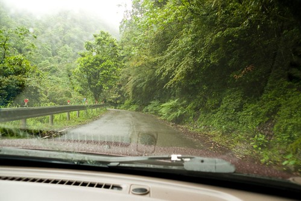 到達園區後 我們先到自然教室觀賞了兩部影片 一個是25分鐘的福山簡介  一個是20分鐘左右的聲音劇場 後者的高品質投影與音響 襯著影片裡的蟲鳴鳥叫 各各鮮明又美麗 而看過影片後 讓我們之後再聽解說員的介紹時更能了解與共鳴  植物展示區的入口解說處 有解說員對來訪遊客一一簡介 除了說明園區可走路徑圖 並搭配照片介紹這時節園內可能遇見的動植物 算是很好的行前說明 而在我們探訪完回到入口處後 解說員依然熱烈的與我們分享福山所見  更讓我們喜歡這裡 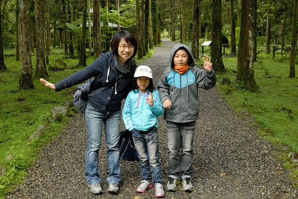 福山的全名是農委會林試所福山研究中心 總試驗林面積約有1000公頃 而當中僅30公頃的植物園區開放予民眾入園參觀 也就是即使我們把植物展示區的所有約3公里的步道走完 我們也只看到3%的福山 福山最原始 最豐富的保留與保護  全在深不可入的林葉後 不過這"小小"的植物展示區也夠"教育"我們這些平民百姓了! 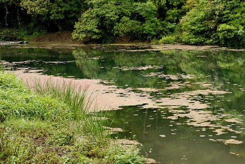 那天的福山 時雨時晴 我們的傘開開又關關  但最令我們無法防備的是 完全沒預想的10來度低溫 讓我們把所有帶在身邊的外套 領巾全派上場 還是不時打冷顫 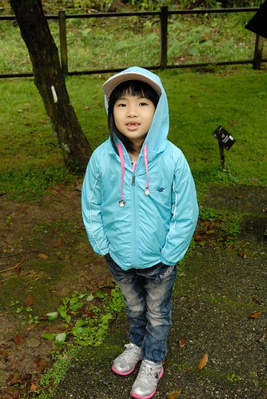 不過福山真的很美 讓我們即使又濕又冷 還是慢慢走  慢慢看 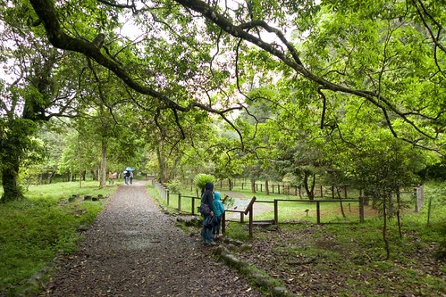 只可惜突來的溼冷讓前幾天才飛來福山避暑的蝙蝠又全飛走了 我們只能徒望留在涼亭地上的蝙蝠大便想像夏日滿屋頂是蝙蝠的盛況 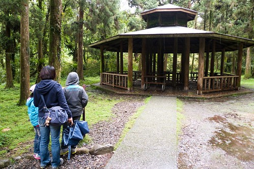 其實福山所見就是大自然裡再自然不過的花草樹 但我們卻是如劉姥姥逛大觀園般 嘖嘖稱奇不已 或許是這裡植物的姿態不一樣 也或許是雨霧之中的朦朧所致... 不管什麼原因 我們衷心欣慰也喜歡台灣有這麼一片林.. 下面就用照片紀錄我們在福山所見所喜:

如地毯般舒服的草坪 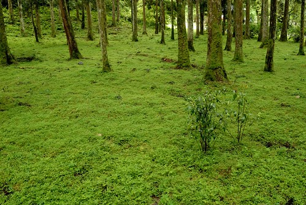 傻傻以為好運氣看見藍腹鷴 結果原來是竹雞 不過竹雞完全不畏人 逕自悠然啄食的模樣也讓我們大開了眼界  園內唯一肯定可以看見哈瓦盆溪的小橋  不管怎樣也要紀念照一張  (TO 徹爸: 這裡應該真的就有日本奧入瀨溪的FU了吧?!  步道的路簡單而明確 沒有路可走的地方就別硬闖進入 但可以走的路可每一條也都不要錯過了 因為處處有發現 有驚喜  來到解說員特別介紹的杜鵑園區 平地杜鵑花期早過的4月可是台灣原生杜鵑正盛開的時候 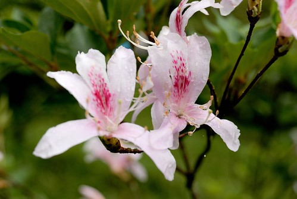 也見著了美麗西施花 (愛愛手上拿的花是地上撿的 拍完照後兄妹兩把花放到樹下隱藏處 深怕被人踩爛了) 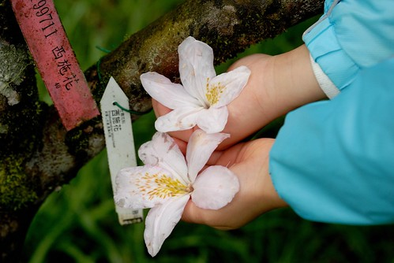 嬌嫩的模樣果然如西施般美麗  鳥來杜鵑 小巧又可愛 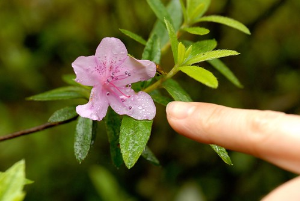 愛愛大喊著"ㄋㄧㄠˇ來杜鵑耶" 我跟徹笑著說"是ㄨ來杜鵑" 愛愛認真研究鳥跟烏的差別  這麼又多認識一個字  草坪上很小很小但卻很顯眼的蛇苺 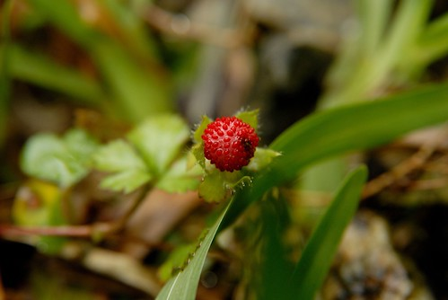 不知名稱的小花  除了花 園內中低海拔闊葉林相更是豐富  原生與附生的植物各個都生意盎然 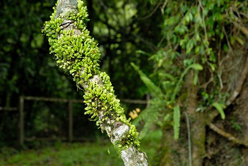 而且垂著雨珠的植物感覺格外清新怡人 

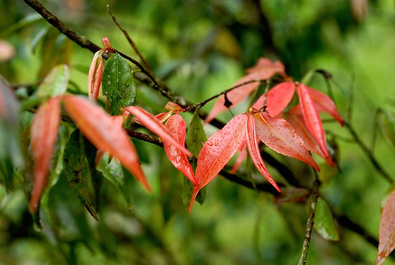

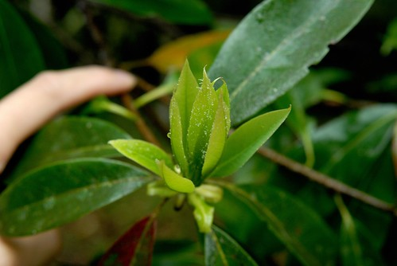 我們還很幸運的看到正好在脫皮的黃土樹 脫皮後的模樣真的很像被頑皮小孩抓了泥土亂抹一把  而這棵大樹的枝葉都快垂到地面上了 就像建立了一面樹牆 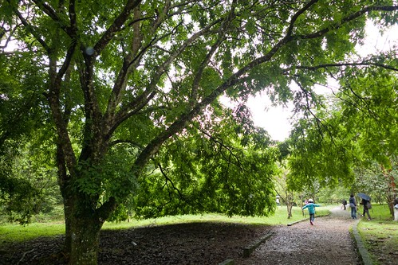 在這樹下抬頭往上看 很美的葉蔭阿 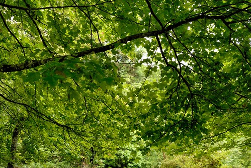 東看西拍的 時間流逝的比我們以為的快很多  而獲得的放鬆與快樂也比我們預期的多很多! 

今天的愛愛有點調皮 東跑西跳的常讓保守的哥哥擔心  不管天雨路滑 還逕自一直走平衡木 結果不小心滑了一跤 拍拍屁股假裝沒事繼續走 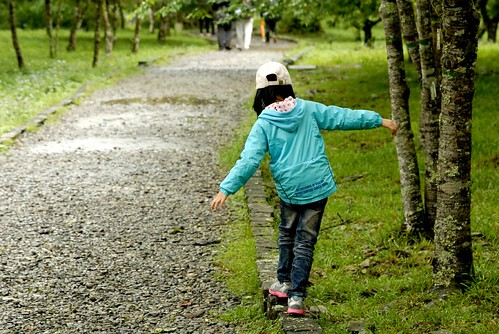 被笑了 自己悶著頭獨自走在最前面 

沿路我們一直留意著猴群的出沒 直到最後1/4路程前 都沒見著讓我們有些小失落 不過突然間看到一群台灣獼猴 悠然自在活動的模樣讓我們新奇又興奮 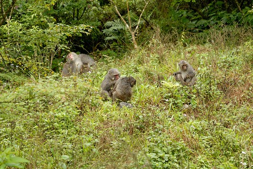 帶著看到獼猴後的滿足 我們繼續最後一段的步道  走阿走的經過動物運動場 沿途坑坑洞洞的草地讓人想像夜晚這裡的盛況  突然間 在樹間又發現猴子的身影了 那彷如印象中孫悟空美猴王的模樣 讓我們看的大呼不可思議  看得入迷時 才發現另一頭更是精彩 成群的猴子猴女正整隊過大街ㄋ(爸爸說照片中的那人真是賺到了) 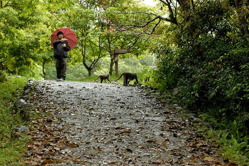 我們看著猴子跳上盪下好一會 覺得這裡的猴子跟動物園裡的不一樣 靈活又充滿自信! 真的很帥!!! 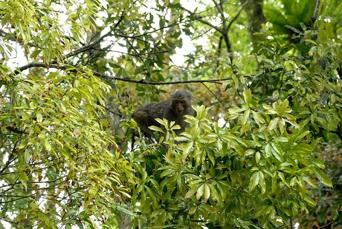 繞了一圈 總算我們走回接近起點的地方 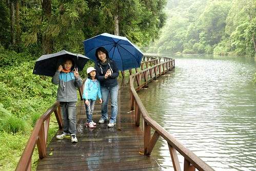 轉個彎走進生態池的木棧道後 立馬被眼前這一幕給定睛  雨停停落落  我們走走停停 歷經3小時我們走了2公里多的大半步道 回到起點 有種意尤未竟的感覺... 我跟徹爸討論起深秋的福山應該很美吧!? 結果解說員告訴我們因為福山不夠高所以楓況未佳 但解說員說山櫻花開的2月以及現在的4月是最美的時候喔! 不過我跟徹爸真是喜歡這 我想這應該是繼武陵之後 另一個我們想收藏四季風情的地方! (回到起點後徹爸嘟嚷著今天他都沒有照到相  所以好歹來張到此一遊照) 

我們一路從福山餓著肚子下山 然後還不知路遙的開到三星青蔥文化館吃田媽媽青蔥料理餐 下午三點半的午餐真是美味 每樣菜一上桌馬上就被我們清盤 青蔥炒杏鮑菇  用青蔥頭燉的雞湯 (回家我們也有樣學樣把青蔥頭拿去燉雞湯 真的好好喝)  炸茄子還有用芋頭做的XX(有個俗稱 我記不得) 這盤特別的好吃  石鍋紅燒肉  吃了好多三星蔥後 我們意猶未竟地買了一大把蔥回家 那個禮拜的餐桌上 每天總有一盤清甜的蔥料理讓人回味 好吃到我都有念頭以後沒事多跑宜蘭 買蔥去...  青蔥文化館裡的小遊戲讓徹愛玩的不亦樂呼 而這青蔥口味的冰淇淋則令我們嘖嘖稱奇!(比想像中還好吃) 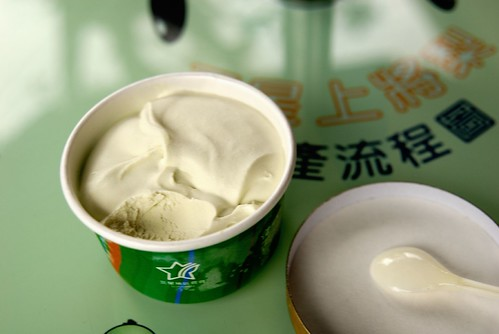 今日福山小旅行 到此圓滿結束! YABE~ 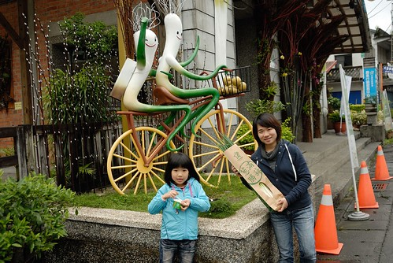
