二月底阿徹的朗讀練習 有一課主題是油桐花 其中一段這麼說"這麼多的落花, 好像山姑娘不只穿白花鞋而已. 我想, 她的衣裳一定和新娘子的禮服一樣, 雪白的裙子拖得又蓬又長, 把整座山都蓋住了" 我們總忍不住想像起滿山油桐花的雪白模樣 想著想著便也嚷起"好想賞桐花阿" 於是行動派的我立馬訂了我們的苗栗桐花小旅行~ 老實講 走浪漫路線的桐花不是很合我們家的胃口 但是個值得收藏的四季風采  

心裡覺得賞桐花就該是住在一個有桐花的地方 趁著傍晚時分人潮散去以及清早落花滿地無人打擾前 愜意的慢慢走慢慢看 因此上網搜尋苗栗熱門的桐花景點後 選了口碑不錯 價錢也適合我們的福田瓦舍 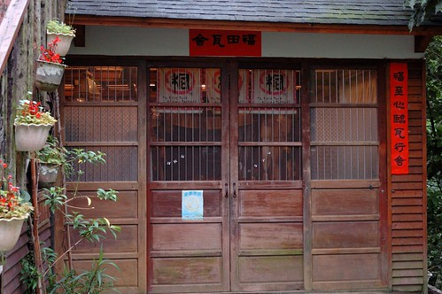 福田瓦舍位在三義的勝興車站與龍騰斷橋之間 為具代表性的桐花地區 站在民宿的院子與陽台 眼前便是油桐花盛開的山景  而院子裡的一棵油桐花也正盛開著 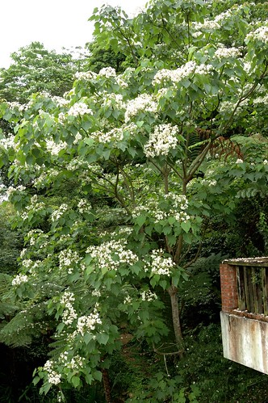 老實講 遠觀的油桐花並不是那麼吸引人(要遠觀 開車走一趟三峽到苗栗間的國道三線就夠了) 可以近看 細拍才是千里迢迢來賞桐的目的所在 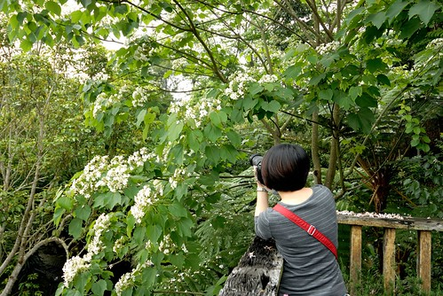 而灑落滿地的桐花似乎才是賞桐的最大樂趣所在 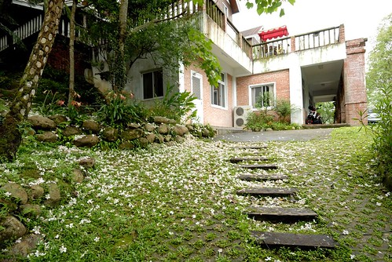 徹愛每每看到滿地的桐花 總會一朵朵的拾起 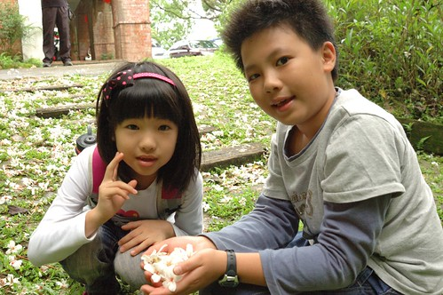 然後一把拋下 自己營造五月雪飛的情景 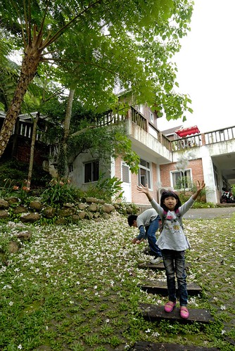 今年因為氣候異常加上連日大雨 讓原本的五月雪卻提早在四月盛開且因雨也提早落地 因此4月底的花況便不是太好 且落在地上的桐花很容易便爛巴巴 但對於這學期國語課本都有油桐花的小學生來講 依然是趟值得的桐花之旅 而母子三人一起念過的"柿子色的街燈"書上所描寫的客家風情 油桐花開的感動 我們也一起體會了 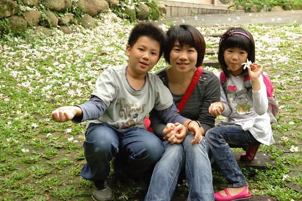 行前看到網友遊記中分享的民宿內桐花祕境 我們依樣畫葫蘆的尋訪去 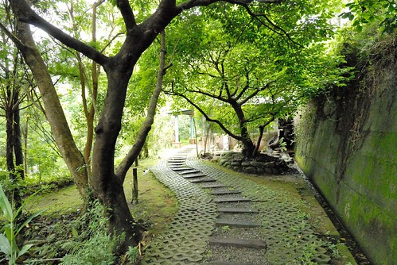 來到10人木屋區 哇~滿地的桐花 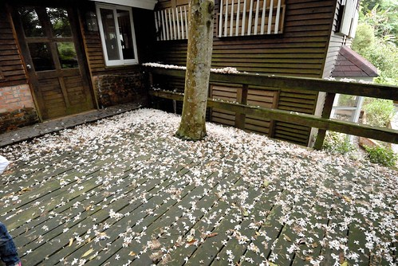 雖然遠遠不如網友分享的那樣誇張 但還是"盛況" 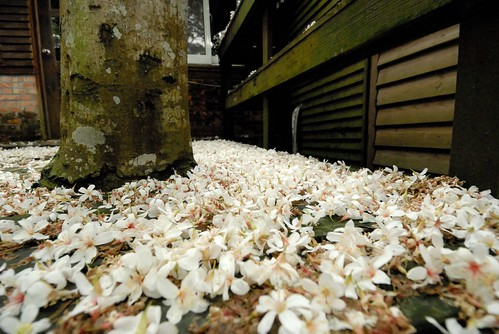 屋頂上 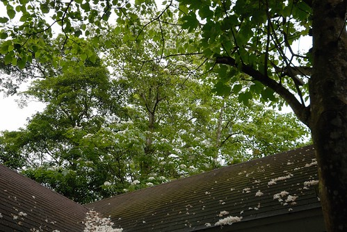 陽台上 到處都見桐花的身影 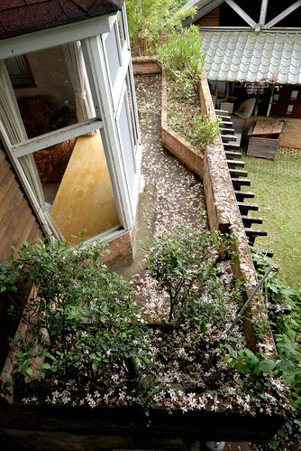 就連房子落地窗的倒影裡也滿滿都是油桐花 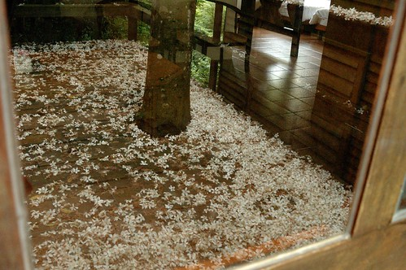 

剛落下的桐花真的很漂亮 但美麗桐花下一層層已腐爛的桐花卻讓人不勝唏噓 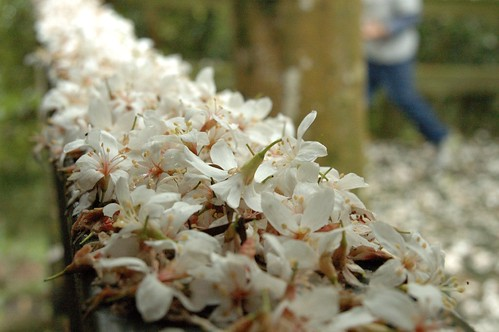 當下 我的心裡不像之前看網友分享賞桐那樣的浪漫情愫 反而有點悵悵然...  隨處可見都是桐花 阿徹玩起桐花遊戲 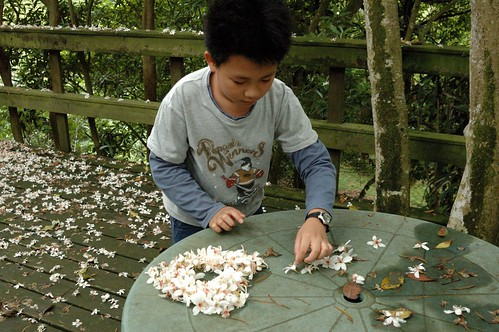 排了他的幸運數字"9" 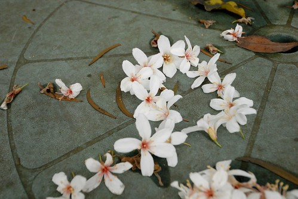 愛愛則一如已往的瞎玩 只是拾滿手的花 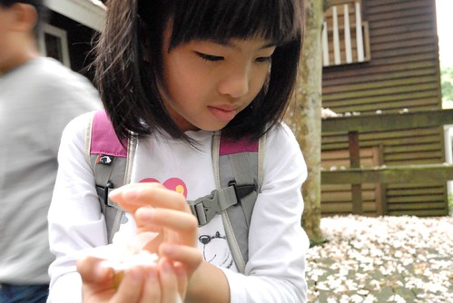 突然 我們有了個點子 幫愛愛的髮圈加工 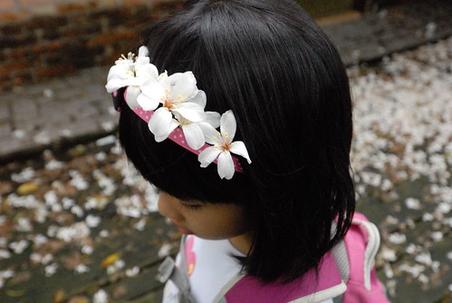 美麗的花圈讓愛愛開心的不得了 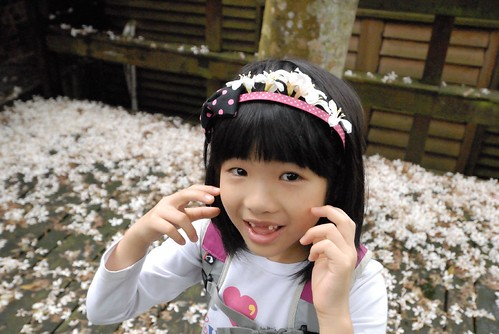 仿若皇冠加持的小公主 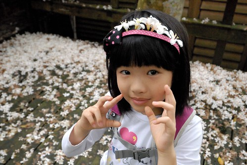 肯定愛愛的賞桐記憶裡 絕對會有這麼一個令她開心的美麗桐花冠 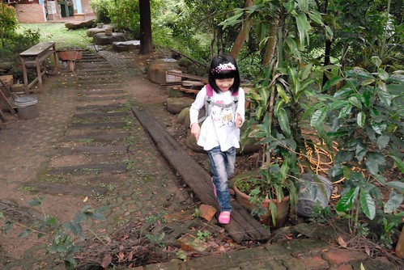

賞桐的另一個重點時間是清早時分 尤其一夜大雨過後 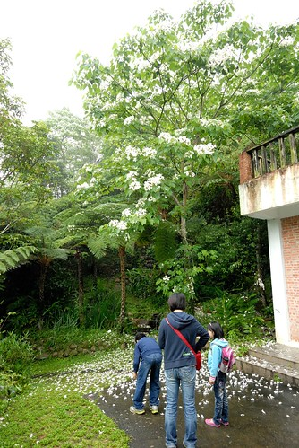 垂著雨水的桐花更顯嬌弱了 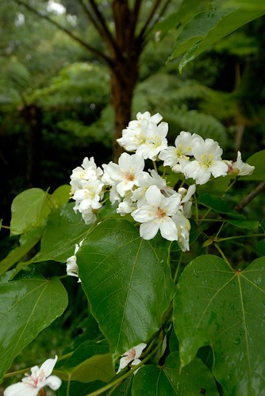 我們小心奕奕的走在滿地桐花上 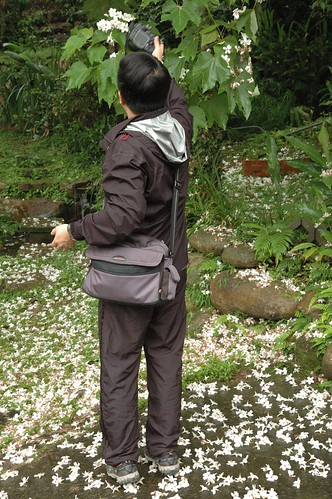 我們拾著一朵朵落下的新鮮桐花 創作我們的桐花圖像 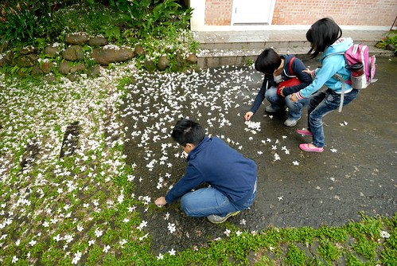 哈~ 最簡單但具意義的"愛心"嚕 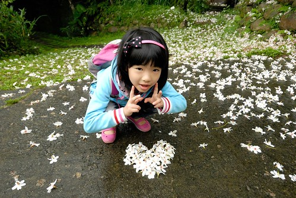 愛愛主動要當小攝影師 catch下她的畫面 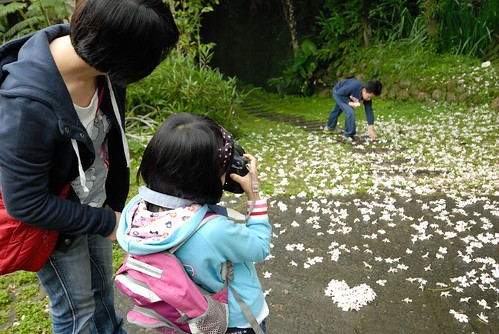 鏡頭下 總能有樂子的哥哥 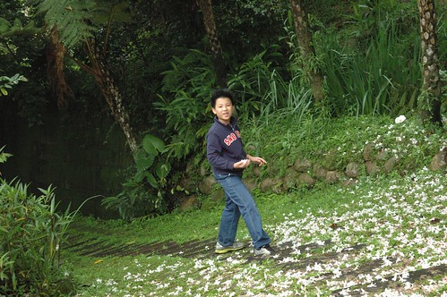 鏡頭下 跟花一樣迷人的媽媽 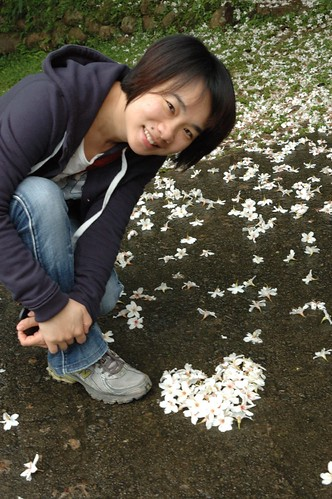 這樣的桐花圖像 這樣的桐花小旅行 對我們來說已足夠(也免疫了) 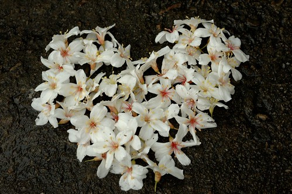

離開民宿後 因為沒有其他景點的安排 加上以後應該不會再賞桐的心理作用 我們繼續探訪著其他的桐花景點 來到五月雪步道 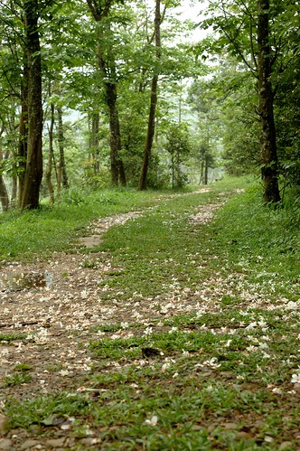 我們買了盒客家麻吉 我們最喜歡的麻吉樣子 邊吃邊走在五月雪步道上 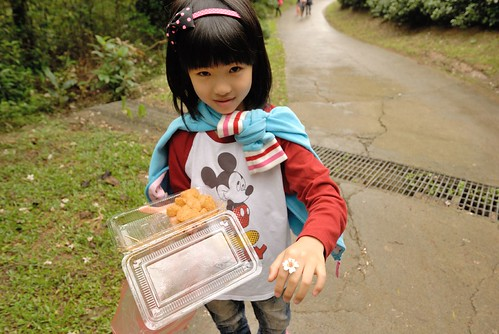 沿途看到一朵剛飄落的小小花 撿起後讓愛愛夾在指縫間 就像一個雅緻的花型戒指煞是美麗  而我手上是正常尺寸的花戒指 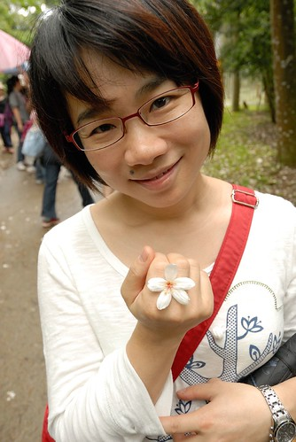 在這也難得看到生長較低的桐樹 得以近距離的觀賞桐花 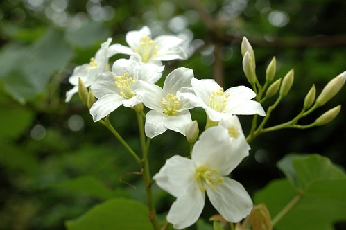 桐花 在樹上與地上的姿態真的很不一樣 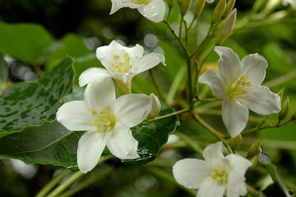 在苗栗的路上 常可見路邊有人玩著桐花 拍著桐花 甚至很多女生有備而來的拿著鐵絲做花圈 套在頭上拍照 這樣的賞花方式真的讓我大開眼界 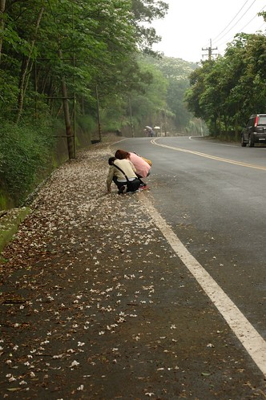 對於桐花 我最喜歡的是這樣花花綠綠的畫面 有fresh的感覺 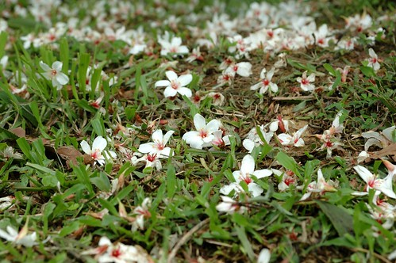 而大部分人喜歡的可能是花飄落後的浪漫表現以及可以讓人做浪漫的恣意吧 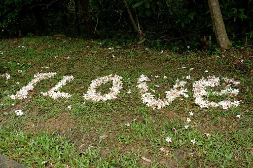 離開小徑 天空開始下起雨 我們的賞桐行也畫下句點 以後再看到 聽見桐花的故事或課文 相信我們會有更多的感動! 而我們也有屬於我們一家子的桐花回憶了! 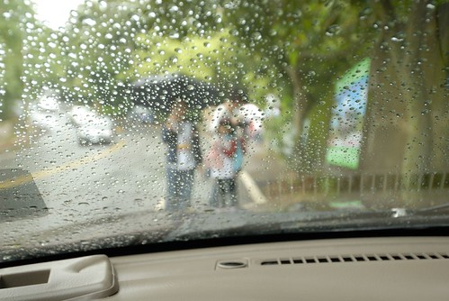

補充: 有關這次的民宿 是個清幽安靜的賞桐花地方 但房間內濕氣有些重 加上當天樓上小孩碰跳聲以及窗外冷氣機運轉聲 我們睡的並不甚安穩 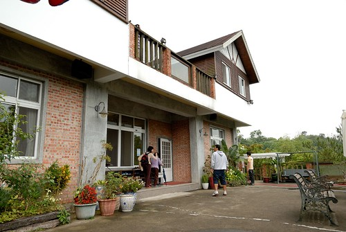 而不算少的民宿容客量 與西部景點的熱門 讓我們一家子忍不住碎念還是喜歡東部的愜意 阿徹甚至說 以後把在西部玩的錢省下來 然後就可以常去花蓮台東了 哈哈! 原來我們家的偏食習慣是表現在這方面 而且還挺嚴重的 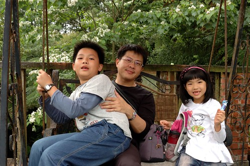 就如那天中午去三義有名的麵店吃中餐 人聲鼎沸 便宜又大碗的麵 卻讓我們吃不消他的大份量與重口味 不過人生還是該這樣多嘗試 多收錄不同的風情與體驗 
