位於台中 隸屬林務局管轄的大雪山森林遊樂區 是我與徹爸一直很想再去的地方 因為這裡是我跟徹爸交往前 讓我們的朋友關係由疏而親 很關鍵的旅行地 只是相隔近20年再訪 才發現倆人對於大雪山的記憶還真是一點也沒有 沒印象上山的路這樣崎嶇不好開 也完全沒記憶園區裡有什麼好玩好看 只記得一大夥人睡的通舖上我們兩人剛好是男女生的分隔線 還有在摩拓車下滑的路上 徹爸說著的玩具夢想... 從此倆人的人生改變了!

帶著徹愛 一家子來到大雪山 帶了點浪漫情愫 但也總算真的走進這片森林且留下我們的足跡 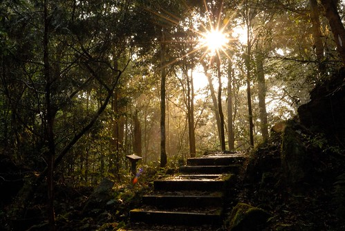

雖然知道大雪山的海拔有2200公尺高 我們卻完全輕忽上到這樣高度的路途肯定迢遙 因此才會安排在東勢吃完中餐後就立即上山 加上路況也出乎我們意外的很不佳 這趟路坐的我與愛七暈八愫

車子抵達大雪山遊客中心時 老實講我跟徹爸完全沒有來過這的絲豪印象... 我說 這遊客中心肯定是新蓋的 我們才一點印象也沒有  遊客中心內很多的木雕作品欣賞 而且剛好有介紹蜂鷹的生態影片播放 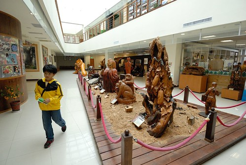 正準備上車去步道口的我 一聽到有影片可看 立馬找了肯定想看的徹愛去看 徹爸笑說 我果然暈車暈慘了 才會有得坐就不走了 不過蜂鷹的紀錄影片真的讓我們大開眼界 尤其攻擊啄食虎頭蜂窩時的盛況 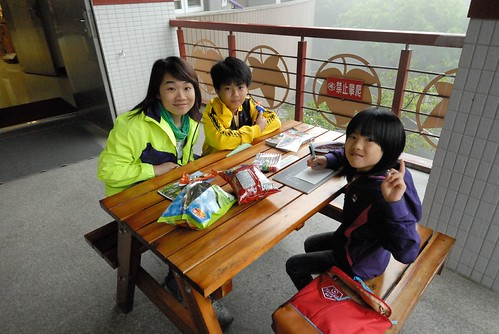 看完影片  山上下起大雨也起了大霧 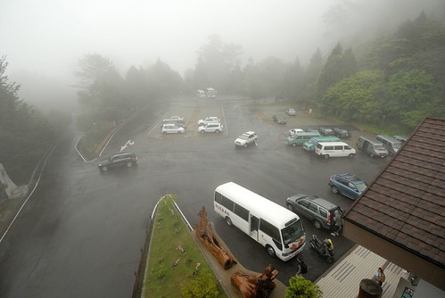 哪都走不了的我們 索性在遊客中心觀景台休憩等待雨轉小 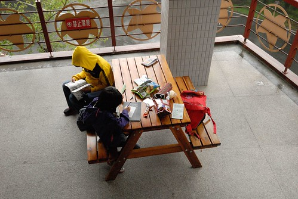 雨還是不停下  我們再轉移陣地回賓館房間繼續消磨我們的下午時光  好不容易四點多雨停了 我們把握天黑前的時間開始我們的步道探險 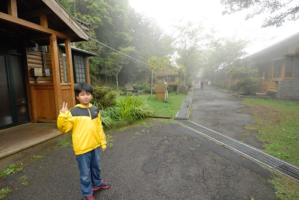 (話說賓館房間的簡單是少數留有的第三個大雪山回憶)  我們的探險從住宿區旁的神木步道開始 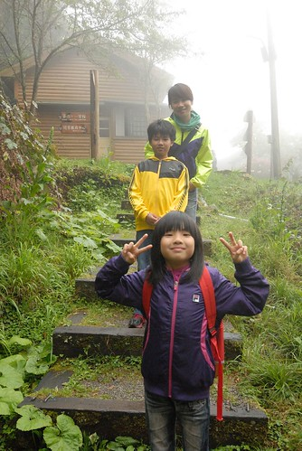 而且剛好這段步道有尋寶打卡集點活動  這類活動最能吸引禮物導向的徹愛積極走入步道  睡飽休息過後的我也總算恢復精神 開始帶著徹愛衝衝衝 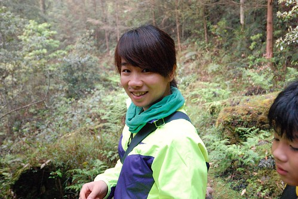 步道沿途生態豐富 好高好直的松柏吸引我們目光  吐出新芽新葉的小花小草引我們佇足觀察 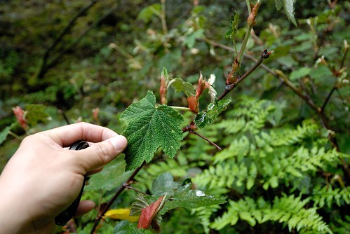 而且下雨過後的山裡 迷迷濛濛 特別詩情畫意 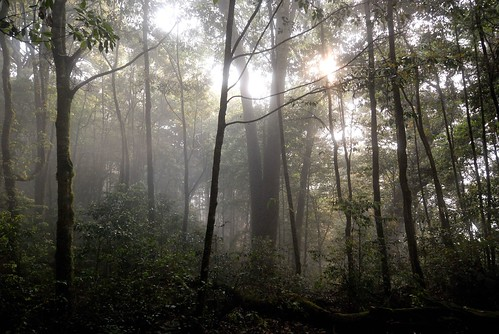 徹哥邊走邊說 我最喜歡這樣的步道了  原始又帶著神祕與浪漫  徹哥拿著我的相機 一路走走拍拍 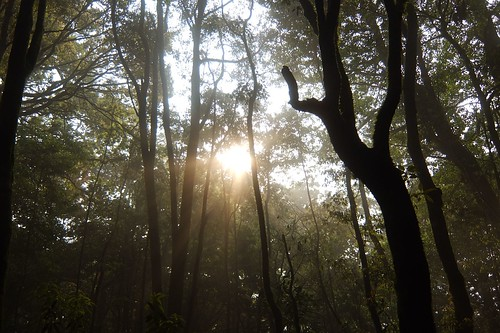 尤其陽光穿透的林間一幕幕 每每引起他的驚呼"好美~"  同時間我們也努力走著 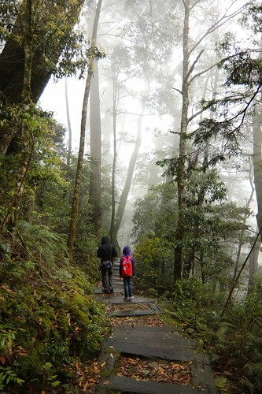 蒐集三個打卡點 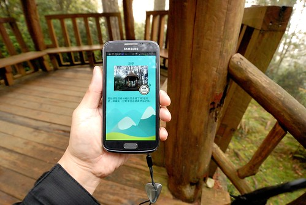 打卡的終點在步道裡的小神木  遠遠看好高的神木 近看更是高聳入參天 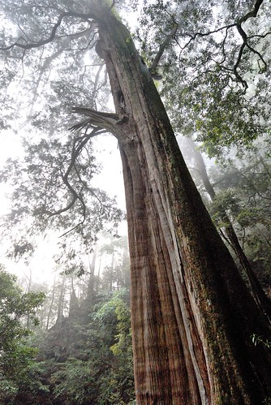 我們高高興興打下第三個卡 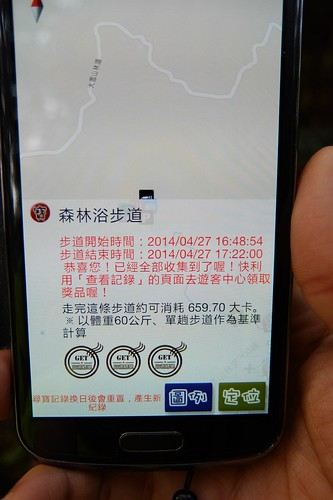 期待可以去遊客中心領取的小禮物  只是在這也尷尬了 要原路返回還是順著步道繼續走下去...  那天的天時 地利實在深得徹哥歡心 於是明知接著走的路更遙迢 我們選擇繼續探險下去 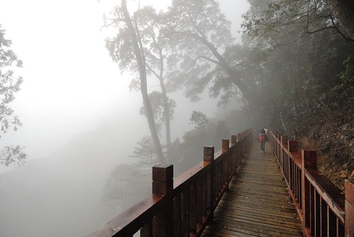 接著的路 因為日落 更迷濛了  但無人煙的路 狀況也更不好了 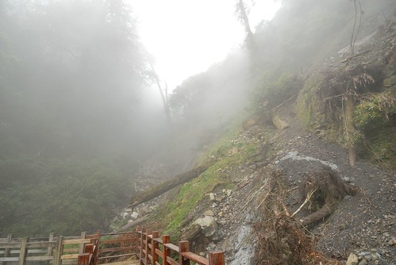 且我們不知道還要走多少的路 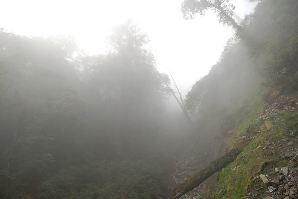 我們跟日落比賽似的 快馬加鞭走著 走了比最後打卡前還要久的時間 才總算回到步道的終點 上山道路的41K處 這一刻 我們才鬆了一口氣(來得及最後的晚餐時間了)  只是我們還有2公里的道路要走 才能回到43.2K的遊客中心與賓館處  雖然這一趟步道 出乎我們意外的遠了些 但下雨過後的步道真的很美 讓徹愛喜歡且開心走著 也讓舟車勞頓一整天的我們獲得舒展  而至於那個打卡... 話說隔日早當我們到遊客中心一臉認真的要換小禮物時 好像有點嚇著服務的替代役 而看到換得的五塊印有長庚紀念醫院製作的心顫器使用流程的磁鐵 嗯~ 真的也嚇傻我們了.. 好歹也用個林務局製作的森林教育磁鐵... 只是徹愛還是歡歡喜喜收著禮物 真的好個禮物導向的孩子們! 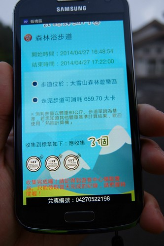
