大雪山森林遊樂區 座落於雪山山脈主稜的後段 1000多公尺海拔的落差 涵蓋暖 溫 寒三帶 擁有豐富的森林植被 也因此是國內 甚至國際間富盛名的賞鳥勝地 行前看了網友分享的大雪山 我們頗嚮往與期待大雪山能繼武陵農場後是我們的下一個祕密花園 大雪山生態真的很豐富  很美 只可惜上山的路太崎嶇 加上武陵谷地地形帶來的豁然開朗實在太難被取代...

一掃前一日的陰雨 在大雪山的第二天是適合健行的好天氣  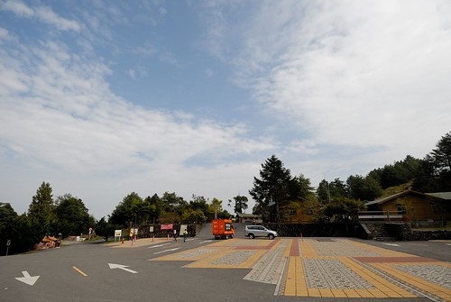 我們先是來到大雪山最裡50K的天池 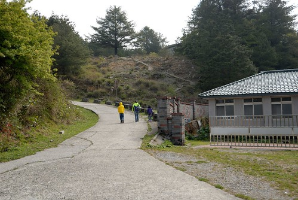 從停車場走到天池的幾百公尺路  雲淡風輕 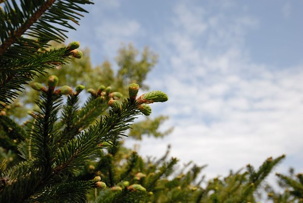 暖暖的太陽曬得人舒服愜意 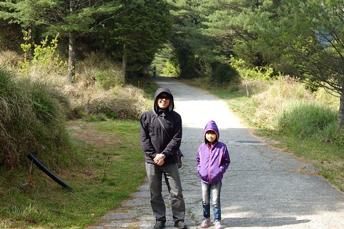 只是走到 看到天池時  我們有點被眼前的乾涸給震驚 徹愛問"什麼是天池" 我說高山上的湖泊離天好近 所以叫天池 徹愛皺了皺眉說 "可是天池不美麗..."  我們沒接著走往雪山神木 但沿著環池步道走一圈  走阿走發現 在某些角度下的天池其實也挺美 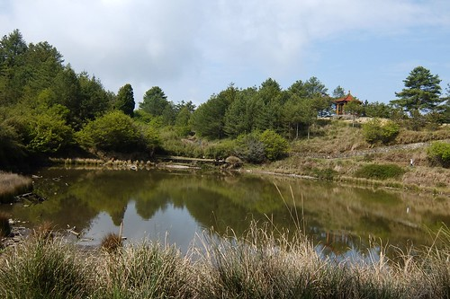 尤其映著綠樹藍天的池水 靜如鏡 別有一番詩情畫意  再搭上一家子的好心情 嗯~ 還不賴  第二戰 我們來到48K的景觀台 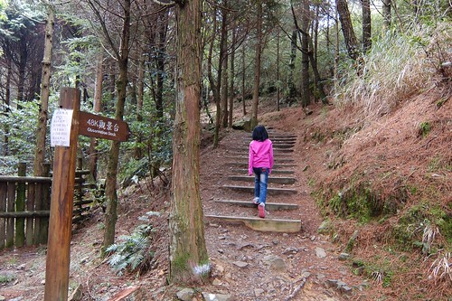 與天池一樣的一公里往返路程  但這裡海拔的抖升降需要強些的心肺力  天氣舒適的關係吧 加上徹哥說的 他喜歡這種原始的步道 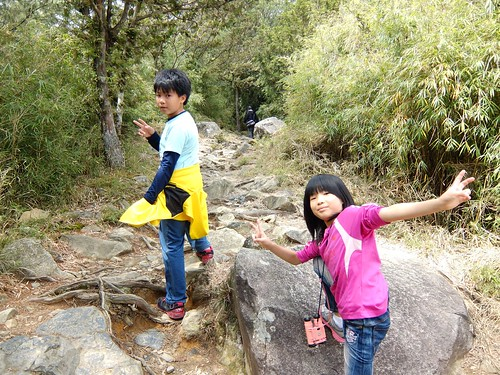 今日徹愛的戰鬥力旺盛(徹哥難得走步道不唉唉叫)  可惜的是上到景觀台後 眼前一片霧茫 能見度並不佳  只能看著解說牌空留遺憾...  不過好不容易來到大雪山的最高點 還是停留些時間感受這的空氣 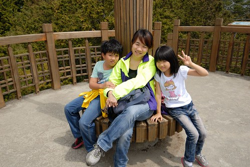 拍照 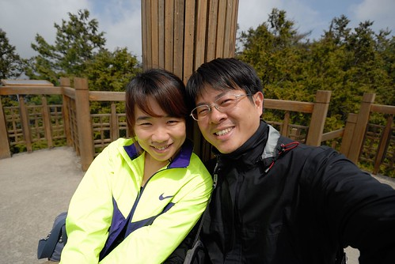 再拍照 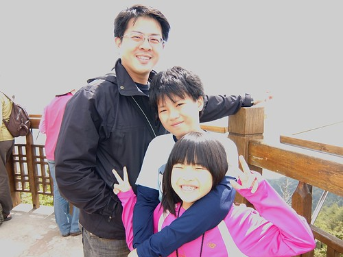 很久沒走進森林的我們很開心!  (徹愛玩著猜拳下樓梯的遊戲 爾虞我詐的倆人很逗趣)  (從小玩大的望眼鏡玩具也跟著我們上大雪山要來賞鳥 可是完全沒派上用場)  順著回程下山的路 我們接著在35K的收費處旁停留 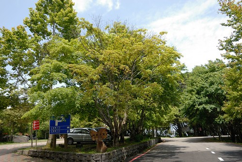 進行最後一段的步道健行  目標是來回5公里多的稍來山三角點  這段路沿途林相很是豐富 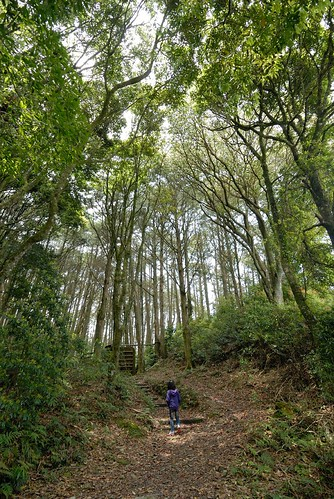 不止樹木高聳入天  地上的小花小草也清新怡人 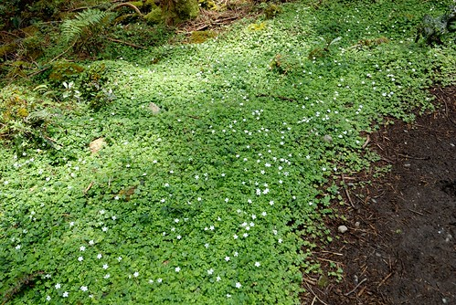 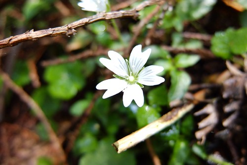 只是一路上不斷迎面而來的小蟲子與蜘蛛絲 讓走前鋒的那個人走的有些辛苦 最後我們靠著徹爸用他的外套替我們打出一條乾淨大道  單程2公里多的路程說長不長 但接近中午時分加上趕著二點下到東勢 我們發揮最強戰鬥力 在預計的50分鐘內抵達我們的目的地 稍來山三角點  看到三角點處的瞭望臺 我們確定我們是抵達終點無誤 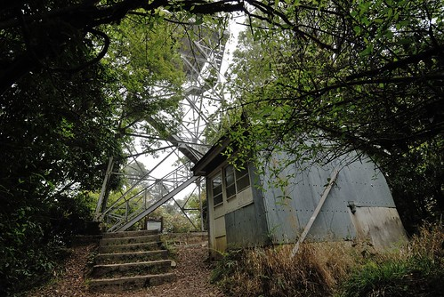 只是話說三角點不是視野最佳的地方嗎 怎麼眼前卻只有一片林?!  我們想爬上這瞭望台上的view應該很棒吧! 網友們PO的視野廣風景佳的照片也肯定來自這的登高而後望遠 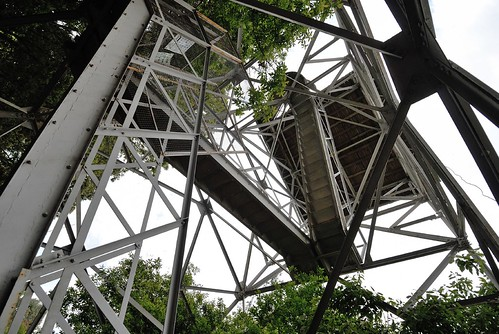 只是在步道口跟瞭望台階梯入口都明顯告示 此瞭望台是林務局巡視森林火災用途 非工作人員請勿入 所以向來很乖 很注意身教的我們當然是連一階都沒往上踏 只拾起前人遺留的海報 然後與其實對我們沒意義的三角點拍照  急行軍的我們 此時看來都有些狼狽  不過達成了今日健行目標  大家心情也都很好 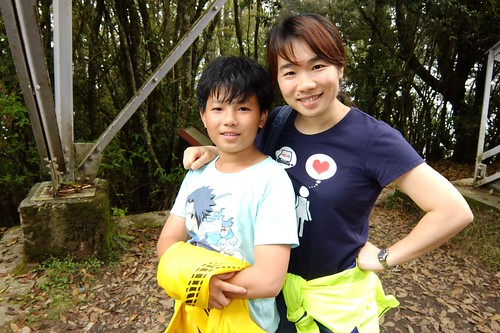 尤其是總算可以下山去找玟姿阿姨的愛愛  我們原路的走回步道口  不過中午時分 山裡便漸漸起了霧  深怕被午後陣雨襲擊的我們更是加快腳步 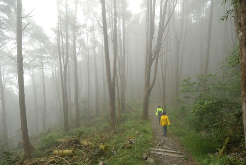 一個上午走了三處小步道 也不枉我們念了大雪山這麼久而來到這 會再來嗎? 老實講..短時間內應該不會 因為山莊的餐點真的好弱阿!!!

離開大雪山 下山回到東勢 很剛好但其實也是很刻意的 在玟姿阿姨課最多的星期一唯一的空檔時間 我們兩點準時出現在東勢鎮上 先是去吃了網友推薦的牛肉麵 餓昏的我們啥都好吃 愛愛還在鎮上郵局寄出在大雪山上寫的明信片給明明跟我們在一起的阿姨 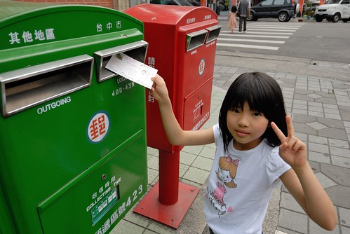 然後 當然一定要跟玟姿阿姨來一碗的剉冰  第二年在徹愛的校慶補假日來到東勢跟阿姨吃挫冰 該來想想明年補假要再來哪個以東勢為中心的地方 才能繼續來找阿姨吃挫冰...
