我知道連著兩個月而且還是這樣的酷暑要徹爸開車去花蓮實在是件很難以啟齒的事 但今年的夏天不知怎樣的 很想很想去花蓮看金針花 於是厚著臉皮在徹爸可以接受及負擔的情況下 安排了這一次兩天半的金針花之旅 花東共有三座金針山 分別為花蓮的六十石山跟赤科山 還有台東的太麻里山 六十石山位在花蓮的最南端富里鄉 而赤科山比它北一點點位於玉里 也就是說再怎麼近還是得跑到南花蓮去賞花  老實講兩天多一些的時間這樣來回還真的挺累的...     

六十石山與赤科山各有特色 前者視野最佳 而後者賞花最舒適 徹爸喜歡前者而我喜歡後者 不管怎樣總算了卻我多年來賞金針花的心願  從此可以免疫嚕 此行總括的來講 金針花況有點出乎我們意外的小失望  但金針山上的視野或是舒適卻很令人喜歡!!!

就按照行程 從六十石山開始寫起吧 \*\*六十石山 視野最佳\*\* 若以視覺效果與開闊度而言 位於海岸山脈上的六十石山 為三地展望最佳的區域 站在三座觀景涼亭上 往內可見大片山坡 遠看彷彿厚實有彈性的草地 加上幾棟紅瓦建築 景色絲毫不輸於瑞士細膩優雅的山景 往外望去 開闊的緃谷平原一覽無疑方格塊狀的農田倒映著天光雲影 煞是美觀 分劉如爪的秀姑巒溪南北縱貫 為這片寧靜平和的縱谷平原天增無限的生命力道 

星期六早上在民宿吃飽飽後我們便開車直驅花蓮南端 六十石山 有睡飽有吃飽的徹爸看起來精神很好 尤其戴上新帽子後心情更是特High(徹爸瘦了後連帽子的選擇也變多了)  

過了玉里的台九線上接近六十石山處  我們家的Tomtom把我們導航到了一條 "無名產業道路" 路越爬越高但也越走越小  甚至有小坍壞的路面讓我家小紅飽受底盤撞壞的威脅 我們邊開邊念著 什麼導航阿 導這樣的路  真是太OOOXXX了 所以有要去六十石山的人們阿 若看到導航系統將你引導到一條你開沒多久就會毛的路 可千萬記得趁早回頭走正道阿 

幸好經過導航系統的這番考驗 我們還是在"正中午"12點抵達六十石山金針花區 只是真的好熱加上媽媽這回的放空恍神  我們一家子走走開開的繞了大半圈最後才落腳黃花亭稍做休息 

黃花亭是六十石山上算是比較下面的涼亭 但爬上涼亭的三樓一眼俯瞰下去便已是這樣的"大"景 開闊的縱谷平原 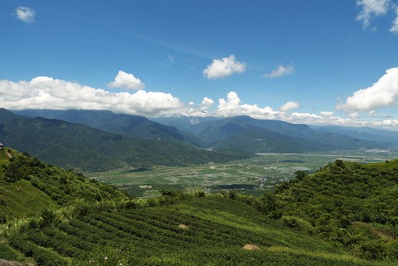

巒巒的金針田及茶園 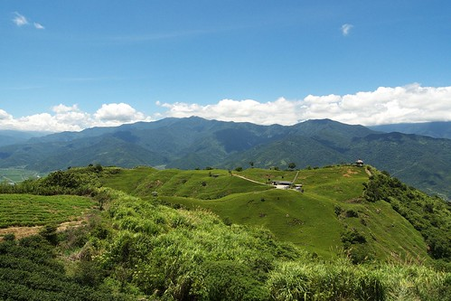

在亭子裡我們看著別人的豐盛富麗便當  嗑著我們的小七御飯糰 其實本來行程規畫時也有想到應該買個當地名產便當上山野餐的 可礙於不太順路便作罷 結果竟然在山上看到好多人帶便當上來吃 真是好羨慕... 

愛愛真的已經長大了 自己可以獨自嗑掉一個御飯糰了 吃飽飽等一下才有力氣走路 這是媽媽每每出門在外勉勵愛愛的話 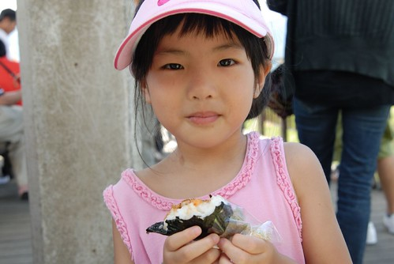

在黃花亭解決我們的中餐後 我們便又開車回頭往山上走 途經過鐵掌櫃茶舍時 看到這樣的藍天白雲金針花  讓人哇哇哇 精神大振了起來 

六十石山上的道路都不大 加上可停車的地方很少 所以徹爸把車子開到老遠處後再頂著烈日回到這裡好好拍個夠 

這樣的景色 似乎白雲才是主角而金針花田是配的剛剛好的搶眼配角 

雖然大中午真的好熱阿  但是才會有如此美麗的藍天白雲阿 

呵呵! 徹爸自己一個人竟也會自拍 很自得其樂 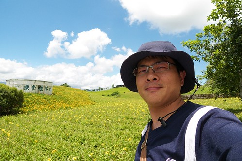

沿著這樣的小路我們繼續往上探訪金針花田 

我們平常吃的金針花都是花還沒開前的花苞 也就是說變成美麗金針花的金針花是沒有經濟效益的 只有觀賞作用 

因此農民們必須在花開前便把花苞採收然後烘製成平常我們吃的金針 而上山民眾之所以能看到的成片金針花田 是因為鄉公所補助所以農民才沒採收的 所以當公所補助的少  能看的金針花就也會跟著少嚕... 

因此金針山上其實大部分看到都是這樣黃黃綠綠的金針田 

以及從清早到正中午都可以看見的 努力採收的農人 看著他們 我想著我平常喝的一大碗金針湯需要她們這樣來回摘拔多少回阿 有一種粒粒(條條)皆辛苦的小感觸 

小瑞士景觀台前的金針田是六十石山上唯一一片較盛開且茂密的金針花田 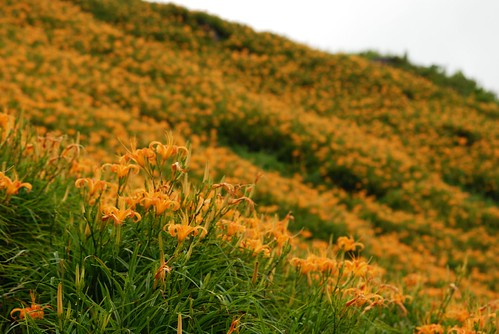

所有上山的遊客應該都有停車在這裡照相吧 而要讓為數不算少的遊客及車輛停在狹小的山路上 可就真是考驗我們國人的公德心了 

不免俗的  我們當然也湊熱鬧的來幾張到此一遊照嚕 

沒在黃澄澄的金針花海前來張大頭照怎能證明我們賞過金針花ㄋ 呵呵 

然後徹爸專心的照了好一會相 但令他滿意的沒幾張 他說金針花看起來都乾乾 沒生氣的樣子 ㄟ...太陽真的很大哩 就別太怪金針了 

而我們母子三人則在瑞士觀景台上吹著涼風 

欣賞這樣的美景 (金針花沒看的很喜歡 但這樣的寬闊大景我很愛) 

頂著烈陽(真的真的好熱 熱到我都有那麼點懊惱夏天應該宅一點的)  我們順著山路往忘憂亭走 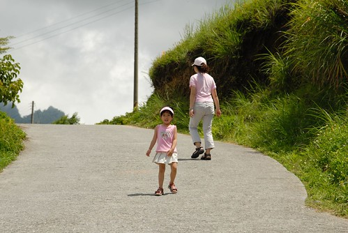

幸好有沁涼運動飲料加持的小愛還有著好心情 (要不然大熱天加上小孩難搞 我一定很容易失控) 

走到忘憂亭後 喝上個幾口 哇~真涼快真忘憂阿! 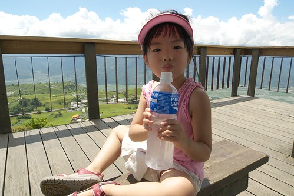

忘憂亭是六十石山上最高的一座涼亭 所以視野當然又更棒了 難怪很多網誌上都介紹六十石山不只是金針花季美  一年四季都值得上山欣賞美景 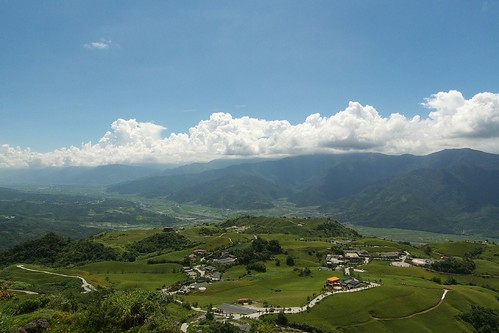

準備下山前 買了兩隻當地產的金針冰嚐鮮 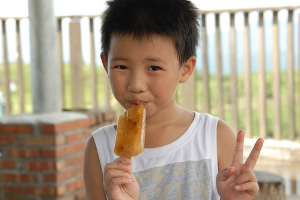

鹹鹹甜甜的還挺好吃的 推! 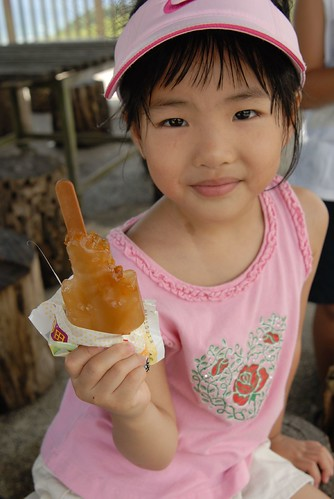

吃完冰 準備涼快下山~ 

下山前再多看幾眼金針花 .... 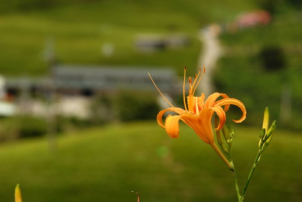 其實我比較愛那黃花後面的那片綠....
