藉著要與玟子交貨之名 貪玩的我就這樣在嘉義返北路上晃進台中快閃三小時 難得一家子一起裝模作樣去老樣喝咖啡 也趕流行的踏進甫揭園不久的勤美術 就如每一次的台中行 我們總忍不住會說"台中真的變好多" 就如離家的遊子 對於那個曾經包容我們年少輕狂的城市 越來越不熟悉 甚至陌生了... 不過還是欣見在大樓林立的城市裡有著這麼樣的一片小綠地與越來越多被保存的老房子!

約定日前碰巧看到網友介紹的勤美術 於是跟玟姿阿姨指名要去那 也因此阿姨順道又約了一起去附近的老樣喝咖啡 老樣的附近很安靜 前後左右也紛紛豪宅林立 突然一塊小地方 一棟老房子出現在那 其實感覺真的很"不可思議" 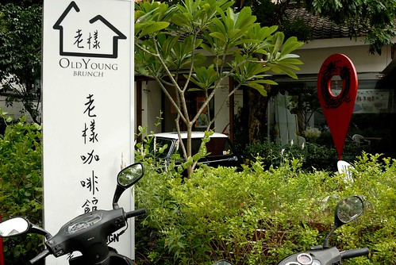 房子的外觀很老 但裡頭除了一間包廂內的舊沙發 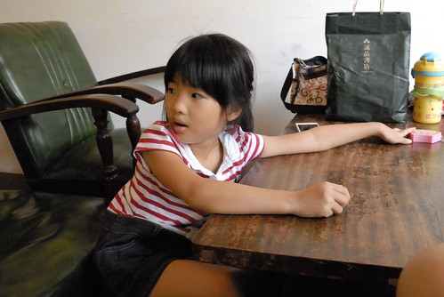 以及舊窗框與房屋木梁柱外 我覺得店裡的氛圍其實跟老房子本身有那麼點的搭不上 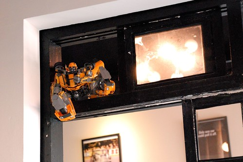 所幸醉翁之意不在酒 我們也只是單純的找個涼爽的地方坐下來聊聊天 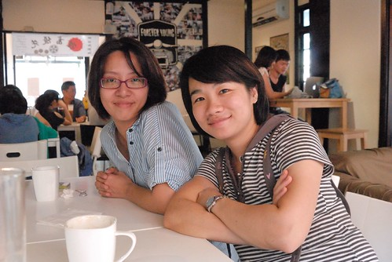 大人開心聊天的同時 小人則被一盤盤的點心飲料以及手機遊戲打發著(謝謝玟姿阿姨大請客!) 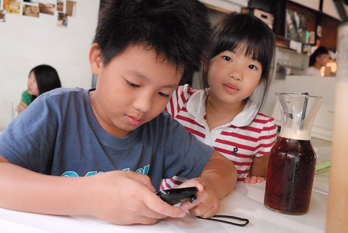 只是東西吃完 飲料喝完 我們便也急於趕赴下一個約會地點 離去時  我忍不住跟玟姿說我還是比較喜歡胡同那從裡子散發出來的好氛圍! 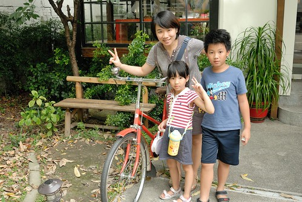 接著我們小散步來到距離不遠的誠品綠園道旁的勤美術區 這是以歐美的街區博物館為概念所設計的無疆界美術館 讓市民與藝術為伍且讓遊客能更近距離的與藝術互動欣賞 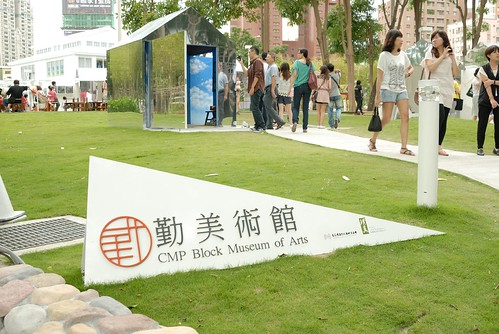 這是我第一次來到綠園道與勤美術 總算能體會為什麼很多台中朋友三不五時會來這散步 搞氣質 還真的是很有FU阿~~~  這次的展覽規畫了數十間用鏡面材質的小屋子 由藝術家進行裝置藝術展 我跟阿徹一間間的觀賞 瀏覽創作者的分享 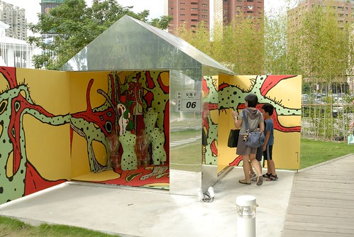 即將四年級的阿徹已經可以明白很多情境與概念了 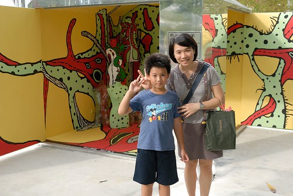 至於愛愛則還在有看沒有懂的階段 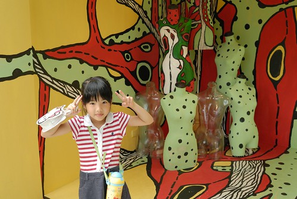 雖然大半我也是看的懵懵懂懂 但我喜歡整個展覽所傳達的愛自己 愛地球 愛生活 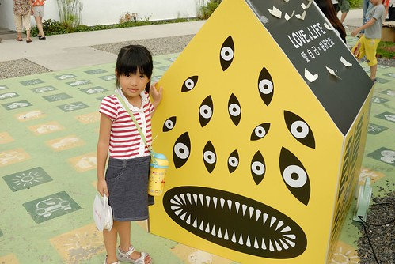 這是獲得我們五個人一致好評 最喜歡的小屋子 因為我們都好想像這隻大嘴蛙那樣每天回家後攤在大沙發上空 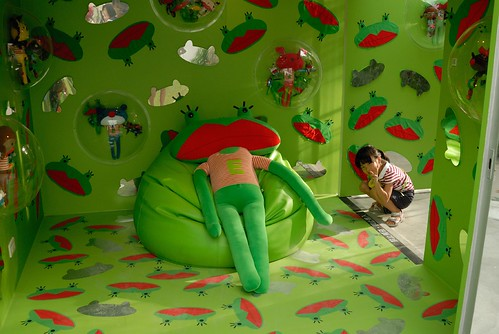 這是讓兄妹倆嘖嘖稱奇的汽車 阿徹好奇的直跟我討論著 到底是怎麼把車埋進去的 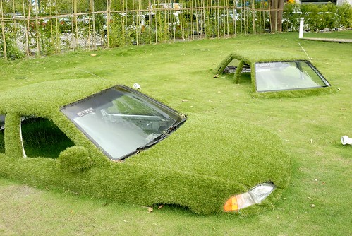 這片傘海的視覺效果也很棒 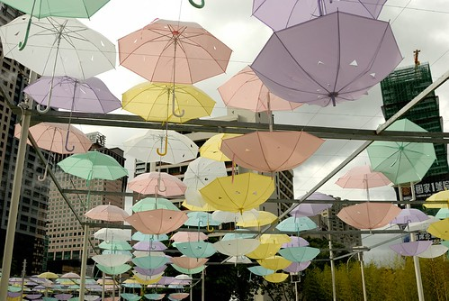 尤其下面還擺了好多張的可愛小椅子 讓人忍不住想坐下來 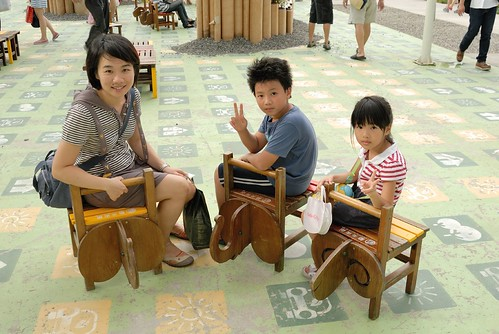 不過我們家的這個小學生更是不得了 逕自大辣辣的躺下去 "有沒有這麼愜意阿?!" 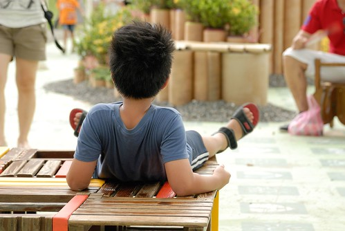 在這阿姨的iPhone 我們的相機輪流閃個不停 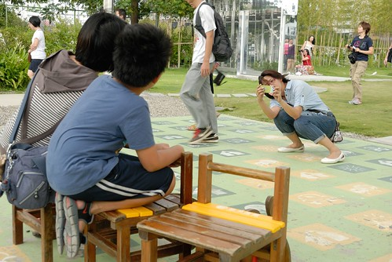 拜阿姨之賜 愛愛的iPhone滑的比媽媽好太多 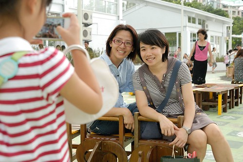 不過愛愛最稱職的還是當阿姨跟爸爸鏡頭下的外拍模特兒  再往裡頭走 看到草坪上停的馬跟驢 我們又興奮的一擁而上 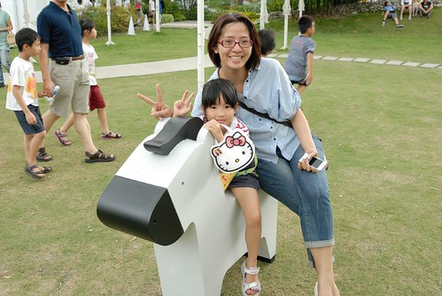 一隻 兩隻不夠 阿姨一鼓勁地去ㄑㄧㄠˊ來第三隻 向來最有公德心的小學生說"告示牌上說請勿移動耶!" 阿姨羞的照完相後趕緊再挪回原位 只是這樣一來一往好像更傷草說.. 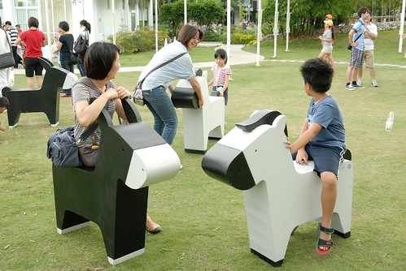 不管如何 感謝阿姨的費盡心思 只為讓我們母子三人一同騎馬(驢)入境 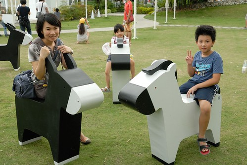 美術館的最裡是一片有坡度的草坪 而草坪的盡頭有架紙飛機 徹愛如放風似的東奔西跑 不亦樂呼 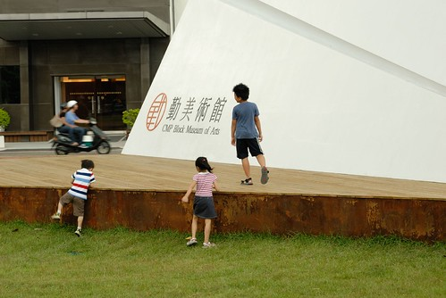 而我們則站在高處盡享這一幕 這裡有著美術館少見的奔放與自在  讓馬上的腳也不自覺的搖擺起來 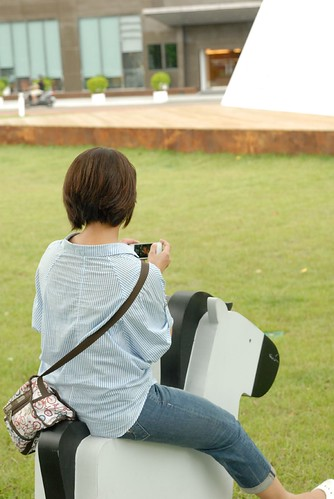 今日三小時的快閃 讓我們家又多收藏了一份台中的回憶 每次的一點點  慢慢串聯起總有一天就會是一大面 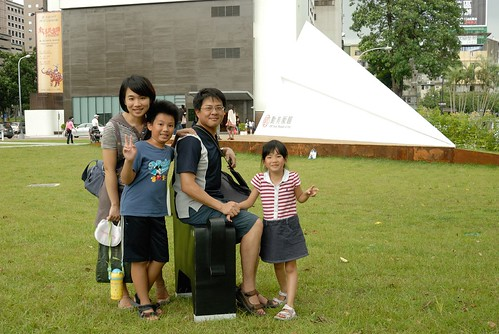 一樣再次謝謝台中最佳伴遊小姐 只是看著照片才發現 怎麼我們家阿徹的塊頭(起碼那顆頭)怎麼快追上阿姨了  一眨眼 原來我們都被小孩追老了!  後記: 離開勤美術 我們接著又去一旁的誠品書店逛了半小時 天ㄚ~那是我看過最多人潮的書局了 我還是喜歡以前家裡附近的轉角書局 那才真是融入生活裏的書局阿 只是隨著星巴克越開越多 台灣的書局也漸漸的剩下好像只有金石堂跟誠品了 唉~ 唉~ 唉~
