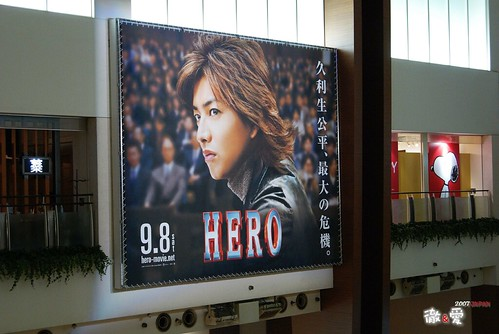
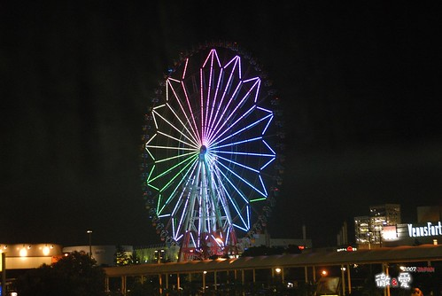
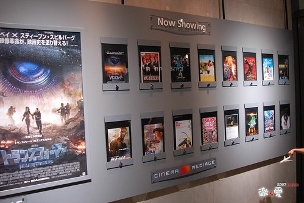
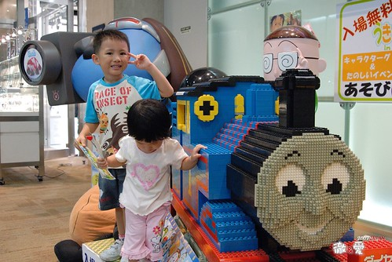
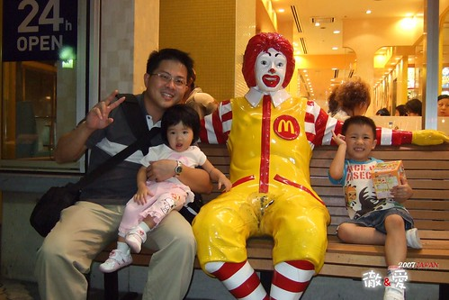
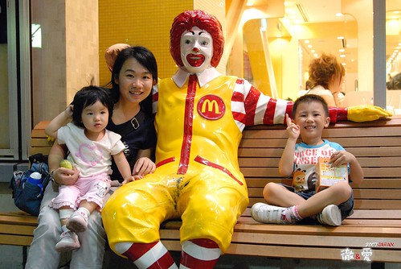
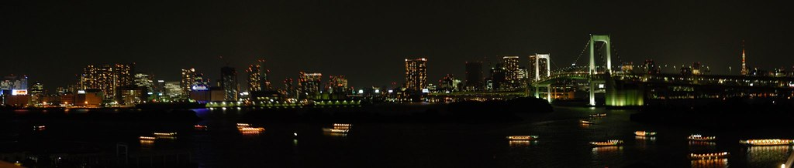

出關 踏出成田機場 旅行正式展開  
第一站便是前往台場看夜景吃晚餐  
等候8點吃飯前的空檔50分鐘是導遊給的第一次放風時間  
順著人潮的往小自由女神像走  
越走越感受到日本炎熱的氣候實在不輸台北  
然後進入某shopping mall  看到湯瑪士小火車  麵包超人 還有帥到不行的木村....  
  

看到閃亮亮的摩天倫 就代表我們真的來到了這繁華的東京  
而霓虹燈閃爍的城市果然不是我的小DC拍的起來的  
一切就得依賴徹爸跟他的小兩小八了  
  
  
  
很雅緻的電影看板 但是放映的電影都跟台灣差不多(哈 表示台灣跟全球很同步哩)  
  
  
  
進入shopping mall 考驗著阿徹的感官  
嚕著要買玩具 買禮物(誰叫我們在家裡就跟他講清楚可以買3樣禮物)  
還有6天要搞哩 可別每天這樣吵  考驗爸媽的耐性哩  
  
  
  
  
  
  
  
  

