媽媽很喜歡賞油菜花 徹愛從小就明白也跟著東奔西跑好幾回 沒想到除了油菜花外 媽媽還愛秋天的芒草 每年總念著想去賞芒 尤其在今年... 十一月初 我豪氣萬丈的跟一家子宣佈"大家今年要陪我去金瓜石賞芒" 徹愛緊張的問"要爬山嗎" "爬很久嗎" 我說"不是太簡單也要走好一會" 徹愛哀號著... 但沒想到從11月初開始 只要我們可以成行的周末就肯定大變天 變的又濕又冷的 徹愛每每慶幸又躲過一次苦行 但我卻一次比一次的失落 因為冬天真的來啦... 幸好老天爺總算在12月中許了個大晴天週末 就如前一天晚上 徹就唸著說"明天如果好天氣的話 媽媽一定會說要去金瓜石" 我說"阿徹真聰明! 果然我兒子沒當假" 阿母今日早就準備好做壽司的材料 打算明天郊遊野餐賞芒去嚕~ 那天我們從金瓜石車站出發 沿途經過日式宿舍區 黃金博物館 茶壺山石階步道 最後再從勸濟堂下山 繞經金瓜石老街 把金瓜石最精華的路線走了一遭 雖然身體剛好的不適讓我在回家後鐵腿好些天 但總算能親眼目睹茶壺山芒浪 做夢也笑了~ 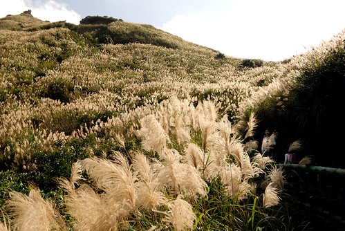 

大部分的遊客都是開車從勸濟堂後方的柏油路上到茶壺山的登山口 只要再步行個30分鐘即可攻頂 但我ㄧ開始就打定主意要從黃金博物館出發 當我們剛到金瓜石要停車時 發現私人停車場收費是以小時計算 問了管理員到茶壺山要走多遠 管理員眼裡盡是質疑的看著我們說"要從這裡走? " 雖然他沒把很遠說出口 但從他不可置信的表情我看的出應該真的不好走 背著徹愛 我也坦白跟徹爸說有路可以開車上登山口 但我想要從這裡開始走 順道逛逛黃金園區 謝謝徹爸無怨無悔的支持! (雖然事後徹爸說他真沒想到車子可以開到這樣近) 我們在黃金園區邊看邊玩 到真正從黃金博物館開始"走"已經是一小時過後 日頭赤炎炎的11點 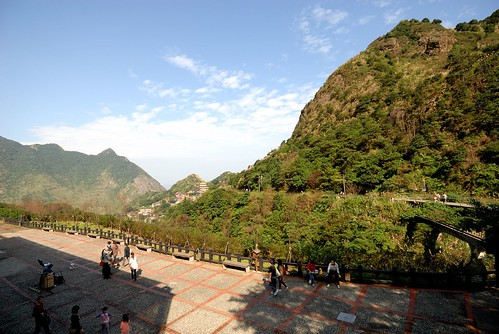 很尷尬的登山時間 太陽有點烈 肚子也快要餓 但是我們的壽司非得要在辛苦流汗過後才能大快朵頤 所以我們只有冒著熱努力往茶壺山方向走  順著黃金博物館旁的步道走 會接到勸濟堂後方的茶壺山步道 從這裡開始便是一路往上的階梯步道 "硬"度完全的不輸前陣子走的南投天梯  雖然我們走沒多久就開始氣喘吁吁 但今天的天氣真的好棒阿! 藍天白雲加盛開的芒花 O.E.C~ (很唐突的O.E.C 但真就是像O.E.C那樣的表情與心情)  我對正苦於挑不出照片做明年桌曆的徹爸說"可別辜負了老天爺今天許的好日子 好好拍出個美麗的芒草吧"  原本擔心12月中才來賞芒可能會只看到七零八落的芒草 加上前陣子又連下了一個月的雨 但沒想到芒花季的尾聲 還能見到這樣大片的芒草  尤其盛開後的芒草 那蓬鬆的姿態 更是別有一番風韻阿! 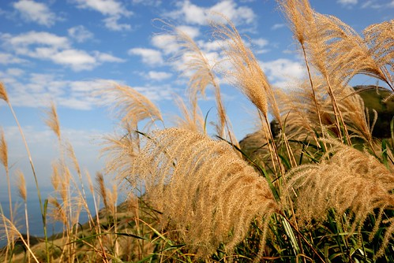 藍天 白雲加上大景 讓徹爸好久沒有這樣認真拍照了 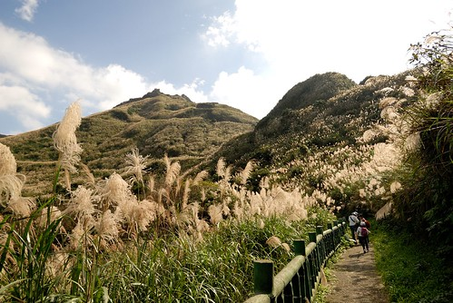 轉個灣 不同光影 不同山線 不同芒浪方向 相機咖擦個不停 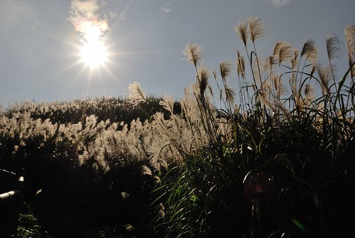 而除了面向茶壺山的芒浪很多變很美麗  面向海的那方也是千變萬化 處處引人驚喜 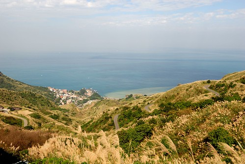 走累的時候 我們便隨處坐下來休息 看芒看海好不愜意 但看的出步道真的不是太輕鬆 讓徹愛似乎有那麼點累 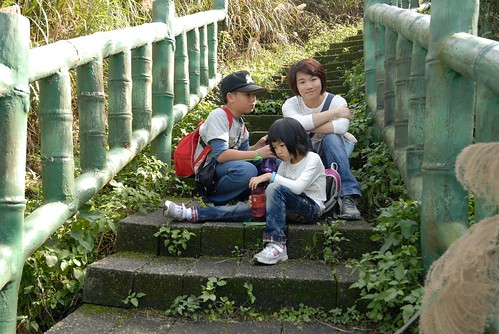 不過沒關係 喝口茶 加上媽媽有備而來的曼陀珠糖 徹愛絕對能走完全程的啦  瞧~ 喝了再上的愛愛又多麼有活力了  (舞蹈老師發的兩顆糖就也足以讓愛愛情緒亢奮好一陣)  雖然12點多的大太陽讓我們走的滿身汗 但濕溼冷冷好長一個月後 能夠這樣流流汗 其實真的很舒服~ 尤其徐徐涼風伴著  往茶壺山的步道口有三個 除了我們走的那個外 另兩個分別是步道與馬路的交叉處 走的很累的徹愛 走到第一個與馬路的交叉處 看到眼前駛過的汽車有點傻眼 "車子可以開上來喔!?" 我說"是阿~" 徹愛這下子真是搞不懂阿母為什麼這麼愛走了 愛愛開始喊著'好累喔 忘記拿車上的竹杖" 開口要爸爸走回去拿竹杖 我說"爸爸如果再回去拿竹杖 應該就是開車上山頂了" 徹愛歡呼著"好耶~" ㄘㄟ~ 有志氣點~ 我們要努力的一步一腳印走上茶壺山~  而且用走的才能好好體會與享受這千變萬化的景象阿 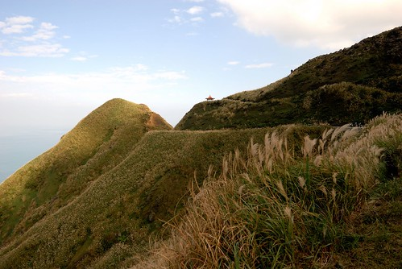 我知道徹愛還無法像我們這樣深刻體會 那些蜿蜒小路與山形變化的美麗 但我還是忍不住一次次的指著前方 告訴他們"你看 那裡多美阿~" 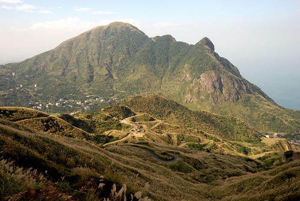 總算在歷經一個半小時後我們走到茶壺山真正的登山口(這兒還有停車場ㄋ)  我們加緊腳步的往上走  因為已經下午一點 肚子餓的我們堅持要走到從遠方就一直看見的那個最高的涼亭吃壽司 (寫到這 看到下面照片中的徹愛 才發現他們兩個真的很餓很累的樣子喔) 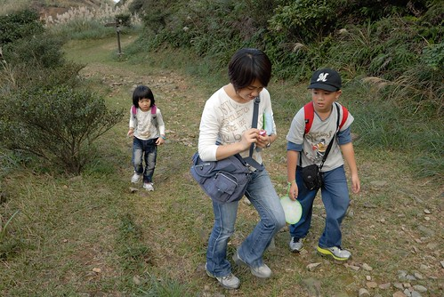 我們堅信辛苦過後的壽司肯定特別的美味  所以我們笑著繼續努力  來到觀景台 愛愛嚷著'到了嗎? 可以吃了嗎?'  爸爸說"還沒 這又不是涼亭" 愛愛差點沒Orz 爸媽不給飯吃也就算 還又忘情的欣賞美景 照起相來...  總算...總算....沒多久 涼亭真的到了...   我們趕緊拿出壽司祭五臟廟  辛苦過後的壽司果然真的好好吃ㄚ~  (雖然父子三人碎念了一下今日的小黃瓜實在不如羅曼生菜來的好) 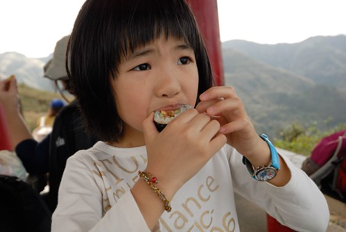 好笑的是 開動前愛愛還先費心的幫她一路揹上來的美樂娃娃鋪好野餐墊 供上鮮茶 後來我就像美樂這樣靠在對面的柱子上吃壽司 感覺真的好棒ㄚ  "寶獅亭"是茶壺山最高點的涼亭 盡覽金瓜石  徹爸對著眼前這幅美景 嘗試好多張不同比例 山多一點或海多一點 或右邊點 左邊點...  這張是我們兩人有志一同最是喜歡的一張 看著這張照片我跟徹爸說 這樣的風景真的一點都不輸歐洲美景阿 很多人去歐洲XX半島不就是看像這樣的山景 海景與濱海小鎮風情 而且今兒個的陰陽海還特別的明顯美麗ㄋ~  吃完壽司趁著鬥志殆盡前 我們做最後一小段路的攻頂 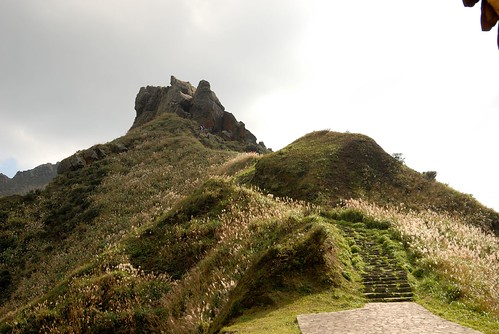 (吃到打嗝的愛愛看起來又活力充沛了)  怎耐最後最後的攻頂得靠繩索攀爬 且一旁立著一張大剌剌的警示牌 向來走保守安全路線的徹家毫不遲疑的就此結束我們今日的茶壺山健走  帶著愉快的心情 我們打道回家嚕~  而下山時候 一路由上往下看過去的芒浪又是不一樣的風情了 這真是一趟太棒了的金瓜石茶壺山秋芒之行阿~~~  後記: 今日拍的芒草果然有三張入選徹家明年的桌曆 作業趕交成功!
