金瓜石 是台北地區難得會讓我放在心裡 一直想去的地方 只是一沒留意 距離上次到金瓜石竟然已是四年前的事了(嚇! 好個最近的地方最遙遠阿) 每一次到金瓜石都會有種"又不一樣了"的感覺 因為越多的建物與歷史被修復與保留著 也當然益發是個熱鬧的觀光景點 但所幸金瓜石還依然有著我所喜歡的淳樸與靜謐 尤其穿梭在小巷與老街中...  

順道先回味一下徹愛的金瓜石回憶 愛兩歲半 黃金神社野餐 [blog.yam.com/hmchen1975/article/14399082](http://blog.yam.com/hmchen1975/article/14399082) 愛一歲 賞芒 [blog.yam.com/hmchen1975/article/6701140](http://blog.yam.com/hmchen1975/article/6701140) 哇~ 愛愛還好小好可愛阿~  真是懷念的日子 不過真是欣慰徹愛現在已經能揹起包包跟著我們上山下海了  我們應該真算熬出頭了!

我們一如以往的每次 從金水公路上金瓜石 途中經過的黃金瀑布因連著一個月的雨而顯得豐沛與美麗 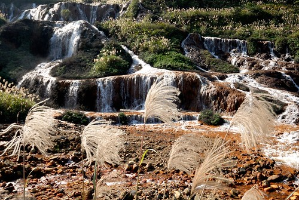 同時 我們在這便看見茶壺山的滿壺芒草 加上今天的藍天白雲好天氣 以及天邊美麗的大海  可以預見今天會是個美好郊遊日阿  想著上次來的時候愛愛還好小 應該完全沒有對金瓜石的印象 也因此我才安排了從黃金園區開始的 最精華但最累的一條賞芒路線  園區內的四連棟依然生氣勃勃的佇立著 而房子後方屋瓦上的青苔也見證著另一段歲月的累積 很是喜歡這一幕的感覺 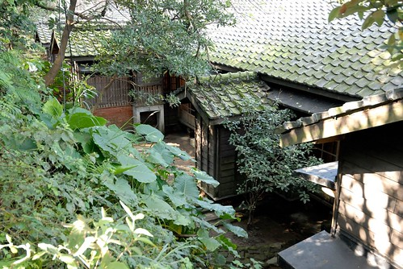 除了既有的繼續努力保存著外 園內也多了好些我們未曾見過的"新"舊樓 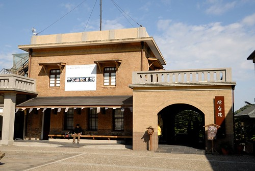 一棟棟舊建物的修復整理與開放 讓我們對於這個淘金小鎮有更深的回顧與了解  而了解更多 走在巷弄間也更能想見曾經的風華 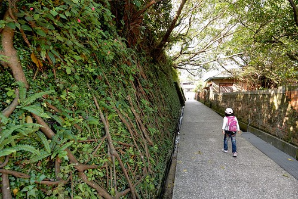 不過我喜歡現在這個寧靜的金瓜石  循著石階 我們怡然散步往黃金博物館的路上  第一次正式開始認識 累積金瓜石回憶的愛愛 看到園內的景物都很感新鮮  抱著她的美樂娃娃橫衝直撞(其實很久沒玩美樂了 純粹聽哥哥講而帶隻娃來複製過去)  原來興沖沖要去看萬兩黃金的我們 看到黃金博物館旁可愛的賣豆花攤 吃碗冰豆花解涼先  愛愛指定要坐老闆娘工作臺前面的位子 想不到吃豆花也有吧檯位子 多了跟老闆娘間的互動 挺不錯的 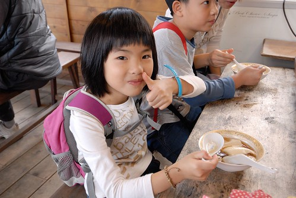 對於黃金博物館 阿徹還有印象 不過還是很期待來摸黃金  摸摸黃金 沾沾貴氣 徹愛便也開心! 果然是小學生阿!  不知不覺我們就在黃金園區內晃蕩一小時  接著只好快馬加鞭往茶壺山的賞芒行 從黃金博物館往勸濟堂方向的沿途 矗立著好些家別具風味或是顯眼的建物  或是茶館 或是民宿 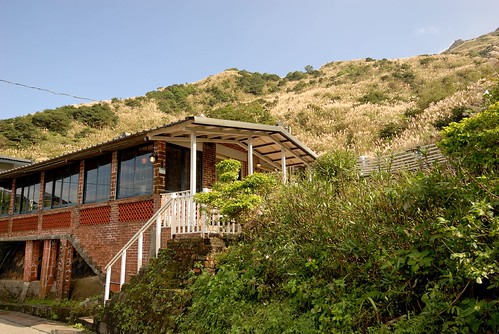 都很漂亮 但我心裡衷心的希望金瓜石不要變成下一個九份(話說我也10多年沒去過九份 也不知道九份現在的模樣) 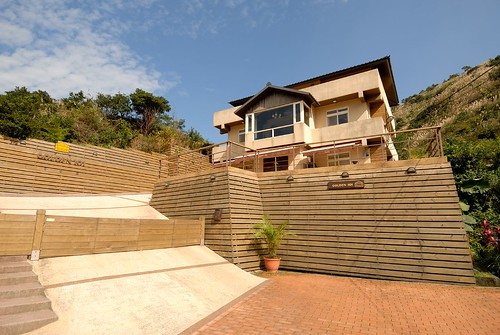

結束茶壺山的賞芒健行 下山時我們從勸濟堂旁接祈堂老街  這是我們第一次走進金瓜石的老街 雖然沒想像過 但真的會跟想像的不一樣  不過我很是喜歡這樣迂迴又安靜的階梯小徑  感覺好溫馨 好親近又好熱鬧的住宅圈阿 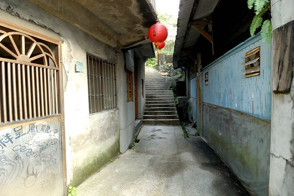 且當中還有小溪穿流而過  這...真是太有FU了  老街上也有些咖啡店  還保留著原建物的模樣挺得人心的 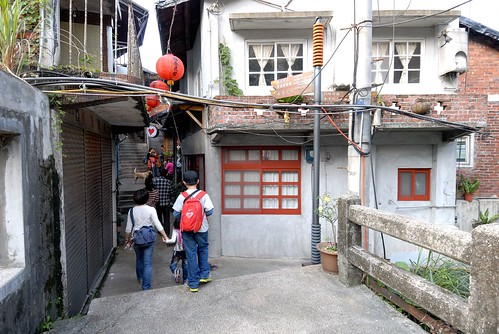 只可惜我們那一小時50元的停車費讓我們完全不敢再多逗留 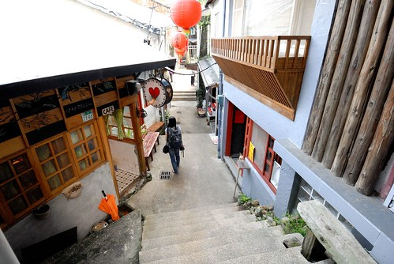 而老街上人氣最高的應該就屬這家阿嬤的柑仔店 阿嬤熱情的販賣著許多我們小時後的小零食與小玩意  一不小心就會讓人拎了滿手的零食點心喔~ (等著我在shopping的父女倆)  老街 樓梯高高低低 兩旁建物也新新舊舊  不算短的距離讓人有彷彿走在迷宮的感覺 只是不用擔心出口的方向  而沿路高掛的紅燈籠更增添另一種時空背景的想像  雖然我們的腳步趕著路 但我們還是不疾不徐的邊走邊吃著剛剛在阿嬤柑仔店買的小零嘴  然後在滿滿的回憶與滿足下 結束我們的金瓜石賞芒小旅行! 果然金瓜石每次都讓我回憶滿滿且越是喜歡她!

後記: 回程的路上順道去了頗有名氣的水湳國小 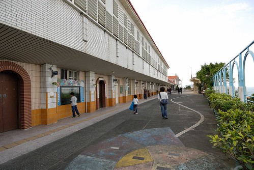 這次國小就真的跟我想像中有些不一樣了 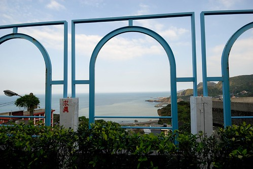 看海的視野沒那麼大方 而滑梯的所在也出乎我們意外的那麼不明亮 不過卻真的是個觀光地 好多爸媽帶小孩來溜滑梯 溜的不亦樂呼  雖然原本衝著來的滑梯有些令我們失望 但阿徹跟爸爸索性在籃球場打起球也還是愜意 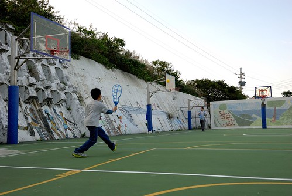 至於我跟愛愛 就更是愜意的納在一旁涼嚕~ 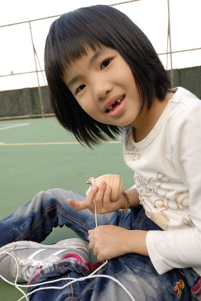
