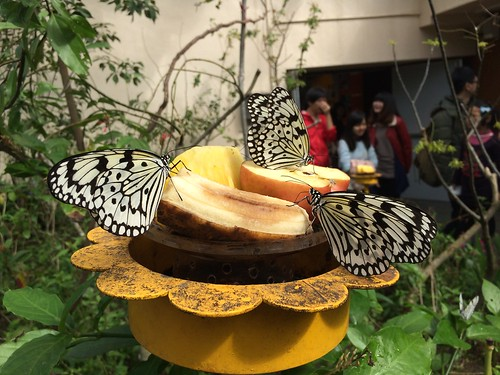
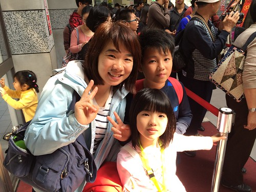
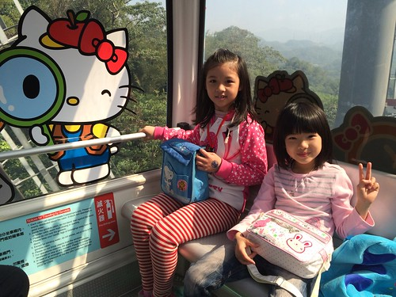
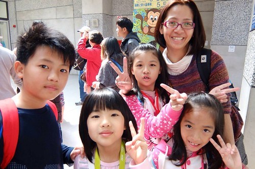
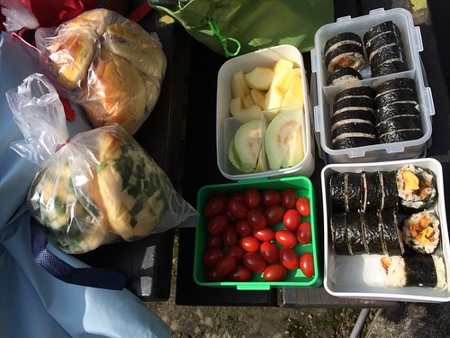
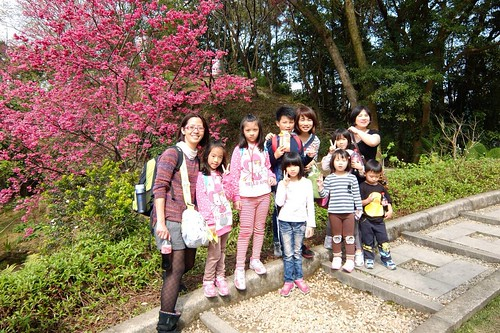
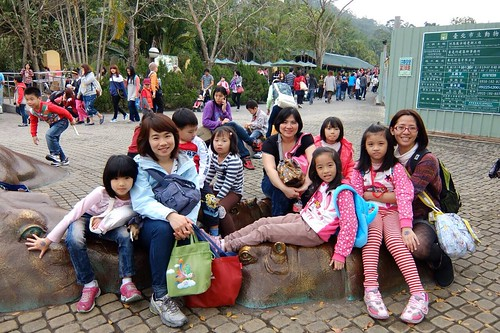
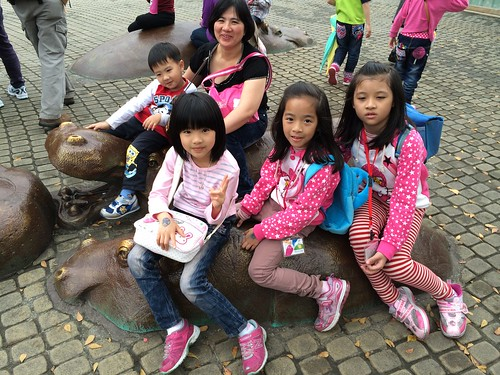
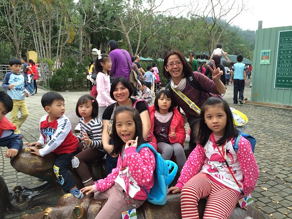
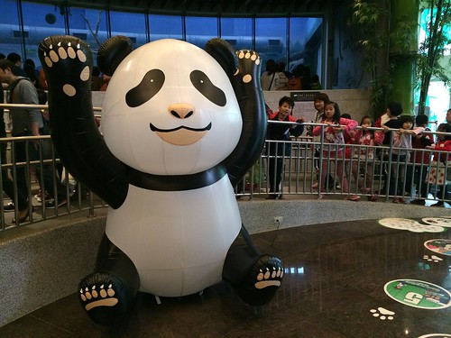

話說人到四十 雖然不惑但卻也容易善感 尤其對於親情與友情 看到玟姿阿姨的感嘆 那我就來催情 讓她在雪上加霜吧(錦上添花啦)! 繼去年暑假三個女人的午茶小約會  過年期間我們三個女人加七個小矮人來了場動物園貓纜小旅行 如燕華說的 她肯定是瘋了 才會自己一個人帶三個小孩去動物園 也如其他同學說 不理智的人才會趕搭流行與人潮去動物園看圓仔 而我說 偶而來瘋一下常保青春也是不錯滴~

首先 真的得先給燕華拍拍手 一個人帶著三個小孩從桃園搭火車到板橋 然後繼續轉搭其實搭蠻久的捷運到動物園 也難怪她一到動物園沒多久就開始喊著 好累 要休息! 而粗心的我們竟然忘了 她已經出門兩小時 站了兩小時  還如趕市集般的 趕著去看昆蟲  去看猴子 去搭貓纜 去看圓仔......  不過我相信這一天 我們一起搭貓纜到貓空野餐 一起親眼看到竟然還醒著的圓仔 肯定會讓三個大人+七個小孩的我們 永生難忘 因為小人的童年只有一次 圓仔的童年也只有一次....   那一天 天氣很好 是很好的郊遊日 搭貓纜日 而且我跟玟姿還有備而來的在前一天就先預約水晶覽車  同時Hollo Kitty車廂 也讓這些小女生們雀躍不已  最多容納5個人的水晶纜車 要如何分配我們10個人需要點心思 去程時 徹愛跟著玟姿阿姨還有玟姿小姪女們一起坐 玟姿拍下的這一幕很有趣 誰大膽誰膽小 一目了然 巧合的是 都是老大哥 老大姐一動也不敢動  我跟燕華一家子同車廂   這一家子也很有趣 媽媽的那一邊 緊張嚷嚷  但另一頭的大姐 老神在在  不算短的20分鐘 我們因為人多熱鬧而一下子就到站 剛下纜車的我們 立馬就被玟姿阿姨攔下這紀念性一刻  出站後 玟姿阿姨又忙著吆喝張羅小人們  後來 我才發現玟姿阿姨的小計劃大工程 要讓這七個小矮人排排站好 的確需要點手琬 ㄏㄏ..(大家手上的那瓶就是證據) 而從小班到小五的這七個小人 以30度斜率的線性關係呈現著 著實非常有趣  那一天也很幸運的 在貓纜的沿途看到底下的許多櫻花樹盛開著 到貓空站後 我們還在捷運站旁的櫻花樹不遠處席地野餐  簡單的壽司 麵包 水果 加上燕華玟姿大手筆加碼的飲料 茶葉蛋  大人小孩大滿足  櫻花+野餐 讓人開心and難忘的美好組合!  再回程搭貓纜前 七個小人們熱烈表達要跟玟姿阿姨同車 甚至很可愛的用黑白猜決定贏家 看到小人圍圈圈黑白猜的樣子 玟姿阿姨笑翻了 也得意翻了 玟姿阿姨這輩子從來沒有像這一刻這樣搶手過...... 這四位就是這場爭奪戰 最後的贏家!  回程貓纜我們只搭到動物園內站 沒想到還得搭園內接駁車才能到動物園區 這一等 大伙真的都累了...........  然後一群人拖著意興闌珊 連長頸鹿也懶得繞進去看的直往貓熊館前進    小人們嚷了一整天要看的貓熊 總算在晃了一整天後來到 隨著動線的前進  一個個都興奮不已 更神奇的是 我們竟然看到聽說一天只醒來一兩小時的圓仔是清醒的 看到活動亂跳 醒著的圓仔  我們說這一天的人來瘋 一切都值得了阿!!  看完圓仔也總算完成我們今日的不可能任務! 燕華媽媽這時候當然已經累慘了 但因小柏瑞問可以去合旻阿姨家嗎 於是一夥人再浩浩蕩蕩的回到板橋 來到合旻阿姨家遊戲 也在簡單的晚餐過後 我們三大七小的不可思議任務圓滿結束! 大成功!!!  我相信這次的經驗 應該會讓燕華以後更有勇氣帶著小孩 跟著兩個行動派的"好"同學出門涯給 而我們三個女人的約會也將更持續下去...

話說繼圓仔之後 三月初我又去看了壓根沒想過會去看的台北紙貓熊展 一樣的 這種熱血 又是因為玟姿而被啟動~ 
