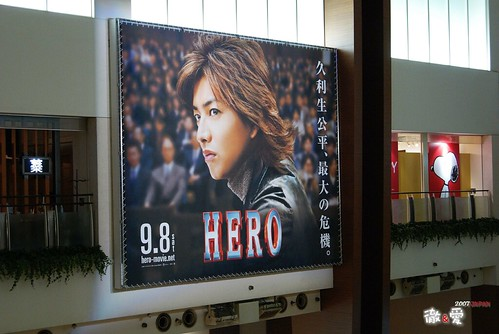

距離暑假的終極警探4  好久沒有跟徹爸去約會了~~~  
可是Hero要11月23才上映 跟徹爸兩人每天倒數著還有多久  
好不容易捱到上映了  偏偏又被一堆鳥工作纏身   
總算在上映後的一個禮拜 讓我們如願上了電影院看到久利生公平  
每個人的臉上都多了不少皺紋    
明顯的時間無情的在大家身上留下了痕跡 (真是好一個凡走過必留下痕跡阿)  
只是六年了  我跟徹爸都已經結婚還生了兩個頑皮鬼了  
還能再看到原班人馬的演出 甚至一樣的配樂  一樣的劇情鋪陳方式 一樣的淡淡幽默搞笑  
心頭真的有股莫名的感動與振奮  
看電影的時候 徹爸頻問我"笑小聲一點 有這麼好笑嗎"  
哈哈~不知道耶   
就覺得這樣的小品電影很適合素愛清淡口味電影的我  尤其適合這陣子需要放鬆的心情  
不過看完電影後突然有種落寞感  沒了個期待的東西了...  
倒是徹爸看完後很振奮 (還在回家的路上就聽起電影原聲帶)  
他說這個社會就是需要像久利生公平這樣的人阿  
  
雨宮有幾句話這麼形容久利生  
"雖然他很\*\*\*(麻煩的樣子).....但是他很誠實 不放棄任何事情...."  
這不就是我最期待孩子具備的特質嗎  "誠 實與堅持"  
這戲又更讓我愛到心坎裏了  
希望有朝一日我們家也能出個久利生公平  呵呵~~  
  
11年了還能跟徹爸這樣手牽手(應該有吧)一起去看部兩人都喜歡的電影  
一起回家窩在溫暖的被窩裏  一起天外飛來一筆的去吃四點的涮涮鍋晚餐  
這是今天下午最大的感動與幸福阿~~~  
  
(這是8月底去日本時徹爸在台場裏拍的  我總算等到可以貼這張照片的時候了  
  這應該才是這篇文的最大目的  哈哈~~ )  
  

