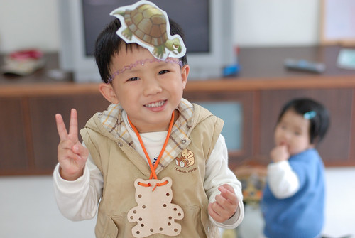
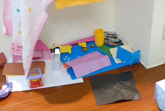
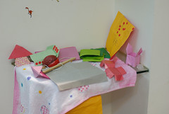
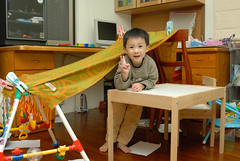
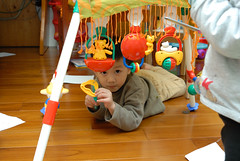

雖然阿徹是個有點愛生氣的小孩  
但卻也是個天兵天將   
一大堆令人發笑的小噱頭  
學校乖寶寶星星換的頭飾小禮物  
加上要媽媽從雜誌上剪下的烏龜圖案  
喜孜孜的套在頭上當美人魚  
  
  

媽媽抵死不買芭比娃娃玩具  
只好請媽媽爸爸用色紙摺一些躺椅 椅子 鋼琴 床...  
佈置阿徹自己的芭比家  
這是芭比家的一樓 有電視 沙發跟鋼琴的客廳 跟有鍋碗瓢盆的廚房  
  
  
這是芭比家的二樓是睡覺的房間 有床 檯燈 還有洗澡的澡盆  
  
  
一堆大人看起來像是垃圾的東西 阿徹竟也玩的不亦樂呼  
還曾經開心 期待的帶去學校寶貝日與同學一起分享  
  
最近美語主題課程是"Outdoors"  
阿徹常問我"where are you going"  
"I am going camping~"  
還說"I like camping"  
而這就是阿徹搭的帳棚 他camping的地方  
  

