有人說旅行的美好不在於去了哪裡 吃了什麼 而是跟誰一起做了什麼事 過年的時後在人滿為患的台中大坑紙鄉王餐廳時 我跟同行的玟姿說"真是難為你來這排隊&人擠人了"  玟姿說"因為你們 才會做這樣的事" 呵呵 是阿~ 就是因為老同學 因為一大夥的大大小小 所以才一起在那人擠人...

過年期間 相信全台不論那 都是人潮為患 當我跟玟姿討論著要跟燕華一家子約在台中哪見面時  我問哪個餐廳比較好訂 玟姿說都難訂 反正就是他早早去排隊預約就好 好吧! 既然反正都難訂 都要排隊 那就去我一直還蠻想去窺見一番的大坑紙鄉王吧

初五好天氣的大藍天襯的紙鄉王裡的一草一物更是突顯美麗 只是人潮果真不是蓋的多  不得不讚嘆台灣主題餐廳之蓬勃發展 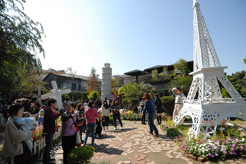 不過幸好我們還能有空間 有心情跟園中景物照相 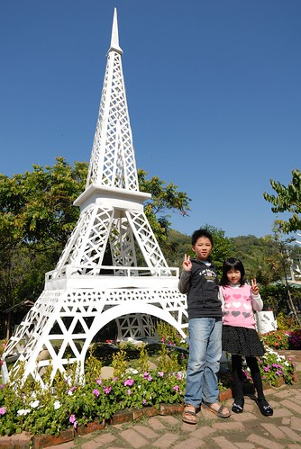 以紙為元素做成的各式小物 大物 讓徹愛看的嘖嘖稱奇  好想在家裡也複製這樣大中小的羊妹妹 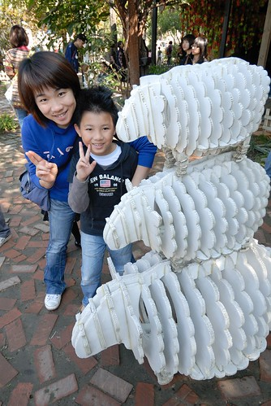 紀念品部裡販售的各式紙製品也讓人忍不住摸摸看 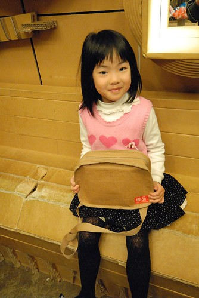 戴戴看  可以的話 就如阿徹說的好想把所有東西買回家阿... 幸好後來的遊客多到讓人忘了買東西這件事 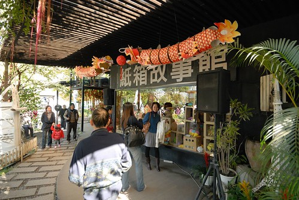 跟小妹出門 當然得多利用她來幫我們照幾張全家福 巴黎鐵塔前 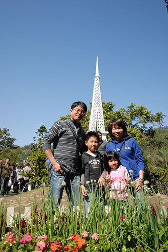 荷蘭風車前  比薩斜塔前   好像我們周遊列國一翻了 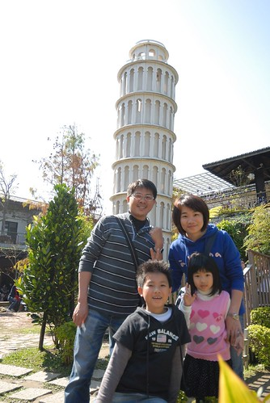 同時間燕華一大家子到達 再來個大合照 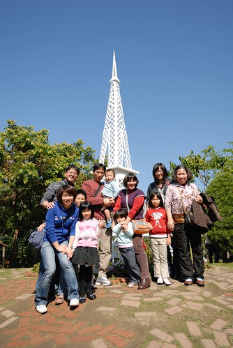 多虧玟姿一大早辛勤來現場排隊 讓我們得已準時中午12點進餐廳吃中餐 一家子舉杯答謝 慶祝 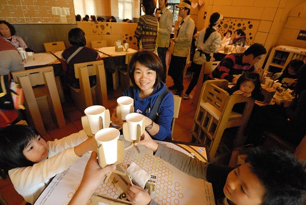 紙鄉王餐廳內的桌椅以及每個餐具都是紙製品 除了喝水的紙高腳杯(其實不是太好用說) 小紙箱外型的飲料也讓我們大開眼界 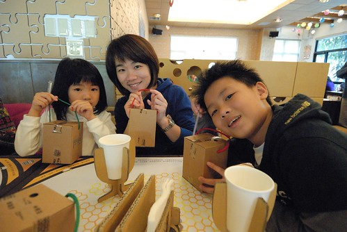 提著一個箱子喝東西 感覺挺酷的 而這些紙箱當然都被徹愛提回家 成為他們家家酒遊戲的傢俬 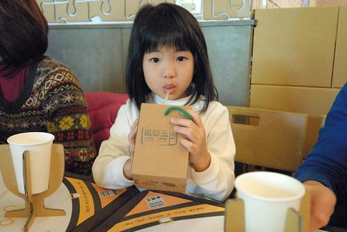 而雖然園外人聲鼎沸 幸好餐廳內的用餐品質還不錯  不論是餐點內容與價格 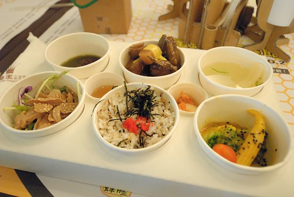 當中可愛又營養的兒童餐讓徹愛超級滿意 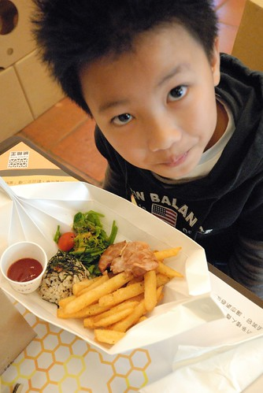 這樣的餐點肯定會讓小人開心的把東西吃光光 還很小氣的不准你偷吃... 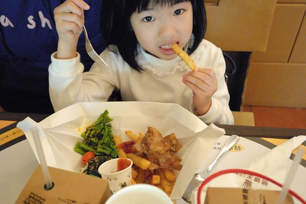 飯後 讓徹愛去做答應了他們的DIY 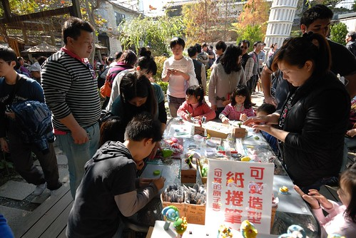 紙黏土捏塑的造型筆  對於徹愛來講不是難事  靜靜的照著老師的指示做每個步驟 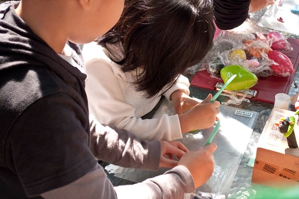 阿徹的成品 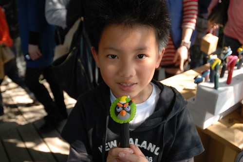 愛愛的  等徹愛的DIY完成  大夥對於園裡人潮的忍受度也到極限了  該是轉移陣地換個清靜點的地方了 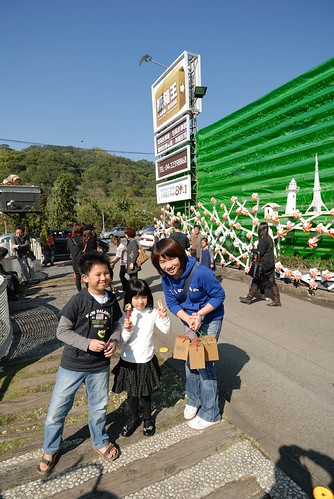 謝謝玟姿跟燕華 大夥不辭辛勞的半年一聚 讓我的紙箱王別具意義 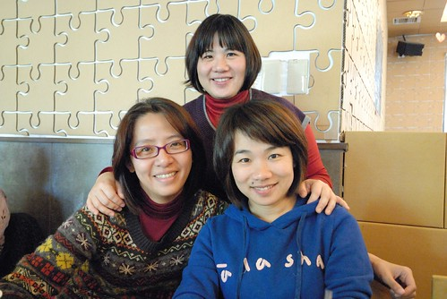 離開大坑前 忍不住去聽說很有名的東東芋圓朝聖一下 哇~ 那個人潮又再次讓我忍不住讚歎這就是台灣經濟的實力阿  即使站著 窩著也要吃... 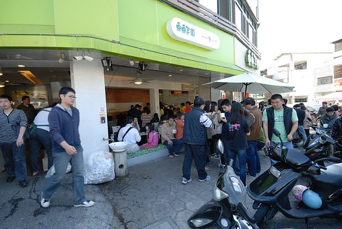 不過新鮮的芋圓真的很好吃 不枉得費盡辛苦的等位子 等芋圓 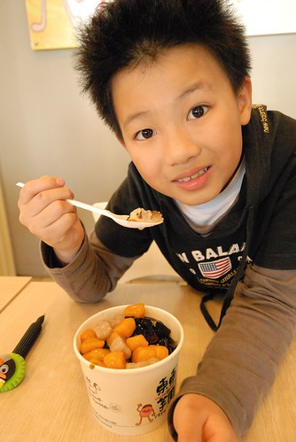 同時間 回台中娘家的素真也在準備回台北前被我們臨時call來了 可以算是四個大學同學的小型同學會  離開大坑  遠離人潮與車潮  玟姿接著帶我們去台中都會公園 她說這樣空曠的地方才比較適合我們阿!  小人玩球 奔跑 吹泡泡 不亦樂乎  同時盡情享用冬日陽光 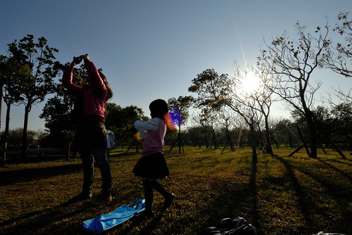 其實老同學沒有聊很多 很多的時後就只是靜靜的看著小孩玩著 但這是我們的共同回憶~ 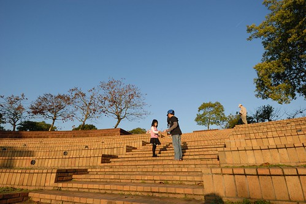 離開台中前 再跟著玟姿一起去有名的百元快炒店吃晚餐 天阿~ 這會不會太大盤的百元快炒 而我們五個人竟然嗑掉這樣六七盤 不過今日台中行大成功 YA!  期待下次再跟著玟姿阿姨去吃香喝辣 
