七月底順回嘉義之路 我們來到唸了不少年的鹿港小鎮 我與徹爸對鹿港的印象都停留在近二十年前念大學的時候 曾幾何時 鹿港早不是模糊記憶中的模樣 熱鬧的讓人意外 不過熱鬧之餘 還保留著的建築文物與歷史還是令我們嘖嘖稱奇 是趟挺不錯的小學生社會課之戶外觀摩~

我們的第一站先是鎖定鹿港民俗文物館 一來對於這保留完整的辜家舊宅很感興趣  再來是我想這是好好認識鹿港的一個好起點 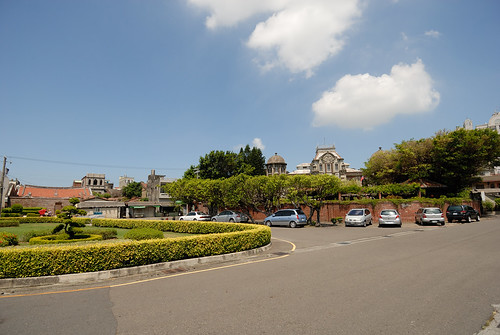 從最熱鬧的中山路 轉進小巷後才能抵達的文物館 讓我們在剛轉進小巷子時 很疑惑小巷小路的盡頭還能有什麼 沒想到小巷到底卻是豁然一片的開朗 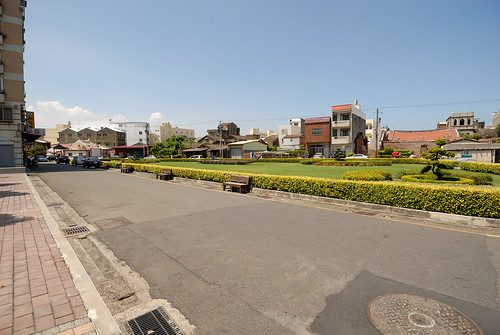 除了文物館的建築顯眼 這倘大停車場也大出意外 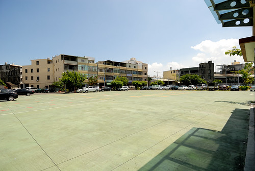 財團法人私立經營的鹿港民俗文物館入內需買門票 不是太親民但在可接受價格 而且若有好品質 使用者付費是應該的 (超小的售票窗口) 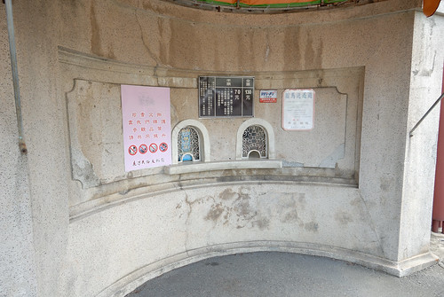 買票進入後 看到眼前這視野就覺得不枉了 [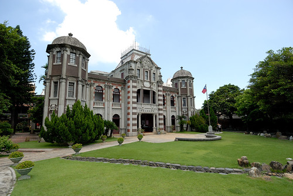](http://flickr.com/photos/33703965@N00/14726435147) 被童玩吸引的阿徹也對眼前的美麗建築嘖嘖稱奇 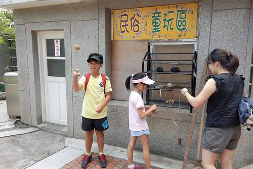 我們嘗試著要踩高蹺 還真的不簡單 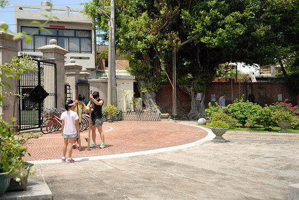 我們沿著前院的庭園水池散步著 欣賞著巴洛克大宅的宏麗氣派 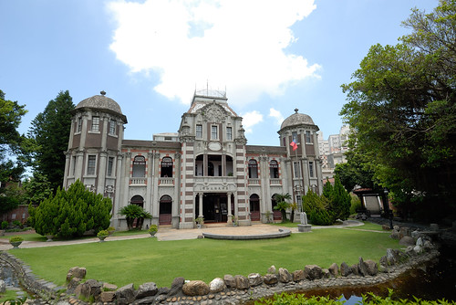 然後進入展示館內參觀 從清朝至民初的許多食衣住行文物的收藏 當中兩百年前的鹿港立體模型地圖最是引起我們討論 對照牆上所掛舊照片 更助我們遙想前人的社會與生活 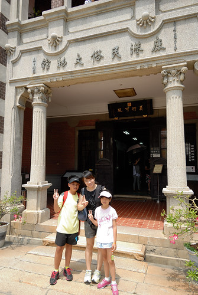 展示廳內是禁止拍照的 不過建築物仍可拍 迴廊式的中空庭園讓我們第一個連想到 住在這的小孩玩起捉迷藏一定很過癮 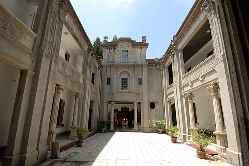 文物館在保存古蹟下維護的很好  每個角落都很有意境 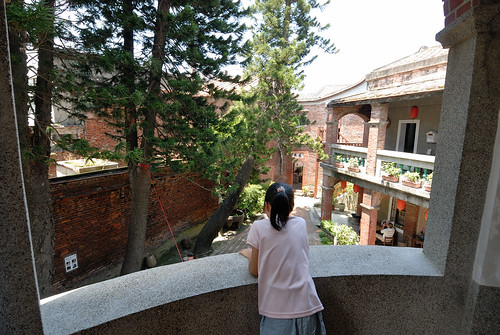 站在二樓陽台處 更有點時空回到以前的懷古悠情  而且不論走在房子內 屋簷下都覺得很涼爽 舒適 [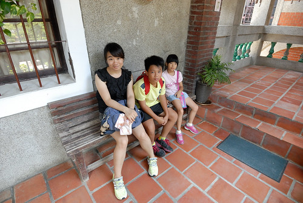](http://flickr.com/photos/33703965@N00/14726372619) 我們仔細的拜訪館內每一區域與文物  小學生與我們的討論互動讓阿母小小欣慰 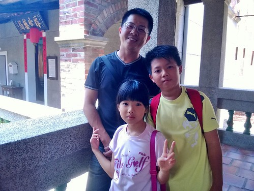 逛完園內前半的巴洛克風洋樓 [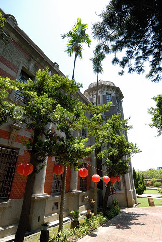](http://flickr.com/photos/33703965@N00/14909973831) 後頭的百年歷史閩南建築也是很有看頭 [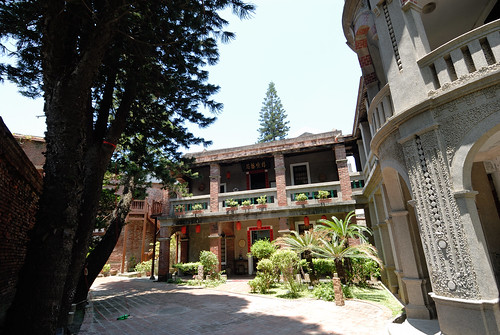](http://flickr.com/photos/33703965@N00/14909979701) 只是古風樓內的狹長走道與幾可擬真的模擬人具讓膽小的徹哥最後是矇著眼草草走完 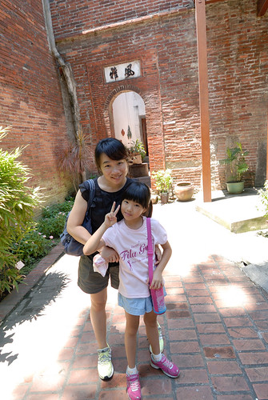 參觀完館內 剛好不用排隊可以玩遊戲 (看過就忘了這叫什麼) 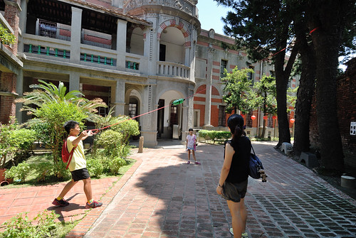 看別人拉以為很簡單 沒想到自己拉的時後才發現也是得有兩三下才行 而果然我們家的徹爸也是很厲害的 不費吹灰之力就拉到底嚕  徹愛二人則是偷作弊  左右開弓一人一邊 當然就拉高高了 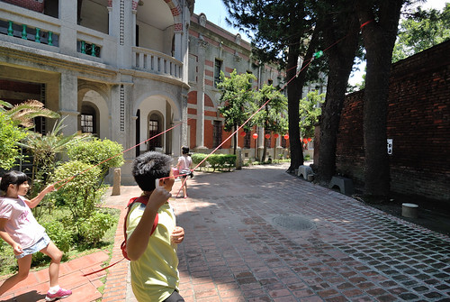大門口的榕樹下也綁了兩座盪鞦韆 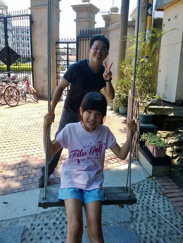 只是徹愛盪公園鞦韆的好本事在這一點也派不上用場 [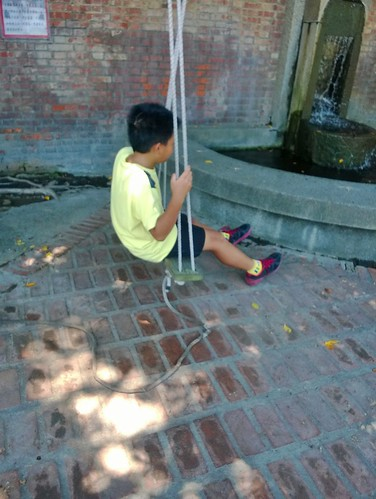](http://flickr.com/photos/33703965@N00/14888899716) 所以醉翁之意不能在高 只能在盪 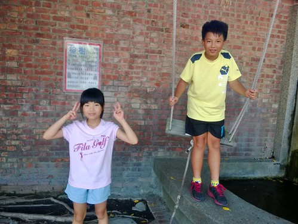 我們在文物館停留近二小時到中午時分 然後要到第一市場吃中餐 經售票員指點  我們從文物館旁的丁家大宅穿過就可到達中山路 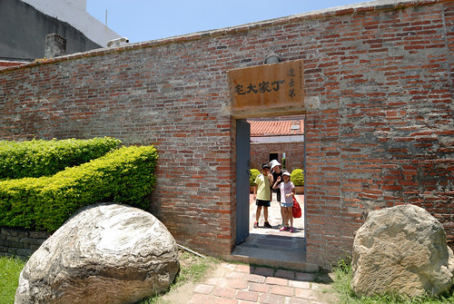 丁家大宅好深好深  從房子的那端走到彼端就要三五分鐘 而且神奇的是穿過丁家大宅就真的來到熱鬧許多的中山路上 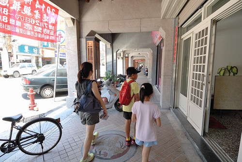 向來對老街有些敏感的我們 對於鹿港的"老"很欣賞 在商業發展,時代進步之下 還能不過份矯飾的保留該老的地方 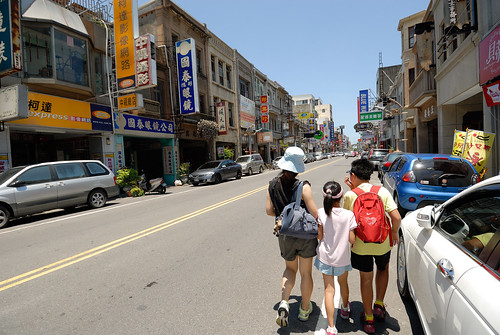 看網路得知第一市場藏著不少美食 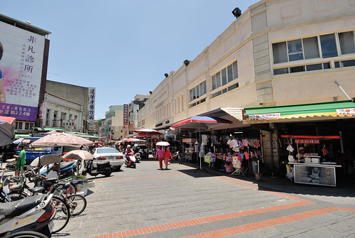 我們循著線索吃了魷魚羹麵  傳統粉條粉棵冰 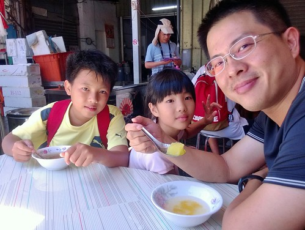 填得肚子不餓後 開始我們的老街巡禮 老實講 很多地方的觀光地圖真的好難看懂阿(我承認我也真的不太會看地圖) 所幸靠著徹爸手機的google map 都能走到要去的地方 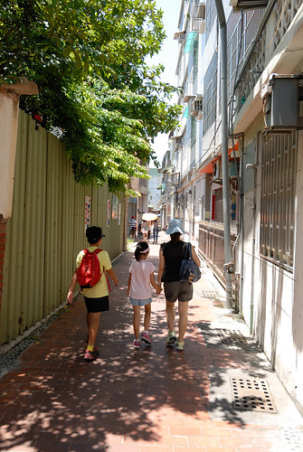 還一頭霧水的我們 不知不覺來到熱鬧的老街 [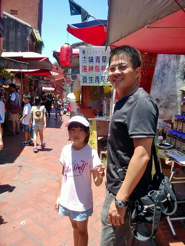](http://flickr.com/photos/33703965@N00/14725222580) 本有些擔心鹿港老街會不會就像全台各地八九不離十相像的老街模樣 所幸鹿港老街裡還真保留著古蹟 [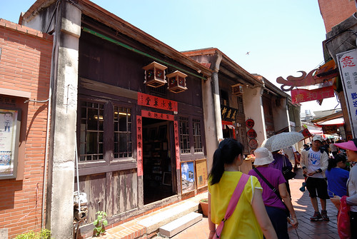](http://flickr.com/photos/33703965@N00/14726462058) 連小學生都能說典故的半口井 [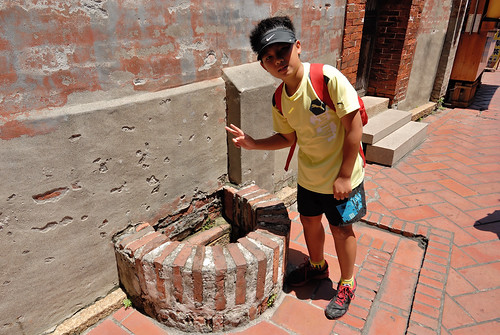](http://flickr.com/photos/33703965@N00/14913055165) 好多風韻猶存的美麗古建物 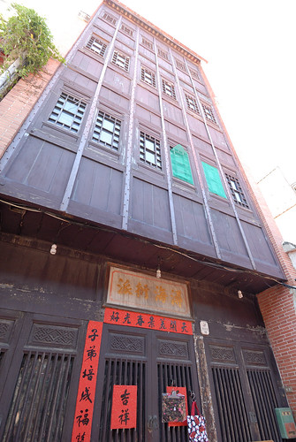 且最令我們驚奇的是這些古蹟不只只是各式商號店家 長長房子的後頭還可窺見有人還住著的生活面 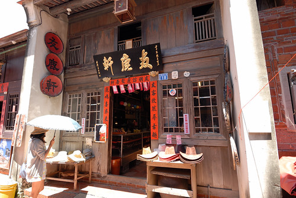 我們也來到君子巷 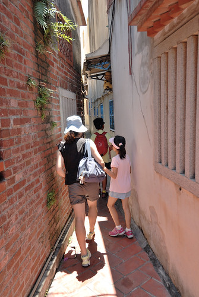 摹擬非君子的摸乳醜行 [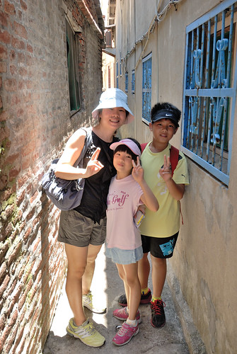](http://flickr.com/photos/33703965@N00/14910009101) 而除了古蹟 衡錯交差著的許多小巷 雖然或新或舊 也都別有一番迷人氛圍 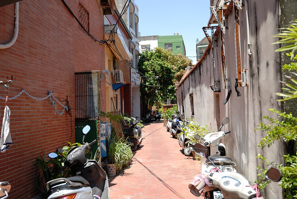 老街上除了當地農特產的販賣 也很多的個性或文創小攤子 這個吸管達人最是吸引我們一家子的好奇與駐足 尤其那幾可亂真的毛毛蟲 讓我們不小心就掏出皮包多帶了好些紀念品 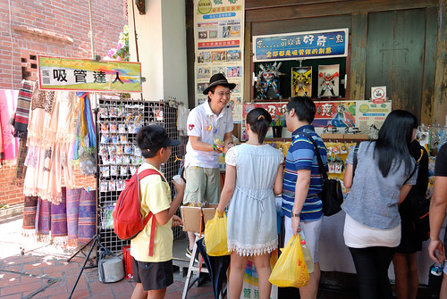 越往馬祖廟的方向走 越是熱鬧與擁擠 乾隆皇敕建的新祖宮 我們雙手和十誠心誠意一拜 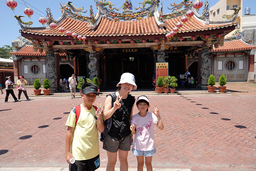 正港的天後宮 豔陽與人潮讓我們僅遠在大門口到此一遊照 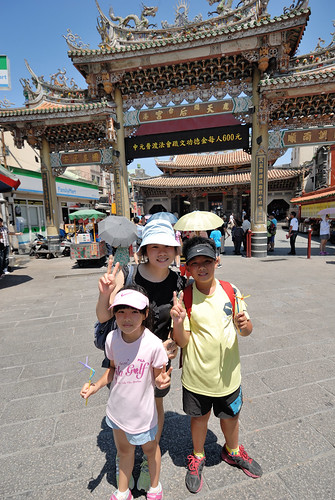 我們沒想到天后宮這的商圈原來才是最繁華最熱鬧 [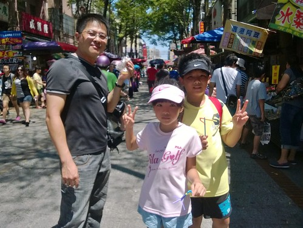](http://flickr.com/photos/33703965@N00/14725246059) 跟早上民俗文物館那的古樸寧靜完全不同  更是慶幸我們今日的鹿港行是從文物館開始的 到此我們也結束我們今日的鹿港小鎮巡禮! 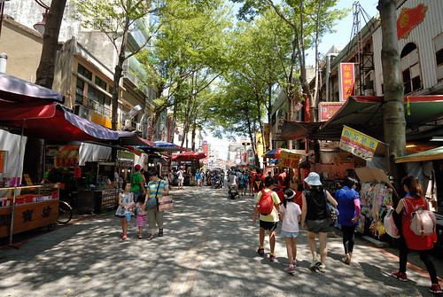 離開鹿港 我們接著來到耳聞許久的彰濱工業區內的玻璃博物館 嗚嗚嗚~~~ 完全沒想到也難以接受  怎麼跟網路上看到的都不一樣 活脫就像是個大鐵皮屋裡 冷氣還很不涼的大商展  真的太太太Orz 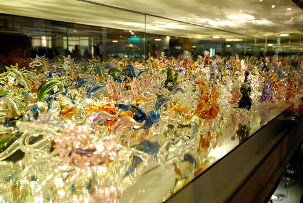 我們停留十多分鐘就想離開 而這一來也打亂我原先的計劃 原以為玻璃博物館值得停留參觀一二個小時 剛好銜接到四點去王功漁港 這下亂了計劃也壞了繼續彰化行的興致 只好提早收工打道回嘉義了 不過很久沒來鹿港  真的挺不錯的小鎮小旅行~ (離開彰濱工業區前  第一次這麼近距離看風力發電機 好壯觀阿~~~) 
