這個暑假 我們一反以往的 比較耐熱也比較努力當孝子爸媽 認真的每週末帶小學生去戶外教學 習慣汗如雨下的酷夏後 其實夏天也可以是旅遊天的嘛~ 小旅行 小感動 只是也容易擱著就忘了... 打鐵趁熱 烙印下徹愛走過的足跡

徹爸去宜蘭喝喜酒的那個週六 我們為了避塞車一早七點多便起床出門 沒想到暑假週末的北宜高還是恐怖的嚇人 讓我們花了兩個半小時才抵達 來不及讓徹爸在喝喜酒前跟我們一起到傳藝中心玩一會 於是臨時起意轉進五峰旗瀑布 上山尋水

 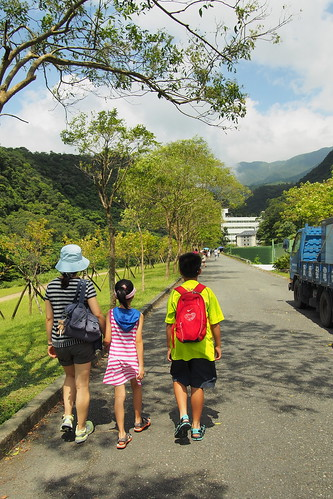 沒來過這 我們意外於這裡的清爽與美麗(雖然人也不少)[ 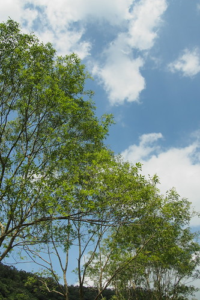](http://flickr.com/photos/33703965@N00/14635248196)沒有預料要走步道的兄妹倆 一開始的臉很不笑(兩人堅持沒有苦 只是不想笑 哈) [ 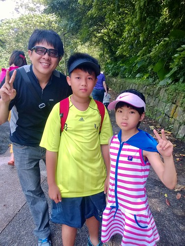](http://flickr.com/photos/33703965@N00/14655003331)可是在看到沿途可戲水的溪流後 兄妹倆的興致總算上來 [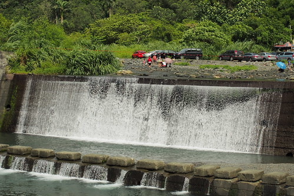](http://flickr.com/photos/33703965@N00/14471556850)一看到可以戲水的瀑布 徹愛立馬拖了鞋子 下水去 [ 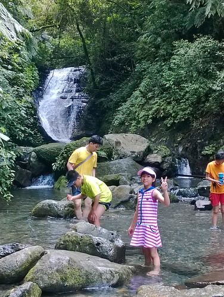](http://flickr.com/photos/33703965@N00/14635259706)徹哥把褲子撩高高 [ 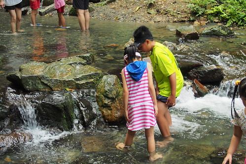](http://flickr.com/photos/33703965@N00/14471566600)領著愛妹往深處探險 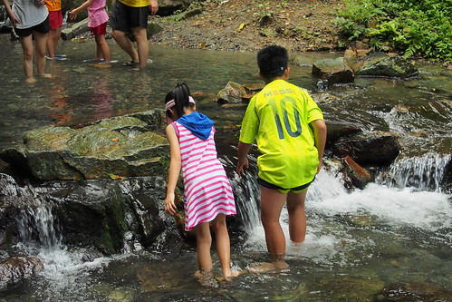 踏進冰涼的溪水裡 兄妹倆笑顏全開 [ 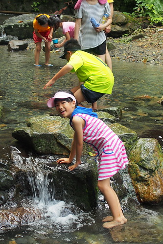](http://flickr.com/photos/33703965@N00/14471613759)我跟徹爸一如平常的 坐在遠處看著兄妹倆的開心 [ 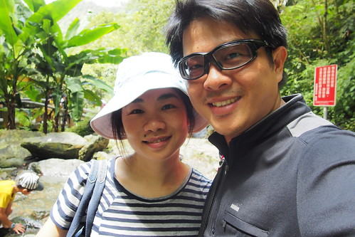](http://flickr.com/photos/33703965@N00/14655926744)我們說難怪國道五每個假期都塞 宜蘭可上山下海 還有人文與美食 真是台北人最佳旅遊去處! 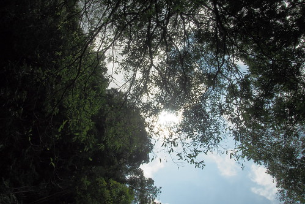 (倆老無聊 相機拍起落花流水) [ 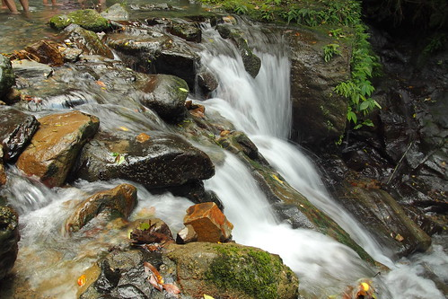](http://flickr.com/photos/33703965@N00/14658258895)五峰旗步道人潮絡繹不絕 像螞蟻一樣的陣列讓我們覺得有那麼點誇張 不過也不難想像 畢竟有山有水有涼的地方是大家都愛的 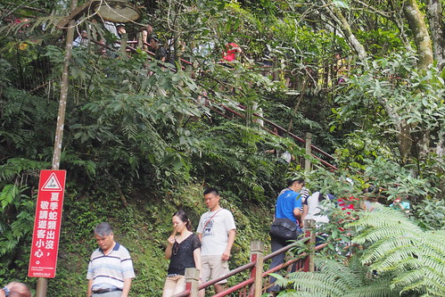 讓徹愛在第三瀑布下泡了半小時的涼水後 我們繼續往上頭的第二瀑布前進 [ 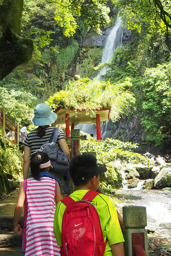](http://flickr.com/photos/33703965@N00/14655051621)瀑布小涼小美 只是我們的醉翁之意並不在瀑布 [ 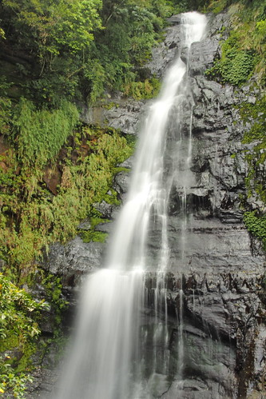](http://flickr.com/photos/33703965@N00/14471641909)純粹的利用徹爸喝喜酒前的空檔 一家子難得地親山親水 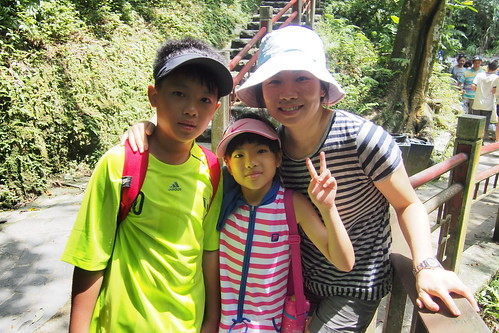 戲水開心的兄妹 讓我們一家子連帶興奮起來 沿途的小花小蟲也跟著鮮明有趣 不斷蹦出來 [ 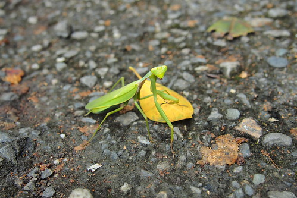](http://flickr.com/photos/33703965@N00/14471643649)雖然近中午 但回程的路走起來格外輕鬆愜意 [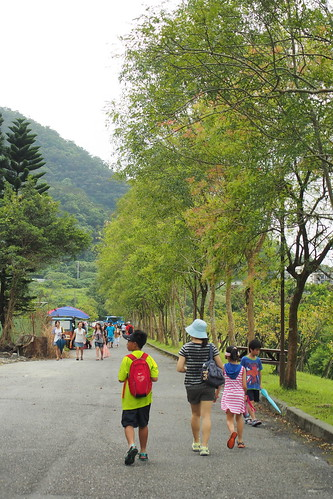](http://flickr.com/photos/33703965@N00/14657911452)

離開五峰旗後 徹爸載我們到傳藝中心 然後獨自一人去羅東喝喜酒 上一次我們來傳藝中心時 愛愛還是個嬰兒 而阿徹當然也還年紀小 記憶不可考 不過徹哥上幼稚園期間道是來了幾回 [ 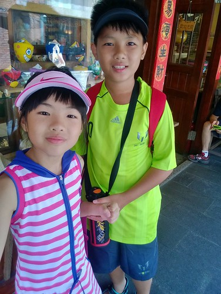](http://flickr.com/photos/33703965@N00/14471654829)我們先是到展示館看台灣傳統工藝展  包含金 錫 銀 鑼等的民俗工藝讓我們大開眼界 而且小學生真的長大了 不再只是走馬看花 而是一起慢慢走 慢慢看  慢慢駐足欣賞 步出展示館時三個人還訝異著 我們第一次花這麼久時間 看展這麼仔細 (話說只有一個爸媽在時 小人都格外乖巧 ) 然後我遵守讓愛愛吃泡麵的約定 找seven吃泡麵 [ 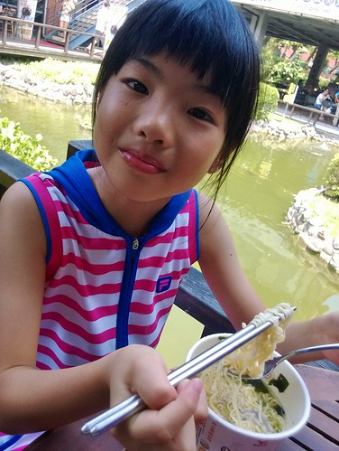](http://flickr.com/photos/33703965@N00/14635313456)解決了中餐 我們開始在傳藝中心逛大街 [ 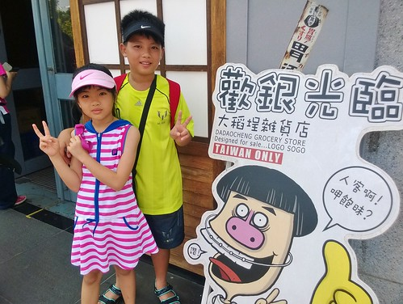](http://flickr.com/photos/33703965@N00/14658287725)逛柑仔店  讓徹愛做排灣族琉璃珠DIY 哥哥選了代表勇者無懼的黑色琉璃珠 希望自己有勇敢就可以克服 面對一切 [ 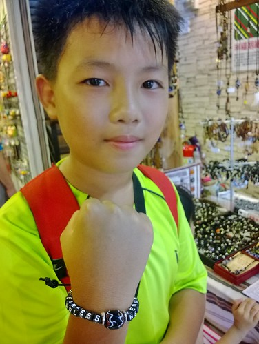](http://flickr.com/photos/33703965@N00/14655072511)而愛愛則是做祈福又幸福的貓頭鷹手環 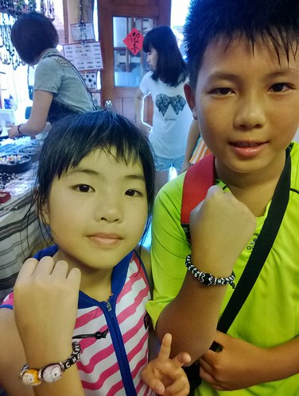 放慢腳步 傳藝中心內有趣的東西還真是不少 [ 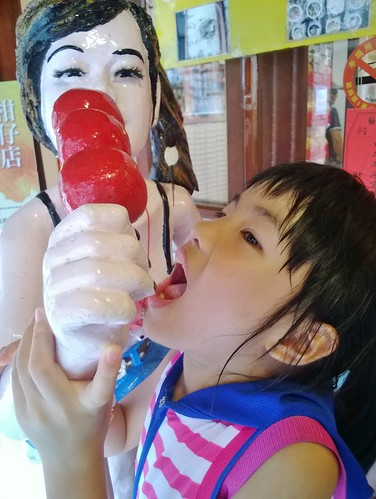](http://flickr.com/photos/33703965@N00/14471682548)整體維護跟氛圍都蠻不錯 [ 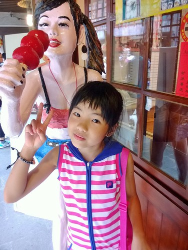](http://flickr.com/photos/33703965@N00/14658176135)雖然街頭表演沒法每個都參與也難卡到好位 但熱鬧氣氛已夠讓徹愛High [ 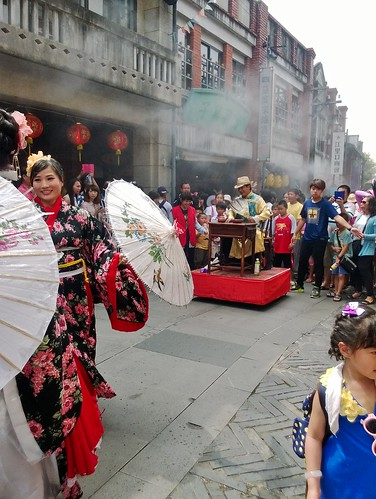](http://flickr.com/photos/33703965@N00/14471871487) [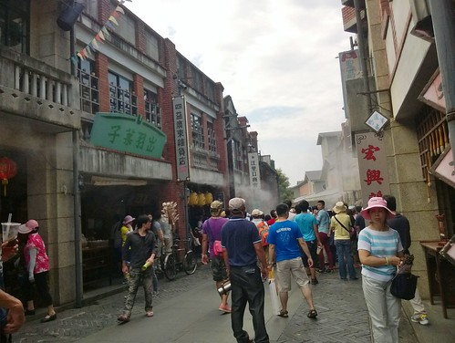](http://flickr.com/photos/33703965@N00/14471664059) [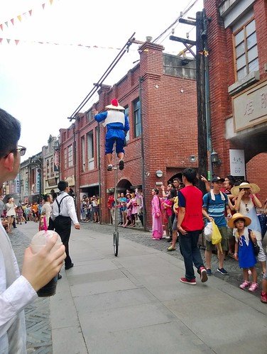](http://flickr.com/photos/33703965@N00/14471622190)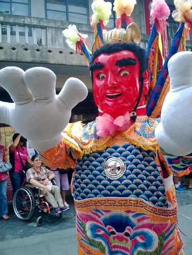 還讓徹愛買了傳統棉花糖跟麥牙糖吃 [ 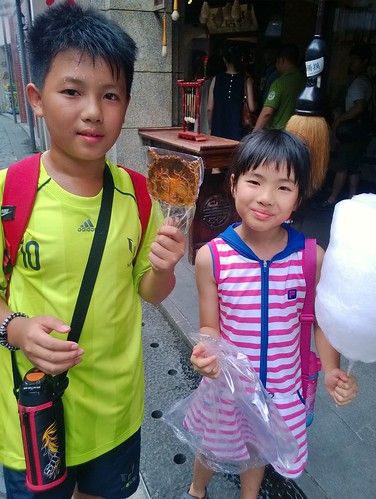](http://flickr.com/photos/33703965@N00/14471626530)好久沒吃棉花糖的愛愛吃得手黏心甜 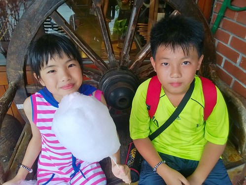 雖然好吃好玩 但也真的熱的讓人猛灌水 高溫 是暑假戶外教學的最大挑戰阿! 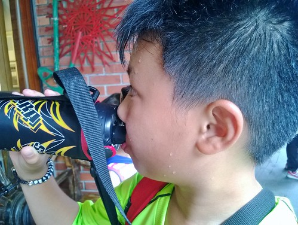 雖然我們停留傳藝中心的時間只有短短四~五小時 但我們逛了許多店 [ 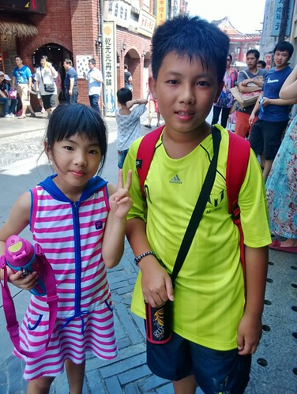](http://flickr.com/photos/33703965@N00/14655074311)看了許多展 [ 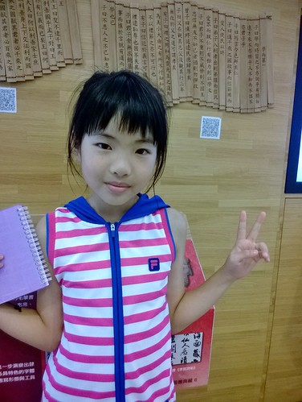](http://flickr.com/photos/33703965@N00/14678217783)還有看霹靂布袋戲3D劇場 [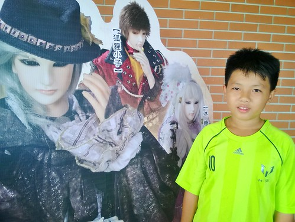](http://flickr.com/photos/33703965@N00/14678083103) (排隊等入場的兄妹倆 一樣的用遊戲打發時間)[ 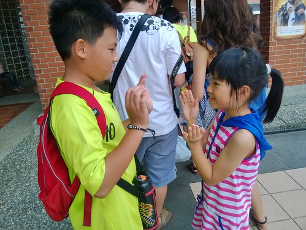](http://flickr.com/photos/33703965@N00/14471501170)(難得戴3D眼鏡 挺酷的兄妹倆)  [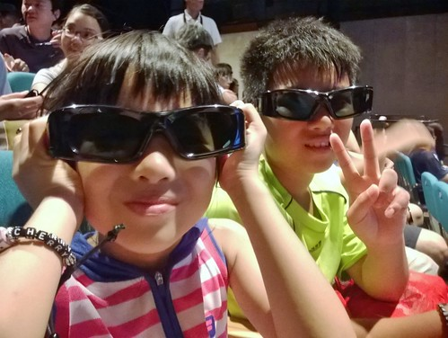](http://flickr.com/photos/33703965@N00/14657801962)雖然沒有爸爸在一起讓我們略有小小遺憾 但母子三人還是情不自禁給他玩的很開心 [ 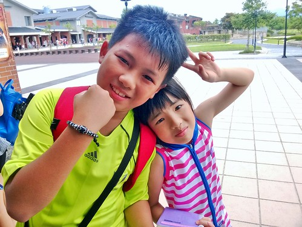](http://flickr.com/photos/33703965@N00/14471676979)小學生的暑假或許就該這樣很熱的玩 很努力的玩~~~ 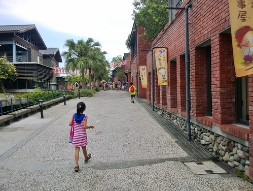
