好久 沒有陳家一大家子出門玩了... 屆不惑之年的三兄妹這幾年越來難聚在一起了 大家就像我記憶中40歲的陳爸陳媽 那樣忙碌於自己的工作與生活 廣告說"再忙 也要一起喝杯咖啡" 家人更是再忙也要偶而一起玩一場 尤其孩子們正超乎我們想像的長大中... 六月初 13個大大小小 最小6歲 最大64歲 我們一起鉛筆學校上學去!

 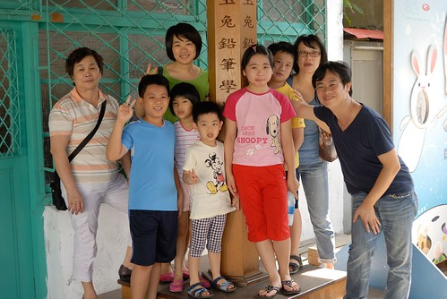 宜蘭的玉兔鉛筆工廠我們在兩年多前來過一次 ([blog.yam.com/hmchen1975/article/33426759](http://blog.yam.com/hmchen1975/article/33426759)) 那時覺得這裡是個很適合小學生來的好玩地方 也總想 如果家裡那幾個小學生可以一起來的話 肯定很有趣 只是這回真拉一大家子來這聽講 還真有點跌破眾兄弟的眼鏡(一大家子從沒這樣一起文青過) 尤其對於陳爸 陳媽來講 真是有點委屈她們陪著孫子來玩 幸好 陳爸陳媽似乎也上學上的有開心 尤其跟著孫子們一起認真 一起笑 真好~~~

今天的第一堂課是下課花路米的影片介紹 很久 很久 很久.. 沒坐過小學生課桌椅的陳媽好像有點興奮 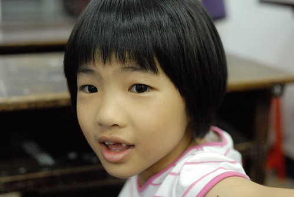 第二堂課是木材的堆疊 我們13個人 開了兩桌  相較於另一桌的老與小 我們這桌的動員力勝出 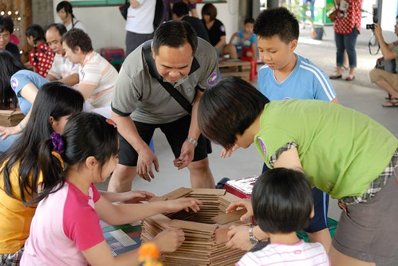 堆疊完成  小學生負起扛抬的重擔  一臉開心得意的模樣 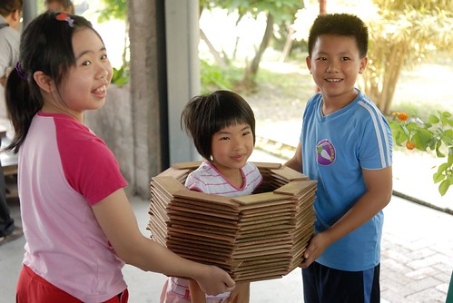 只是最後木材片的整理 大家稍微打混了些  第三堂課 工廠參觀(略) 第四堂課 鉛筆DIY    大家多麼認真的聽老師說明阿 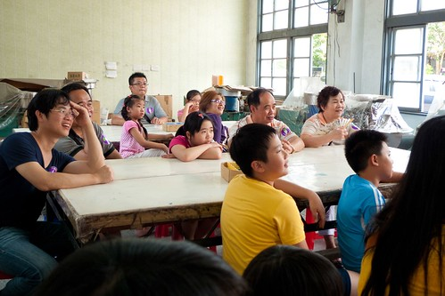 聽完講解 大家繼續認真的做著自己的三支筆 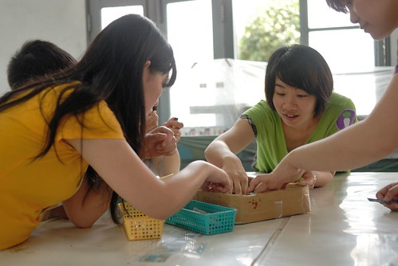 小學生們 當然不用我們擔心  每個人都文思泉湧的揮灑著  只是就有點苦了陳爸與陳媽 陳爸從一開始就埋頭苦幹 而陳媽在大家取笑她摸魚後 也認真了起來  從小學畢業後就應該沒畫過畫且大半輩子難得寫字的阿嬤 下筆前還謹慎的先在自己掌心中練字... 聽說 阿公阿嬤兩人借筆傳情 互相宣告老公/老婆 我愛你... 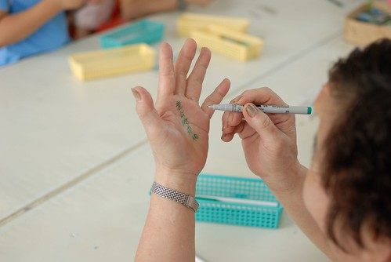 一大家子都這樣認真 還真是很出乎我意外 但感覺真的很棒  第五堂課 釣鉛筆比賽  大家延續著DIY認真的精神 每個人都好拼阿 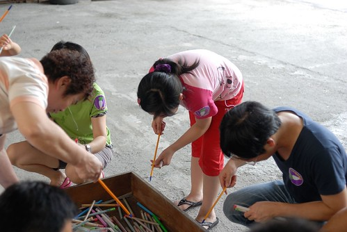

 最後陳爸更是一舉拿下成人組第三名 表現最優的喔  而上完最後第六堂課的工廠歷史介紹後 大家順利拿到鉛筆學校的畢業證書一"支"! 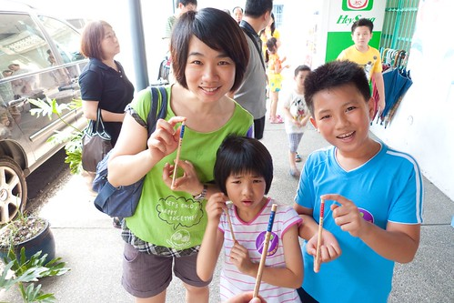 雖然相較於兩年多前  課程從2個半小時縮水為兩小時不到 內容與緊張度也鬆了些 但就如之前只來商品部看過的陳家哥哥所說 來這果然要上課才好玩 這裡 意外的讓我們有個不一樣的家族旅遊回憶~

而今日除了一起去上學 大家還一起下水泡湯去 很愛一起玩水的孩子們 這個下午更是玩瘋了 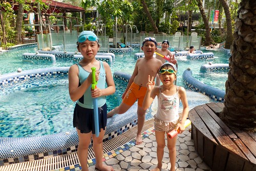 每個都笑的好開心  膽子也都變大了 五層樓的滑水道一趟又一趟 同時間 阿公阿嬤也泡的不亦樂乎 還在石版睡了個午覺  而最後就如每次的同遊 在一次次的"再一次" "再一會'後 孩子才依依不捨的離開池子 結束今日的遊玩 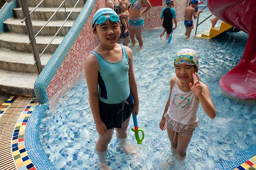 5點多 大家上北宜高速公路奮戰前  最後一起在甕窯雞飽食一噸  這時 其實每個孩子都累了 放下筷子後 每個人的眼皮似乎也都快垂上了 哈哈 大家一定要玩的這樣精力耗截嘛 不過這些都是為人女 為人母的我 滿滿的回憶與支持阿! 再累 也要跟家人一起來場小旅行~
