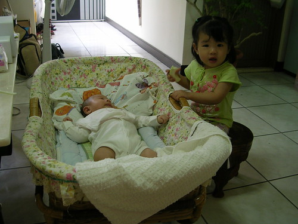
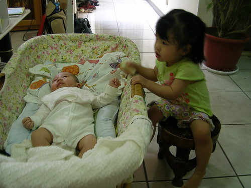
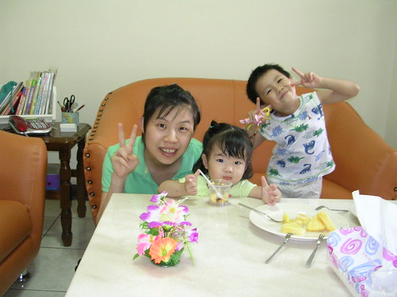
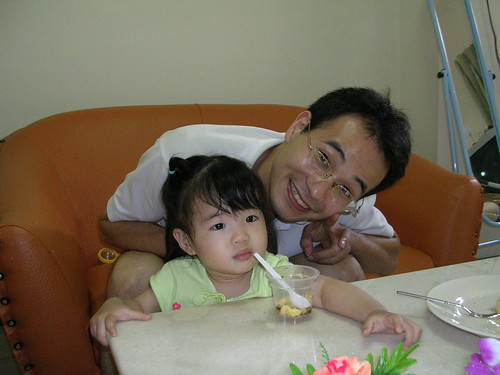

總算總算在前兩個禮拜從嘉義回台北的路上  
下了台中 去探望剛雙滿月的小奶油  
正值中午用餐時間  提了麵跟飲料就這麼去人家作客  
女主人小吳阿姨忙著準備水果 男主人的午餐   
(以為男主人不在才沒順道提他的麵的 我們真的不是故意的)  
我們一家四口就也不客氣的自己吃起午餐  
糊了幾口麵的小愛 在小奶油弟弟被推出房門後  
就自己這麼的坐在搖床旁的小椅凳上  
啃著水果 看著寶寶 偶而搖著床 比著小奶油喊著"寶抱..寶抱"  
就像個駕輕就熟的小保母  
徹爸打趣說 會不會在保母家被保母訓練照顧小弟弟阿  
(保母家兩個月前多了個滿月沒多久的小嬰兒)  
這...回去可要去保母那打探打探....有沒有壓榨小愛這個小童工...  
  

有趣歸有趣 但還是蠻擔心小愛不小心搖的太猛烈把弟弟給晃出去了  
陪著小愛對著小弟弟說話時  小弟弟還對著我們笑了  
哈哈~莫非這就是小愛跟小弟弟之間的緣分...  
  
  
  
小吳阿姨很喜歡小愛  
聽說常會對著小奶油說"長大以後去追小愛姐姐"  
娶某大姐 坐金交椅阿~  
  
  
  
小卷爸也興沖沖的跟小愛合照一張  
  
  
  
看到小吳辭去台北工作 (生統人離開台北好像就斷了生路一樣)  
回到台中待產生產 坐月子 租屋在外過小家庭生活 辛苦的讓人有點不捨  
也想起我跟徹爸唸完書沒多久 懷孕 結婚 生小孩那段日子  
常每個月在繳完一堆費用後只剩幾千元過生活  
然後在薪水進戶頭的前一刻 剩餘存款不超過3位數  
不知不覺我跟徹爸竟也熬過這麼些年  
一路走來流了不少汗水 也偶而兼雜著淚水  
這一切在每晚望著熟睡中的阿徹小愛 相信也告訴自己"這都是值得的"  
真的~凡走過必留下痕跡  
辛苦的耕耘總有一天會讓人可以又笑又哭的收割的  
祝福小吳一家子 也祝福所有分享這個blog的朋友們  
  
PS. 感謝小吳提供照片  
       當天因為徹爸的雙機一隻長鏡頭一隻廣角鏡不適室內拍照  
       加上我的小DC留在嘉義給徹嬤用  
       所以所以...向來酷照的我們只能乾瞪眼的望著小愛小奶油的可愛模樣...嘔~
