最近天氣暖和多了 可是春天果然後母心 天氣忽冷忽熱變化真是大... 三月初的一個突然寒流來襲日 我們家心血來潮的去搭貓纜 玩貓纜 貓纜比想像中的高 時間也比不知道的久 在裡頭能做的事有限 但一家子這樣"困"在裡頭20多分鐘 只能看風景 只能說說笑笑 卻有一種只有我們的甜蜜感!

一如往常到動物園的路徑 我們從板橋走快速道路到新店然後接木柵 9點多不算早 但寒遛來襲的週日 木柵動物園難得冷清  走到貓空纜車車站 好冷清阿... 看著站內站外林立的排隊布條與椅子  只能想像平日人潮滿滿的樣子  有點枉費我們前一晚還上網預約了水晶車廂 不過我們還是得意的拿著我們的預約單暢行無阻 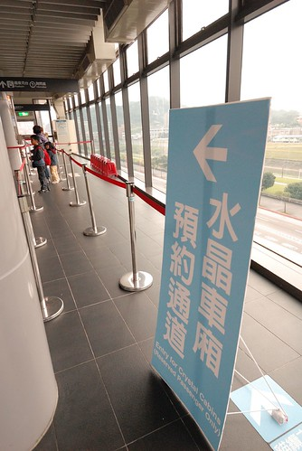 從車站內逐層的從一樓上到四樓時 看著外頭的貓纜 一家子大驚小怪的驚呼著"哇! 好高!! 好恐怖阿!!!"  看到運轉中的機具時 也忍不住張大嘴驚歎"哇 好像變形金剛"  我們真的很像鄉巴佬進城似的 同時我們也互相揶揄著誰最膽小 誰會嚇的腳發軟 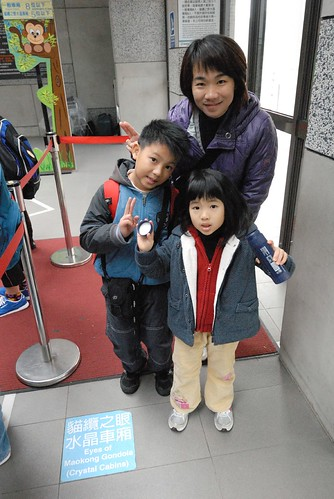 一切順利的在預約時間內 我們的水晶車廂來嚕 (好期待阿~)  坐上車廂後 多年前就開始常嚷著要去搭貓纜水晶車廂的阿徹樂不可支 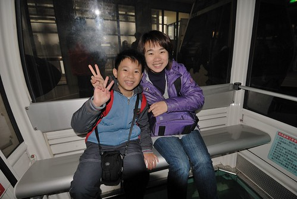 另一側的愛愛與徹爸則顯得平靜  不過纜車駛離站台後 徹爸看到廂底一覽無遺的景色忍不住張嘴驚呼  而大膽愛依然勇健  同時間 我跟阿徹興奮的拿著相機拼命拍 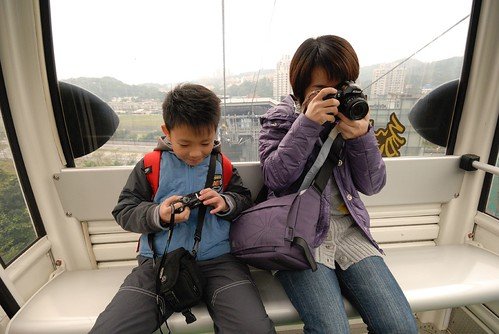 誰是我們家最害怕搭纜車的人  大家應該知道了... 不免俗的 搭水晶車廂就是得這麼個來一張 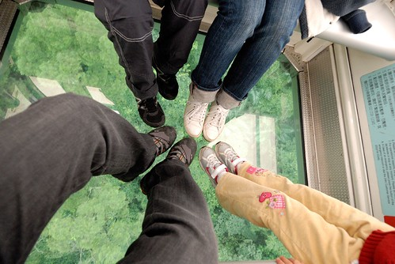 穿過車廂底層的玻璃 色彩其實有點跑掉了 可是阿徹說 這樣看起來好像綠花椰菜喔!  一朵一朵 連綿不絕的花椰菜 煞是壯觀與美麗 我們一路看著風景 一路一直照相 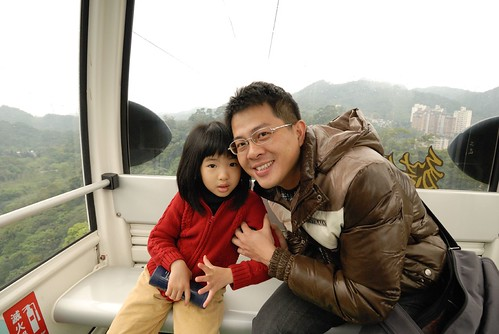 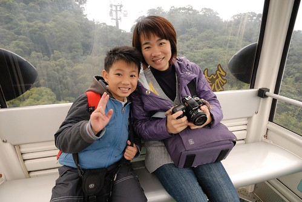 也一路隨著纜車的高高低低而驚呼"哇~好陡" "哇~好快" 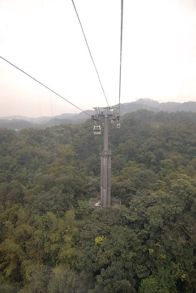 比起以前搭過的九族文化村與花蓮海洋公園纜車 貓纜真是刺激又超值   而且在貓纜車廂裡 放眼望去的台北城別有一番風情 (只是那個山坡上的房子也未免太多了 恐怖~)  雖然天氣不好 能見度不佳 令人遺憾了點 但是很棒的初體驗 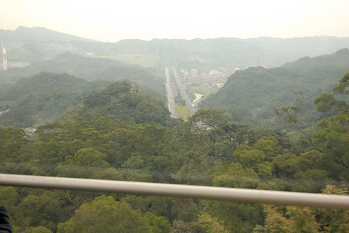 只是當我一直處在興頭上時 我們家那個善變的愛愛果然很快就膩了  吵著"還要坐多久阿 好久喔~"  於是兄妹倆開始勇氣大考驗 較量敢不敢站起來 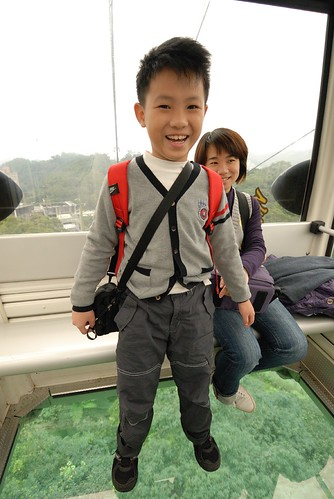 不過只能站立喔 高空中可千萬別開玩笑了... 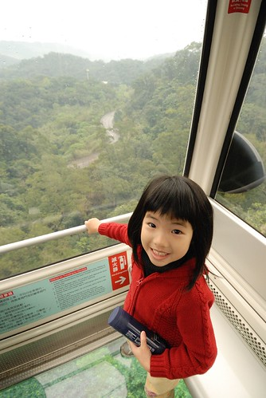 比完勇氣  為了排遣愛愛的無聊 於是拿出我的相機讓她拍 徹爸還好好指導了愛愛握相機的手勢 徹爸說"我的女兒耶~" 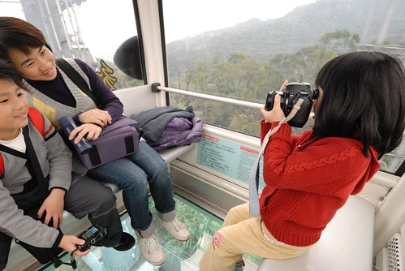 父女倆對拍  愛愛拍兩老(中間硬是擠了個電燈泡) 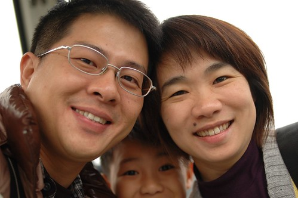 愛愛拍自己的腳  小妮子很認真的玩起相機 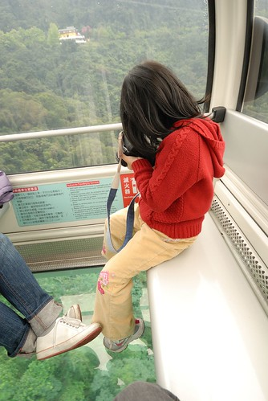 不亦樂乎 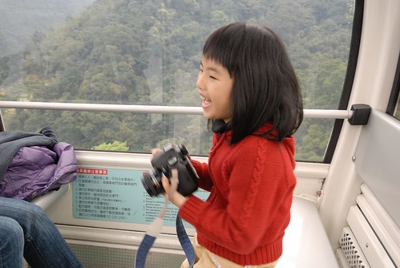 相較於阿徹 徹爸對於愛愛非常的讚譽有佳 認為是個可造之才  就這樣說說玩玩 感覺搭了好久的纜車總算快要到貓纜站了 準備下車前 來個成功出擊照  下車後再來一張紀念照  沒來過貓空 出站後我們頗為訝異這裡的清幽 (街道很乾淨大加分) 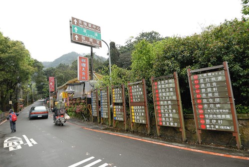 原打算去樟湖步道走走的 只是一看到美食區 阿徹便嚷著"我肚子好餓喔" ㄟ..一個半小時前才剛吃完早餐的饅頭哩 這會不會餓的太快了點 不過山上風大 溫度又低 吃點熱的暖暖身也是不錯 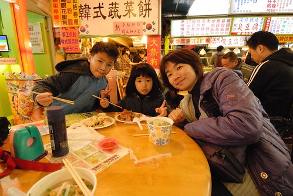 只是原打算讓阿徹吃飽飽好認命走步道的如意算盤 最後卻因細雨紛飛而不得不打道回府 扼脕阿~~~ 離去前 好歹來個貓空站到此一遊照 (不用走步道的阿徹很樂)  回程原打算搭乘一般車廂就好 可是沒什麼遊客於是父子倆還是興沖沖的去拿水晶車廂號碼牌 完全不需要任何多等待時間的我們又順利搭上水晶車廂返回木柵  貓纜的新鮮感在去程都用光了 回程中 我們愜意的聽著徹爸手機播放的音樂  熱血三年級小學生阿徹還超認真的跟著快樂天堂音樂一起哼唱 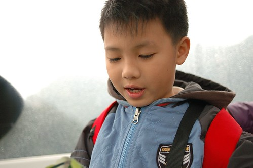 我跟徹爸完全沉浸在音樂放鬆的氛圍中 而徹愛兄妹倆則還是興趣盎然的各自把玩著相機 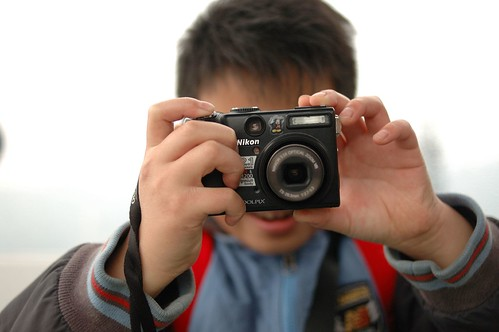 在高空中 沒有忙碌 沒有下一步的趕快  是個只看得見彼此的四人小約會  彷彿短暫的遠離塵世.. 這種感覺真是挺不錯的 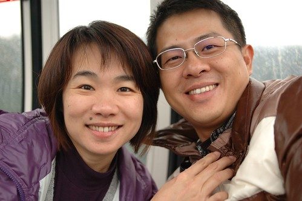 可能因為太放鬆 太享受 覺得回程的距離好像變短了 才一會時間就到站了 但其實5-6首歌的時間本來就真的很短暫~ 下車後 徹爸說"走吧! 找機會來去搭日月潭纜車吧"  我會記得大人的吩咐的 阿徹說"我好想下次再來坐貓纜喔 而且還要去動物園"  兒子~願意且非得走步道才有下一次了 離開貓纜 離開木柵 結束我們半日不到的小旅行!  貓纜 我們總算嚐鮮了..
