耳聞高雄捷運站是最美麗的車站許久 也每每看到人家分享的高雄旅行精彩又豐富 趁著228連假 我們從嘉義到高雄來個小半日捷運小旅行

 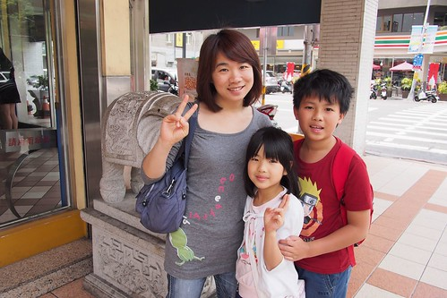 既然去高雄 當然得把回高雄打拼的鳳琴"姊姊"叫出來當我們的地陪 以前跟阿姨頗熟的徹愛 看到阿姨開心的不得了 拼命對堅持要他們叫"姊姊"的阿姨喊"姊姊阿姨" 氣得阿姨猛糾正"叫姊姊"! 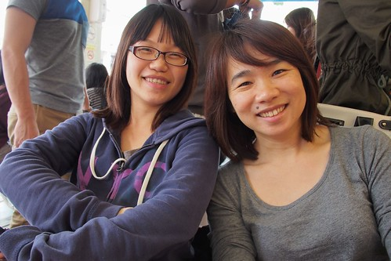 姊姊阿姨想破頭 費心的帶我們到具高雄代表性的丹丹漢堡吃中餐 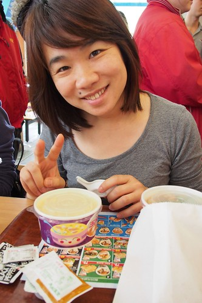 聽說丹丹漢堡在高雄很有人氣 而且只有高雄才有 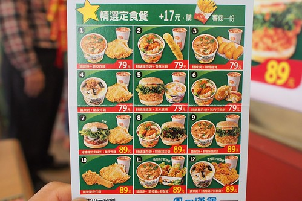 但讓我們這些外地人覺得酷的是 丹丹的吃炸雞配麵線 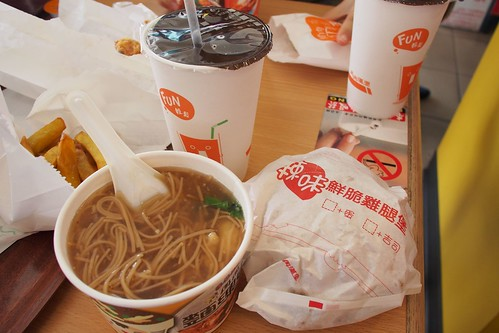 還有這怎樣都很難以想像的鹹酥雞肉羹.. 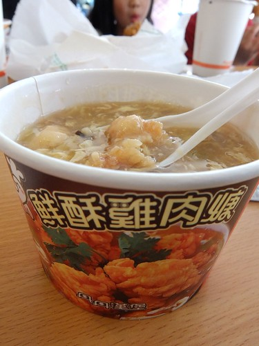 真的太令我們大開眼界的高雄名產! 吃完中餐 我們從高醫往捷運站的方向慢慢走去 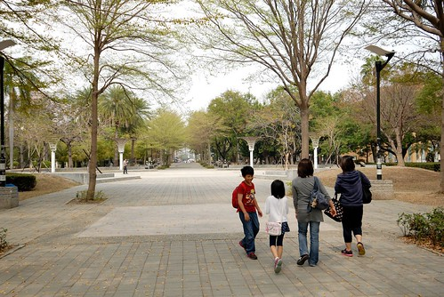 穿過公園 高雄的地廣人稀讓人羨慕 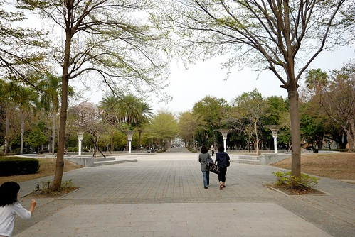 聽說高雄的每一個捷運站各具特色 各個美麗 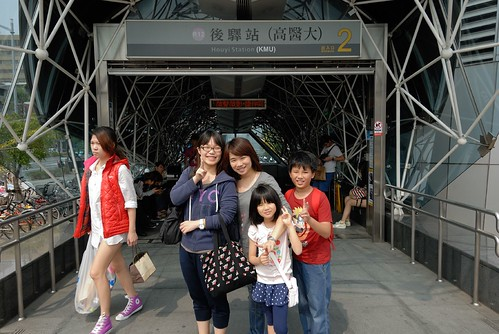 第一次搭高捷的我們 總算圓夢似的開心 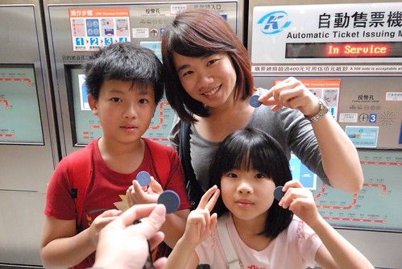 難得搭高捷 當然一定要來號稱最美麗車站的美麗島站朝拜下 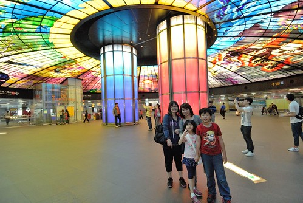 車站大廳的玻璃鑲嵌藝術作品果然偉大炫目 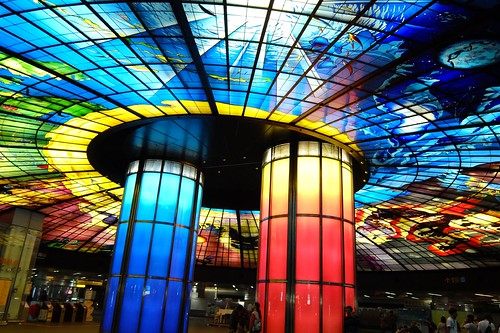 只是真的還挺抽像 我們有點看不懂... 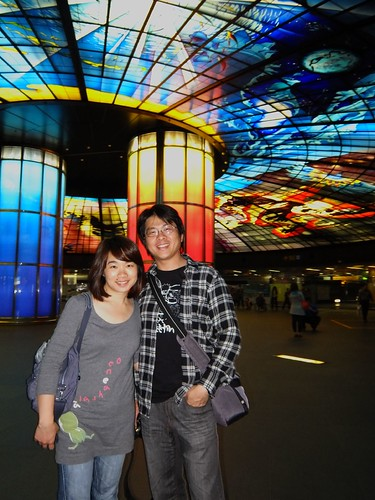 不過不管怎樣 都要很觀光客的來一張完全沒拍到主角的失敗自拍照 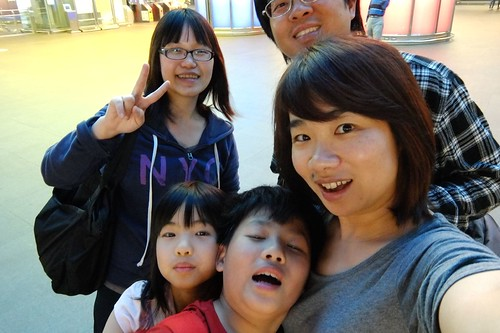 當觀光客的另一必備 買紀念品! 話說父子三人真的很愛逛紀念品店 然後買些小物 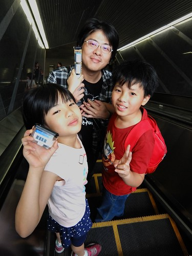 美麗島站的另一特色是代表祈禱意義的貝殼造型出口 大老粗的我們 果然又有眼不識泰山 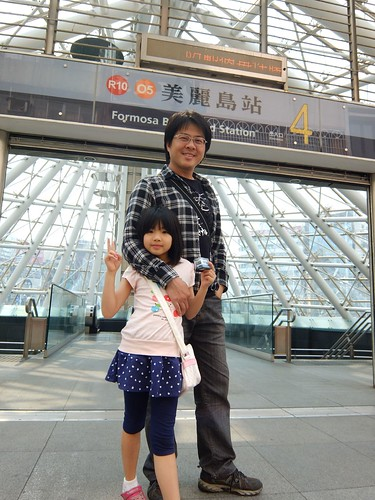 不過搭著電扶梯上來時 透明玻璃穿透下來的陽光讓人很舒服 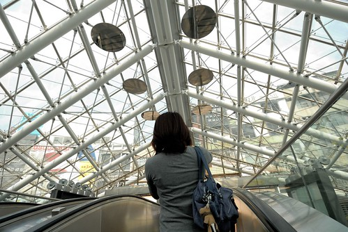 繼續 我們換搭西仔灣線到駁二藝術特區 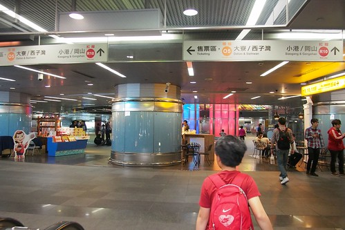 出捷運站往特區的路上 幾個街頭藝人妝扮引人駐足 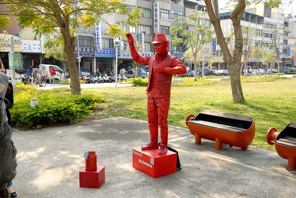 熱鬧的藝術氣氛證明我們在往駁二的路上無誤 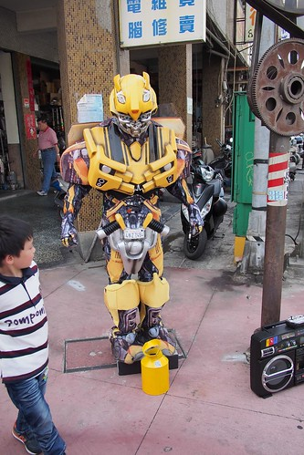 南高雄的天氣果然熾熱 到駁二先來個人氣香蕉冰降溫 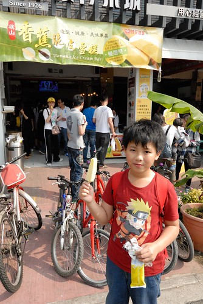 雖然香蕉冰直挺挺 但顏色跟味道卻到味 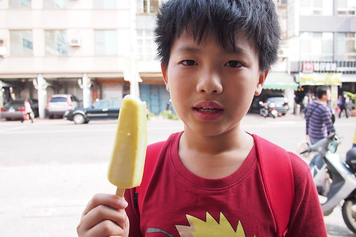 只是不知道是太天然(不會溶的添加物加太少)還是天氣真太熱 不過主要還是徹哥吃東西向來邋遢 以致一根香蕉冰吃的叩叩滴 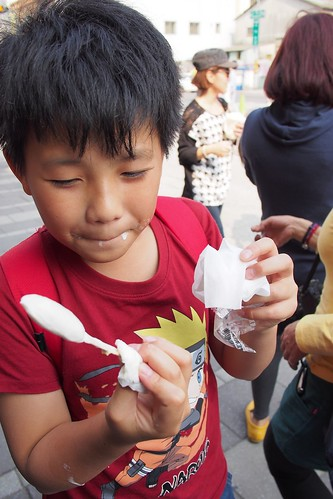 吃得滿手 滿嘴黏膩膩 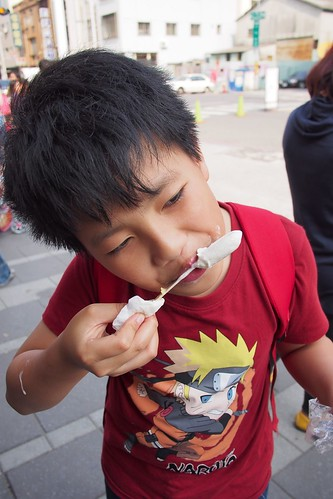 不過也可見這香蕉冰有好吃! 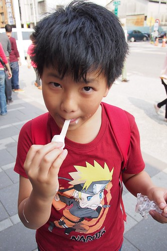 另一方 我跟愛愛則去買聽說也是人氣的黑糖冰淇淋 姊姊阿姨貼心叮嚀 這冰得待在室內吃 要不然會抽抽滴 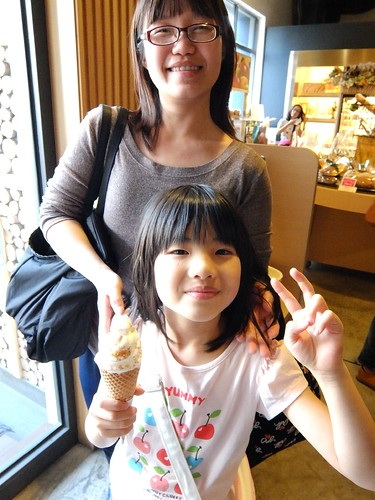 真的! 在高雄吃冰 怎麼這麼會滴阿... 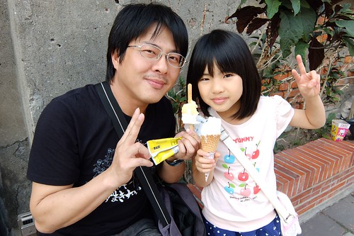 吃冰消暑過後 我們開始專心倘佯在藝術中 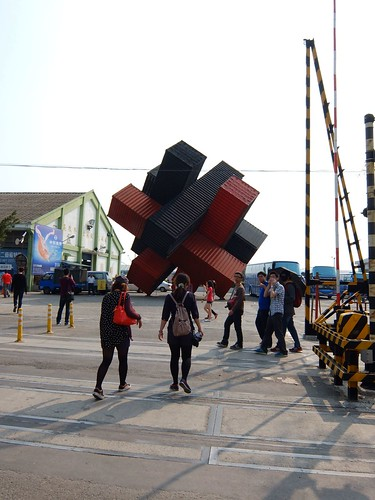 挺有趣的臉譜 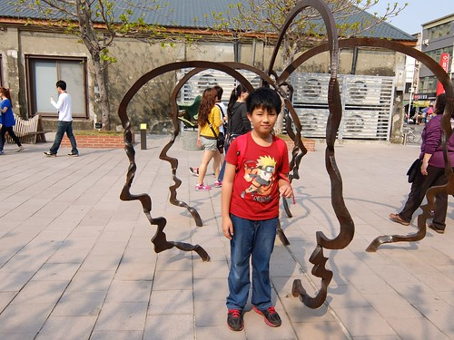 只是愛愛竟然搓人家的鼻孔 實在大不敬 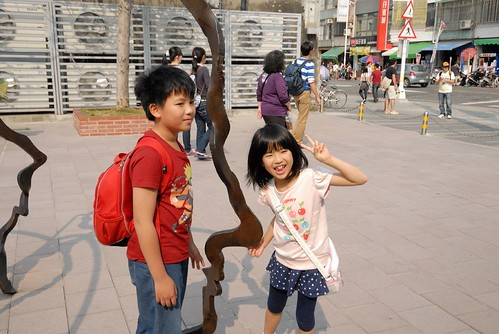 228假期的人潮挺多  我們索性就順著人潮 沿著鐵道往西子灣的方向散步去 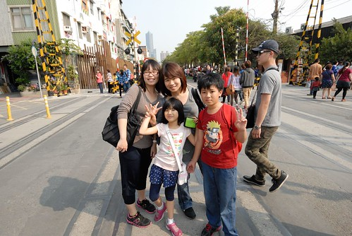 鐵道兩旁有一系列相同身形但不同彩繪的公仔 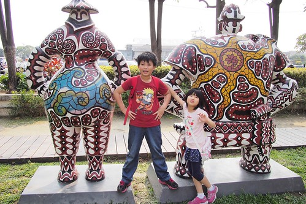 徹哥看的煞是有趣 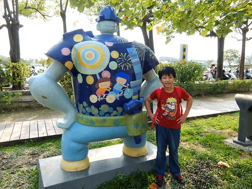 每個都要求照一張 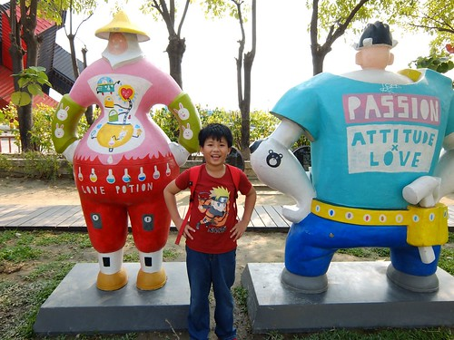 而園區內還有其他許多大型藝術裝置也很吸引人目光 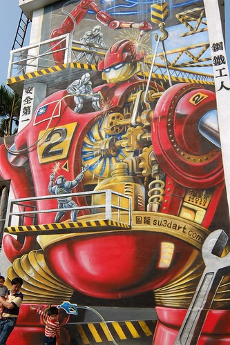 雖然我們只是遙望 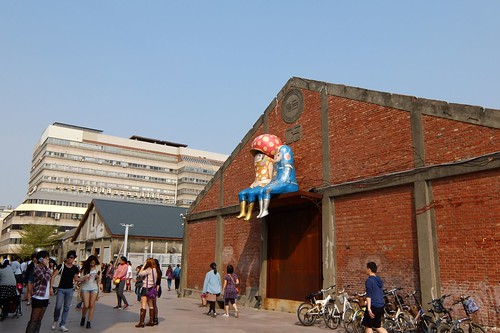 但這些鮮豔的藝術創作外 最讓我喜歡的卻是存在著的老倉庫 老房舍 老圍牆 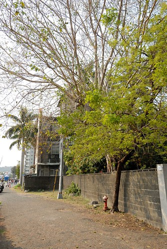 不搶眼的 靜靜說著自己的歷史 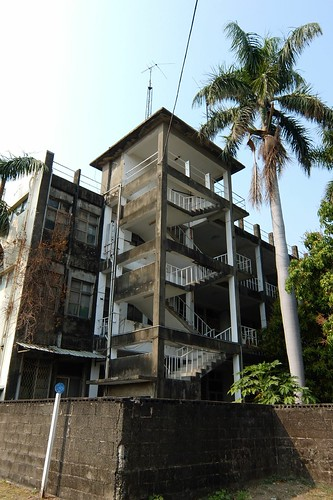 我們壓馬路似的 邊說邊看一直走著 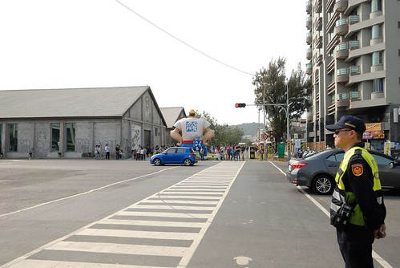 穿過長長斑馬線 來到園區的另一頭 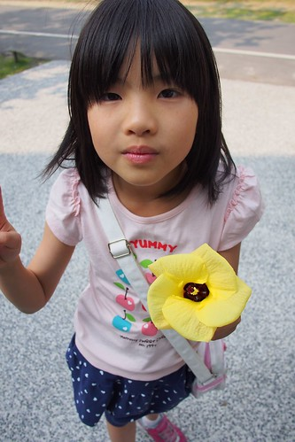 越走越是感受到愜意 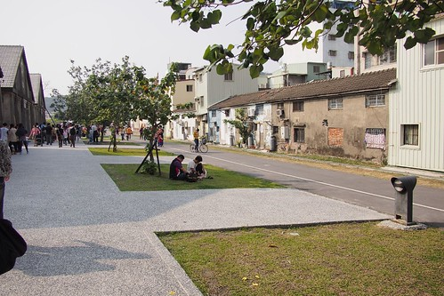 但一樣的饒富趣味 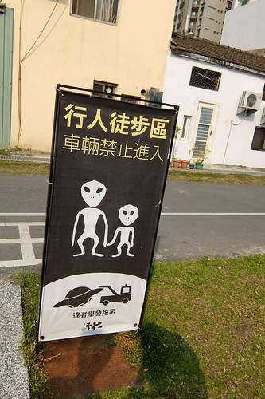 突然間一個大草坪 讓人豁然開朗 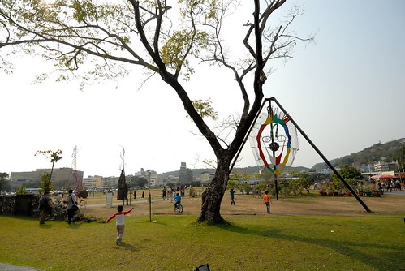 剛好有幾座椅子讓我們坐下來休息 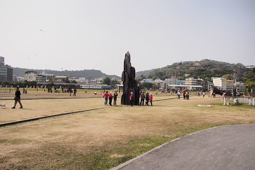 吹吹風 享受眼前的空 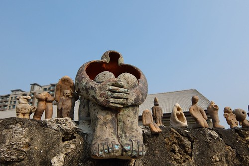 這兒的藝術裝置更富童趣  大留聲機  大行李箱 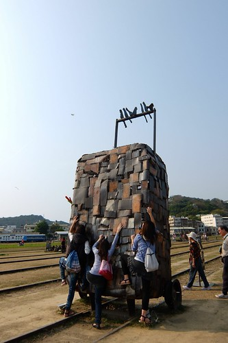 沒有年輕人的"放"勁  母子三人只敢在鏡頭前含蓄比YA 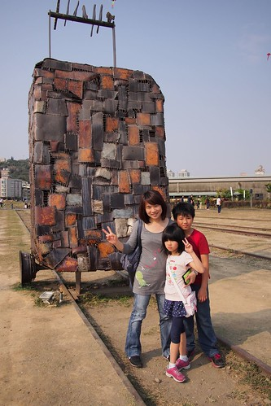 穿過鐵道我們又往更空曠的那頭走去 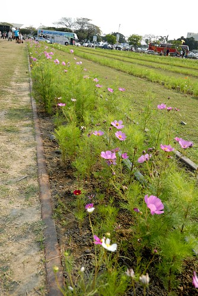 那頭有好多風箏飛著 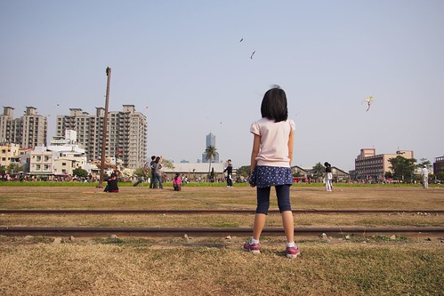 是個讓人感受貨真價實高雄生活面的角落 而不是一路的觀光氣息 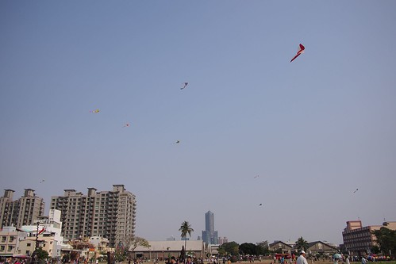 我們坐在鐵道上  看著天 聊著天  玩著剛剛買的高捷紀念品  很棒的高雄捷運小旅行阿!  好不容易起身 我們要繼續往今日的最後目的 西仔灣的打狗領事館 此時也才發現原來我們不知不覺早已走到捷運西子灣站了  只是西子灣站離領事館還有一段不算短的路要走 (話說遊客中心內服務人員聽到我問打狗領事館怎麼走 露出一臉很遠 沒搭公車到不了的表情 果然呼應鳳琴說的 高雄人不耐走 問哪都會說遠)  不過走路真是旅行最好的工具 沿途看到的房子 看到的樹 看到的人 騎車的 走路的 家門口聊天的... 是對一個城市/鄉鎮的最直接體驗  20來分鐘的繞路後(不知道路的跟著GPS亂亂走)走到搭船往旗津的碼頭  排隊搭船的人龍好長阿... 沒去過旗津的我竟突然萌生下次再來高雄搭渡輪的念頭  碼頭對岸的我們在又是一陣找不到路 問路後  從不起眼的樓房中間走上往打狗領事館的小徑  挺像台北寶藏巖的穿弄小巷 走起來很有趣  只是辛苦了揹著大包小包的地陪了  總算來到一直讓我念念不忘 大學畢業旅行時來過的中山大學西子灣  雖然前幾天跟鳳琴確認行程時 我們才發現西仔灣沙灘已是要收費的海水浴場 而小小失落 但我真的很想很想再站在這看海 看船  看夕陽  美麗紅磚屋的打狗領事館是今日高雄旅行另一個讓人期待的地方  只是沒沒沒想到 竟然已發包給玫瑰園經營 不小的入門收費(還只能折抵餐費)以及濃濃的商業氣息讓人錯愕  加上祖國同胞真的好多阿!!!  讓我們有些失落  但除了這最後小小的失望外 今天的半日高雄輕旅行真的很不錯!  雖然華燈初上 其實才是高雄正要開始熱鬧的時分我們便要打道回府 但很高興 今日我們又多認識了高雄一點點 ~ 
