去年在網路上看到台中有個氣球博物館後 便一直想去這個光想像就覺得多彩歡樂的地方 趁著四月底的谷關行 我們順道去博物館先晃晃探探 哇~ 一看不得了 更是好奇與期待的我回家後馬上上網預約幾週後的參觀體驗 這是繼玉兔鉛筆工廠後 一個適合大小同遊的觀光工廠 

第一次到氣球博物館是四月底 徹愛校慶補假的週一 非假日 園區內空蕩蕩一片 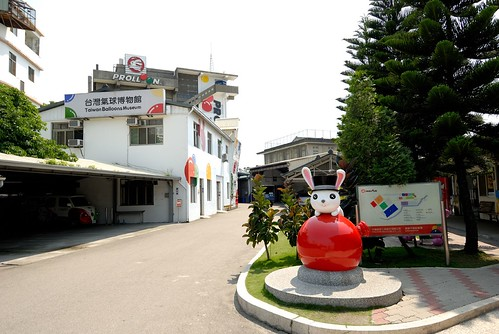 而唯一一場的體驗也在早上結束了(其實前幾天有想預約也滿了) 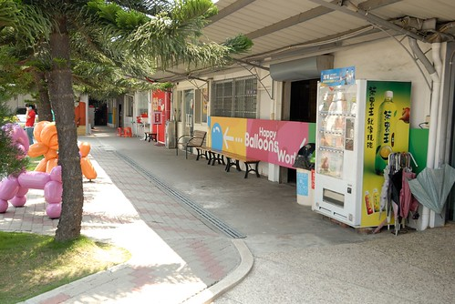 能做的就是到商品部shopping  琳瑯滿目的氣球商品 讓我們大開眼界也每個都愛不釋手 愛愛買了徹爸之前網路看到而感興趣的氣球車 購買後 工作人員還很熱心的示範給我們看  而除了買氣球 令人開心的還有戶外那幾隻大氣球寵物  沒有人 徹愛盡情賴在這些寵物身上 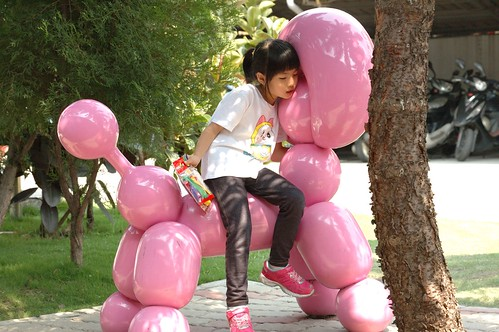 一隻輪過一隻  而且每個照相效果都超好 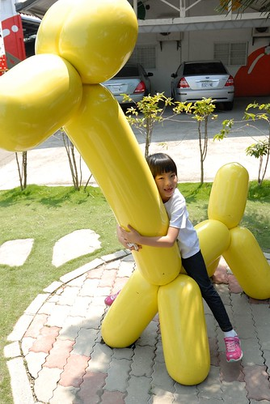 色采豐富 明亮的 裝滿眼睛 填滿視窗  這天 阿徹信誓旦旦買了一大包長型氣球跟氣球造型書  一拿到書 迫不期待的研究起來 (這坐姿很好笑) 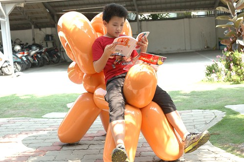 還拿起氣球當場做了起來  因為打氣筒是妹妹的 只能讓妹妹慢慢的打  而爸爸幫忙綁氣球嘴  爸爸好怕氣球破掉的模樣阿 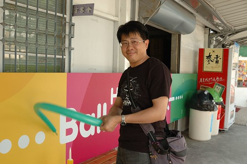 然後阿徹開始轉了起來... 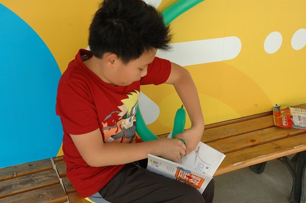 鐺~ 完成第一把寶劍 阿徹一臉開心滿意 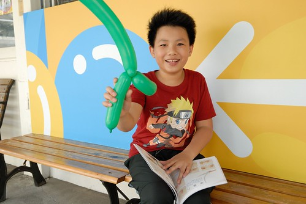 兄妹倆當場比劃起  今天來也不過是商品館買氣球 還有照照相 但好氣氛卻讓我更讓好奇與期待 參觀體驗課程多有趣  

於是四週後的週六一大早 我們再次來到台中的大倫氣球博物館 準備上今日10點-12點的參觀+體驗課程  上課前 先到商品部報到並領取名牌  10點準時在DIY教室開課  DIY解說的是花花姊姊    很有YOYO姊姊的FU 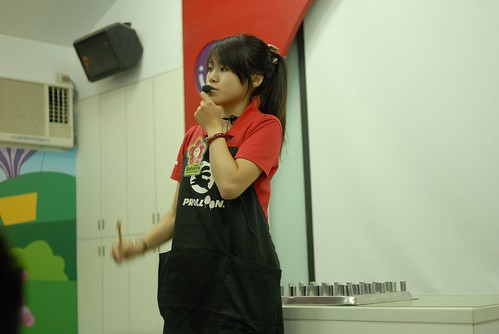 在花花姊姊示範與解說製作口訣後 大家首先戴上歷史斑斑的工作手套 等熱騰騰的模具一拿出爐  開始搶時間(模具冷掉前)做自己的氣球  步驟一: 沾凝固劑  步驟二:  沾乳膠劑  雖然做之前 大家口訣已複誦過幾遍 但開始做之後還是一陣疑惑與混亂 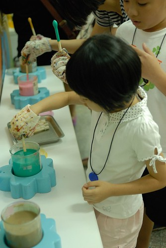 負責拍照的徹爸 反倒在大家的兵荒馬亂後得以好好做他的氣球 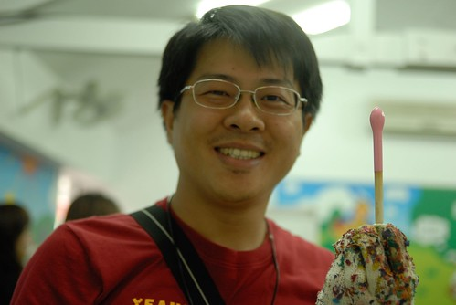 技術不夠好的話  氣球可是會流眼淚的 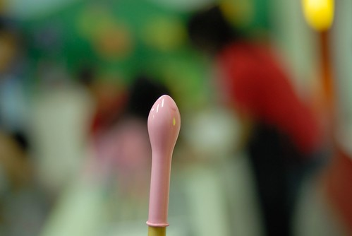 步驟三: 沾好乳膠劑的模具放回盤子上 進爐烘烤20分鐘  交氣球的時候 花花姐姐在每個人的手腕上註記自己氣球的編號  等候氣球出爐前 先是看一段工廠歷史簡介  然後是問答送氣球 花花姐姐拿了幾個造型氣球準備送遊客 送出前請坐在第一排的愛愛代管 因為阿徹之前已經搶答拿了幾個氣球 以致後來送造型氣球時已經沒啥機會被點名 兄妹倆只能羨慕別人拿這些可愛的造型氣球  為什麼氣球要烤是問題之一  阿徹第一個回答可是答錯 姐姐繼續問了4-5個人答案還都是錯 同時間阿徹還一直都舉手想回答  最後沒人再舉手要回答 姊姊總算再點阿徹 沒想到阿徹真的說對了 完全跌破我們眼鏡 原以為他只是不甘心來鬧場的說... 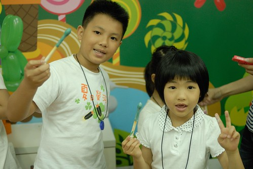 20分鐘過後 氣球烤好 只剩最後一道步驟: 沾滑石粉 脫模 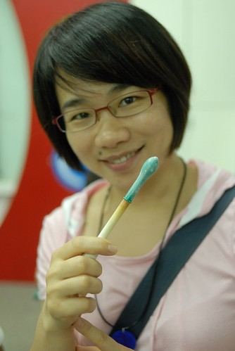 大家拿到生平第一顆自己做的氣球 雀躍不已 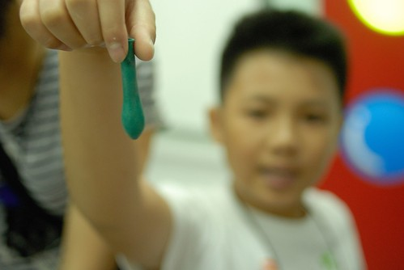 不過得打氣試試氣球有沒有破掉 失敗了 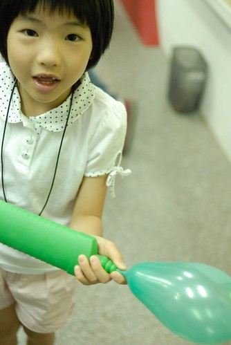 YA! 大家的氣球都成功!!!  只是打過氣的氣球就會皺皺 鬆鬆的了 不過姐姐說可以用吹風機吹一吹後就回復喔 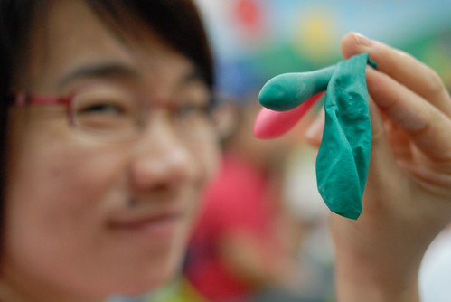 其實做氣球的過程很簡單 但主要的步驟發生就在幾分鐘之內 就如徹爸說的 怎麼好像還不知道做什麼的時候就什麼都結束了... 哈哈

結束一小時的氣球DIY課程 接著第二堂是同樣一小時的博物館參觀  大倫是台灣目前僅剩的唯一一家氣球工場 但生產的氣球行銷全世界100多個國家 很厲害喔 目前工廠都已是自動化的生產線 博物館內所展示的為以前半自動化 甚至手工製作的過程與機器  DIY過就明瞭氣球的製作步驟不算多 所以博物館內的製程介紹也當然的很快就可以說完 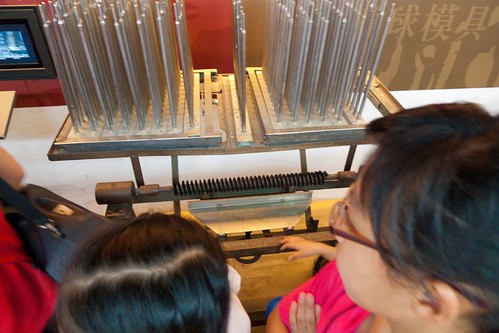 剩下的時間就是姊姊小活動 小遊戲的帶領  蘋果氣球的操作示範 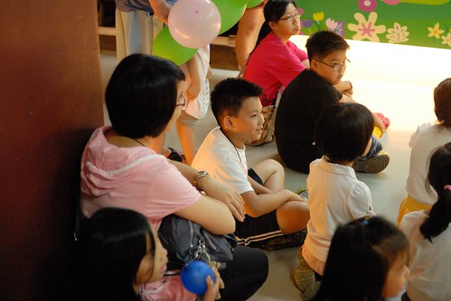 各式玩具氣球的介紹與示範  最後拉拔回到戶外"施放"火箭三兄弟  這是我們最熟悉的二哥 火箭氣球 一發不可收拾  亂竄亂飛 阿徹回家後曾還在公園裡直上天空的飛到5層樓高 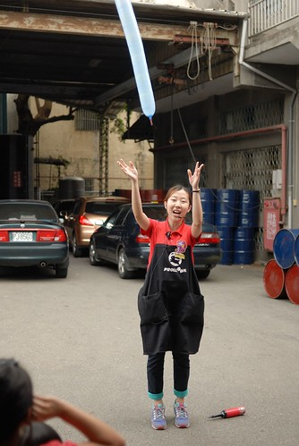 火箭大哥反倒沒有那麼會飛 不過塊頭驚人  火箭三兄弟的勇猛樣 看的愛愛目瞪口呆  每個參加者最後獲得一包裝有許多玩具氣球與經典氣球的小禮物 而今日兩小時的參觀體驗課程也到此結束 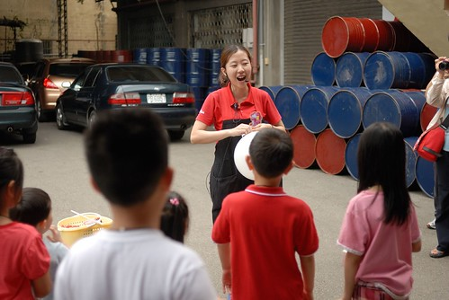 很有趣的氣球體驗 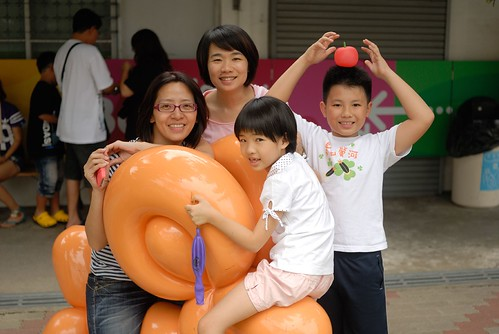 也謝謝玟姿阿姨今日與我們的同行同樂!!! 

後記: 離開氣球工廠後 玟姿阿姨繼續帶著我們去吃喝玩樂 首先是到工廠附近一家 在地人推薦的秘店 真的是門口看不出裡頭那樣熱鬧與好吃的麵店 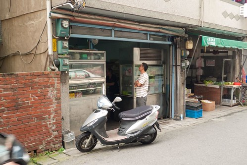 然後我們又拉拔到市區裡吃聽說要排隊很久的點頭冰 那天沒有排很久 10分鐘就吃到了 但真的好吃的讓人點頭 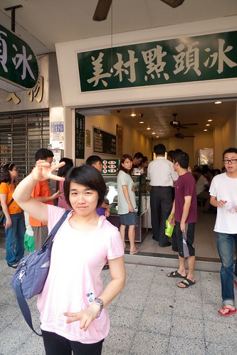 接著我們又繼續來到阿徹指名的誠實商店(去年我跟愛愛下台中喝喜酒時來過) 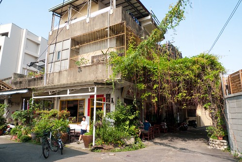 在這我們又買了 吃了好些小零食 小點心  然後坐在樹蔭下納涼好一會  這又是一個令人開心滿足的台中一日小旅行! 謝謝玟姿阿姨!!! 
