自從兩年前透過買買氏書而知道了羅山村後 就一直想著有機會要來這小村子住一晚 感受作者筆下富濃濃人情味的台灣第一有機村 雖然因為天公不作美 在羅山的時間不是暗夜就是大雨天而未能走遍羅山 但羅山稻穗的美 人情的暖 已讓來去鄉下住一晚的我深深被感動阿! 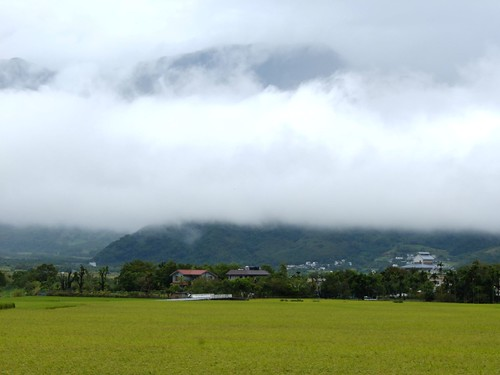 

火車從池上到富里 搭自強號八分鐘就抵達了 才發現 原來富里離台東這樣的近 近的讓人容易在花蓮南往台東時 不知不覺就呼嘯而過這個小鄉... 抵達富里火車站 租摩拓車前 先用步行的方式來到台九路上的富里教會  富里教會是花東歷史最悠久的長老教會 經歷與見證著富里歷史 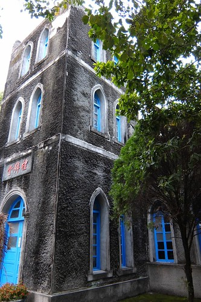 如今八十年歷史的巴洛克建築 一直這麼安安靜靜 沉沉穩穩的坐落在富里 我不是教友 但身至其間卻也感受一股寧靜!(話說一個人不靜也怪) 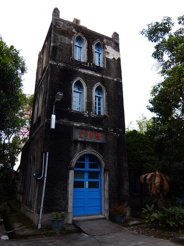 離開教會後 趁著天黑前趕緊租了輛代步的摩拓車前往今日下榻的羅山民宿 可惜抵達羅山時 天已黑 來不及來個傍晚時分的小散步  隔日特意六點多早起 想著來個清早散步肯定萬分怡人 只是這... 怎麼下起雨來了 還越下越大 完全沒有停歇的跡象 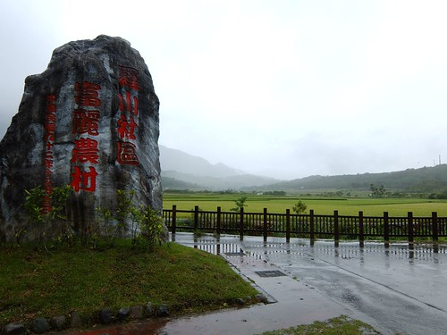 在民宿內等到11點 好不容易雨小了些  趕緊把握時間來個雨中散步  陰雨綿綿 但雨中的羅山卻更顯詩情畫意~ 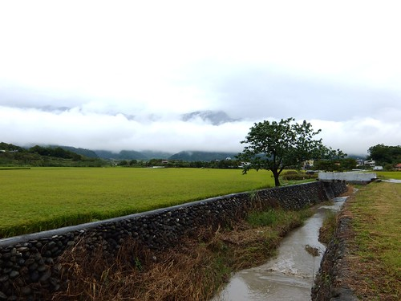 歹勢~ 我又忍不住稻穗拍個不停  東一張 西一張 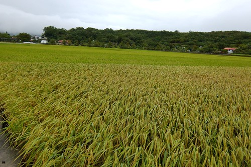 田埂一張  近拍一張 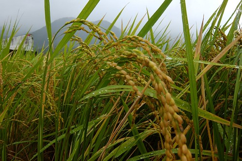 還盲拍... 就是忍不住按個不停 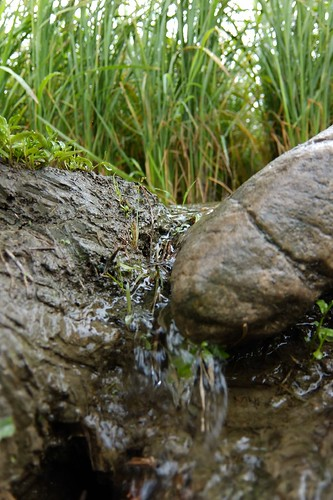 同時 田邊一畦畦小菜田 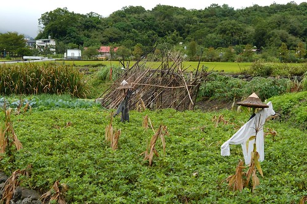 也都好可愛 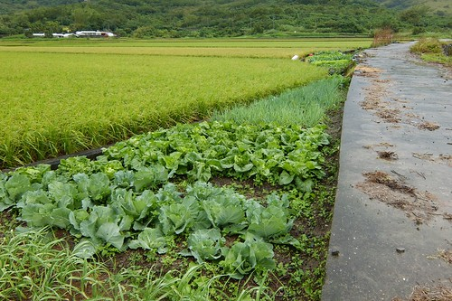 看起來好可口阿 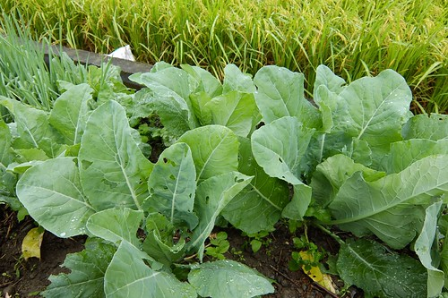 好土 好水 不止稻長的好 菜也長的美啊!  只是這種在大排上的瓜棚 要如何採收長在中間的絲瓜阿..(看著那瓜 我好生納悶)  羅山村位於中央山脈與海岸山脈之間 地理環境多變 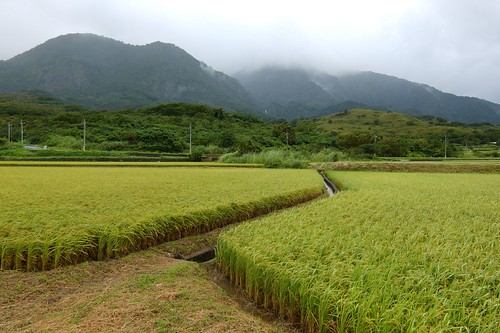 也因此這裡的稻田看起來有些不一樣  彎彎曲曲的  這是羅山有機稻田獨特的自然美  離開稻田區 我繼續在村子裡散步(可惜  忠勇顧家的狗兒不少讓我卻步)  街道整齊 乾淨 非常怡人的小村子 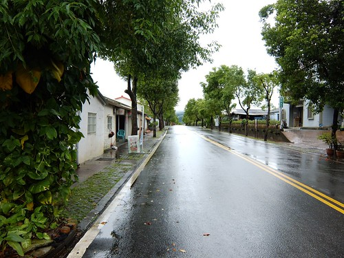 雜貨店就像是每個村子的守護神 每個地方的雜貨店都讓人備感窩心  小雜貨店整齊 可愛的模樣就如羅山村本身  散步的終點 回到前一晚下榻的民宿 月荷塘  月荷塘也是當初在買買書上看到才知道的  這也是讓我此次想在羅山住一晚的最大原因 想多認識從台北新移民到這南花蓮小村子裡的一家人 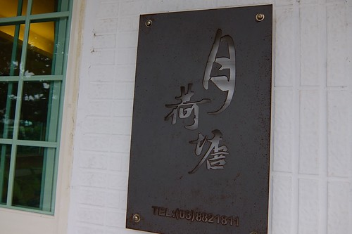 民宿的佈置很簡單 清爽 但又不失鄉間小屋的高雅 大門口望去的左手邊  這區除了是民宿兼營咖啡廳的場所 也是民宿客人休憩的地方 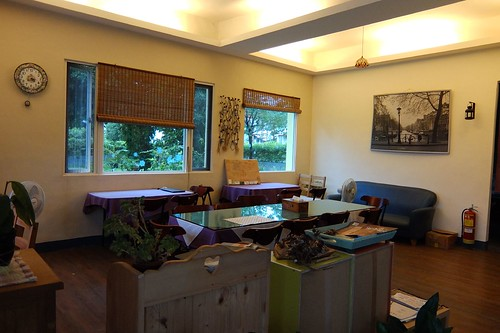 從左手邊望去右手邊的模樣  右後方的吧檯區  吧檯區旁的農產品販售桌 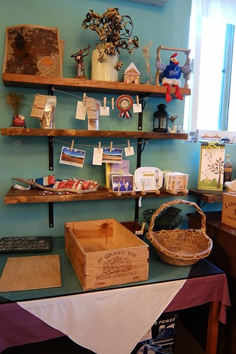 那天的早餐就有民宿自製的大麵包一顆 可惜我跟女主人聊的太忘我完全忘了拍照這回事 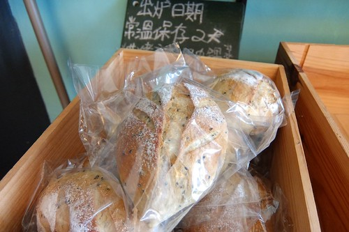 民宿的手作麵包現在也已經是羅山的特產之一了喔  那天遇見好些客人專程來看麵包買麵包  民宿的後半還有間大廚房 提供有麵包DIY活動  跟泥火山豆腐一樣打響了名號 

民宿的房間都在二樓 磨石子地的梯階 不小心洩漏了房子已有一把年紀(30多年的屋子了) 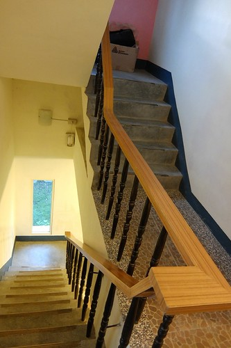 一間雙人套房  一間雙人雅房還有四人雅房 是民宿僅有的三間房 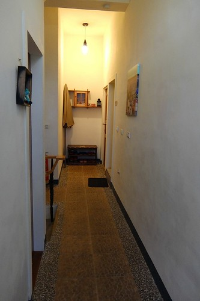 這是我住的雙人房 沒有電視 沒有多餘的擺飾 但讓人一夜好眠 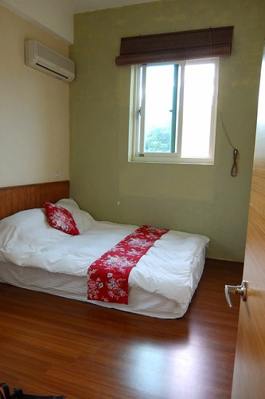 那天的另兩間房剛好分是男女主人的以前同事入住 所以那晚我跟著他們一起用晚餐 一起聊了很久的天 聽著男女主人說著他們的移民故事與起伏 以及每個人的慷慨心情分享 讓一個人旅行的我 一點也不寂寞 還收穫好豐~ 隔天離去前 特別到男主人甚感驕傲的菜園  還有雞園瞧瞧  越來越自給自足的農家生活阿! 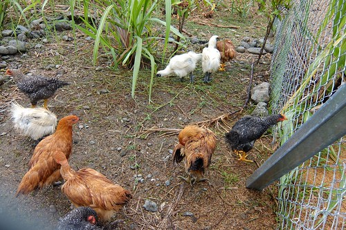 很喜歡月荷塘 健談的女主人 看的出很有堅持的男主人 可愛貼心又活潑的女兒 還有一家子努力在這個小農村過新生活的樂觀與積極 太喜歡她們的我 忍不住說了好幾次的"寒假一定帶全家人一起來..." 這下子寒假真的一定要再來花東玩了喔~ ㄏㄏ  在羅山等不到雨停 還是只好冒雨離開羅山 離開富里  曾經有一年的冬天徹家來花東賞油菜花時 從台九上看到遠遠一片油菜花田而尋覓來到富里這個小車站 所以這回進出富里火車站有說不上的親切感動  富里 羅山 很美的鄉 很美的村! 值得來去鄉下住一晚~
