原訂的玉里行程跟交通方式都因為那天下午的雨而改變 幸好雨勢在隔天清早暫停歇 讓我還可以騎著民宿的破腳踏車繼續我的賞稻路線

 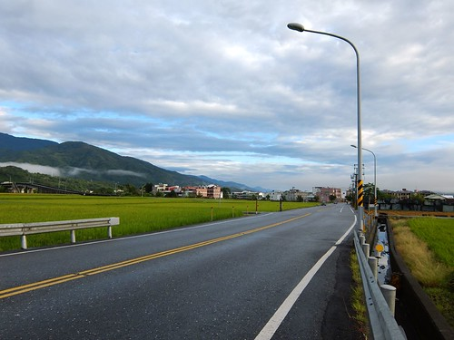 我很喜歡玉里的清晨  尤其天氣不好的時後 雲很重 卻富層次 尤其襯著中央山脈更顯飄渺 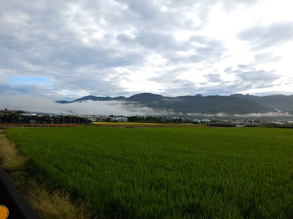 我常覺得旅行的不如預期常是老天刻意的安排 原是前一天下午要騎摩拓車到南安遊客中心 因雨變成隔天透早騎腳踏車走這10里路 而這樣的早晨好清新 好舒服~ 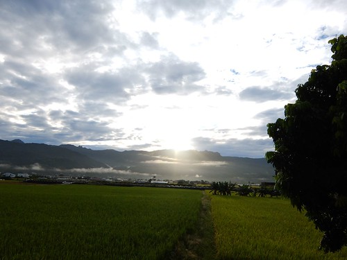 稻穗的黃 好美 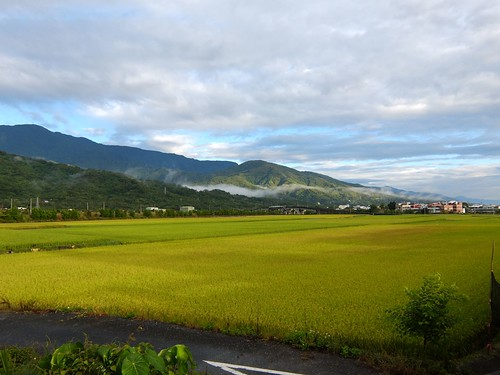 客城鐵橋的紅 好美 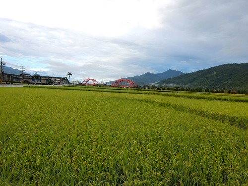 映在中央山脈上的山影變化 好美 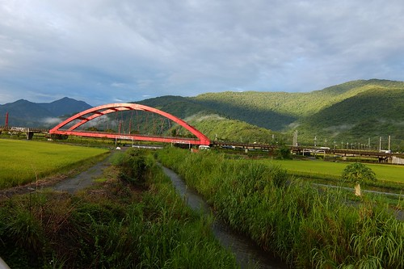 映在稻田裡的自己的影子 也好美~ 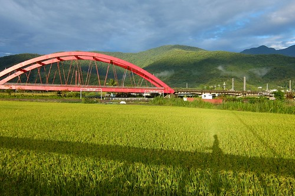 我知道這是清早時分 而且因為騎著單車才能有的限定美景! 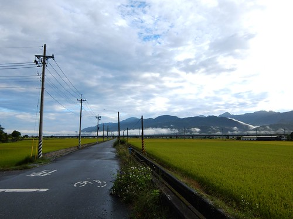 沿途是普通再不過的花東縱谷景色 但卻也是一幕幕最看不膩的美景! 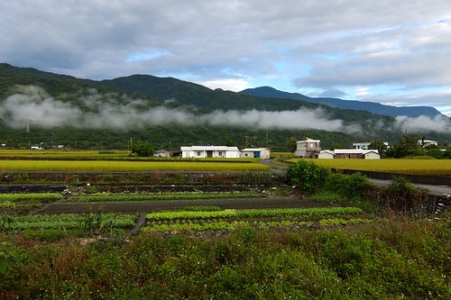 進入卓溪 映入眼的景色又不一樣了 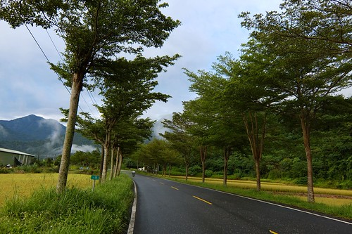 台30的小覽仁樹這段路  靜靜的 但耐人尋味 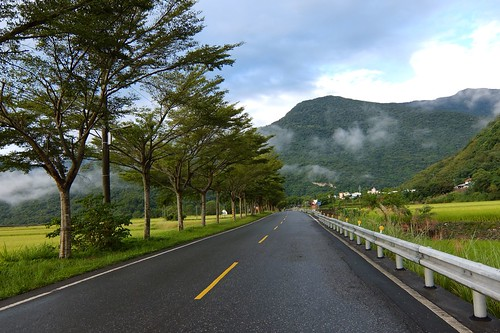 卓樂部落裡的教堂在週日早上大門敞開著 部落族人一個載一個紛往教堂方向去 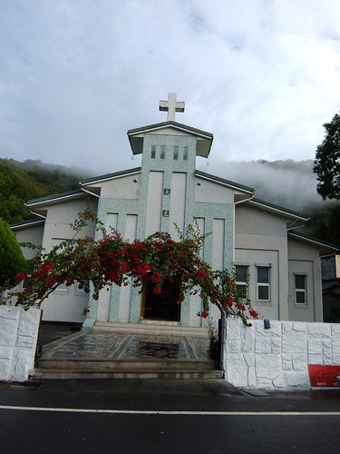 我這個外客 在部落族人一雙雙眼睛的好奇注視下  緩緩騎過這個寧靜的原住民部落 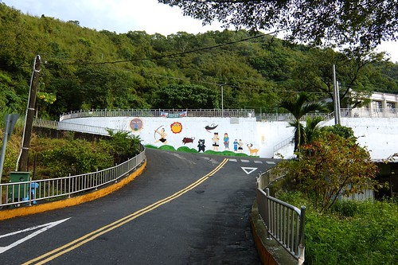 

沿路 我的心情超級喜悅 甚至可以說是笑著騎整路 但其實內心卻同時有一點不安  因為民宿的腳踏車實在維護不佳 胎氣不足 如果腳踏車突然就破胎"顧路" 我一點都不會訝異 我沿途注意過往車輛的頻率跟車種 看見偶會有農家小貨車駛過心裡安心不少 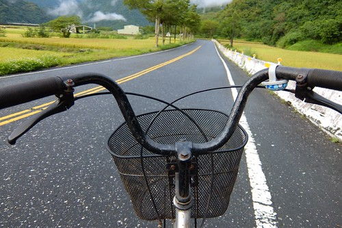 不過不要看腳踏車舊 而且還淑女車 我真的騎著這民宿裡難得煞車不會出聲的腳踏車抵達10公里外的南安遊客中心 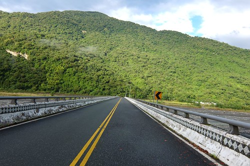 南安的山景又更漂亮了 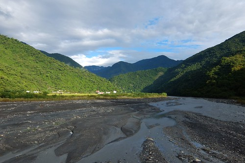 稻田也不出意料的美麗 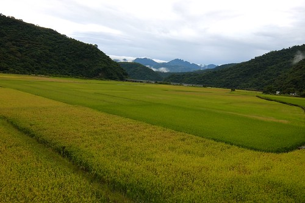 一個人 我當然更是逕自往田裡走 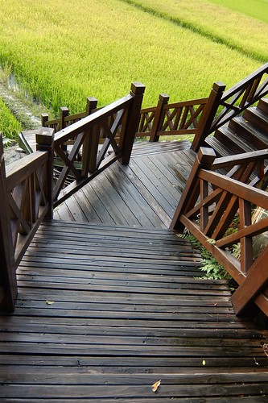 坐在木階梯的最下階 看著眼前這片田 大口呼吸著 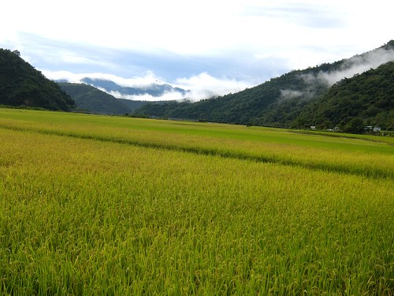 東看看 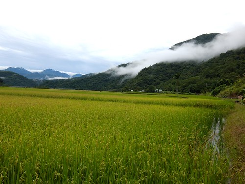 西瞧瞧 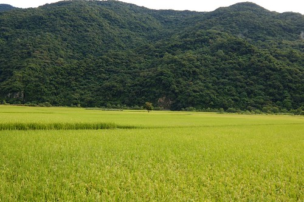 還有下往上 這一幕 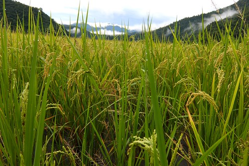 然後才心滿意足的拿出我的早餐享用 只是原本就不甚優的早餐在經過舟車勞頓之後更是不佳 可惜了點 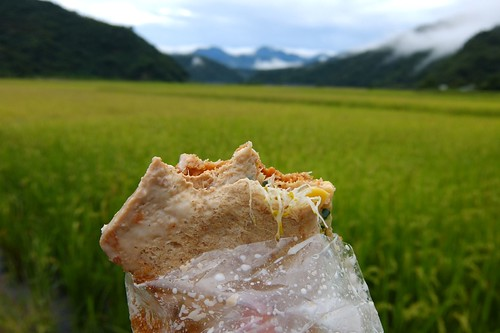 吃完三明治 我繼續的在田埂間晃蕩 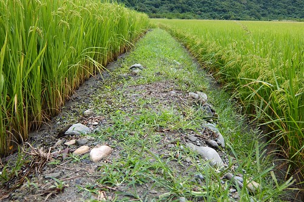 眼睛所見的360度 覺得每個角度都好美阿! 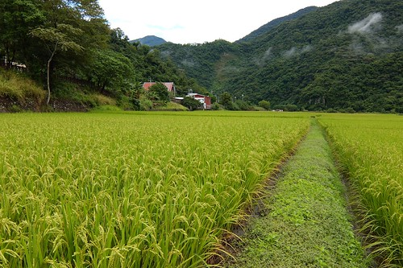 很可愛的雲吧! 根本不是雲瀑而是雲蟲 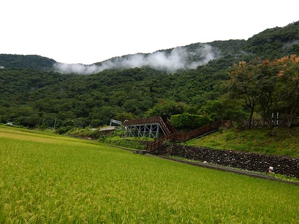 我也好喜歡稻田邊一堆堆的零星小菜田 每次看著這些田邊的菜 心裡都會莫名的踏實 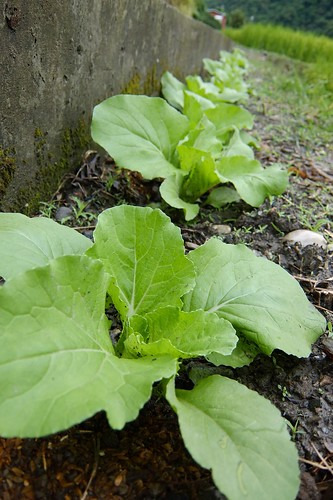 我等著雲層散去 光影美麗映射稻田的時刻 可惜 太陽公公遲遲不肯露臉 還越躲越裡 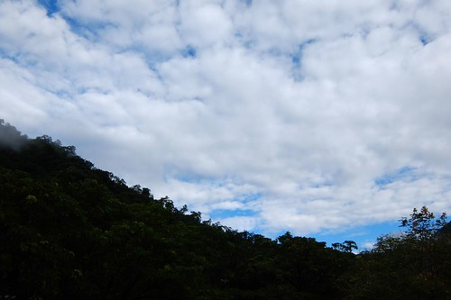 怕若下起雨就狼狽了  還是趁早起身回玉里 啟程前 繞進遊客中心想借個打氣筒打氣 但看到原本有的借腳踏車服務已取消 我連口都不敢開了 安慰自己 下坡比較不會有問題...  遊客中心裡的許多貓頭鷹 黑熊木材裝置還是讓我看的好喜歡 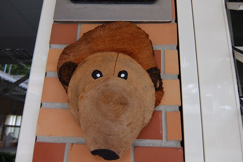 而原預定想去的南安瀑布還有瓦拉米步道  就等下一次全家來玉里時再去了! 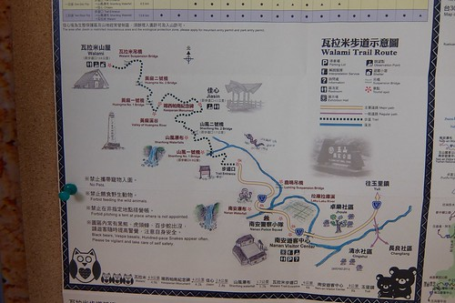 回程 經過卓樂部落 我又忍不住多瞧好幾眼 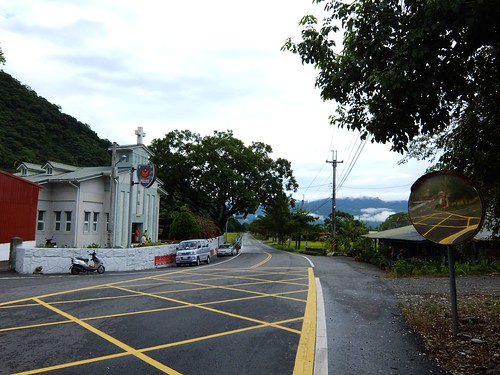 我好喜歡 台30這條路阿! (加映兩年前的遊記: [blog.yam.com/hmchen1975/article/37437494](http://blog.yam.com/hmchen1975/article/37437494)) 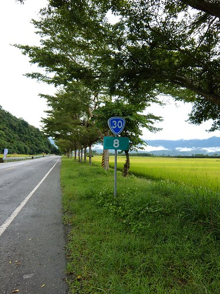 回到玉里已經9點多  天亮了許多 遊客也多了許多 尤其一台台載著攝影同好們的疾駛車子讓空氣中多了緊張感 襯著綠山 黃穗的紅鐵橋是玉里客城的經典 吸引許多攝影高手來這等候火車駛過的畫面 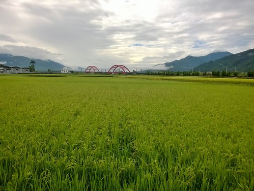 看到高手們心急的模樣  我真的忍不住噗哧笑出來 忍不住拍下我覺得其實才經典的這一幕 (我在台30愜意時 就是被這幾台飆速的車子給嚇到) 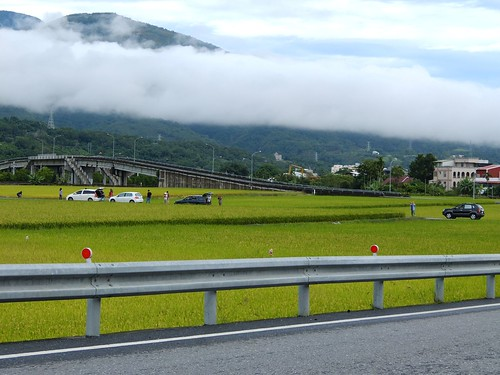 我很帥氣的 騎著腳踏車來到花蓮旅人誌上寫的鐵橋最佳觀賞處 (當下我心裡真的覺得好屌喔 也不知道自己在屌什麼 哈) 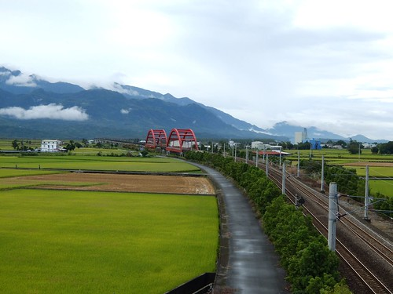 站在陸橋上 往鐵橋的方向 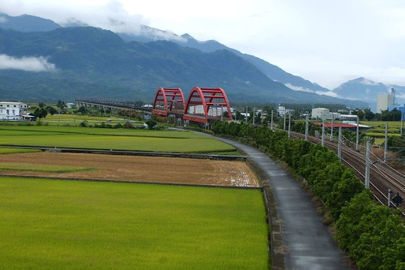 與鐵橋相反的方向 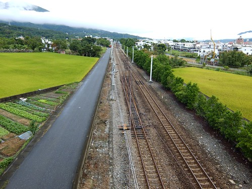 右邊 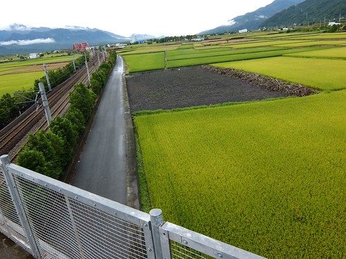 右後 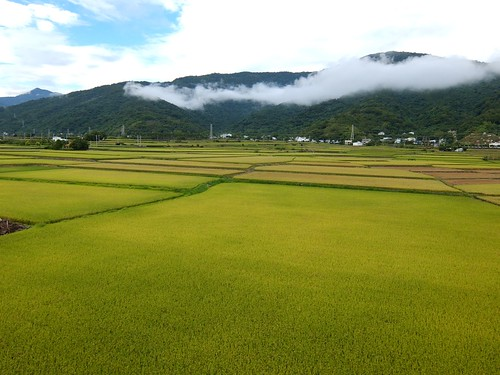 左後 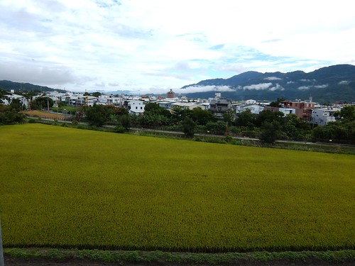 小鎮盡覽無遺~ 這一幕幕 讓我更是徹底戀上玉里這個小鎮!

我沉浸在自己的美好氣氛中 沒想到那群攝影高手竟也知道這秘密基地而來到 還因為陸橋柵欄擋了他們絕佳攝影角度而吵吵嚷嚷 然後不屑一顧的離去 可是就在她們準備上車離去時 火車來嚕....

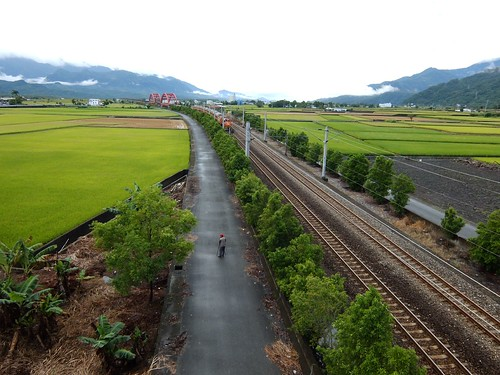 我一個人站在陸橋上 拿著一只小DC 興奮不已... 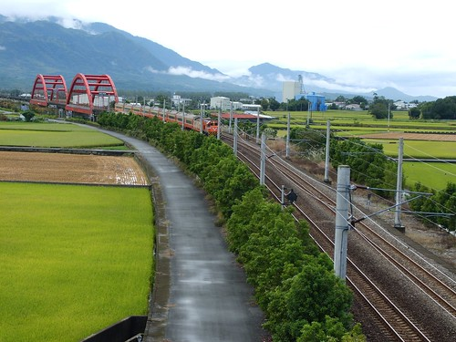 心裡哇哇個不停! 火車耶!!  我怎麼這麼Lucky 這麼剛好就拍到火車了!!! 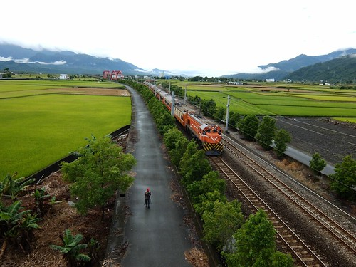 只是沒想到就在最高潮的時後 小DC螢幕顯示"電力不足"  然後怎樣都不給我拍了........... 這一切會不會結束的太戲劇性了阿!!!   "落漆"的很嚴重阿! 不過 這個早晨真的很棒!  很輕 很溫 但很暖...
