 

玉里是花蓮的第二大城 玉里的玉里麵 金針花 安通溫泉是最廣為人知的 吸引南來北往的旅客短暫停留 只吃一碗麵或看一眼花 肯定不是因為玉里麵 金針花或溫泉 自己說不上理由的喜歡南花蓮的這個小鎮 這回靠著雙腳的漫步玉里後 我明白了自己為什麼這樣喜歡玉里了 不只因為這裡的稻 這裡的雲 這裡好多的自行車道 還有因為這裡的一切都剛剛好...

南北往返台東的火車幾乎都有停靠玉里 只要事先查好火車時刻 靠著火車進行移動很是方便  可惜這一天的花蓮下著雨 雨勢還不小  抵達玉里的這半天 只能撐著傘在玉里鎮中漫步 度時光 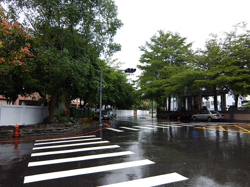 先是來到鎮上的五餅二魚用餐  大樹下 老房子建築的複合式茶舖 不若我預期的熱鬧 整間屋子的黑因為我一個客人的到來而點亮 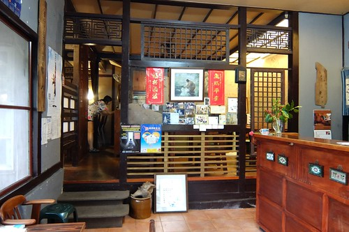 我選了個窗邊的角落座位 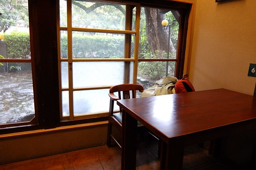 點了份可以讓老闆簡單準備的小火鍋 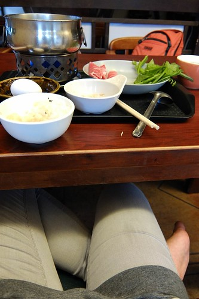 伴著窗外雨聲  享受一個人的午餐  自己難得可以這樣矯情做文青  休憩一個多小時 總算有客人上門喝咖啡  已經乾爽的我也剛好該離開了... 

其實天有點冷 肚子也剛飽 但我還是設定橋頭冰為自己的下一個目地 撐著傘漫步在來過幾回 有那麼一些些熟悉的玉里街上 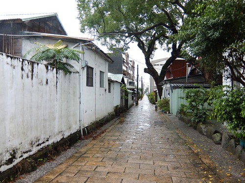 冰 我一直找不著 倒是來到有點印象的璞石藝術館 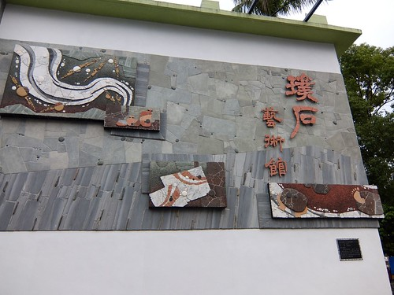 不知道民宿入房前還能上哪的我 順著好奇心走了進去 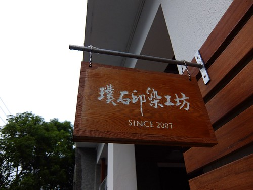 開放參觀 而且還有專人導覽的印染工坊 讓雨天裡的我 心頭好暖 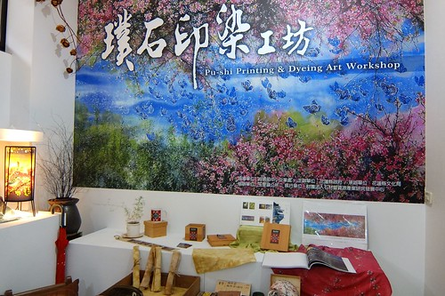 怕自己的來訪打擾 耽擱到裡頭的工作 但志工奶奶卻熱情又鉅細靡遺的跟我導覽介紹著   她說這也是他們的工作之一喔 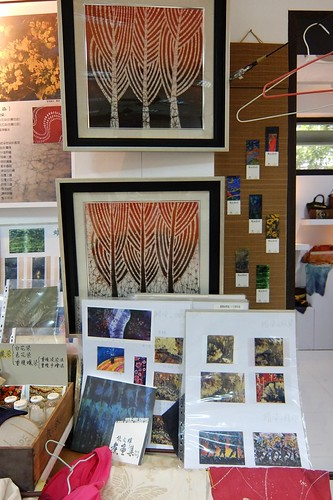 美麗的染印絹布燈  植物染圍巾 有衝動想買條回家可是又怕回家後被我束之高閣而作罷  東里國小小朋友的作品 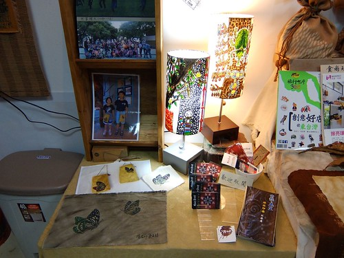 創校百年紀念 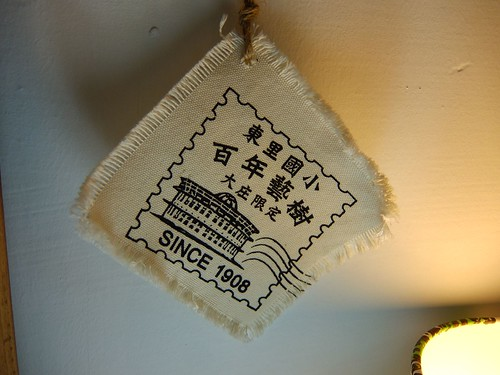 玉里公所近年推動「藝術客庄」營造與藝術駐村計畫 這是張文暐老師領軍的印染創作團隊  針對桐花祭創作的紀念衫 原本印來要送人的老師 捱不住其他學員們幫我的請求 割愛賣了我一件  ㄏㄏ 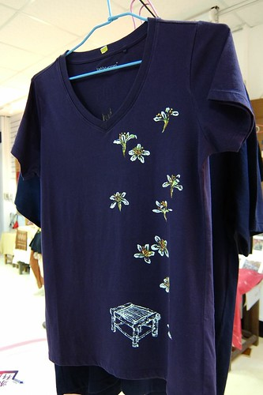 謝謝這些媽媽學員們 讓我一旁看著她們進行染印  她們一層層嚴謹的刷染著  看的自己神經也不自覺的繃起來  而當板子拿起時 也忍不住跟著一同讚嘆著 好漂亮的女媧! 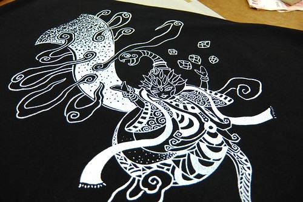 叨擾大家近半小時準備離去前  幫我解說的志工奶奶想到似的跟說 二樓有石畫藝術展也可以去看看喔  然後志工奶奶熱切的帶我到二樓 跟在場的大家介紹我這個一個人出門的女生 還拋給大家一個問題"大家猜看看她幾歲" 這個問題引起大家對我的歡迎與好奇 也讓我接下來如貴客般的被接待著 雖然真是很受寵若驚 但我還是厚著臉皮接受難得的專人導覽... 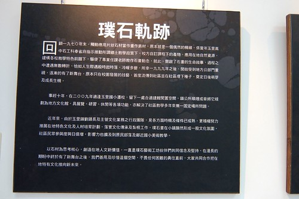 舊名璞石閣的玉里 利用石頭作畫的歷史最早回朔到1979 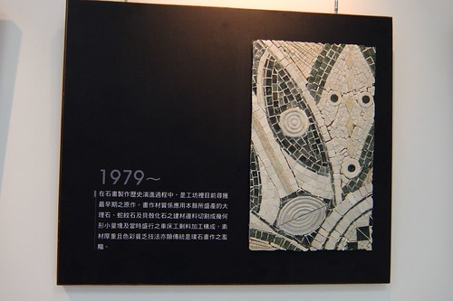 80年代 玉里高中甚至還有"石工科" 這個全台獨一無二的科系 (我覺得好屌喔) 花蓮的石頭藝術很有名 而一半以上石雕藝術師來自於玉里  幫我導覽的志工鉅細靡遺的跟我介紹著這些璞石畫的歷史與風格演進  讓不懂門道的我 上了一堂豐富的藝術欣賞課  不以為意的石頭 呈現在畫作上後 竟是這樣的豐富卻又單純  我尤其喜歡石頭散發出的溫潤感  這璞石藝術也向下扎根到國小裡 小朋友的畫作令人爾莞  我說"璞石"這兩字用真的真貼切也真美! 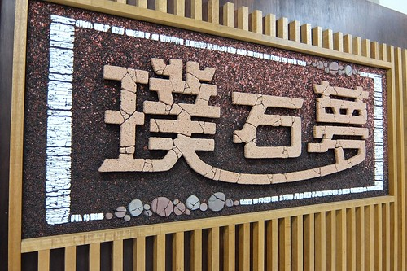 結束展覽廳的參觀後 接著回到一開始的工作室(DIY教室) 志工繼續好認真的跟我介紹其內的教學裝置 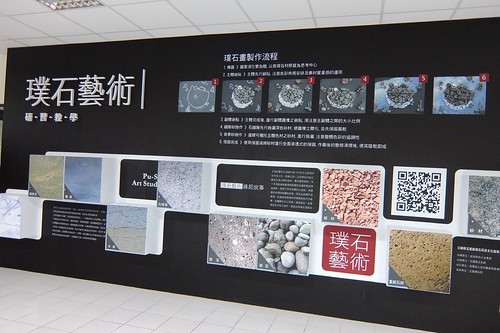 打開木櫃 撲鼻而來還濃郁的完工味道 我笑說"哇! 感覺我是頭香哩" 真的很豐富 很棒的地方 我何其有幸這麼被盛情款待著阿~ 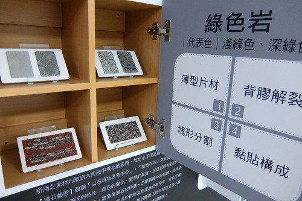 教室提供有三種產品的DIY  小掛畫的自由創作  以房子為主題的相框畫  以及人造石的製作  哇~ 連黃色小鴨也風靡到花蓮啦~ 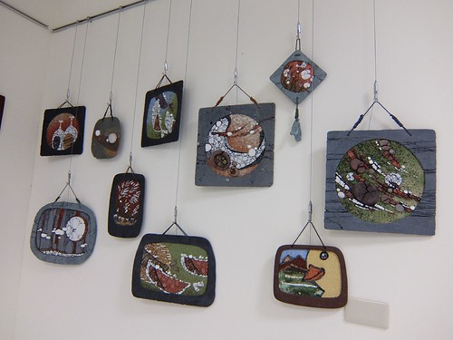 不可思議 這真是黃色小鴨作者的親手創作! 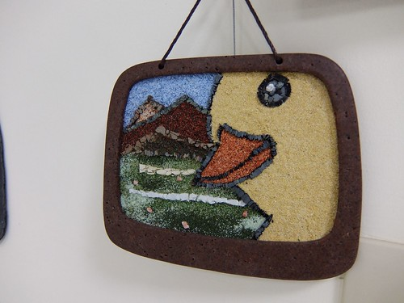 有簽名為證喔~  約莫一小時的導覽 不止聊璞石藝術也聊玉里的稻 玉里的美 謝謝工坊每一位老師 學員的熱情招呼 讓原就喜歡玉里的我更是喜歡玉里了  尤其謝謝幫我導覽的鎮公所黃科長 小女子真是有眼不識泰山  一直以為科長是學校老師 直到最後才知道原來是服務於鎮公所的科長 難怪導覽過程中 不止聊藝術 也聊許多玉里的事與物   讓我收穫豐富~  工坊設立完備好應該是沒多久的事 衷心希望這樣的地方能吸引更多遊客來到玉里 玉里絕對有足夠的條件成為大亮點  我深具信心~ 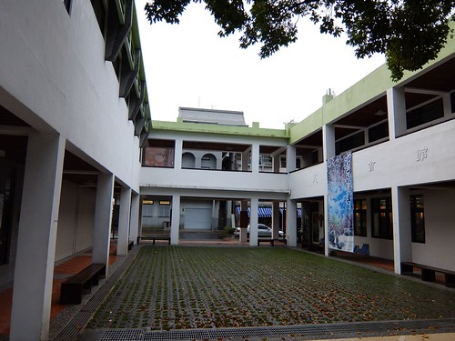 原擔心不知怎麼度過的下雨天下午 沒想到就這麼的滿滿到傍晚 今天住的地方是三年前全家騎車住過的鏷石民宿 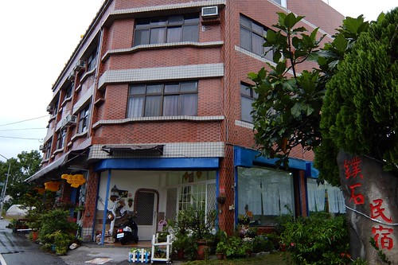 民宿乾淨便宜且令徹爸放心 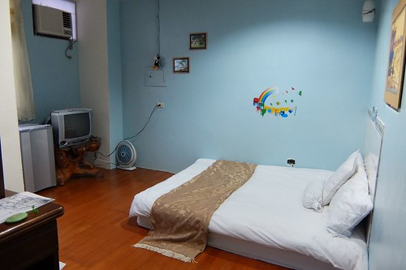 從房間窗戶看出去的傍晚時分 山 雲迷迷濛濛的 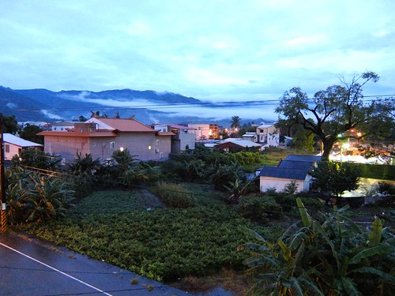 這個下午 我幾乎把玉里的鬧區走遍了  晚上本想就近在小7解決就好 但最後還是騎著民宿腳踏車去吃阿徹要我去吃的橋頭臭豆腐 第三次吃的橋頭臭豆腐 還是一樣是我心中No.1好吃 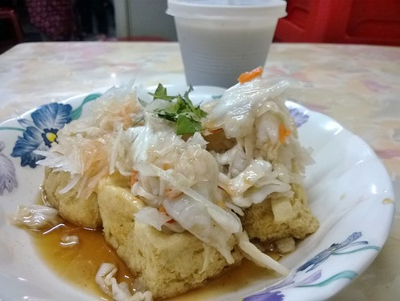 然後再去買碗阿婆燒仙草帶回民宿 以上我的晚餐  今天經過好多回的圓環 如每次來玉里時那樣的存在 我喜歡這樣剛剛好寧靜 剛剛好熱鬧的玉里小鎮 

很喜歡花蓮旅人誌文章裡描繪的玉里 隔天早上 依著地圖 我總算找到這彩色巷道 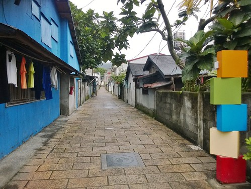 地上的跳格子地磚很有趣  斑駁石牆引人好奇想一窺究竟 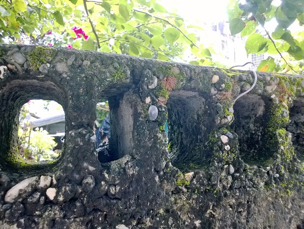 沿途兩旁 有矮舊房子 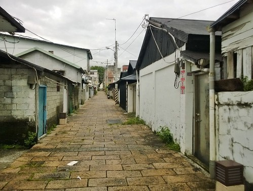 樸實小公寓  新穎小洋房  還有這最令我喜歡的舊樓房 簡單卻富風格 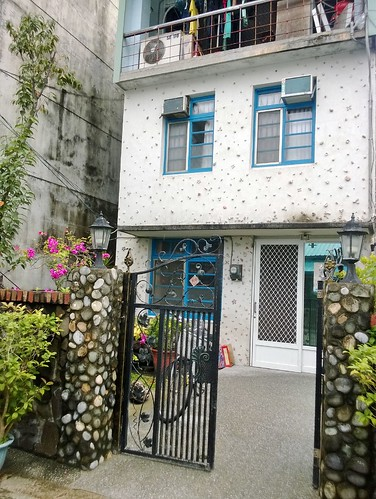 突然發現牆角處的圖騰真是可愛 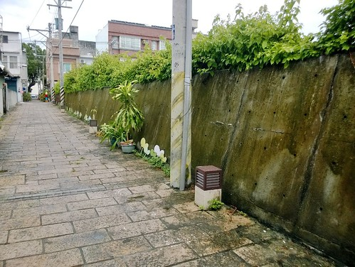 到這也才明瞭原來這是條學生的通學步道阿  任何的汽機車都禁止進入 所以這樣整齊 整潔 並饒富趣味 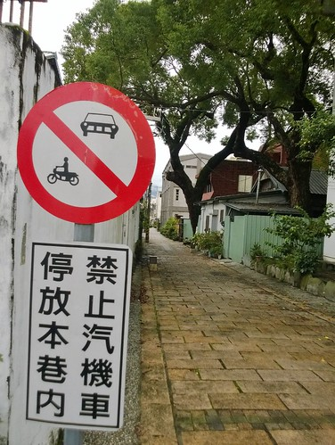 此外 鎮上有許多的老樹 大樹 很具看頭 藝術館旁的數顆百年笳苳樹  鎮公所前的老松樹 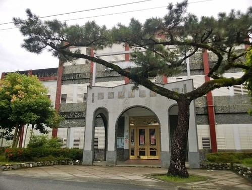 火車站附近的大樹  我喜歡這一顆顆讓人蹦見的盎然大樹  中午搭火車回台北前 當然最後一定要來碗玉里麵 11點多甫開店的湯頭 好燒燙好清爽~  再配上一盤涼拌苦瓜  令人滿足的一個人旅行的最後一餐 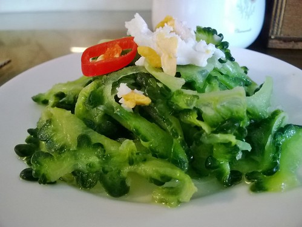 依依不捨的離開玉里 結束自己一個人的旅行  心想寒假一定要再來ㄚ~~~ 
