我ㄧ直很嚮往池上的秋收 但也一直沒能在秋天來池上 因為秋天是小學生新學年的一開始 實在不好請假來這遙遠的東部! 收集池上四季風采這麼多年 萬萬沒想到有一天池上會因為金城武大樹而變成大亮點 加上台灣好基金會這些年的積極行銷池上的春耕 夏耘 秋收 冬藏四季活動  連雲門舞集也在池上最美麗的秋收來舞稻禾 我最後收集到的池上秋色 好不熱鬧阿! 尤其在這熱鬧滾滾秋收的前一天!離開台北時的陰雨霏霏 沒想到火車抵達池上後 迎接的卻是大藍天白雲好天氣   看到月台上販售著的鐵路便當 正中午肚子餓的我好想來一顆 但是今日中餐早有計算 所以只能光聞香氣過乾癮 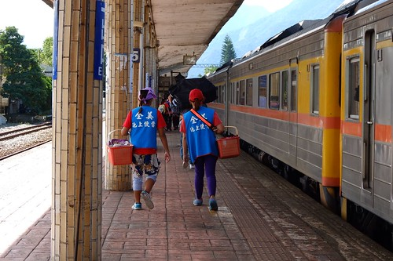 忍住不吃便當 為的就是來火車站附近的甘盛堂  甘盛堂是舊房子改裝而成的麵店 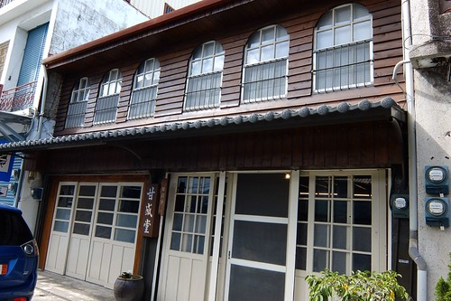 從店門口外到裡一整個很有日式小食堂的FU 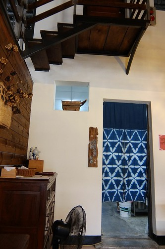 甘盛堂裡只賣四種麵跟兩樣的小菜 種類少但每一樣都是用當地食材所做 尤其加進米粉的米麵條更是特別 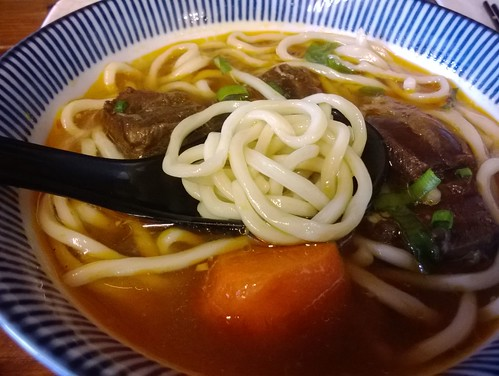 而小菜雖然只有兩樣 但溫熱的豬耳朵 清脆的小黃瓜 都好入味好好吃喔~  後來聽老闆跟別桌客人聊起才明瞭 今天真是很奇怪的一天 因為平常週末店裡高朋滿座 得事先預約才吃得到 但今天客人卻異常的少 所以我說我是特別幸運的 在理應遊客如熾的秋收前一日吃到甘盛堂的米麵條 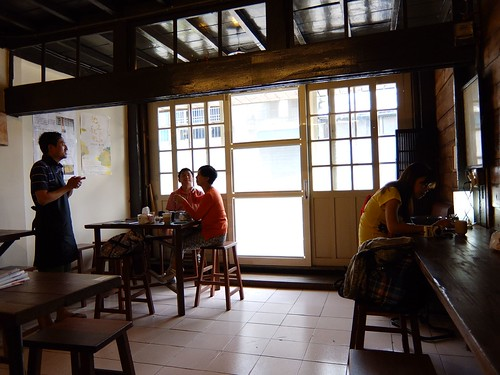 吃飽麵 踏出甘盛堂 看著成排的老樓房以及街道上的寧靜 深呼吸一口 "真棒的一開始"!  在火車站前的素食店租了台看起來很新但騎了兩百公尺後開始ㄎ一 ㄍㄨㄞ但卻也懶得回去換的腳踏車 雖然還是有拿好心老闆給的池上地圖 但我還是憑著自己腦海裡的地圖開始我的小鎮漫騎 途經大坡池渡假會館前 哇~ 一大排的單車 真是為即將到來的週末做好準備  而還沒騎到沿圳車道 就也開始感受到熱鬧滾滾 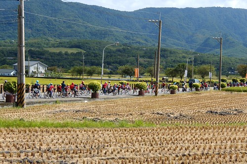 我 一個人 一台車 好打發 打算哪沒人就往哪裡去 只是才發現我心裡的景點好像挺冷門的 其實遇著的人的機會也並不多 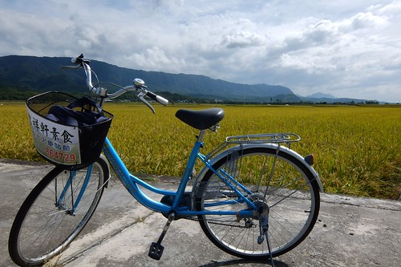 途經曾經住過的賢情玉緻 停駐好一會也多看好幾眼  而從這開始 沿圳車道也開始的豁然開朗  遇到幾個可以進到田埂的出口 我總忍不住停下車 近距離看這些稻穗 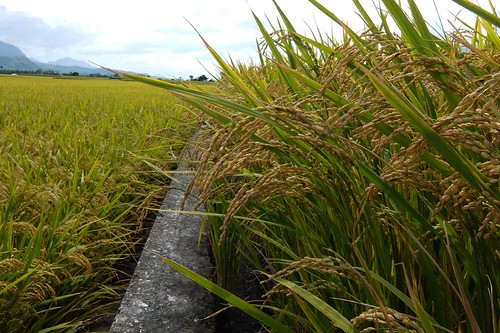 要不就會在稻米達人立牌的米窗裡  揣想停在這窗口的小鳥所見視野 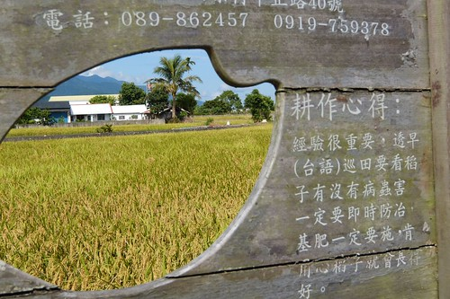 這時節的鳥真的好多  一顆樹上傳來的超高分貝啾啾鳥聲讓我懷疑大概有一百隻鳥停在上頭吧! 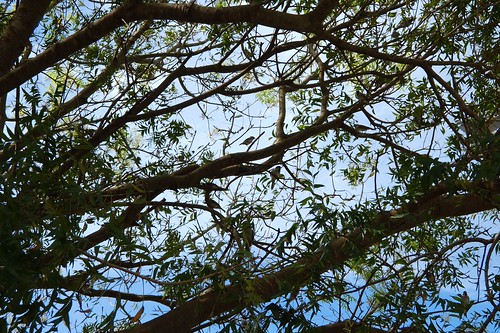 離開環圳車道 轉進往萬安的方向 映入眼的一幕幕 讓人快門按個不停~  意外的發現 遠遠那棵樹就是金城武樹吧!  騎近一看 果然此地不宜久留~  我繼續朝著伯朗大道的方向騎  但卻也是朝往人潮的方向 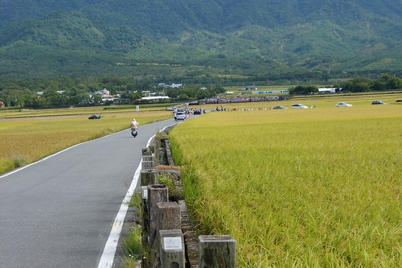 這個下午有雲門舞禾的採排 也是回饋地方的鄉親場 遠遠就感受到好不熱鬧阿!  看著當地鄉親 扶老攜幼趕赴這場盛宴  感覺挺妙的  騎離開因為管制而塞車的天堂路 來到了伯朗大道  哇~ 竟然沒人哩~ 快拍阿~  交雜著黃黃綠綠 無限向前延伸的池上這片田真的是很美  而且就像租單車老闆說的 今天天氣很好 大太陽下的稻穗更是閃亮漂亮喔  不過我也突然發現被風彿著的稻浪 好像阿徹的頭髮喔 茂密又刺刺的 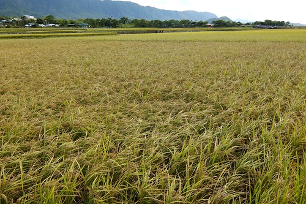 雖然我每次都很不齒這根立柱 但我每次還是都照它  哈哈! 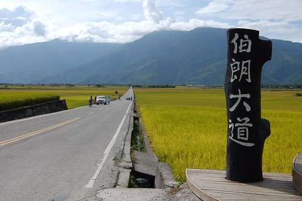 而這相框 也是我怎樣都覺得畫蛇添足了些  既然是來收集我的池上秋色 當然一定得要來到稻米原鄉館 出乎我意外的冷清 但卻沒了往常的寧靜  因為儼然成了這次活動的休息準備處  在這 意外的發現金城武大樹的奉茶茶壺(原來沒奉茶的時候 茶壺在這休息阿) 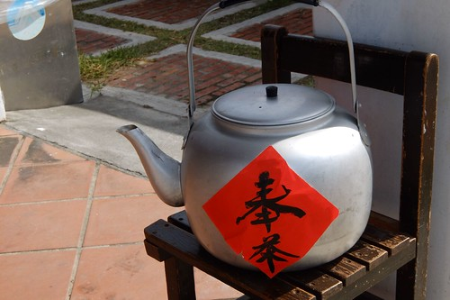 買了一根米冰棒 上到原鄉館的二樓 倚窗的老位子已經不是當年好多年的模樣 我只好坐到露臺區 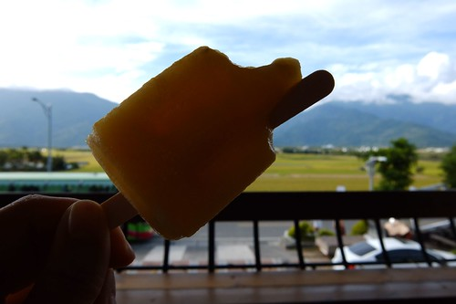 這一幕是我想收集很久的池上秋天顏色阿 只是畫面中 除了我們每次都嫌礙眼的電線外 還多了好多車子 好多旗幟 跟有的沒的 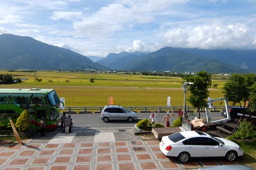 其實我沒有反對這樣的觀光推動 只是總覺得除了說個故事或是透過文藝活動吸引都市人來到鄉村 是否也有同時讓當地的居民在被尊重下 獲得實質的生活改善與整體質的提升 台灣的農產品如何在雙贏的情形下 更有效益的經營出去 我覺得才是這行銷之外不能忽略的初衷  沒有金城武大樹 也沒有電線桿的這一幕 其實才更是池上的經典阿!  離開原鄉館後 我繼續朝著沒有人的小圳 小路騎  突然一個轉頭 發現遠方怎麼有條螞蟻大道 嚇~  單車塞車的伯朗大道 真的很妙!   遠遠看著的我忍不住笑了... 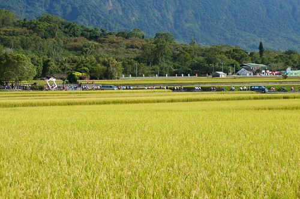 繼續來到本來擔心會人很多的錦園洗衣亭  想不到一樣的是我獨享阿! 哇哈哈~  乘涼賞景的同時  我心裡想池上還是池上 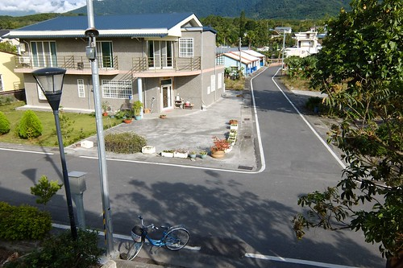 大半的池上 還是這樣平常 寧靜的過著日子  我心滿意足的踏上歸途 繼續騎在沒有人的車道上 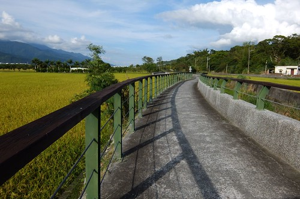 經過大波池  遠遠的 一片祥和 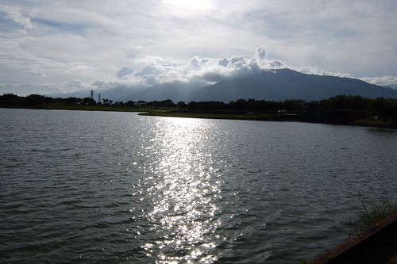 秋天的大坡池原來這樣的美 這樣的煙波寧靜  雖然看到一大群應該是畢業旅行的年輕人在湖畔邊唱歌跳舞 又令我大笑了 但這衝突的組合 感覺真美 真好!!!  謝謝池上! 給了我這麼棒的四季風采 春耕 夏耘 秋割與冬藏!!!
