雖然我的心早就按耐不住的想寫南花蓮的這個秋天 但為免很多事過了這個村就沒那個店 還是督促自己一篇篇補上值得寫上一筆的這些事! 繼兩年前的隙頂旅行後 一大家子嚷嚷且期盼許久的家族旅行總算再次舉辦 五個兄弟姊妹 橫跨三代 共23個人的一大家子旅行 真的聲勢浩大也好熱鬧阿!

這次家族旅行的地點在苗栗三義  而為的就是卓也小屋的藏山館 卓也小屋是苗栗很有聲望與口碑的民宿 尤其桐花開的五月一房難求 但高品質相對應的高房價對於我來講卻也難以承受 不過後來看到卓也別館 藏山館的資訊 我好喜歡也好期待 除了價格平民許多外  有著歲月痕跡的舊磚瓦屋更完全是我的菜 加上遠離本館彷如遺世獨立 但又功能齊全的大建物 超級適合一大家族的旅行 於是年初的舊農曆年 趁著兄弟姊妹們都回家的時候向大家推薦了這 謝謝張大姐一直放在心上 還辛苦算日子搶訂房且打理大小事 看到一大家子這兩天都玩得這麼開心 肯定大姊的感動是最深 而當大家才玩回來就又在FB聊天群組開始討論起明年要去哪 住哪個民宿時 真的好好笑!!! 也可見大家真的有玩開心!

下面就透過照片介紹藏山館也記錄這次的家族旅行: 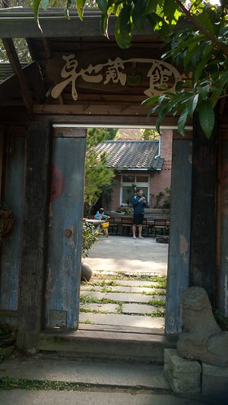 進入斑駁小木門後 映入的是讓大伙驚訝的大院子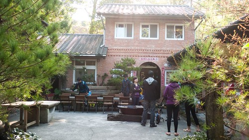 以及三面環繞 功能齊聚的老房子  盡是的木材與紅磚建材 看了就好舒服  包含4間雙人 2間四人 1間八人通鋪的房舍 睡個30人也不是問題  而最令人滿意的是有著超級多的公共空間 除了院子裡有大桌子 側邊露臺上也是賞景聊天的好地方 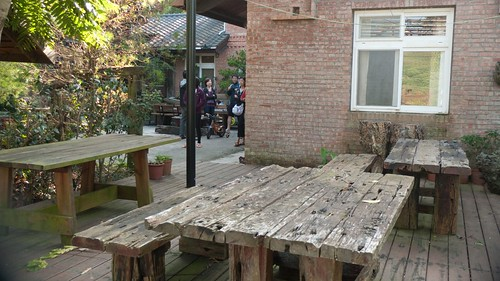 兩個室內客廳 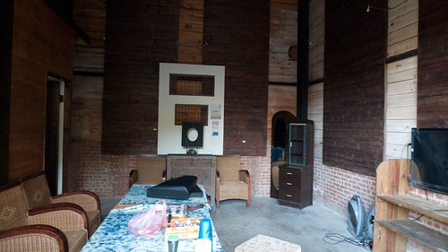 可以讓人在睡前窩在一起看電視 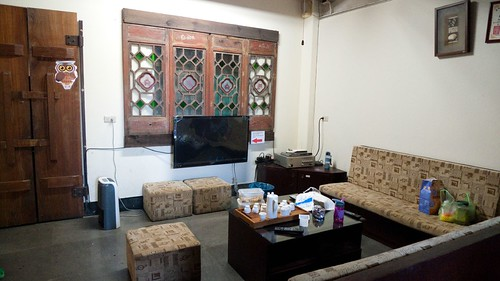 但最最最...出乎意外受歡迎的是這超大間的多功能室! 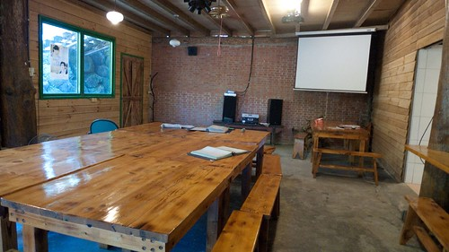 隨處可見的小佈置 小美麗  只是這兒的門牌 還真是有點嚇人~  嘖嘖稱奇的大伙 四點入房後開始各自找玩樂 找想窩的地方 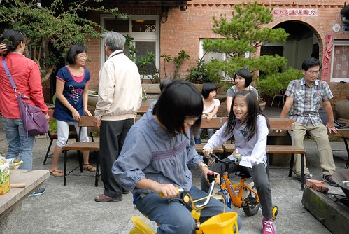 玩大家有備而來要PK的大富翁 打地鼠 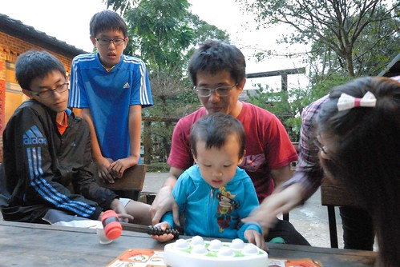 唱很久沒唱的卡拉OK  意外發現原來大家這麼愛唱這麼能唱 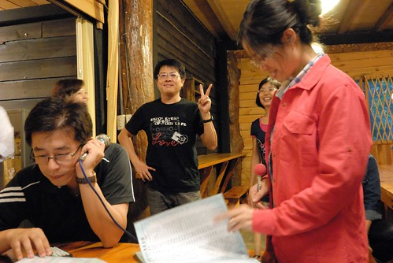 趁著天黑前 喚了所有人來張大合照 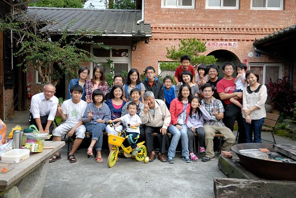 徹爸家五兄弟姊妹 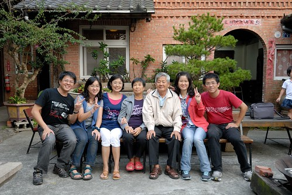 大姊家  二姐家  三姊家 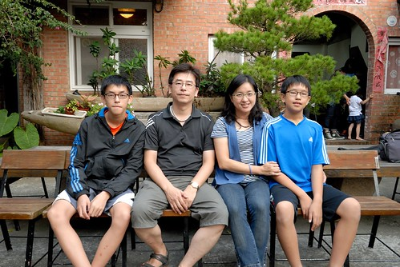 大哥家 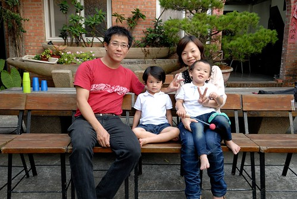 還有么子的徹家  照片裡的大家都笑的好開心也好自然阿~ 棒!

別館住宿不若本館的一泊二食  但可提前預約晚餐 而早餐則一樣的有包含在包棟房價裡 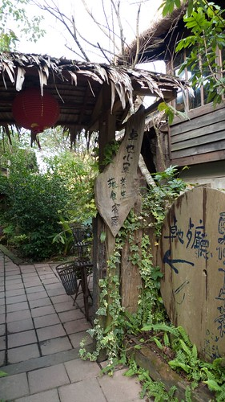 所以還是有機會可以到美麗的本館裡走走的 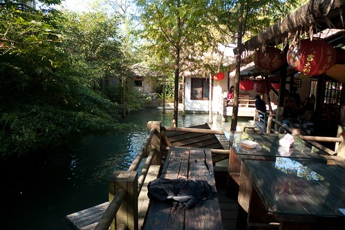 在池子旁的餐廳用餐 意境遠大於餐點本身  尤其那養鵝鴨與魚的池子 更是小小朋友不乖乖坐著吃飯時的最佳去處  真的蠻愜意的一個地方  我們也預約參加卓也的藍染課程 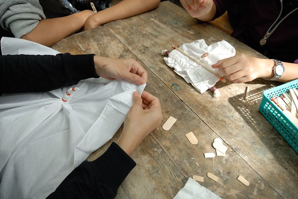 沒有外人的包場 大家毫無保留的跟老師互動著 老師應該很哭笑不得 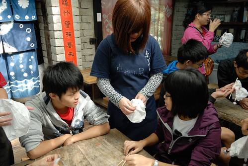 不過大家都有很認真的激發創意 且執行每一步驟喔 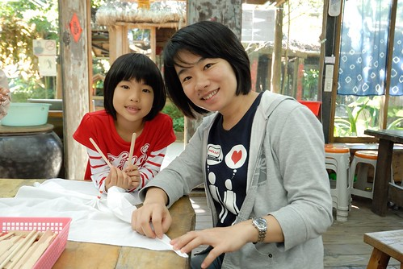 今天徹哥完全自己獨當一面 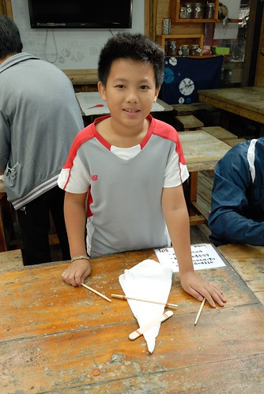 已是小學高年級的他果然實力不容小靚  尤其又是他最喜歡的藝術創作  設計 綁好匹布  大伙穿上圍巾要開始最大工程的染布了 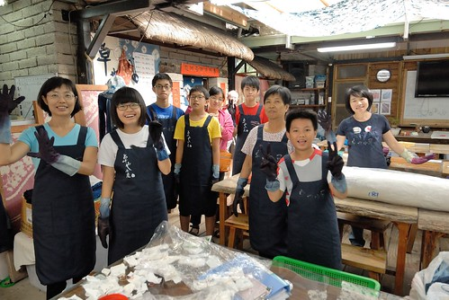 陽光下的兩個大染缸 真是很有FU阿(很難得一家子一起這樣搞氣質)  三個大男孩 窩在這小缸一起摸  五個大人窩在另一個大缸一起摸  真的是在缸裡摸阿! 努力的磋 摸 讓染料均勻的染上布  每次在缸裡搓泡三分鐘 就要起來讓布風乾  要很頂真的把布的每個地方充分養化 最後成品顏色才會漂亮 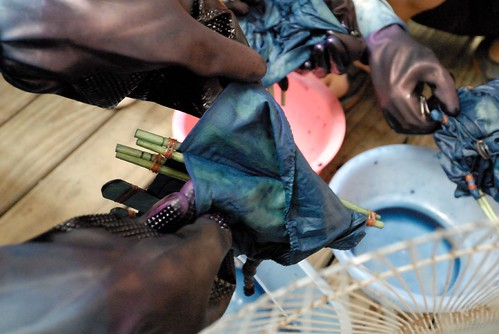 對稱摺合很多的阿徹 比別人多花一個步驟的時間完成作品 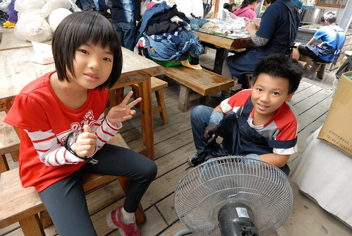 但不愧高年級了 默默承受 有始有終 還憋尿直到完成最後一道的染布才忍不住的跑去上廁所 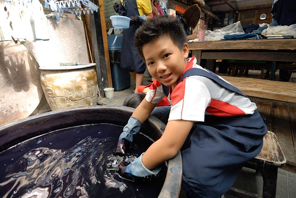 一群人努力的染布 剩下的更大群人則到處溜達  雖然染到第三次程序大伙就哇哇叫 但大家還是很有毅力的完成六道染布程序 最後用清水清洗至沒有顏色流出 脫水熨乾後就大功告成了 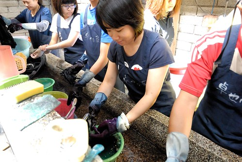 老師預言 效果應該不錯 最令她期待的阿徹作品 果然~ 小學生 good job! 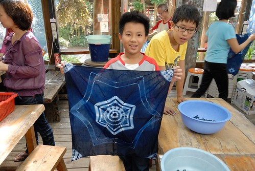 中午退房前 大伙拿著辛苦一早上的作品大合照一張 每個人的作品都獨一無二 也都好美阿~  離開卓也 一伙人浩浩蕩蕩的來到旅行的最後景點 勝興車站  等著用餐前的小人 走軌道 玩石頭 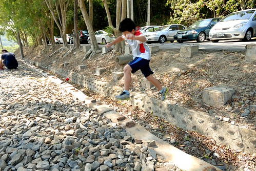 一群小孩子怎樣都能玩  最後一起進到美麗的餐廳裡用餐  等候餐點的時間裡 依然繼續著大人的聊天與小人的遊戲 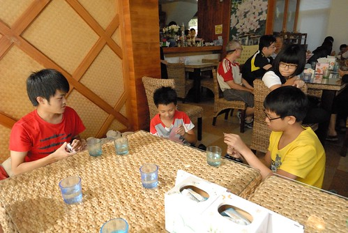 睡的好不好 吃的好不好 不是重點 一家人可以一起吃 一起睡 一起玩戲 一起唱好多歌 說好多話 才是家族旅行最美好的事 
