I-Ku 生日快樂!!!

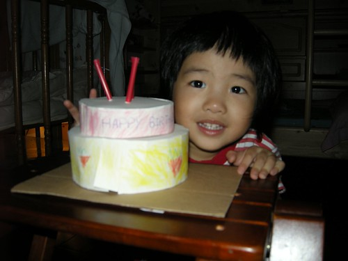

I-ku 是阿徹哥哥與媽媽一起替妹妹取的綽號 因為妹妹常在搶不到東西 不想吃飯 被罵罵時  "啪"就哭的響徹雲霄 阿徹哥哥便會笑妹妹"愛哭..愛哭" 經媽媽改良後變成這個有點像日文又有點像中文的 "I-ku  I-ku" 每次妹妹大哭時 阿徹哥哥就會大喊"I-ku"又在哭了....

11月初學校辦當月慶生會的那一天 我們在家也做了一個蛋糕送給愛愛 然後一家人很認真很虔誠的圍著蛋糕唱生日快樂歌以及許願 做蛋糕的創意與主意來自阿徹哥哥 可是在看了那弱不禁風 彈指可破的demo版後 媽媽忍不住下海技術支援與阿徹一起完成兩層蛋糕的剪貼還有上色 而最後的組合以及蠟燭則是爸爸的巧手贊助

一開始愛愛很害羞 躲在客廳不願意進房 最後則是玩的欲罷不能  一再的要我們替他唱生日快樂歌許願 就好像真的在過生日一樣

昨天阿徹他們的小表哥典澂因為心臟手術失敗最後走了 今天我與徹爸更無心幫愛愛過個真的的生日 於是月初那場玩笑生日會就這麼成了今年愛愛的生日會... 一如以往我們沒有準備可以與小朋友一起分享的大蛋糕 糖果餅乾 也沒要讓小壽星可以享受任何特殊福利待遇 因為生日不過是三百六十五天的其中一天 我希望孩子們每天都能也都該健康快樂..... 真的! 健康快樂最重要.......

順道出清一下積著的照片還有小小紀錄愛愛的近況

\============================================================

愛愛的吃飯大戰還持續在上演 奮鬥中… 不過戰況有緩和些 時間也縮短了點 可以算是小小有進步有進展啦 雖然與徹爸有小感欣慰 但卻也更加堅信與堅定這場戰爭不成功不縮手!!!

只是愛愛吃飯的情況實在起伏變化很大 可能前一天喜歡吃肉 後一天卻怎都不嚐 可能前五分鐘喜歡吃菜 最後卻也因菜而難以下燕 或是前半碗飯以著一分鐘三口的速度進行著 後半碗飯卻是三分鐘一口 落差大的有點令人難以捉摩 我想這場戰事如果可以成功的話  彼此間的耐性與耐力應該也進步不少

幸好愛愛喜歡吃水果 尤其是香蕉 大半的時候總能以水果半逼半誘的讓她在40分鐘內吃完 (比起曾經的兩小時 真的是有進步該偷笑一下了) 愛愛也應該是有意識到爸爸媽媽對於吃飯的要求好像是來真的 有比較認命 認真看待吃飯這事了 所以常在無謂的掙扎反抗之後 自個默默的繼續扒她的飯 然後在好不容易扒完後開心的說著"我吃完了 我好棒" 

有一次晚上約了要帶愛去看醫生 偏偏愛愛的飯又吃的好慢 還不時的跟我說"等一下要去看醫生對不對" 那表情好像在跟我說"我等一下要去看醫生 所以沒吃完飯也不會怎樣吧" 只差後面那句話沒從她口中說出來而已 後來礙於時間 我也真的只得邊減飯量邊逼他吃完平日的一半 她算是有得逞了….

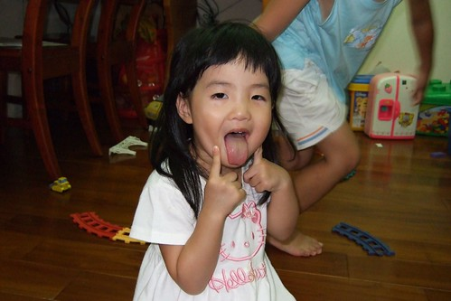

看完醫生回家後 我在停放摩拓車時 愛熱心俐落的幫我把停車格內的禁止停車柱搬走 搬好後一臉得意的跟我說"我好厲害 對不對" 我說"對阿 你好厲害 只是你吃飯不厲害" 本來以為她會害羞的傻笑一下的 結果她竟然是毫不害臊的冽嘴大笑說"對阿 我吃飯不厲害" 聽的我哭笑不得… 唉…………

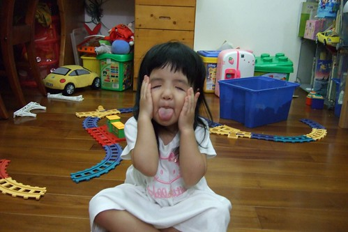

沒錯! 語言表達越來越流利甚至懂得得用腦袋瓜說話了 常會在爸爸媽媽生氣數落他的時候 一臉政經+無辜的指正我們哪裡說錯了 例如: 媽媽你說錯了 是吃薯條不是喝薯條 害我們的氣馬上就被消了好幾分 還得忍住無奈笑意說"我剛講錯了 是\*\*\* 謝謝你 不過...." 繼續開罵

(我與愛愛換新髮型那一天的合照 熊熊發現阿徹哥哥的表情怎麼這麼欠扁阿) 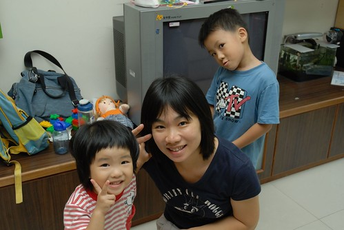

受哥哥的影響 愛愛也常嚷著"我的功課還沒寫" "我要用水彩畫圖" 昨天甚至一整晚一直跟我嚷著"我今天好忙 好多事情要做" 然後一下子寫功課 一下子畫圖 一下子湊熱鬧的要幫媽媽拖地 (邊拖還邊念 我好忙我好忙) 目前最愛畫也唯一能畫出具體形象的東西是太陽 有眼睛 有鼻子 不愛笑的太陽

某天媽媽被洋蔥嗆的忍不住去拿哥哥的蛙鏡來戴著切洋蔥 用完後一個不小心蛙鏡就被愛愛拿去當眼鏡戴著看電視了

阿徹以前幼幼班的老師 Jenfier 每次看到愛愛時都喜歡特熱情的跟她打呼  尤其是早上 而愛愛常聽到Jenfier熱情的"愛愛 早安"後常就是呆在原地然後開始抓頭髮 極害羞到像是想鑽到地底下去的樣子  (愛愛每天早上上學時都是超害羞好像新生一樣) 不過往往到了放學後的遊戲時間時愛愛又會活潑到眾人好 剪短髮後上學的第一天 Jenfier跟愛愛說"你怎麼頭髮剪掉了 這樣更像小阿徹了" 結果愛愛笑嘻嘻的說"對阿 我哥哥也有去剪頭髮喔"  好一個雞同鴨講 不過剪短髮後的愛愛看起來是真的更像她哥哥了

最近晚上一家四口偶而會玩玩賓果遊戲 數字還不認得幾個的愛愛也會湊熱鬧的要算一咖 不過姑娘的運氣不錯 有她參一腳的那咖常常得到第一名

圈的很認真喔... 也慢慢懂得要挑快連成一條線的數字了

連成一條線後可得意的哩

YABE!  我跟媽媽第一名

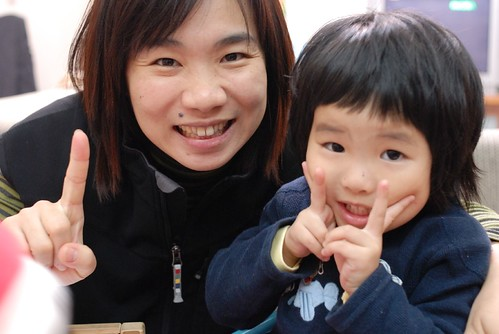

得意的小愛擺出最近照相的101式

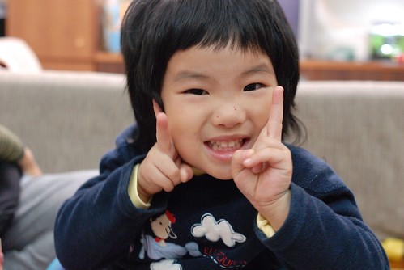

愛愛很愛學校的運動服 常會叮嚀媽媽星期三要穿運動服 戶外教學要穿運動服 可是運動服容易髒又不容易洗 所以除了戶外教學一定穿以免小孩不見了被老闆買去了( 這是愛愛說的) 可以的話 媽媽不愛讓她們星期三穿去上學 可是現在如果媽媽沒有讓她們星期三穿運動服去上學 姑娘回家後一定會數落媽媽一番 然後接下來的一週也會一直嘮叨著 星期三要穿運動服

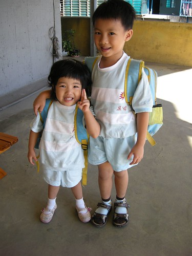

其實兄妹兩的身高應該只差20公分左右吧 可是每次看到兄妹兩依偎的合照就會覺得妹妹怎麼這麼嬌小阿

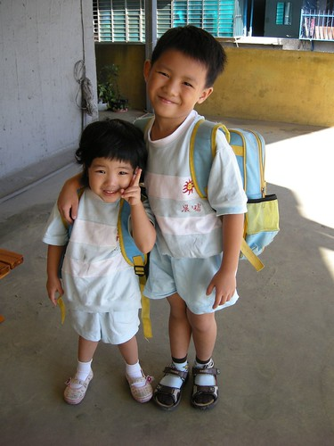

\=========================================================================

十月底的萬聖節遊行 徹爸出公差揹著小兩一起跟著去遊行 雖然主要是要幫忙園長照遊行的盛況 但肥水不落外人田 還是照了不少自己那可愛的女兒 當全校其他小朋友看到徹爸那對著她們的鏡頭視而不見不笑 只有自家的女兒永遠笑咪咪的對著老爸的鏡頭擺出101式

可能有阿爸在的關係 愛愛今天遊行的很開心

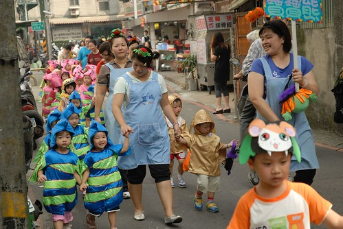

雖然大熱天裏穿著小魚裝很熱很熱....

但看到鏡頭就是笑! 笑!!

很盡責的小model

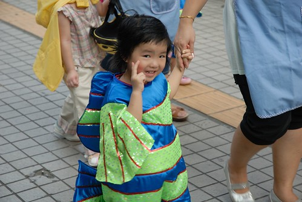

媽媽很愛這張小魚的背影

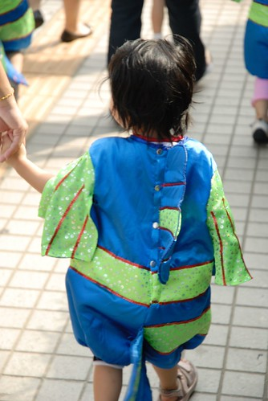

結束遊行回到涼爽的學校等發糖吃嚕~~~

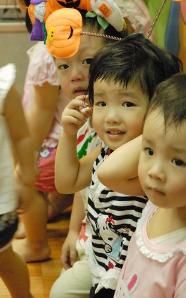
