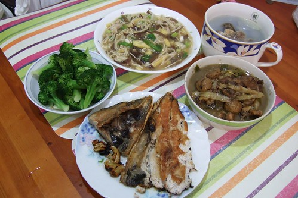
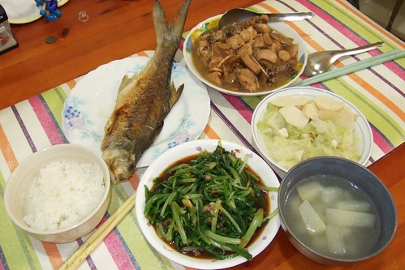
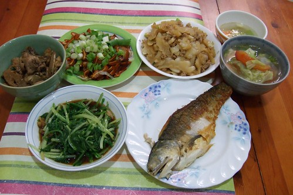

我一直覺得老天爺不會對一個人好太久的...  
  
下班後不用忙著洗菜煮飯就有健康營養"便當"吃的好日子果然突然間就結束了...  
  
當便當店老闆娘偷偷告訴我"因為人力問題要改賣麵時"我的眼淚真想滴下來  
老天爺阿~你真是看我爽太久了喔~你真是不願意我這樣懶惰下去喔~  
你要我去哪找這麼乾淨 不油不鹹 青菜多又富變化的便當給我小孩吃阿~   
雖然徹爸一直覺得這便當口味太淡  
但是卻深得我跟阿徹的心　尤其阿徹超愛阿姨的飯飯 　  
週一到週五問他想吃啥 10次有9.9次是說阿姨的飯飯  
偶而當媽媽想換口味吃別的東西時就得去請阿姨裝縮小小版的便當才能打發阿徹  
週末阿姨不營業的日子阿徹也常嚷著"要吃阿姨的飯飯 為什麼今天沒有阿姨的飯飯阿"  
  
雖然曾經憂心以後阿徹的回憶裡沒有媽媽的味道(有的話大概只有海鮮粥)只有阿姨飯菜的味道  
但這樣可以媽媽輕鬆 全家又吃的開心健康的便當店   
對我這職業婦女來講真的很重要 很重要  
賣飯飯阿姨常常說"煮飯辛苦的事就交給我們啦 媽媽負責陪小孩子玩就好了"  
嗚～此情已待追憶～

沒有了阿姨飯飯　我只好認命的煮媽媽牌晚餐  
趁著周末把一週的魚肉菜都採買處理好  
還替荒廢已久幾乎只煎魚煮湯煮粥燒開水的廚房添換不少調味料（黑醋早已見底　醬油放到發霉）  
然後開始每天下班後衝衝衝　趕趕趕　洗洗洗　煮煮煮的日子  
  
真的覺得煮飯是件勞民又傷財的事  
進趟市場沒有１－２張的四個小孩很難全身而退  
再俐落也得花個３０－４０分鐘準備好有魚有肉有菜有湯的一餐  
重點是餐前的準備跟餐後的收拾讓我少跟小孩玩一個鐘頭  
而且套徹爸說的＂便當沒吃完就算了　媽媽辛苦煮的菜沒吃完很可惜＂  
哈哈～沒錯　媽媽大汗滴小汗流煮的飯菜沒吃完可是會想扁人的  
  
多了準備晚餐這件事 每天晚上幾乎就是忙著煮飯 打理小孩吃飯 收拾 洗碗 準備水果 然後小孩準備洗澡睡覺  
真的少了很多跟小孩悠悠哉哉相處玩樂的時間  
某天徹爸飯後 阿徹突然說"爸爸都沒有幫忙做家事" 硬是指定要他爸去洗碗  
於是徹爸只好硬著頭皮去洗滿槽的鍋碗瓢盆  
其實我是有點不放心也有點同情徹爸這麼晚下班吃完飯還得洗碗  
但想想也許是個機會可以彌補我對於徹爸堅持不幫我晾衣服的不諒解  
洗了第一次碗後 徹爸似乎對於自己可以有所貢獻很開心很欣慰  
徹爸說"以後就都給他洗碗"  
他說他堅持不肯晾衣服是因自己一個人站在陽台晾衣服很孤單  
洗碗就OK啦 沒有孤單的感覺   
因為母子三不五時進去探班而且還是聽的到小孩的嬉鬧聲  
很怪的想法&理由 不過就這麼分工吧...  
  
(擺了20天的日記刪除可惜  還是繼續寫完吧)  
  
自己煮飯忙歸忙 但其實很多快樂與成就感是阿姨的便當替代不了的 例如  
阿徹常會去偷吃用苦茶油煎的香脆的魚 邊吃邊喊"媽媽 你煮的魚怎麼這麼好吃ㄚ"  
有時聞著剛盛起的飯說"飯飯好香 好好吃喔"  
聽到兒子這麼捧媽媽的場 辛苦真的也是值得的  
或是看到徹爸滿足的吃著他最愛的香煎虱目魚 喝著料多實在的熱湯  
總要到起身後 摸著自己的大肚南才驚覺"怎麼又吃太飽了"   
看到老公小孩每天這麼吃飽撐著 心中真的會有股莫名的感動與驕傲  
也許那些養豬公比賽的人就是這麼的心情吧...  
  
(被阿徹小手荼毒後的虱目魚就像被狗啃過一般)  
  
  
四個人的晚餐  魚 / 肉 / 青菜 / 熱湯 一樣都不能少...  
  
  
  
可是一尾魚要剖半分兩次  一把青菜也要分兩天  
煮太少怕老公吃不飽  可是吃剩的還是想辦法進了媽媽的肥肚裡  
難怪這個夏天我瘦不下來  原來兇手是我自己  
  
  
  
週一到週五這麼勤奮的煮了一個多月後  
阿姨總算重新開張賣起 香菇肉羹麵線 滷肉飯還有涼麵  
雖然這些東西頂多一週吃個1-2次 但起碼可以少煮一天飯了  
阿姨重新營業的第一天  阿徹雀躍的跟著我去捧場  
還突然迸出"真是太好了 媽媽可以比較輕鬆 不用每天煮飯了"  
ㄟ....該說阿徹是善體人意還是慶幸可以少受媽媽一天的荼毒ㄋ  
(因為媽媽常會說"媽媽煮的這麼辛苦 給我吃~~~")  
  
幾週後 阿姨又增賣了以前的排骨飯跟雞腿飯  
OHYA! 媽媽又可以少煮1-2天飯了  
只是還是沒有魚 所以還是得自己煎魚   
不過能又再吃到阿姨的飯飯真的真的心懷感恩  
老天爺其實還是蠻照顧我的~嘿嘿
