自從去年底人來瘋地成為投資客後 因著對第二個房子的夢想 開始留意起書局裡居家裝修/佈置類的書 十月裡看到了這本不同於我平常所見有關談房子的書 一開始"驚艷"於書的封面  翻看之後則是被裡頭一張張的"家屋"照片給觸動著 而沒多想的把書買回家後 自己竟有如看小說般的沉迷於書中每個家屋的"故事"中 談的不只是"房子"  這本書更多的是每個屋主及作者對人生 對生活 對自然 對房子的分享... 除感動於每位屋主的勇氣與用心外  我想我對自己的"家屋"也有了不一樣的想法與夢想了!  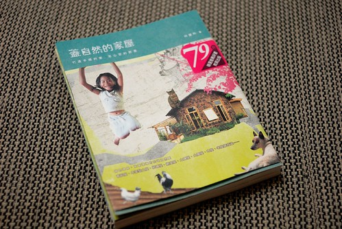

書裡提到: 自然建築與現代主流建築最大的差異有二 一是建築材質 一是建築系統 材質上針對在地環境來選擇設計 房子最終可回歸大地 材質可再利用 建築系統上 則是仰賴人的勞動力更甚於機械科技 因此怪手卡車等機械 必須透過適當控制 其餘部分則依照居住者的需求來調整

書裡屋主對於"自然家屋"的定義及實際作法大抵如作者所述 當中很重要的概念在於建材的就地取材或再利用 且最終可回歸大地 看著不同的屋主利用著不同的素材或舊木材/舊資源 建造起自然 環保 但卻很舒適很自我的另類建築 除了驚嘆外 更是佩服加感動... 而我心裡最大的好奇則在於 為什麼她們有這樣的勇氣去有這樣的態度 做這樣的事 過這樣的生活...

這是書裡我最喜歡的一個段落標題"生活才是主角 不是房子" 除了房子外 我想工作 育兒等也都是這樣  生活才是人生的主角阿! 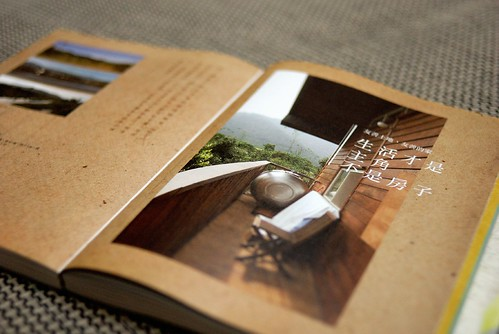

書當中一個描述: 建築師問屋主"你想要讓你的房子表達什麼?" 包括房子想要什麼風格 造型 品味... 屋主想了一下回答說: 我的房子什麼也不想表達! 只要簡單 舒適就好 若真的要表達什麼 也是要透過我們全家人的生活來表達與實踐 作者說這真是她聽過最棒的答案 現今家庭的建築與裝潢 都已是風格強烈的名師作品  不是讓我們無從發揮 就是最後無法維持而走了味 家原本該室一張讓家人一起慢慢經營描繪的白紙 日子久了 家風自然顯現 赫然明瞭原來家風是這樣經年累月 靠著居住其中的家人共同一點一滴累積起來的阿 不是掛了張"禮義廉恥" "佛心"在家裡就是家風 更不是單純的巴里島 鄉村風 美式風 奢華風的裝潢就是家風阿!

每個家屋反映著 代表著屋主的生活態度  對於人生 對於大自然  對於人之間 以及未來 現在我完全不及她們的百分之一 甚至千分之一  未來我想我也還是會遠不及 雖然就如徹爸所說 書中有些建材 有些生活方式實在太不可思議 太違反常規與常人接受度 但我希望我也能有我自己的態度 自己的方式 不論現在或未來... 以前我夢想著退休後去田野間過著小木屋愜意生活 而現在則更夢想著過著自給自足的鄉居生活阿 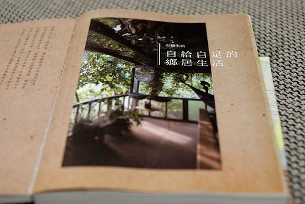 阿徹現在八歲 愛五歲 我35歲  想一想..(徹爸說現在的狀況 若去過這種生活是自私的 ) 嗯...等徹愛長大後我應該還算年輕  還能有機會及體力去過這樣的生活吧!

順道分享一下 今年去花蓮時住的民宿給我們的感動 瑞穗東岡秀川: 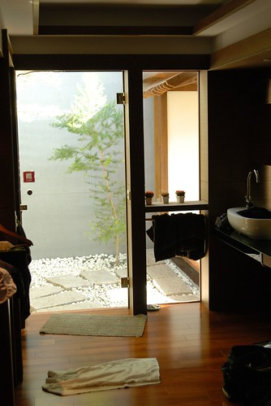

充滿光與影的日式風格建築  簡單大方但卻舒適愜意 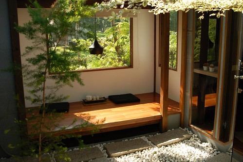

只是要生活在大自然中 第一個要面對的難題就是與各式蚊蟲相處 想要置身在這詩情畫意的情境中 除非一大清早要不就得能忍受蚊蟲的叮咬阿 所以我們得再多練練 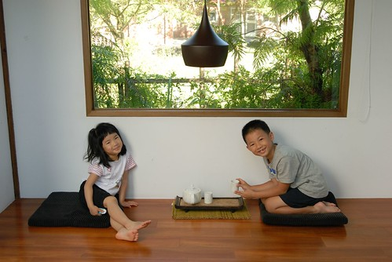

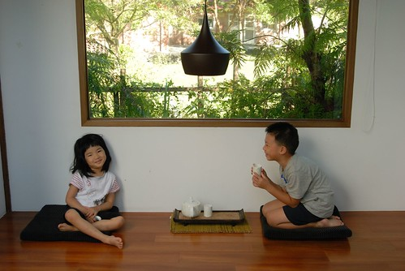

吉安檜木居: 簡簡單單的房內布置 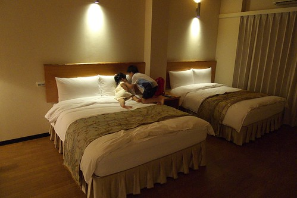

兩張床 兩張休憩的小椅子 小桌子 完全沒有木頭以外的喧賓奪主擺設 房間一如檜木給人的沉穩 溫暖 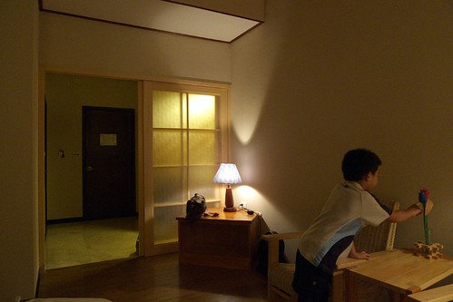

雖然位在熱鬧的市區附近 但鬧中取靜 另一種的民宿體驗 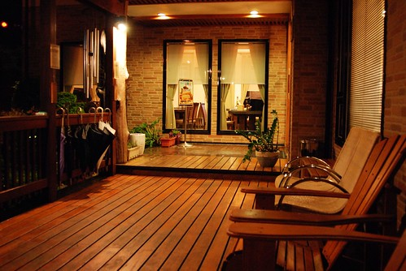

能有這樣的延廊 坐在其中看著外面的藍天綠樹 對我來講就是享受 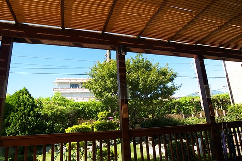

有庭院 有大樹 有"精神"的獨棟房子真好阿!!!! 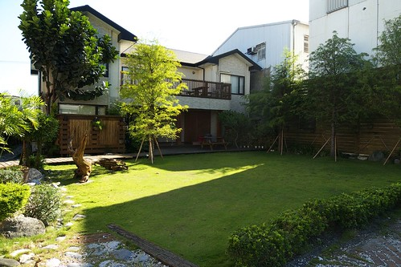
