其實本來以為這樣的展覽是很商業性的 而且以為作品的元素是我們生活中難以取得的動力零件等 因此年初徹爸同事在揪團買團體票時 我們並沒有多大的興致跟進(沒買) 直到八月時看到網友分享的參觀日記 我才赫然發現原來每個作品都是用基本樂高所創造出來 只用著平常徹愛玩的小樂高竟然能創作出這麼多栩栩如生的作品 這真是太amazing了! 因此我們費心的安排了個非假日 全家來趟難得的藝術之旅 這是場不同於電影欣賞 舞台劇觀賞的藝術創作饗宴!

九月的星期三下午 我們輕從簡便的從板橋搭捷運來到松山文創區 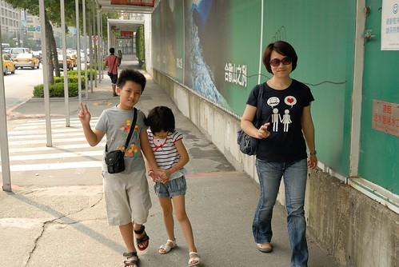 我跟阿徹這兩隻魚永遠是每次家裡有活動時 最期待最興奮的人 尤其覺得阿徹從小玩樂高就有他獨門之處 讓我更是非得要帶他來開開眼界  開學後的非假日果然沒有暑假時的熱鬧 我們快速的買到票也立即的進入展館內 雖然因為之前沒有買團體票 如今得有點心疼的掏錢包買各兩張的250元全票與220元優待票 但看完之後我個人覺得很值得 更甚用同樣的錢去看場電影  展場的動線還不錯 不過可能也是因為今日人潮不多 所以可以好好的駐足欣賞作品與拍照 原本徹爸擔心膽小的阿徹會不會害怕看這些其實有點掙扎有點痛苦的臉譜 但沒想到阿徹就像是欣賞藝術品一樣的仔細觀賞且嘖嘖稱奇每一件作品 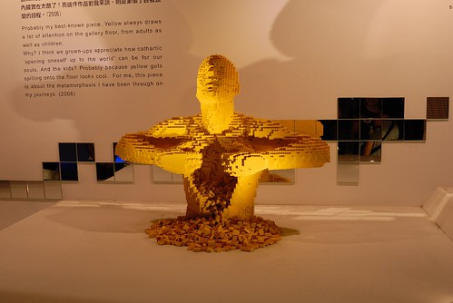 而年紀尚小不知愁滋味的愛愛也同時湊熱鬧湊的很高興 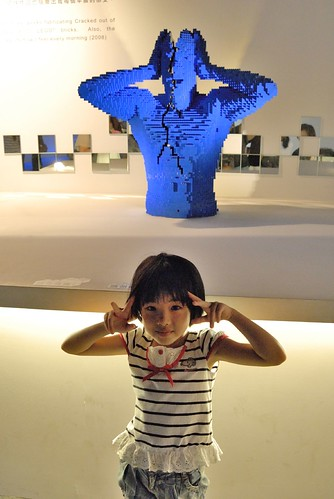 看到大師特別為台北創作的101 我們直呼比真的101還漂亮  看到原本方方正正的單調小積木 在以萬計的數量組合下 變成一個個有表情 有生命力的人系列作品  感動直搗心裡 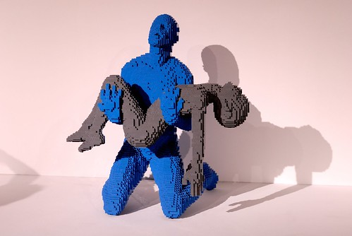 裡頭最大的作品是這隻大暴龍 真的好像科博館裡的恐龍化石喔 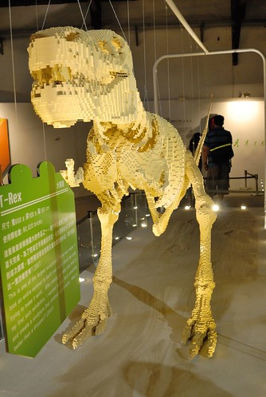 我們母子三人看的目瞪口呆 只能一直嚷著"太厲害了 真的太不可思議了"  (傑克這真的太神奇了)  我跟阿徹兩人看的很慢 過程中常一起分享彼此的驚喜發現與感動  偶而愛愛冒出來搞笑一下 似乎提醒著我們別忘記她了  不過一不小心 愛愛跟徹爸還是比我們早半圈的走完 然後再回頭找我們 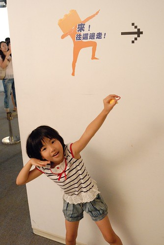 那時我正陪著阿徹看了10多分鐘 完整的Nathan Sawaya介紹影片 期間阿徹說"以後我去美國的時候 我要去參觀他的地方 我要帶我的樂高去給他簽名 我要跟他買他用的那種單一色系的樂高..." 我拍拍阿徹的肩跟他說"爸媽沒法帶你去美國 只能靠你自己努力了!" 雖然覺得這個單純又天真的阿徹想法實在有夠"天" 但我欣見這場展覽帶給他這樣的夢想

不同於徹爸照的寥寥可數 阿徹按相機的手不放過任何作品 下面是阿徹鏡頭下的部份展覽: 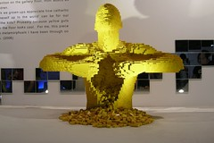 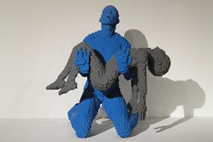   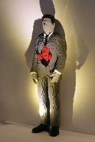 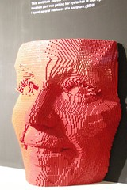 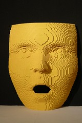   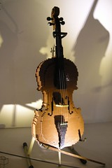  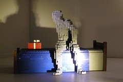   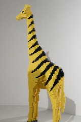 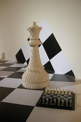   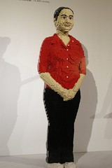 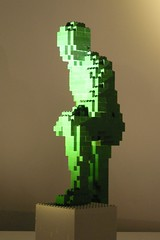 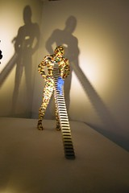 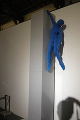 意猶未竟但心滿意足的 我們花一小時多一些的時間看完所有作品 這是踏出展場前的最後一個作品  ㄏㄏ 赫然明白原來是哪單位主辦的 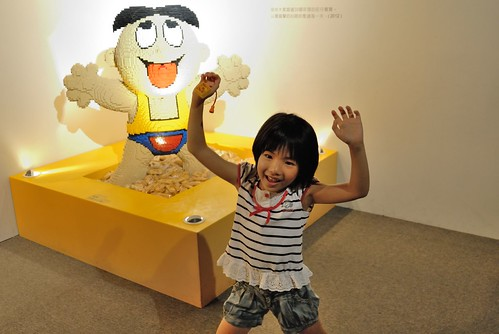 緊接著展場出口處是紀念品販售區 當然販售著各式各樣 或大或小與各種主題的樂高產品 可能是受展覽都是用基本樂高所組成的影響 徹愛只對一些小項圈類的東西有興趣 完全沒說沒吵要買那陳列頗壯觀的主題樂高 這點值得肯定!（尤其最後我們什麼都沒買）  不過離開展館後 爸媽難得大放手的買了三瓶飲料一起喝 涼快的飲料 讓這個星期三下午的心情達到最高點 (雖然回家還有功課要寫)  我們用散步的心情慢慢走往捷運站 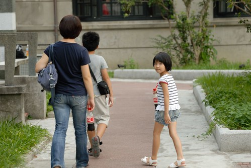 第一次來到舊松山菸廠的我們很是喜歡這裡 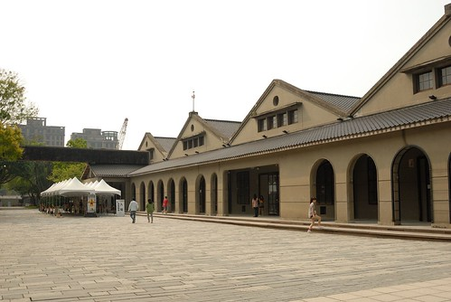 每一棟建物 每一根柱子都散發著迷人的老味道  連庭園也散發著舊時代的端莊與氣勢  最後我們駐足在生態池旁 好好享受台北城裡難得的涼風與愜意  只是我們家的過動小孩 到底還是跑出滿身汗  在這 我們也遇見了幾隻可愛的鵝 胖嘟嘟 有點憨但又有點靈氣的模樣 很是討喜 這是阿徹連續拍下且製作成他相機開機照片的圖片 

後記: 回家後 徹愛很認命的趕緊寫作業 完成作業後 阿徹無聲無息的窩到遊戲區做了一個玩具總動員裡頭的小外星人  誘發阿徹動手的起因是展覽出口飲料區吧檯上的這隻 我跟徹爸第二時間都問了"有看相機裡的照片照著做嗎" 阿徹說沒有喔 恩~很棒的ㄋ  這個創意積木展肯定有在阿徹心上埋下一顆小小種子 而且我跟徹爸一致覺得阿徹的外星人神韻更佳且更帥ㄋ  接下來的兩三天 阿徹也突然興致勃勃的將家裡零零總總6000多個小物件的小樂高積木做分類 而其實心裡很讚歎與期望阿徹創意表現的徹爸也很孝順的幫兒子加工盒子  然後我們家的小樂高第一次這樣整齊又美麗的分類著  而且從拾兩位小主人關愛的眼神 被熱熱鬧鬧好些天 這是很棒的意外收穫! 我跟徹爸非常的樂見.... 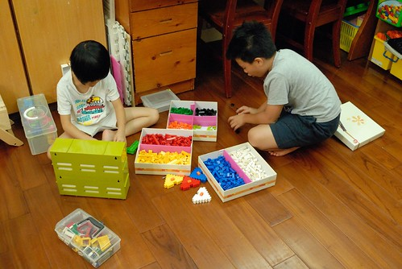
