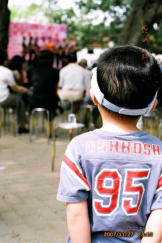

前陣子美賢貼了一段3年前我跟徹爸的MSN談話內容給我看  
(阿知美賢當初未啥把這存下來 最近整理CV時為啥又會發現這)  
內容大意是:  
(徹媽剛看完醫院內的台灣弦樂表演回來)  
徹媽:剛看著台上拉小提琴的人幻想著有一天阿徹也能這麼在台上拉琴  
徹爸說:我倒是夢過幾次阿徹是棒球選手 我上台頒獎給他  
......  
我與徹爸的夢很美麗吧  
其實最近剛好為了這類事情有點傷神+傷心  
看到美賢貼的這段話忍不住笑出來  
雖然有夢最美也慶幸自己曾經做過這樣的夢  但認清事實築夢才踏實阿~~

打從當了爸媽後 我與徹爸對於小孩最重視的  
除了健康外就是品格教育  
所以當其他小朋友會數數 會ABC 會唱唱跳跳 讓爸媽得意的獻寶時  
我家阿徹都只能在旁邊當點綴的 甚至是很不起眼的那顆星  
但我們都喜歡那個傻呼呼甚至有點無厘頭的阿徹  
但就像當初寫的那個幻想  
我也是會期待我家能出個貝多芬或是貝比魯斯或是牛頓  
只是隨著阿徹年紀越大我們也越明白阿徹是沒有那天份與本事的  
但...明知不可能 爸媽(我家是我啦)還是想要(願意)炸那錢去培養小孩的天份  
  

半年前當阿徹說他想要學鋼琴時(而且還是他自己提起的)  
我心裡真的挺高興的 (因為我小時後超想學鋼琴的 )  
不過還是告訴阿徹"學鋼琴很辛苦喔 要花時間練習喔 你真的可以嗎?  
                 你再想一想 如果過一陣子你還是真的想學再讓你去學"  
於是花了半年的時間讓阿徹確認自己的心意  
然後總算報名了YAMAHA的幼兒班音樂課  
一班大約11對親子 小孩+一個陪同家長  
老實說對於從小很怕上音樂課的我要再這麼陪著小孩去上音樂壓力不小  
但是徹爸壓根不看好這樣的音樂課  
完全是我跟阿徹兩人一頭熱的想法 所以我還是只得硬著頭皮當書僮

第一次上課看到老師的教法  
其他小朋友的勇於表現 不害羞的言行舉止以及家長投入的樣子  
我真的就懷疑我跟阿徹是否可以適應這樣的體制  
而一心只想學"鋼琴"的阿徹對於課程中極大比例的非鋼琴的音樂教學  
則顯得有點焦燥 不能集中注意力  
尤其當全部小朋友集中在一起唱唱跳跳的時候  
阿徹那微張的小嘴(有時候我很懷疑他到底有沒有張)加上極小幅擺動的肢體  
他絕對不會是老師眼中活潑認真又積極的學生  
不過阿徹還是期待每週四晚上的音樂課  
上完課後還是開心的回答我"音樂課好玩阿 喜歡阿"  
  
  
  
總算在第6堂課的音符練習時(在五線譜排豆豆)母子倆爆發第一次口角  
每週教一個音 在教到Me的時候  
老師請小朋友在五線譜版子上練習排三個音的排列組合  
例如老師彈唱著"Me Do Re"然後請小朋友排出來  
阿徹聽到後就說"我不會"  
我說"Me住在哪裡"  
阿徹"我不知道"  
我說"Me住在第一線"然後用手比著第一線  
阿徹更生氣的說"我不會啦"  
母子倆起爭執的大概連老師都看出來還過來關切一下  
那天回家後我忍不住破口大罵了   
1.一直交代阿徹中午要睡午覺 要不然晚上8-9點的音樂課總會上到精神不繼  
2.阿徹一開始就生氣一直說"我不會"還完全拒絕我的從旁指導  
3.除了跟鋼琴有關的教學 阿徹都很容易閃神  
.....  
我烙下狠話 下次沒有練習就不要上了 如果以後上課不認真下期就不要上了

隔週上課前一天問阿徹是否要練習排豆豆  
阿徹接受了也很OK的可以通過我們的測驗  
所以那週(第7週)的上課很愉悅 因為老師出的豆豆練習他都會  
回家的時候阿徹還開心的跟我說"音樂課真是太好玩了 我有認真是不是可以繼續上音樂"

第8週上課阿徹還是容易有點分心  
尤其當全部小孩集中在老師琴旁練唱或是聽講時  
卡位卡不好加上個子小的阿徹就得站在外圍對著裡面的老師探頭探腦  
然後心就慢慢散了  眼睛東看西瞧   
課程一半後開始哈欠連連 想也知道小子又沒午睡了  
果然在最後的排豆豆練習時又母子倆又小小衝突了  
上到這一堂課 我真的死心了...也決定不管阿徹願不願意 上完這期就先暫停吧  
  
第9週上課前阿徹還是沒記取教訓的   
每次跟她說要不要練習排豆豆阿  阿徹都回以他正在忙或是明天再練習  
而我有一種豁出去的體認  心想反正都下決定下期不再上了 剩下三堂課就算浪費不去上也無所謂了  
果然到週四上課前一個鐘頭 阿徹還是都沒有練習也沒有寫音樂功課  
甚至今天又沒睡午覺 脾氣有點煩燥  
我在數落了一頓後宣告"今天不用去上音樂課了" 阿徹不能接受的爆哭  
徹爸回家了解後  竟然問我"可以給阿徹一次機會嗎"  
然後徹爸跟阿徹說"爸爸教你排豆豆 會排了就讓媽媽帶你去上課"  
阿徹含淚答應 但...真的還是又分心了  
徹爸教到第二輪時也氣呼呼的大聲宣告"今天不用去了"  
阿徹哭的更慘... 二次重傷  
  
可是徹爸終究撩下去了 (徹爸從頭到尾都很不看好阿徹去上音樂課這事的)  
還去分析音樂教室的豆豆磁板不好用  
花了幾個晚上用紙筆教阿徹音符  
然後最後兩堂課父子兩開開心心 輕輕鬆鬆的去上音樂課  
不過徹爸跟我還是決定等阿徹大一點 可以專心後真對音樂有興趣再去上吧  
現階段還是讓阿徹做他真的做的來 真的感興趣的事吧  
所以我們拿學校的陶藝課跟阿徹交換音樂課  
我們相信喜歡亂做東西 喜歡砂畫的阿徹上陶藝課或是美術課會更開心點的  
  
  
  
阿徹現階段真的很容易分心  
而且對於記憶性的東西 如ABC 123 跟音符就是超難記住   
也許他一直不願意正面 積極的記住吧  
也也許他是需要很長的時間才能熟悉這些東西 然後才能記住吧  
可有時候看到她做樂高或是其他事情的靈活敏捷  
甚至看過的故事書 A夢的電影 不管多久都能記住一些雞皮蒜毛的小情景  
我真的懷疑起阿徹到底是聰明還是笨   
(媽媽都不願意承認自己小孩笨的 也許該說要承認不聰明都很痛苦了)  
以前就常聽老師說阿徹學英文分心玩褲子玩鞋子 摳手指的事  
現在親眼目睹體會了  無力感更加上心頭  
  
前陣子回嘉義時 看到阿徹跟阿公阿嬤去公園做回來的砂畫   
看的出來他每次回嘉義做砂畫技巧的進步  
問阿嬤這麼一張畫需要多久時間 阿嬤說"一個多小時"  
我很訝異竟然需要這麼久的時間(都可以看完一部A夢電影了) "阿徹不會沒耐心嗎"  
阿嬤說"不會ㄚ  他很小心 很有耐性的慢慢用"  
腦海中想起阿徹每天放學後都很認真在玩的模樣 玩辦家家酒 玩阿哩不達  
霎那間我寬心了....  
  
  
      
其實上這樣的音樂課是個沉重的壓力負擔 對阿徹或我來說都是  
在第二堂課當大部分的小孩都可以朗朗上口老師上回只教了副歌的那首歌時(我自己都覺得有困難度了)  
我除了訝異更是好奇 莫非她們每天在家反覆聽著音樂課的教學CD  
(我真的得承認我是懶媽媽  一心期望小孩子的主動學習 主動需求)  
加上看到老師課堂上教唱時 有時對於小朋友需要伸出哪一隻手指比劃對應的規定  
講真的我不喜歡這樣的才藝課 這樣的音樂課   
雖然因為很想讓阿徹有音樂這樣的興趣  (我真的挺羨慕有些人開心時或是難過時可以彈個琴抒發一下)  
所以在他主動表達想學鋼琴時 我不顧徹爸的反對意見還是送他去上YAMAHA音樂課  
想說這樣比較有系統也許學習可以持續的比較久  
但這一次的經驗讓我覺對阿徹這樣的小孩  生活中的學習可能還是容易上手點  
而且我還是比較喜歡那個在家裡開心的 隨意的哼哼唱唱跳跳的阿徹  
  
雖然很多專家都說小孩子學才藝 堅持/持之以恆很重要  
也很多老師與家長說  興趣是要靠培養的 甚至要家長的督促練習養成的  
但我想我們不是勤勞的父母 我們也不想從小這樣督促小孩學習  
而且雖然"堅持"很重要   
但讓阿徹明白因為沒有專心 沒有珍惜所以不能再擁有(再上)音樂課也是一種學習  
有一次罵他時我說  
 "上一次音樂課要多少錢 你知道嗎...  
   可以買8個阿姨的飯飯  12碗阿姨的麵線 可以吃好多天的晚餐了  有沒有很多錢錢"  
阿徹哭著回我說"有...."  
我說"對 很多錢錢...有多少小孩連飯飯都沒有可以吃   更不可能像你一樣去上音樂課...."  
所以真的不是像很多專家說的 要尊重小孩的興趣 要培養小孩的興趣  
父母也真的需要適當的喊"卡"的  
興趣等到小孩大一點  真有心真能夠珍惜學習的機會 再慢慢培養也不遲...  
  
這些是我這兩個月來陪阿徹去上所謂"才藝班"的感想與省思  
徹爸看著我期間常常的生氣 感嘆 無言 思索  
跟我說"看來這件事讓你想很多喔" 恩...蠻多的  
真的覺得當爸媽是一門很大的學問  而且很沒有標準答案的學問  
我相信阿徹上大班 上小學甚至上中學後 我們一定會面對到更多更殘酷的事實與問題  
如何走出阿徹 徹家自己的路 正考驗著我們~~~      
  
        
  
註: 好長的一篇...從去年寫到今年 歷時半個月  
     文中照片純粹點綴用 都是阿徹去年3-6月間拍的  沒多久時間怎麼又變了又大一點的感覺了
