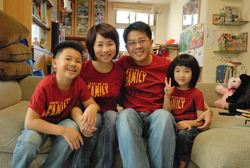
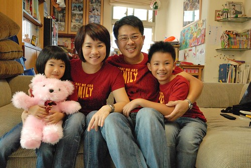

愛愛跟阿徹這陣子常說"好剛好喔! 現在妹妹差哥哥一顆頭 哥哥差媽媽一顆頭 媽媽差爸爸一顆頭" 咚! 咚! 咚的咚上去 就像階梯那樣! 我說"這錯過了就再也不會有的畫面要照張全家福紀錄下來" 徹爸說"對! 還要穿我們的那件衣服" 我原本幻想著要在擎天崗的草原上 藍天綠地背景下 排排站來這麼一張的  結果卻因山上大霧而作罷 幸好趁著出門前 先在家裡客廳來了張好久不見的居家全家福照 雖然沒有咚咚咚 但我還是喜歡這樣的四個人 一樣的衣服  貌似的舉手投足 以及那片充滿我們家活力與歷史的背景!  

照完第一張 再來個第二張 這回阿徹跟愛愛交換位置 我才發現愛愛照相真的超級有矜持&堅持的 都是那樣淺淺的微笑著(這笑容以後適合去選美) 而看照片時也更赫然的發現怎麼我們家的阿徹看起來已經這麼高這麼大 再沒幾年 個頭就超過媽媽了..  書櫃的玻璃窗上貼了好多張這些年從三個人到四個人 從小嬰兒到小女生/小男生的全家福 家的歷史就這樣一張一張的累積著 且持續發生著....
